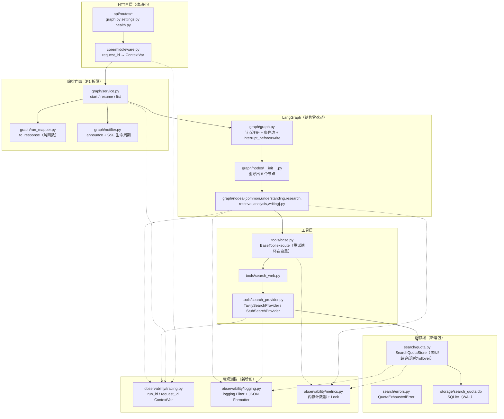
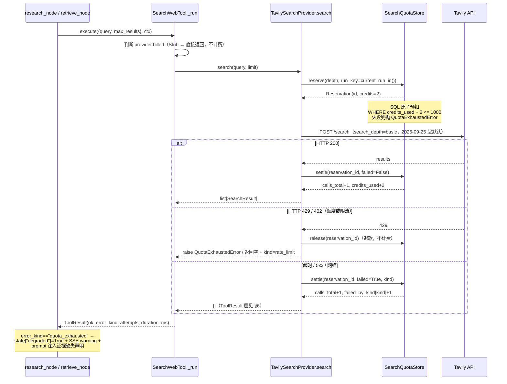
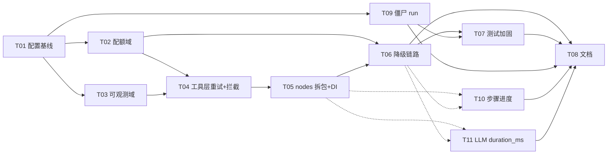

# AI Research Workspace — 后端重构架构设计

| 项 | 值 |
| --- | --- |
| 文档类型 | 技术架构设计 / 可施工蓝图 |
| 对应 PRD | `docs/backend-refactor-prd.md`（许清楚，v0.2.0） |
| 代码基线 | `D:/UserData/Desktop/项目/backend`（app 4216 + tests 774） |
| 架构师 | 高见远 |
| 上游决策（主理人已拍板，本篇作为约束执行） | Q2 单 worker（理由已于 2026-09-25 实测更正，见 §10）；**Q3 已于 2026-09-25 决议推翻：`search_depth` 默认由 `advanced` 改为 `basic`**（见 §10）；不接新供应商；不加 structlog/otel/Prometheus；现有 774 行测试断言语义不变；SQLite 配额存储 |
| 版本 | v0.2.0（重构版） |

## 0. 给施工者的导航（先读这一节）

1. 本设计**以代码为准**。凡 PRD 与当前代码不一致，一律在 §11「PRD 与代码的差异」列出，并给出修订后的判定。
2. 施工顺序严格按 §8 任务列表。**串行主干是 `T02 → T04 → T05 → T06`**（配额 → 工具 → 节点 → 端到端），T01 是所有人依赖的基座，T03/T07 可并行。
3. 第 2 轮追加的三块 P0（僵尸 run / 步骤进度 / LLM 耗时）见 **§12**，对应任务 **T09 / T10 / T11**，已插入 §8 的依赖图。
4. **§9.1 登记了三条技术债（TD-1/TD-2/TD-3）**——它们是「本轮刻意不做」的残留缺口，每条都带缓解措施与还债触发条件。**施工时如果发现自己在"顺手补上"某一条，请先停下来读 §9.1 的「为什么留着」。**尤其是 TD-1：给僵尸写回中断状态需要动 checkpointer，**本轮不存在 `mark_interrupted()`，已裁定不升级立项**。
5. 三条最容易踩的坑（都已被测试锁住）：
   - **坑 1**：`list_runs` 的 WHERE **不能**简写成 `status NOT IN (终态)`，否则 `?status=completed` 静默返回空（§12.1.3，AC-21b）。
   - **坑 2**：**`STALE_ELIGIBLE_STATUSES` 只装 `running` 一个状态，不是漏了**。`awaiting_approval` 的 `updated_at` 在报告产出时就定格了，给它套任何阈值（含折中值）都等于「3 分钟后从列表里删掉」——那是数据丢失。想加新状态，先读 §12.1.5.1 的「只增不改」（AC-21d）。
   - **坑 3**：`compute_step_progress` 里「research 循环期进度保持第 3 步不递增」是**已批准的刻意设计**，改成按轮次推进会让进度倒退（§12.2.3，AC-23b）。
7. 三条红线（违反即返工）：
   - **红线 A**：`tests/` 现有 774 行、8 个测试文件，断言语义**只能加不能改**；`app/llm/client.py:259-270` 的 `_MOCK_PURPOSES` 一个都不能删。
   - **红线 B**：`StubSearchProvider` 必须走 `billed=False` 不计费路径（`tests/test_tools.py:131` 会因此红）。
   - **红线 C**：`app/graph/graph.py:18-27` 的 `from app.graph.nodes import (...)` 8 个名字**一个都不能改名、不能挪位置**，否则整张图挂掉。
8. 本篇给出的是**接口签名 + DDL + 关键片段**，不是完整业务实现。

---

## 1. 总体架构（改造后分层）

### 1.1 分层图



**新增模块（3 个包 + 1 个 DB）**

| 模块 | 职责 | 是否新增 |
| --- | --- | --- |
| `app/search/`（`quota.py` / `errors.py`） | 搜索配额记账与额度决策 | 🆕 |
| `app/observability/`（`tracing.py` / `logging.py` / `metrics.py`） | run 追踪、结构化日志、指标 | 🆕 |
| `app/graph/nodes/` | `nodes.py` 拆包 | 🆕（目录） |
| `storage/search_quota.db` | 配额持久化 | 🆕（文件） |

**零新增第三方依赖**：全部用 `sqlite3` / `contextvars` / `logging` / `json` / `threading`（ tenacity 已在依赖里，但本篇**推荐自建重试循环**，理由见 §6.2）。

### 1.2 数据流：一次搜索的配额生命周期（这是全篇最关键的一张图）



**为什么必须在「发起请求前」预扣**：Tavily 把「额度耗尽」与「请求太频繁」都返回 **429**，状态码无法区分。若等拿到 429 再熔断，积分数已经超支（用户被多扣了不该花的钱）。预扣是唯一能在前端时间线上防止超支的手段。

---

## 2. 配额治理详细设计（核心交付物）

### 2.1 计费口径与配置

**必须写进代码注释的口径**：Tavily `basic = 1 credit/次`，`advanced = 2 credits/次`。当前 `app/tools/search_provider.py:115` 硬编码 `"search_depth": "advanced"` → 1000 额度实际只够 **~500 次**搜索。

`app/core/config.py` 的 `Settings` 内追加（全部有默认值、均可 `.env` 覆盖）：

```python
# ----- Search quota（主理人已拍板：单 worker 语义）-----
search_quota_enabled: bool = True
search_quota_db_path: str = "storage/search_quota.db"
search_quota_monthly_credits: int = 1000
search_quota_warn_ratios: str = "0.5,0.75,0.9"
search_quota_policy: str = "degrade_annotate"      # degrade_annotate | hard_stop
search_quota_soft_cap_ratio: float = 0.9
search_quota_per_run_cap: int = 12                 # 单次 run 搜索次数硬顶（P1-5，本期实现）
search_depth: str = "basic"                        # 2026-09-25 决议：默认 basic（原 advanced）

# ----- Tool retry -----
tool_max_attempts: int = 2
tool_retry_backoff_min: float = 0.5
tool_retry_backoff_max: float = 4.0
retryable_tool_kinds: str = "timeout,network,upstream_5xx,rate_limit"

# ----- Observability -----
log_format: str = "json"                           # json | plain
```

> ⚠️ 主理人决策 #3（**2026-09-25 已修订**）：必须可配置 + 设置页明示「basic = 1 credit / advanced = 2 credits」。因此**新增 `search_depth` 配置项替代硬编码**。~~默认 `advanced`~~ → **默认 `basic`**（决议推翻，见 §10 Q3）。
> ⚠️ 主理人决策 #1：配额记账为**单 worker 设计**。`README.md` 与 `settings.py` 注释必须写明「多 worker（`--workers>1`）会低估用量，请勿使用」。`/api/health` 的 `metrics` 里加 `"quota_mode": "single-worker"`。

### 2.2 数据模型（SQLite DDL）

文件：`storage/search_quota.db`，与 `app/rag/store.py` 同一套连接范式（`check_same_thread=False` + `PRAGMA journal_mode=WAL` + `PRAGMA synchronous=NORMAL` + 进程级 `threading.Lock` 串行化写 + `close()`）。

```sql
-- ---- 周期用量表：一个自然月一行，PK 即 period_key（'YYYY-MM'）----
CREATE TABLE IF NOT EXISTS search_quota (
    period_key     TEXT    PRIMARY KEY,          -- '2026-09'
    credits_limit  INTEGER NOT NULL DEFAULT 1000,
    credits_used   INTEGER NOT NULL DEFAULT 0,   -- 单调不减，SQL 原子累加
    calls_total    INTEGER NOT NULL DEFAULT 0,   -- 含重试的全部真实请求数
    warn_level     INTEGER NOT NULL DEFAULT 0,   -- 0 正常 1≥50% 2≥75% 3≥90% 4 耗尽
    updated_at     TEXT    NOT NULL
);
CREATE INDEX IF NOT EXISTS idx_quota_updated ON search_quota(updated_at);

-- ---- 按天聚合：排查「哪天突然烧没了」+ 设置页迷你图 ----
CREATE TABLE IF NOT EXISTS search_quota_daily (
    day           TEXT    PRIMARY KEY,           -- '2026-09-25'
    period_key    TEXT    NOT NULL,
    calls         INTEGER NOT NULL DEFAULT 0,
    credits       INTEGER NOT NULL DEFAULT 0,
    created_at    TEXT    NOT NULL
);
CREATE INDEX IF NOT EXISTS idx_quota_daily_period ON search_quota_daily(period_key);
CREATE INDEX IF NOT EXISTS idx_quota_daily_day ON search_quota_daily(day);

-- ---- 按 run 聚合：回答「这次研究花了多少」----
CREATE TABLE IF NOT EXISTS search_quota_run (
    run_key       TEXT    NOT NULL,              -- graph 路径=thread_id，agent 路径=run_<hex>
    period_key    TEXT    NOT NULL,
    calls         INTEGER NOT NULL DEFAULT 0,
    credits       INTEGER NOT NULL DEFAULT 0,
    degraded      INTEGER NOT NULL DEFAULT 0,    -- 本次 run 是否触发过额度降级
    updated_at    TEXT    NOT NULL,
    PRIMARY KEY (period_key, run_key)
);
CREATE INDEX IF NOT EXISTS idx_quota_run_period ON search_quota_run(period_key);

-- ---- 预警去重：同一周期内同一档位只触发一次 ----
CREATE TABLE IF NOT EXISTS search_quota_warn (
    period_key    TEXT    NOT NULL,
    level         INTEGER NOT NULL,              -- 1=50% 2=75% 3=90% 4=100%
    fired_at      TEXT    NOT NULL,
    credits_used  INTEGER NOT NULL DEFAULT 0,
    PRIMARY KEY (period_key, level)
);

-- ---- 预扣流水：每一笔 in-flight 的额度占用 ----
CREATE TABLE IF NOT EXISTS search_quota_reservation (
    reservation_id TEXT    PRIMARY KEY,          -- 'res_<16hex>'
    period_key     TEXT    NOT NULL,
    run_key        TEXT,
    depth          TEXT    NOT NULL,             -- 'advanced' | 'basic'
    credits        INTEGER NOT NULL,             -- 1 或 2
    state          TEXT    NOT NULL DEFAULT 'open',  -- open | settled | released
    created_at     TEXT    NOT NULL,
    closed_at      TEXT
);
CREATE INDEX IF NOT EXISTS idx_res_open ON search_quota_reservation(state, created_at);
CREATE INDEX IF NOT EXISTS idx_res_period ON search_quota_reservation(period_key, state);
```

**索引清单（4 个）**：`search_quota.updated_at`、`search_quota_daily.period_key`、`search_quota_daily.day`、`search_quota_run.period_key`、`search_quota_reservation(state, created_at)`、`search_quota_reservation(period_key, state)`。

### 2.3 `SearchQuotaStore` 接口

文件：`app/search/quota.py`

```python
CREDITS_BY_DEPTH: dict[str, int] = {"basic": 1, "advanced": 2}   # Tavily 计费口径


@dataclass(frozen=True)
class QuotaSnapshot:
    provider: str                 # 'tavily'
    period_key: str               # '2026-09'
    period_start: str             # ISO8601，含时区
    period_end: str               # '2026-10-01T00:00:00+08:00'
    renews_at: str                # 同 period_end
    credits_limit: int
    credits_used: int
    credits_remaining: int
    ratio: float                  # 0.742
    warn_level: int               # 0|1|2|3|4
    calls_total: int
    search_depth_default: str     # 'basic'（2026-09-25 起）
    estimated_runs_remaining: int | None
    daily: list[dict]             # [{'date','calls','credits'}, ...] 最近 7 天


@dataclass(frozen=True)
class Reservation:
    reservation_id: str
    period_key: str
    run_key: str | None
    depth: str
    credits: int


class QuotaExhaustedError(RuntimeError):
    """余额不足以支付本次搜索。由 provider 捕获后转成 ToolResult(error_kind='quota_exhausted')。"""
    def __init__(self, message: str, *, credits_remaining: int = 0, deficit: int = 0) -> None: ...


class SearchQuotaStore:
    """搜索配额的唯一记账口。所有 SQL 只出现在这个文件里。"""

    def __init__(self, db_path: Path, *, monthly_credits: int,
                 warn_ratios: tuple[float, ...] = (0.5, 0.75, 0.9),
                 depth: str = "basic") -> None: ...
    # 建表 + WAL + schema，等同于 KnowledgeStore.__init__

    # ---------- 周期 ----------
    def current_period(self) -> tuple[str, str, str]:
        """返回 (period_key, period_start, period_end)，'YYYY-MM' 自然月。"""
        ...

    def _ensure_current_period(self) -> str:
        """lazy rollover 的写入侧：确保当前周期的行存在。见下方 SQL 详解。"""

    # ---------- 预扣 ----------
    def reserve(self, *, depth: str, run_key: str | None = None) -> Reservation:
        """发起请求前预扣。余额不足直接抛 QuotaExhaustedError，一个字节都不会花出去。"""
        ...

    def try_reserve(self, *, depth: str, run_key: str | None = None) -> Reservation | None:
        """不抛异常的变体；返回 None = 额度不足。供 pre-flight 检查使用。"""

    # ---------- 结算 / 退款 ----------
    def settle(self, reservation_id: str, *, failed: bool = False,
               kind: str | None = None) -> None:
        """真实计费或记为一次失败调用。state: open → settled。"""

    def release(self, reservation_id: str) -> None:
        """请求未被受理（429/402），退还预扣，不计入 credits_used。state: open → released。"""

    # ---------- 查询 ----------
    def snapshot(self) -> QuotaSnapshot:
        """读取时才做 rollover 判定：发现最新行不是当前月，则当前月视为全新周期。"""

    def daily(self, days: int = 7) -> list[dict]: ...
    def run_usage(self, run_key: str) -> dict: ...
    def warn_events(self) -> list[dict]: ...

    def close(self) -> None: ...
```

#### 2.3.1 预扣的原子性（本设计的地基）

**不做「读出来 +1 再写回」，用单条 SQL 完成检查与累加**：

```sql
INSERT INTO search_quota (period_key, credits_limit, credits_used, calls_total, updated_at)
VALUES (?, ?, 0, 0, ?)
ON CONFLICT(period_key) DO UPDATE SET
    credits_used = search_quota.credits_used + excluded.credits_used,
    calls_total  = search_quota.calls_total  + excluded.calls_total,
    updated_at   = excluded.updated_at
WHERE search_quota.credits_used + excluded.credits_used <= ?   -- monthly_credits
```

三个性质一次拿到：

1. **原子**：单条语句，`transaction` 内不可被其它写插入（写路径全程持 `self._lock`）。
2. **单调不减**：只有 `UPDATE` 分支会加，且加的是 `+0`（首次插入）或 `+0`（更新分支里 `excluded.credits_used` 恒为 0）。`credits_used` 只增不减。
3. **防超支**：`WHERE ... credits_used + 0 <= 1000`，超支时 DO UPDATE 判定为 false → 整条语句退化为 **DO NOTHING**，同时**不插入新行**。调用方据此抛 `QuotaExhaustedError`。

> 这条 SQL 同时覆盖了验收项 AC-10（重启不归零、`storage/search_quota.db` 在磁盘上）与 AC-11（跨月 rollover：`period_key` 变了新的行 `credits_used=0`，旧行原样保留做历史）。

#### ⚠️ 2.3.1.1 硬规则：`_ensure_current_period_locked()` 是惰性建行，不是构造期建行

**这条是踩过才知道的坑，写死在这里，不要再推导。**

`SearchQuotaStore.__init__()` **不会**往 `search_quota` 表里写任何行。当前周期行的存在性由 `_ensure_current_period_locked()` 在**每次读/写入口**惰性保证，实际建行的时机只有这三个：

| 会建行 | 不会建行 |
| --- | --- |
| `reserve()` | `SearchQuotaStore(...)` 构造 |
| `remaining_credits()` | 仅读取而不经过上面三个入口的其它路径 |
| `snapshot()` | |

**后果**：任何「构造 store 之后直接裸 `UPDATE search_quota SET ...`」的测试或脚本，都会打到**空表**上 —— 看起来像「配额没生效」「UPDATE 静默生效了」，实际上表里根本没那行。这个失败模式没有任何报错，纯靠人看出去。

**硬规则（对测试与一次性脚本都适用）**：

```
构造 store 之后、裸写 search_quota 之前，必须先调用一次 remaining_credits()
（或 reserve() / snapshot()）把当前周期行建出来。
```

> team-lead 已在 `tests/test_search_quota.py` 里加了前置（先 `remaining_credits()` 建行，再用独立连接 UPDATE）。已实测确认成立：**82 passed / 0 failed / 0 skipped**。
> 函数名以 `_ensure_current_period_locked()` 为准；本设计正文在少数位置写作 `_ensure_current_period`，指的是同一个东西。

**已排除的两个假设（不要重复排查）**：

| 假设 | 结论 |
| --- | --- |
| 问题出在 sqlite `cursor.rowcount` 的同步性上 | ❌ **不成立**。team-lead 实跑排除，与本问题无关，不要再查 |
| 余额不足时 `try_reserve` 会多扣 | ❌ **已闭环**。`try_reserve` 余额不足时 `remaining_credits() == 0`，一个字节都没扣 |

**lazy rollover 的完整语义**（不引入定时任务）：

| 时机 | 行为 |
| --- | --- |
| `reserve()` | 用上方 SQL 保证当前周期行存在；若 SQL 未生效（超支）→ 抛 `QuotaExhaustedError` |
| `snapshot()` | 先 `DELETE FROM search_quota_daily WHERE day < 本周期首日` 与 `DELETE FROM search_quota_warn WHERE period_key != 当前`；再读当前周期行 |
| `daily()` | 同上，保证迷你图只画当前周期 |

#### 2.3.2 并发安全说明（单 worker 前提下的边界）

| 场景 | 处理 |
| --- | --- |
| 同线程 / 同 asyncio 事件循环内的并发 `reserve` | SQL 单语句原子 + `self._lock`（`threading.Lock`）串行化写路径 |
| 跨线程（后台任务 / 线程池） | 同 `self._lock`；连接用 `check_same_thread=False` |
| 跨进程（多 worker） | ⚠️ **本次不支持**。各 worker 有自己的 `sqlite3` 连接与 `Lock`，会低估总量。缓解：README + `/api/health` 标注 `quota_mode: single-worker`；WAL + `synchronous=NORMAL` 保证不会写坏库，最坏结果是「少记」，不会「多给额度」 |
| 预扣了但进程崩溃 | `reservation` 行会残留。`_ensure_current_period` 启动时清一次：`UPDATE search_quota_reservation SET state='released' WHERE state='open'`（refresh 语义）；`snapshot()` 读取时对 `state='open'` 的计 0（反正 SQL 也没加过） |

**为什么不是进程内存 dict**：重启即清零 = 用户重启服务就能「刷新」免费额度。对按 credit 计费的外部服务，这个记账不成立，是漏洞。SQLite 是主理人已拍板的方案，理由成立。

### 2.4 预扣 vs 后扣的落点

| 位置 | 动作 | 触发时机 |
| --- | --- | --- |
| `TavilySearchProvider.search()` **之前** | `quota.reserve(depth, run_key=current_run_id())` | 每次真实 HTTP 请求**前**，含每次重试 |
| 429 / 402 → | `quota.release(reservation_id)`（退款）+ 分类 | 上游拒绝受理 |
| 超时 / 网络错误 / 5xx → | `quota.settle(reservation_id, failed=True, kind=...)`（不计 credits，只计 calls） | 请求疑似已被受理 |
| 200 → | `quota.settle(reservation_id, failed=False)` | 成功 |
| `start_research()` **之前**（可选 pre-flight） | `quota.try_reserve(...)`；`hard_stop` 策略下余额为 0 → 抛 `AppError(SEARCH_QUOTA_EXHAUSTED, 402)` | 新建 run 入口 |

**分类规则（429 的两义性）**：

```
请求返回 402                       → error_kind = quota_exhausted，release（退款）
请求返回 429 且余额已被预扣到不足   → error_kind = quota_exhausted，release（退款）+ 立即熔断不重试
请求返回 429 且余额充足             → error_kind = rate_limit，release（退款）+ 重试 1 次
请求返回 5xx / 超时 / 网络错误      → error_kind = upstream_5xx|timeout|network，settle(failed=True)
```

> ⚠️ **本条与 PRD 验收项 AC-2 有一处互斥，已裁决**：见 §11.1（主理人已采纳「按余额二分」的修订方案）。下表即为裁决后的最终判定表。

### 2.5 额度耗尽的降级：`degrade_annotate`

**默认策略 `degrade_annotate`，`hard_stop` 作为配置项提供，`continue_silent` 明确废弃（不得保留代码路径）。**

| 环节 | 实现位置 | 具体行为 |
| --- | --- | --- |
| ① 工具层判定 | `TavilySearchProvider.search()` 抛 `QuotaExhaustedError` → `BaseTool.execute` 捕获 → `ToolResult(ok=False, error_kind='quota_exhausted')` | 不再 `return []` 冒充成功 |
| ② 工具层告警 | `SearchWebTool._run` 检查 `result.error_kind == 'quota_exhausted'` → `emit(current_run_id(), EventType.SEARCH_QUOTA_WARNING, {...})` + `ctx.artifacts['quota']={'degraded':True}` | SSE 实时弹提示 |
| ③ 节点层记录 | `research_node` / `retrieve_node` 写 `state['degraded']=True`、`state['degraded_reason']='search_quota_exhausted'`，并在 `steps` 追加一条可见记录 | 图形界面可见 |
| ④ run 级记账 | `quota.settle()` 时把 `run_key` 写进 `search_quota_run` 并置 `degraded=1` | 「这次研究花了多少 + 是否在降级」 |
| ⑤ 报告正文声明 | `write_node` 调 `prompts.write_messages(..., evidence_gap_block=...)`，prompt 追加「本次研究未获取到任何联网来源，报告中必须显式声明证据缺失，且不得给出需要联网核实的确定性数字」 | 报告不再假装完整 |
| ⑥ 终态标注 | `write_node` 返回 `finished_reason='search_quota_degraded'`，`status` 仍为 `completed` | 用户侧的「明说」 |
| ⑦ API 暴露 | `ResearchRunResponse` 新增 `degraded / degraded_reason / credits_used / search_calls / warnings` | 前端零分支 |

**为什么不是纯 `hard_stop`**：研究任务有独立价值，用户可能只想要一份基于自有知识库的结论 —— 此时 `retrieve_node` 的**知识库检索分支仍可能命中**，直接 402/409 会让用户等 1~2 分钟全部作废。
**`hard_stop` 的实现**：`start_research` 入口加 pre-flight `try_reserve`；失败 → `AppError(code=ErrorCode.SEARCH_QUOTA_EXHAUSTED, message="本月搜索额度（1000 credits）已用尽，下次重置为 2026-10-01。可以在设置里切换 search_depth=basic（1 credit/次），或暂时使用离线模式。", status_code=402)`，`ErrorCode` 枚举加一项。

### 2.6 阈值预警：三条暴露路径

阈值判定集中在 `SearchQuotaStore._recompute_warn_level()`（写后计算），档位 `warn_level ∈ {0,1,2,3,4}`。

| 水位 | `warn_level` | 日志 | SSE | API |
| --- | --- | --- | --- | --- |
| ≥50% | 1 | `WARNING` `trace_event=search_quota_warning level=1` | 否 | `usage.warn_level=1` |
| ≥75% | 2 | `ERROR` | ✅ `SEARCH_QUOTA_WARNING` | `warnings[]` + `usage.warn_level=2` |
| ≥90% | 3 | `ERROR`（高优先级） | ✅ | `usage.warn_level=3`；`hard_stop` 语义生效 |
| ≥100% | 4 | `CRITICAL` | ✅ | `usage.warn_level=4`；停止扣费 |

- **日志路径**：由 `app/observability/logging.py` 的 `QuotaLogEmitter` 在 `settle` 成功后触发，字段见 §7.3。
- **SSE 路径**：`app/events/schemas.py` 的 `EventType` 新增 `SEARCH_QUOTA_WARNING = "search_quota_warning"`。发事件时读 `search_quota_warn` 表做去重（同周期同档只发一次），事件体：
  ```jsonc
  {
    "trace_event": "search_quota_warning",
    "level": 2,
    "credits_used": 742, "credits_limit": 1000, "credits_remaining": 258,
    "message": "本月搜索额度已用 74%，建议切换 search_depth=basic 以节省额度。"
  }
  ```
- **API 路径**：见 §2.8 `usage` 字段。

### 2.7 向后兼容契约：`ResearchRunResponse` 新增字段表

文件：`app/schemas/graph.py` 的 `ResearchRunResponse` 追加（**全部有默认值，pydantic 序列化时永不缺失**）：

| 字段 | 类型 | 默认值 | 额度充足时返回 | 额度耗尽时返回 |
| --- | --- | --- | --- | --- |
| `credits_used` | `int` | `0` | `0` | `4`（本次 run 消耗） |
| `search_calls` | `int` | `0` | `0` | `2` |
| `degraded` | `bool` | `False` | `false` | `true` |
| `degraded_reason` | `str \| None` | `None` | `None` | `"search_quota_exhausted"` |
| `warnings` | `list[str]` | `[]` | `[]` | `["本月搜索额度已用尽…"]` |

**填充逻辑**（`app/graph/run_mapper.py` 的 `_to_response`）：

```python
search_calls = sum(1 for c in tool_calls if c.get("tool") == "search_web")
credits_used = _sum_search_credits(tool_calls)          # 见下方说明
degraded     = bool(values.get("degraded")) or any(
    c.get("error_kind") == "quota_exhausted" for c in tool_calls)
degraded_reason = values.get("degraded_reason")
warnings = _build_warnings(degraded, degraded_reason, quota_snapshot)
```

> `credits_used`（按 run）**双来源取最大**：① 从 `state['tool_calls']` 里累计（离线/无配额时唯一来源）；② `search_quota_run` 表按 `run_key` 读。**离线（stub）路径下②为 0，取①即可**，保证 `test_graph` 端到端也拿到 0/0/false/None/[]。

**`finished_reason` 取值域扩展**：`"completed"` 之外新增 `"search_quota_degraded"`（额度耗尽仍出报告）与既有的 `"node_error"` / `"rejected_by_human"` / `"timeout"`。前端只需判断 `finished_reason != 'completed'` 即降级。

> 📌 本表是**配额域**的 5 个字段。`ResearchRunResponse` 在第 2 轮还追加了 3 个非配额字段：`current_step` / `estimated_total_steps`（见 §12.2）与 `duration_ms`（见 §12.3）—— 它们同样有默认值、同样不破坏向后兼容。

### 2.8 `usage` 契约（独立端点 `GET /api/settings/usage`）

> ✅ **已裁决（主理人）**：批准**独立端点** `GET /api/settings/usage`，字段与 PRD §3.4 契约逐字段一致。主理人澄清原约束「不新增路由」的本意是针对**9 个指标的暴露**（不要建 Prometheus 端点、不要开一串 metric 路由），不是禁止用量端点——用量与配置的刷新语义不同（运行中用量会变、配置不变），分开反而合理。
>
> 因此本设计与第一版相反：**新增一条端点**，而不是塞进 `GET /api/settings`。
> `GET /api/settings` 保持原样不动（前端已有的调用点零影响）。

**端点定义**

```
GET /api/settings/usage        →  ApiResponse[SettingsUsageData]
查询参数：无
响应：见下方 JSON 契约
```

**实现要点**：`app/api/routes/settings.py` 里新增一个 handler，内部调 `get_search_quota_or_none()`；配额关闭时 `provider="off"`、`credits_used=0`、`warn_level=0`，并在同级返回 `"quota_enabled": false`。

响应体（`data` 部分，与 PRD §3.4 逐字段一致）：

```jsonc
{
  "success": true,
  "data": {
    "provider": "tavily",
    "period_key": "2026-09",
    "period_start": "2026-09-01T00:00:00+08:00",
    "period_end":   "2026-10-01T00:00:00+08:00",
    "credits_limit": 1000,
    "credits_used": 742,
    "credits_remaining": 258,
    "ratio": 0.742,
    "warn_level": 2,                    // 0 正常 1≥50% 2≥75% 3≥90% 4 耗尽
    "calls_total": 371,
    "search_depth_default": "basic",    // 前端据此明示「basic=1 credit / advanced=2 credits」（2026-09-25 起默认 basic）
    "estimated_runs_remaining": 64,     // 近 7 天均值估算，数据不足为 null
    "renews_at": "2026-10-01T00:00:00+08:00",
    "daily": [{"date": "2026-09-25", "calls": 12, "credits": 24}]
  }
}
```

`estimated_runs_remaining` 公式：`floor(credits_remaining / avg_credits_per_run_7d)`，`avg` 取最近 7 天 `search_quota_run` 的 `credits` 均值（不足 1 条 → `null`）。
**`search_quota_enabled=false` 时**：`data.provider` 取 `"off"`，`credits_used/limit` 取 `0/1000`、`warn_level=0`，并在同级加 `"quota_enabled": false`，前端据此隐藏卡片。

**可选的 `search_depth` 切换开关**（主理人决策 #2 要求「让用户可自行切换降本」）：本端点**只读**，不提供 `POST /api/settings/usage/search-depth`。理由：改 `search_depth` 会立刻影响计费口径，做成写接口就需要「改完立刻生效」与并发保护，属于配置面而非用量面的事，超出本次范围。切换方式 = 改 `.env` 的 `SEARCH_DEPTH` 后重启（或在设置页留 TODO）。若产品后续要在线切换，单独开需求。

**建议的 `SettingsUsageData` Pydantic 模型**（`app/schemas/settings.py`，避免路由直接返回裸 dict）:

```python
class UsageDay(BaseModel):
    date: str                      # '2026-09-25'
    calls: int
    credits: int

class SettingsUsageData(BaseModel):
    provider: str                  # 'tavily' | 'off'
    quota_enabled: bool = True
    period_key: str
    period_start: str
    period_end: str
    credits_limit: int
    credits_used: int
    credits_remaining: int
    ratio: float
    warn_level: int                # 0|1|2|3|4
    calls_total: int
    search_depth_default: str      # 'basic'（2026-09-25 起）
    estimated_runs_remaining: int | None
    renews_at: str
    daily: list[UsageDay] = []
```

### 2.9 `StubSearchProvider` 不计费（红线 B 的结构化实现）

不要靠 `isinstance(provider, StubSearchProvider)` 这种脆弱判断。给 provider 协议加两个属性，计费行为成为**类型的固有属性**：

```python
# app/tools/search_provider.py
class SearchProvider(Protocol):
    async def search(self, query: str, limit: int) -> list[SearchResult]: ...
    @property
    def billed(self) -> bool: ...      # StubSearchProvider → False；TavilySearchProvider → True
    @property
    def depth(self) -> str: ...        # 'advanced' | 'basic'（仅真实 provider 有意义）

class StubSearchProvider:
    billed = False
    depth  = "none"

class TavilySearchProvider:
    billed = True
    depth  = settings.search_depth      # 默认值 'basic'（2026-09-25 起）
```

`SearchWebTool._run` 内的分支：

```python
provider = get_search_provider()
if provider.billed and settings.search_quota_enabled:
    quota = get_search_quota()          # 模块单例；失败（DB 不可用）时降级为不计费并记录
    ...                                 # reserve / settle / release
```

`search_quota_enabled=False` 或 provider 不计费 → **完全不触碰 `SearchQuotaStore`** → `tests/test_tools.py:131-135` 在 `TAVILY_API_KEY=""` 下必定拿到 5 条离线语料且 `ok=True`，不受额度影响。

---

## 3. `nodes.py` 拆分方案

### 3.1 目标目录树

```
app/graph/
├── __init__.py              (1 行，保持存在)
├── graph.py                 (不动：8 个 import + 边的定义)
├── state.py                 (+2 个字段：degraded / degraded_reason)
├── prompts.py               (write_messages 增加 evidence_gap_block)
├── service.py               (↓ 拆薄至 ≤120 行)
├── run_mapper.py            🆕 (_to_response + TERMINAL_STATUSES)
├── notifier.py              🆕 (_announce + SSE 生命周期)
└── nodes/
    ├── __init__.py          🆕 重导出 8 个节点
    ├── common.py            🆕 节点公共件 + NodeDeps
    ├── understanding.py     🆕 understand_task + plan_node + _fallback_plan
    ├── research.py          🆕 research_node
    ├── retrieval.py         🆕 retrieve_node
    ├── analysis.py          🆕 analyze_node + verify_node
    └── writing.py           🆕 write_node + fail_node
```

### 3.2 `__init__.py` 与「零改动 import」

`app/graph/graph.py:18-27` 现有写法：

```python
from app.graph.nodes import (
    analyze_node, fail_node, plan_node, research_node,
    retrieve_node, understand_task, verify_node, write_node,
)
```

`app/graph/nodes/__init__.py` 必须**导出这 8 个名字，且签名不变**：

```python
"""节点包。

[架构约束] graph.py 通过 `from app.graph.nodes import <8 个节点>` 引用本包。
这个 import 一行都不用改 —— 重导出是硬要求，否则整张图挂掉。
"""

from app.graph.nodes.analysis import analyze_node, verify_node  # 其余 import 见下方

__all__ = [
    "analyze_node", "fail_node", "plan_node", "research_node",
    "retrieve_node", "understand_task", "verify_node", "write_node",
]
```

真实写法（无占位）：

```python
from app.graph.nodes.analysis import analyze_node, verify_node
from app.graph.nodes.research import research_node
from app.graph.nodes.retrieval import retrieve_node
from app.graph.nodes.understanding import plan_node, understand_task
from app.graph.nodes.writing import fail_node, write_node

__all__ = [...]
```

**硬约束**：
1. 8 个函数名**一字不改**（`write_node` 是小写，别顺手改成 `WriteNode`）。
2 每个导出对象的 `.__module__` 会变成子模块名，但 LangGraph 只按注册名 `"write"` 索引，**不影响**。
3. `ruff` 的 `I`（import 排序）会让 import 顺序按字母排；保持即可。

### 3.3 各子文件职责与行数

| 文件 | 导出 | 从 `nodes.py` 迁入的内容 | 预估行数 |
| --- | --- | --- | --- |
| `nodes/common.py` | `NodeDeps`, `default_deps`, `resolve_deps`, `_ask`, `_step`, `_failed`, `_safe_args`, `_TRUSTED_TOOLS`, `_EVIDENCE_PREVIEW`, `_ARGS_SNAPSHOT_CHARS`, `_make_tool_context` | 43-49 常量、52-70 `_safe_args`、89-118 `_ask`/`_step`/`_failed` + 新的 DI 三件套 | ~175 |
| `nodes/understanding.py` | `understand_task`, `plan_node` | 124-199 两个节点 + 202-224 `_fallback_plan` | ~100 |
| `nodes/research.py` | `research_node` | 227-368 | ~155 |
| `nodes/retrieval.py` | `retrieve_node` | 371-463（并加上配额降级分支） | ~100 |
| `nodes/analysis.py` | `analyze_node`, `verify_node` | 466-526 | ~70 |
| `nodes/writing.py` | `write_node`, `fail_node` | 529-572（并加 `evidence_gap_block`） | ~65 |
| `nodes/__init__.py` | 8 个重导出 | — | ~15 |

拆分原则：**每个文件 ≤160 行**；跨文件共享的私有函数一律上提到 `common.py`；`_thread_id(config)` **整个删除**（改用 ContextVar，见 §7.1）。

**拆分期的最低风险做法**：`git mv app/graph/nodes.py app/graph/nodes_tmp.py` → 逐个 `git mv` 子文件 → 写 `__init__.py` → **不动 `nodes_tmp.py` 直到测试全绿**。生产上时直接删 `nodes_tmp.py`。

### 3.4 `graph.py` 是否需要改

**不需要改节点注册顺序，也不需要改任何边**。`build_research_graph()` 一行不动。`_to_response` / `TERMINAL_STATUSES` 从 `service.py` 移到 `run_mapper.py`，`service.py` 里 `from app.graph.run_mapper import TERMINAL_STATUSES` 重新导入即可（`api/routes/graph.py:12` 从 `app.graph.service` 导入 `TERMINAL_STATUSES`，这个 re-export 必须保留）。

---

## 4. 依赖注入改造

### 4.1 `NodeDeps`

文件：`app/graph/nodes/common.py`

```python
from dataclasses import dataclass, field, replace
from typing import TYPE_CHECKING, Protocol

from langchain_core.runnables import RunnableConfig

from app.llm.client import LLMClient, get_llm_client
from app.tools.registry import ToolRegistry, build_default_registry

if TYPE_CHECKING:  # 避免 common.py 被 observability 反向依赖
    from app.observability.metrics import Metrics
    from app.search.quota import SearchQuotaStore


class Tracer(Protocol):          # 本期只留位，不实现，避免过早抽象
    def event(self, name: str, **fields: object) -> None: ...


@dataclass(frozen=True)
class NodeDeps:
    """一个节点运行所需的一切外部依赖。

    - llm / registry：不变
    - quota：None = 不计费（stub provider / 配额关闭）。**红线 B 的落点**
    - tracer：本期为 no-op，预留给后续
    - metrics：缺省用全局单例
    """

    llm: "LLMClient"
    registry: "ToolRegistry"
    quota: "SearchQuotaStore | None" = None
    tracer: "Tracer | None" = None
    metrics: "Metrics | None" = None
```

### 4.2 `default_deps()` + `resolve_deps()` 兼容垫片

```python
@lru_cache(maxsize=1)
def default_deps() -> NodeDeps:
    """进程级单例依赖。替换原先散落三处的 get_llm_client() / build_default_registry()。"""
    from app.search.quota import get_search_quota_or_none
    from app.observability.metrics import get_metrics
    return NodeDeps(
        llm=get_llm_client(),
        registry=build_default_registry(),     # 复用 registry.py:39-59 的 lru_cache
        quota=get_search_quota_or_none(),      # 配额关闭 or stub → None
        metrics=get_metrics(),
    )


def resolve_deps(config: RunnableConfig | None) -> NodeDeps:
    """兼容垫片：把旧的 `configurable['client'|'registry']` 通道继续认账。

    存在的两个理由：
    1. 现有 test_graph.py 端到端调用不传 configurable，必须落到 default_deps()；
    2. 后续换真正的 DI 容器时，只需改这一个函数。
    """
    configurable = (config or {}).get("configurable") or {}
    base = default_deps()
    injected = configurable.get("deps")
    if isinstance(injected, NodeDeps):
        return injected
    return replace(
        base,
        llm=configurable.get("client") or base.llm,
        registry=configurable.get("registry") or base.registry,
    )
```

**兼容性保证**：
- `tests/test_graph.py` 走 `start_research(...)` → `resolve_deps(None)` → `default_deps()`，与改造前行为一致（除 `quota` 多一个字段外无副作用）。
- 想给单个节点塞假依赖的测试，可以直接 `await _research_logic(state, deps)`，**完全不碰 `RunnableConfig`**。

### 4.3 「纯逻辑 + 适配器」两层拆分（以 `research_node` 为例）

```python
# ---------- app/graph/nodes/research.py ----------
import json, logging
from app.agent.schemas import AgentDecision
from app.graph.nodes.common import (
    _ask, _failed, _safe_args, _step, resolve_deps, _TRUSTED_TOOLS, _EVIDENCE_PREVIEW,
)
from app.graph.state import ResearchState
from app.core.config import get_settings
from app.core.security import wrap_untrusted_block
from app.events.bus import emit
from app.events.schemas import EventType
from app.graph import prompts
from app.llm.errors import LLMError
from app.schemas.research import ResearchPlan
from app.tools.base import ToolContext

logger = logging.getLogger(__name__)


async def _research_logic(state: ResearchState, deps: NodeDeps) -> dict:
    """纯逻辑：只依赖 (state, deps)，不认识 RunnableConfig。可直接单测。"""
    settings = get_settings()
    client, registry = deps.llm, deps.registry
    run_id = current_run_id() or "graph"

    try:
        decision, usage = await _ask(
            client,
            prompts.research_messages(
                tool_schemas=registry.function_schemas(),
                evidence=state.get("evidence", []),
                plan=state.get("plan"),
            ),
            AgentDecision, "research_decision",
            metadata={"evidence_count": len(state.get("evidence", []))},
        )
    except LLMError as exc:
        return {
            "failure_streak": state.get("failure_streak", 0) + 1,
            "iteration": state.get("iteration", 0) + 1,
            "research_done": False,
            "steps": [_step("research", f"研究决策失败（重试）：{exc.message[:60]}")],
        }

    usage_record = {"purpose": "research_decision", **usage}

    if decision.final_answer:
        return {
            "research_done": True, "failure_streak": 0,
            "iteration": state.get("iteration", 0) + 1,
            "evidence": [f"初步结论：{decision.final_answer[:_EVIDENCE_PREVIEW]}"],
            "steps": [_step("research", "模型判定信息已充分")],
            "usage": [usage_record],
        }

    action = decision.action
    if action is None:
        return _failed("模型既没有选择工具也没有给出结论")

    ctx = ToolContext(
        run_id=str(run_id),                       # ← 不再是手搓 thread_id，见 §7.1
        max_output_chars=settings.tool_output_max_chars,
        allowed_domains=settings.fetch_allowed_domains_list,
        step_index=state.get("iteration", 0) + 1,
    )

    emit(run_id, EventType.TOOL_STARTED, {...})
    try:
        tool = registry.get(action.tool)
    except Exception as exc:
        return {...}                              # 与现有一致，省略

    result = await tool.execute(action.args, ctx)
    emit(run_id, EventType.TOOL_COMPLETED, {...})

    observation = result.to_observation()
    if result.ok:
        evidence_text = (
            f"[内部工具] {observation[:_EVIDENCE_PREVIEW]}"
            if action.tool in _TRUSTED_TOOLS
            else f"[{action.tool}] {wrap_untrusted_block(observation[:_EVIDENCE_PREVIEW])}"
        )
    else:
        evidence_text = None

    update: dict = {...}                         # 与现有一致，省略
    if result.citations:
        update["citations"] = result.citations
    if evidence_text:
        update["evidence"] = [evidence_text]

    # 🆕 额度降级标记：工具失败原因里有 quota_exhausted 就记一笔
    if result.error_kind == "quota_exhausted":
        update["degraded"] = True
        update["degraded_reason"] = "search_quota_exhausted"
    return update


async def research_node(state: ResearchState, config: RunnableConfig) -> dict:
    """LangGraph 适配器：只负责取依赖 + 转发。"""
    return await _research_logic(state, resolve_deps(config))
```

**其余 7 个节点用同一套模板**：`xxx_node(state, config)` 是一行转发的薄壳；业务逻辑在 `_xxx_logic(state, deps)`。

### 4.4 为什么单测不再需要构造 `RunnableConfig`

1. 纯逻辑函数的签名是 `(ResearchState, NodeDeps)`，两个都是**普通数据在普通对象**，构造成本是「new 一个 dataclass」。
2. `NodeDeps.llm` 的类型是 `LLMClient` Protocol，`NodeDeps.registry` 是 `ToolRegistry`。测试塞进 `FakeLLMClient()` / `ToolRegistry([FakeTool()])` 即可，`type` 检查与运行时都不会去找全局单例。
3. `deps.quota=None` → 该节点路径完全不碰 SQLite（红线 B）。
4. `run_id` 从 ContextVar 取，单测里用 `with run_context(run_id='test-run'):` 包一层即可，连 `ToolContext` 都不用手工构造。

```python
# tests/test_nodes_unit.py（新增）
async def test_research_degrades_on_quota_exhausted():
    deps = make_fake_deps(exploding_provider(QuotaExhaustedError("no credits")))
    state = build_initial_state(question=QUESTION)
    with run_context(run_id="test-run"):
        update = await _research_logic(state, deps)
    assert update["degraded"] is True
    assert update["degraded_reason"] == "search_quota_exhausted"
```

---

## 5. 工具层执行与重试设计

### 5.1 重试判定表（落地版）

文件：`app/tools/retry.py`（新建，`BaseTool` 与 provider 共用；**不 import tenacity**）

| `error_kind` | 触发位置 | 退款？ | 重试 | 依据 |
| --- | --- | --- | --- | --- |
| `invalid_args` | `BaseTool.execute` 参数校验 | — | ❌ | 模型参数错了，重试 100 次还是错 |
| `blocked` | registry 拒绝 / SSRF 拒绝 | — | ❌ | 重试是安全漏洞的放大器 |
| `timeout` | `asyncio.TimeoutError` | ❌ 计 failed | ✅ 1 次 | 幂等读操作，可能只是慢 |
| `network` | `httpx.ConnectError` / `TransportError` | ❌ 计 failed | ✅ 1 次 | 瞬时故障 |
| `upstream_5xx` | `httpx.HTTPStatusError` status ≥ 500 | ❌ 计 failed | ✅ 1 次 | 上游抖动 |
| `rate_limit` | 429 且余额充足 | ✅ 退款 | ✅ 1 次（更久退避） | 重试有意义，未超支 |
| **`quota_exhausted`** | 预扣拦截 / 402 / 余额不足的 429 | ✅ 退款 | 🚫 **绝不重试** | **重试就是继续烧积分**。与「限流」的关键区别 |
| `execution_error` | 其它未分类异常 | — | ❌ | 本地异常，重试无意义 |
| `empty`（非错误） | 请求成功但 0 条结果 | — | ❌ | `ok=True`，只是没搜到 |

> 🚫 **`quota_exhausted` 的重试开关是硬编码常量，不接受配置项覆盖**（`_NEVER_RETRY = frozenset({"quota_exhausted", "blocked", "invalid_args", "execution_error"})`）。这是安全不变量。

```python
# app/tools/retry.py
DEFAULT_RETRYABLE = frozenset({"timeout", "network", "upstream_5xx", "rate_limit"})
NEVER_RETRY = frozenset({"quota_exhausted", "blocked", "invalid_args", "execution_error"})


def is_retryable(kind: str | None, *, retryable: frozenset[str] = DEFAULT_RETRYABLE) -> bool:
    if kind in NEVER_RETRY:            # 硬闸门，配置无法覆盖
        return False
    return kind in retryable


def backoff_delay(attempt: int, *, minimum: float, maximum: float) -> float:
    """attempt 从 1 开始（第 N 次重试前等待）。带 ±30% 抖动，避免同批请求同步重试。"""
    base = minimum * (2 ** (attempt - 1))
    return min(maximum, base) * (1.0 + 0.3 * _jitter())   # 0.5 → 1.0 → 2.0 → 4.0 上限
```

### 5.2 `ToolResult.attempts`

文件：`app/tools/base.py` — `ToolResult` 增加字段（**有默认值，不改现有构造**）：

```python
@dataclass / class ToolResult(BaseModel):
    ...
    attempts: int = 1          # 🆕 本次 execute 实际执行了几次 _run（含重试）
```

### 5.3 重试循环的实现位置与写法

**位置**：`BaseTool.execute()` 内，只包住 `self._run(...)`（参数校验不重试）。

**为什么不用 tenacity（虽然已在依赖里）**：`App/tools/retry.py` 的重试判定输入是 `ToolResult.error_kind`，而 `error_kind` 只在 `execute()` 内部产生。用 tenacity 需要在 `ToolResult` 与「控制流异常」之间来回翻译，会引入一个必须被吞掉的控制流异常，与 `BaseTool.execute` 对外「绝不抛异常」的承诺冲突。手写循环 25 行，**零新依赖**，行为完全可预测。

```python
# app/tools/base.py（改写后的 execute，只列关键骨架）
async def execute(self, raw_args: dict, ctx: ToolContext) -> ToolResult:
    started = time.perf_counter()
    try:
        args = self.args_schema.model_validate(raw_args)
    except ValidationError as exc:
        problems = "; ".join(...)
        return self._failure("invalid_args", f"参数不合法：{problems}", started, attempts=1)

    settings = get_settings()
    max_attempts = max(1, settings.tool_max_attempts)
    retryable = frozenset(k.strip() for k in settings.retryable_tool_kinds.split(",") if k.strip())

    attempts = 0
    for attempt in range(1, max_attempts + 1):
        attempts = attempt
        try:
            output = await asyncio.wait_for(self._run(args, ctx), timeout=self.timeout_seconds)
        except QuotaExhaustedError as exc:                       # 🆕 额度：不重试，直接定性
            return self._failure("quota_exhausted", str(exc), started, attempts=attempt)
        except TimeoutError:
            result = self._failure("timeout", f"工具执行超过 {self.timeout_seconds} 秒", started, attempts=attempt)
        except Exception as exc:                                  # noqa: BLE001
            logger.exception("tool execution failed: %s", self.name)
            result = self._failure("execution_error", str(exc), started, attempts=attempt)
        else:
            duration_ms = int((time.perf_counter() - started) * 1000)
            truncated = output[: ctx.max_output_chars]
            return ToolResult(ok=True, tool=self.name, output=truncated,
                              summary=f"{len(truncated)} 字符", duration_ms=duration_ms,
                              attempts=attempt, citations=list(ctx.artifacts.get("citations", [])))

        # 🆕 记录本轮失败（供指标 + run 级 tool_calls）
        _record_tool_failure(result, ctx)
        if attempt < max_attempts and is_retryable(result.error_kind, retryable=retryable):
            await asyncio.sleep(backoff_delay(attempt, minimum=settings.tool_retry_backoff_min,
                                              maximum=settings.tool_retry_backoff_max))
            continue
        return result
    return result
```

**关键参数**：
- `tool_max_attempts = 2`（总计 2 次：1 次原始 + 1 次重试）
- 退避 `multiplier=0.5, min=0.5, max=4.0` → 第 1 次重试前等 `0.5s × (1±0.3)`，上限 4s。**比 LLM 层（`client.py:152` 的 min=1,max=8）更短**，因为工具在 run 关键路径上，用户等不起。
- `quota_exhausted` 在进入循环前就 `return`（硬闸门），循环体对它**完全不可达**。

### 5.4 观察文本修复（P1-4）

```python
# app/tools/search_web.py
async def _run(self, args: BaseModel, ctx: ToolContext) -> str:
    assert isinstance(args, SearchWebArgs)
    provider = get_search_provider()
    results = await provider.search(args.query, args.max_results)
    if not results:
        # 请求成功但确实没结果 —— 这才是当前这条文案的正确语义
        return f"没有检索到与「{args.query}」相关的内容。"
    return json.dumps([...], ensure_ascii=False, indent=2)
```

`ToolResult.to_observation()` 对失败的默认文本（`base.py:63`）改为：

```python
return (
    f"[工具执行失败] tool={self.tool} kind={self.error_kind} error={self.error}"
    if self.error_kind != "quota_exhausted" else
    f"[搜索额度耗尽] tool={self.tool} error={self.error} "
    f"请基于已有证据作答，并在结论中显式声明「本次研究未获取到联网来源」，"
    f"不要编造来源、不要给出需要联网核实的确定性数字。"
)
```

这样模型拿到的反馈是「服务不可用/额度没了」，而不是「没有相关内容」（后者会导致模型误判并编造）。

---

## 6. run 追踪与结构化日志

### 6.1 `run_id` 的 ContextVar 实现

文件：`app/observability/tracing.py`（新建）

```python
from __future__ import annotations

import contextvars
import uuid
from collections.abc import Iterator
from contextlib import contextmanager

_run_id: contextvars.ContextVar[str | None] = contextvars.ContextVar("run_id", default=None)
_request_id: contextvars.ContextVar[str | None] = contextvars.ContextVar("request_id", default=None)
_node: contextvars.ContextVar[str | None] = contextvars.ContextVar("node", default=None)
_tool: contextvars.ContextVar[str | None] = contextvars.ContextVar("tool", default=None)


@contextmanager
def run_context(*, run_id: str, request_id: str | None = None) -> Iterator[None]:
    """包住一次 run 的整个执行区间。asyncio 子任务会继承 ContextVar，无需手工透传。"""
    r = _run_id.set(run_id)
    extra = (_request_id.set(request_id) if request_id else None)
    try:
        yield
    finally:
        _run_id.reset(r)
        if extra is not None:
            _request_id.reset(extra)


def bind_node(name: str | None) -> None:   ...   # 进入节点时调用
def bind_tool(name: str | None) -> None:   ...   # 进入工具时调用
def current_run_id() -> str | None:  return _run_id.get()
def current_request_id() -> str | None:  return _request_id.get()
def current_node() -> str | None:  return _node.get()
def current_tool() -> str | None:  return _tool.get()


def new_run_id() -> str:
    """Agent 路径的 run_id（orchestrator.py:65 同款规则）。"""
    return f"run_{uuid.uuid4().hex[:12]}"
```

**三个 ID 如何串联（P-4 的正解：不新造第三个 ID，而是把两个已有的统一）**

| 路径 | run_id 取值 | 绑定点 | 兼容说明 |
| --- | --- | --- | --- |
| Graph | `thread_id`（`thread_<12hex>`） | `service.start_research` / `resume_research` 内 `with run_context(run_id=tid, request_id=...)` | **前缀 `thread_` 保留**，因为 `ResearchRunResponse.thread_id` 与 `schemas/graph.py:17` 的正则 `^thread_[0-9a-f]{12}$` 是既有 API 契约 |
| Agent | `run_<12hex>` | `orchestrator.run_agent` 内 `with run_context(run_id=run_id)` | 与 `orchestrator.py:65` 的生成规则一致 |
| HTTP | `request_id`（`middleware.py:33`） | `middleware` 内 `_request_id.set(request_id)` | BaseHTTPMiddleware 的 `dispatch` 与 endpoint 在同一 task，`set` 会向下传播 |

**为什么 `start_research` 也要显式 bind run_id**：`nodes.py` 不再从 `config` 抠 `thread_id`，必须有一个明确的绑定点，否则 ContextVar 里会是 `None`，日志失去可关联性。`api/routes/graph.py` 调 `start_research` 时传不进 request —— 所以 `middleware` 负责把 `request_id` 放进去，`run_id` 由 `start_research` 自己 bind（两者在同一 task 上下文里，天然可见）。

**清除**：`ServiceT` 的 task 结束后 ContextVar 自动随 context 销毁；长 lived 场景请在 `_snapshot` 之后加 `run_context` 的 finally reset（已由 `contextmanager` 保证）。

### 6.2 `logging.Filter` 的实现

文件：`app/observability/logging.py`（新建，**不引入 structlog**）

```python
"""结构化日志。

JSON 输出 = 标准库 logging + 一个 Filter 注入字段 + 一个 Formatter 序列化。
不引入 structlog/otel：本项目的字段字典是固定的，Formatter 完全够用。
"""

class ContextFieldFilter(logging.Filter):
    """把 ContextVar 与 record 上的业务字段统一注入 record.__dict__。"""

    def filter(self, record: logging.LogRecord) -> bool:
        for key, getter in (
            ("run_id", current_run_id), ("request_id", current_request_id),
            ("node", current_node), ("tool", current_tool),
        ):
            record.__dict__.setdefault(key, getter() or None)
        record.__dict__.setdefault("logger", record.name)
        # 可选字段：统一给默认值，保证 JSON 里不会缺键（JSON schema 稳定）
        for key in ("attempts", "ok", "duration_ms", "error_kind", "purpose",
                    "search_depth", "credits_delta", "trace_event", "credits_used"):
            record.__dict__.setdefault(key, None)
        return True


class JsonFormatter(logging.Formatter):
    """把 record 序列化成单行 JSON。default=str 兜住任何非 JSON 类型（datetime/异常/对象）。"""

    _FIELDS = ("ts", "level", "logger", "msg", "run_id", "request_id", "node", "tool",
               "attempt", "attempts", "ok", "duration_ms", "error_kind", "purpose",
               "search_depth", "credits_delta", "trace_event")

    def format(self, record: logging.LogRecord) -> str:
        payload = {
            "ts": datetime.fromtimestamp(record.created, tz=timezone(timedelta(hours=8))).isoformat(),
            "level": record.levelname,
            "msg": record.getMessage(),
        }
        for key in self._FIELDS[3:]:
            if key in record.__dict__ and record.__dict__[key] is not None:
                payload[key] = record.__dict__[key]
        return json.dumps(payload, ensure_ascii=False, default=str, separators=(",", ":"))


class PlainFormatter(logging.Formatter):
    """开发环境（log_format=plain）：保留字段拼接，不做完全降级。

    理由（对应 PRD 开放问题 Q5）：开发时也要能按 run_id 追溯，否则可追溯性在开发环境归零。
    """

    _FMT = ("%(asctime)s | %(levelname)-8s | %(name)-28s | run=%(run_id)s | "
            "node=%(node)s | tool=%(tool)s | %(message)s")

    def __init__(self) -> None:
        super().__init__(self._FMT, "%Y-%m-%d %H:%M:%S")
        self._filter = ContextFieldFilter()

    def format(self, record: logging.LogRecord) -> str:
        self._filter.filter(record)
        return super().format(record)


def configure_structured_logging(level: str, fmt: str = "json") -> None:
    """在 core/logging.configure_logging 之后调用一次，替换 root handler 的 formatter。"""
```

接入点：`app/main.py` 的 `create_app()` 里，在 `configure_logging(settings.log_level)` 之后加：

```python
configure_structured_logging(settings.log_level, settings.log_format)
```

**同时给所有业务 logger 加一次 Filter**（`logging.getLogger().addFilter(ContextFieldFilter())` 加在 root 上即可，handler 已经在 root 上）。

### 6.3 JSON 日志字段字典（17 个字段，PRD §5.2 的 17 行确认保留，仅修订 2 处）

| 字段 | 类型 | 示例 | 来源 | 变更 |
| --- | --- | --- | --- | --- |
| `ts` | str | `2026-09-25T14:03:11.221+08:00` | logging 自动（`record.created`） | 原 PRD 写 ISO8601，明确为 **+08:00 带时区** |
| `level` | str | `WARNING` | logging 自动 | 不变 |
| `logger` | str | `app.tools.search_provider` | logging 自动 | 不变 |
| `msg` | str | `搜索额度耗尽，本次返回降级结果` | 业务 | 不变 |
| `run_id` | str \| null | `thread_a1b2c3d4e5f6` | ContextVar | 不变（Graph 路径取 thread_id） |
| `request_id` | str \| null | `9f8e7d6c5b4a` | middleware / ContextVar | 不变 |
| `node` | str \| null | `research` | `bind_node()` | 不变 |
| `tool` | str \| null | `search_web` | `bind_tool()` / `ToolResult.tool` | 不变 |
| `attempt` | int \| null | `1` | 重试循环 | 不变 |
| `attempts` | int \| null | `2` | `ToolResult.attempts` | 不变 |
| `ok` | bool \| null | `false` | `ToolResult.ok` | 不变 |
| `duration_ms` | int \| null | `1842` | `ToolResult.duration_ms` | 不变 |
| `error_kind` | str \| null | `quota_exhausted` | `ToolResult.error_kind` | 新增取值 `quota_exhausted` / `rate_limit` / `upstream_5xx` |
| `purpose` | str \| null | `research_decision` | `LLMRequest.purpose` | **修订**：`SearchWebTool` 等工具不属于 LLM，无 purpose，输出 `null` 而非省略 |
| `search_depth` | str \| null | `basic`（2026-09-25 起，原 `advanced`） | 搜索请求 | 默认值已变 |
| `credits_delta` | int \| null | `2` | 配额结算 | 不变（成功 `+2`，退款 `-2`，失败 `0`） |
| `trace_event` | str \| null | `search_quota_warning` | 结构化事件名 | 不变 |

> 修订说明：PRD 说「15 个字段」，实际列出 17 行；本篇确认按 17 个字段实现，且**未在 JSON 里省略任何字段为 null**（保证日志 schema 稳定，便于后续接 Loki/ES）。

---

## 7. 指标设计

### 7.1 `Metrics` 实现

文件：`app/observability/metrics.py`（新建，纯 dict + `threading.Lock`，零新依赖）

```python
class Metrics:
    """进程内计数器。不持久化 —— 它是「自进程启动以来的健康快照」，重启即清零是可接受的。"""

    def __init__(self) -> None:
        self._lock = threading.Lock()
        self._counters: dict[str, float] = {}
        self._labels: dict[str, dict[tuple, float]] = {}
        self._hist: dict[str, dict[tuple, list[float]]] = {}

    def incr(self, name: str, value: int = 1, **labels: str | int) -> None: ...
    def observe(self, name: str, value: float, **labels: str | int) -> None: ...
    def snapshot(self) -> dict: ...      # 见下方结构
```

`snapshot()` 返回结构（`GET /api/health` 的 `data.metrics`）：

```jsonc
{
  "generated_at": "2026-09-25T14:03:11.221+08:00",
  "uptime_seconds": 86421,
  "counters": {
    "search_calls_total":         {"basic:ok": 120, "basic:failed": 3, "basic:quota_exhausted": 2, "basic:empty": 9},
    "search_credits_used_total":  {"advanced": 260, "basic": 0},
    "quota_warning_total":        {"2": 1, "3": 0},
    "tool_calls_total":           {"search_web:true": 130, "search_web:false": 14, "calculate:true": 3},
    "llm_calls_total":            {"research_decision:success": 40, "research_decision:error": 1},
    "llm_tokens_total":           {"research_decision:prompt": 120400, "research_decision:completion": 21300},
    "graph_run_total":            {"completed:completed": 12, "completed:search_quota_degraded": 2, "failed:node_error": 1}
  },
  "histograms": {
    "tool_duration_ms":  {"search_web": {"count": 144, "sum": 262080, "avg_ms": 1820, "p95_ms": 4820}},
    "graph_run_duration_ms": {"count": 15, "sum": 231000, "avg_ms": 15400, "p95_ms": 28100}
  },
  "derived": {
    "tool_success_rate":    0.9028,     # tool_calls_total ok/(ok+fail)
    "search_failure_rate":  0.0393,     # (failed+quota_exhausted)/calls_total
    "search_credits_used":  260,        # 从 SearchQuotaStore.snapshot() 拉的真实额度（不是计数器的近似）
    "search_credits_limit": 1000
  }
}
```

### 7.2 采集点（9 个指标对应注入位置）

| 指标 | 注入位置 |
| --- | --- |
| `search_calls_total` | `BaseTool.execute` 出口（按 `tool`/`error_kind` 打标签）→ 优于放在 provider 里，能覆盖全部工具 |
| `search_credits_used_total` | `SearchQuotaStore.settle(failed=False)` 内 |
| `quota_warning_total` | `SearchQuotaStore` 触发 warn 档位时 |
| `tool_calls_total` / `tool_duration_ms` | `BaseTool.execute` 的 `try/except/else` 三个出口 |
| `llm_calls_total` / `llm_tokens_total` | `app/llm/client.py` 的 `complete_structured` 出口（purpose 已有） |
| `graph_run_total` | `run_mapper._to_response` 的调用方，即 `service._snapshot` 终态处 |
| `graph_run_duration_ms` | `service.start_research` 的 `ainvoke` 前后 |

### 7.3 暴露路径

1. **`GET /api/health`**：`app/schemas/health.py` 的 `HealthData` 追加 `metrics: dict | None = None`；`routes/health.py` 填 `get_metrics().snapshot()`。
   ✅ `tests/test_health.py` 只断言 `status`/`environment`/`success`/`error`/`X-Request-ID` 头，加字段不影响（已核对）。
2. **`GET /api/settings/usage`**：完整用量快照（§2.8）。**这是新增端点**（裁决后），与配置的刷新语义不同，独立更合理。
3. 🚫 **9 个指标本身不做独立端点**——不做 `/metrics` Prometheus 端点（新依赖 + 运维成本，超出范围）。指标随 `/api/health` 的 `data.metrics` 一起查。

---

## 8. 任务列表（有序，含依赖与并行标记）

> P0 = 必须做；P1 = 应该做。任务序号即施工顺序。

### T01 — 配置与基础设施骨架 🟢可独立
- **来源文件**：`app/core/config.py`（+11 个配置项）、`app/api/routes/settings.py`（+`usage` 框架）、`README.md`（+单 worker 警告）、`pyproject.toml`（**不改依赖**）
- **做什么**：新增配置项；`settings.py` 里预留 `usage` 键但先留 `{}`；README 补「配额记账为单 worker 设计，请勿 `--workers>1`」
- **验收**：`uv run pytest` 全绿（此时还没业务逻辑）；`Settings()` 能读到新字段
- **依赖**：无

### T02 — 配额域：`app/search/` 🔴必须串行（后续全部依赖）
- **来源文件**：新建 `app/search/__init__.py`、`app/search/quota.py`、`app/search/errors.py`
- **做什么**：DDL + `SearchQuotaStore`（reserve / settle / release / snapshot / daily / rollover / warn_level）+ `QuotaExhaustedError` + `get_search_quota_or_none()` 单例
- **验收**：AC-10（重启不归零）、AC-11（跨月 rollover）、AC-1 的一半；新增 `tests/test_search_quota.py` 覆盖预扣/结算/退款/429 分类/阈值
- **依赖**：T01

### T03 — 可观测域：`app/observability/` 🟢可与 T02 并行（但语义上应在 T02 后合并）

> ⚠️ **不要把它当成一个一次性工程。**

**取证前提（team-lead 已实测确认）**：

- `app/observability/` **当前不存在** —— 它是本任务新建的，不是改造。
- `app/core/config.py` 里目前**只有** `log_format: str = "json"`，其余可观测相关配置项全部由本任务引入。

**因此交付必须是分档落地的，不是「一次建齐再验收」**：先交付能对外回答问题的那一档，可观测能力按可用性逐档补齐，中间状态允许是「日志有、指标没有」，不允许是「什么都没有」。`/api/health` 的 `metrics` 段与 **`/api/health` 的 `search_quota` 段同属这一批** —— 后者不能留到最后一天补。

> **✅ rung 定义已确认（team-lead）**：**rung1 先落；rung2 分两步，第二步含 `/api/health` 的 `search_quota` 段。** 分档表如下，判据只区分一个东西：**「能不能观测到」≠「观测到了」**。

| rung | 交付内容 | 验收判据（必须能区分上述两个状态） |
| --- | --- | --- |
| **rung1（先落）** | ContextVar `run_id` + `logging.Filter` + JSON Formatter；`app/core/logging.py` / `middleware.py` / `main.py` 接入 | **能观测**：拿不到指标数字没关系，但**每一条日志都能按 `run_id` 串起来**，且 `log_format=plain` 时人也能读 |
| **rung2-①** | `app/observability/{metrics}.py` + `Metrics` 9 个计数器 + `/api/health` 的 `metrics` 段 | **观测到了（指标）**：跑完一条 run 后 `GET /api/health` 的 `metrics.histograms.graph_run_duration_ms.count >= 1` 且 `avg_ms > 0`（AC-24） |
| **rung2-②** | `/api/health` 的 **`search_quota` 段**；`settings.py` 的 `usage` 从 `{}` 填满 | **观测到了（配额）**：`search_quota.{credits_used,credits_limit,warn_level,...}` 有非零数据；配额关闭时这些字段返回 `0` 而非 `null`（AC-19） |

**分档的意义**：中间状态允许是「日志齐了、指标还没有」（rung1 完成、rung2 未完），**不允许是「什么都没有」**。`/api/health` 的 `search_quota` 段不能留到最后一天补 —— 它是 rung2 的第二小步，第一小步（metrics 段）落地时它必须已经在排期里。

- **来源文件**：新建 `app/observability/{__init__,tracing,logging,metrics}.py`；改 `app/core/logging.py`、`app/main.py`、`app/core/middleware.py`、`app/api/routes/health.py`、`app/schemas/health.py`、`app/api/routes/settings.py`
- **做什么**：ContextVar + Filter/Formatter + Metrics + `/api/health` 的 `metrics` + `/api/settings` 的 `usage`
- **验收**：AC-12（日志含 run_id）、AC-13（`data.metrics` 三个字段）；`tests/test_health.py` 仍绿
- **依赖**：T01（指标字段名与 health schema）

### T04 — 工具层：重试 + 额度拦截 + 分类 🔴必须串行（P-1 主战场）
- **来源文件**：新建 `app/tools/retry.py`；改 `app/tools/base.py`（重试循环 + `ToolResult.attempts` + `QuotaExhaustedError` 捕获）、`app/tools/search_provider.py`（`billed`/`depth` 属性 + provider 内 reserve/settle/release + 抛 `QuotaExhaustedError` 取代 `return []`）、`app/tools/search_web.py`（`ok` 语义 + SSE warning + `to_observation` 文案）
- **做什么**：把 §5 的重试循环、§2.4 的预扣、§2.9 的不计费分支全部落地
- **验收**：AC-2、AC-7、AC-8、AC-9；**红线 B**（`tests/test_tools.py:131` 仍绿）
- **依赖**：T02（quota）、T03（ContextVar / run_id）

### T05 — `nodes.py` 拆包 + DI 🟡需先合入 T04 的语义
- **来源文件**：`git mv app/graph/nodes.py app/graph/nodes_tmp.py`；新建 `app/graph/nodes/` 七文件；删 `nodes_tmp.py`；改 `app/graph/state.py`（+`degraded`/`degraded_reason`）、`app/graph/prompts.py`（`write_messages` +`evidence_gap_block`）
- **做什么**：按 §3/§4 落地 8 个 `_xxx_logic` + 8 个薄适配器 + `NodeDeps`；`graph.py` 一行不改
- **验收**：AC-5（每文件 ≤160 行）、AC-6（单节点测试不构造 RunnableConfig）；`tests/test_graph.py` 全绿；新增 `tests/test_nodes_unit.py`
- **依赖**：T04（降级字段语义）

### T06 — 降级链路端到端打通 🔴必须串行（P-1 收口）
- **来源文件**：改 `app/graph/nodes/retrieval.py`、`nodes/writing.py`（`finished_reason=search_quota_degraded` + prompt 注入）、`app/graph/nodes/common.py`、新建/改 `app/graph/run_mapper.py` 与 `app/graph/notifier.py`、改 `app/graph/service.py`（≤120 行）、改 `app/events/schemas.py`（+`SEARCH_QUOTA_WARNING`）、改 `app/schemas/graph.py`（+5 字段）、改 `app/core/errors.py`（+`SEARCH_QUOTA_EXHAUSTED`）
- **做什么**：把 T04 的工具级信号一路传到 API/SSE/报告正文；`hard_stop` 策略的 pre-flight 拒绝
- **验收**：AC-3、AC-4；`tests/test_graph.py` 全绿
- **依赖**：T05、T02

### T07 — 测试加固与 CI 护栏 🟢并行
- **来源文件**：`tests/conftest.py`（**只追加，不动原 24 行**）、新建 `tests/test_tool_retry.py`、`tests/test_metrics.py`、`tests/test_tracing.py`、`tests/test_run_store.py`
- **做什么**：`no_network` autouse fixture、`tmp_quota_db` fixture、`fake_deps`/`flaky_provider`/`exploding_provider` fixtures
- **验收**：AC-14（测试总行数 ≥1200）、AC-15（无外网）、AC-20/AC-21/AC-21b/AC-21c/**AC-21d**
- **依赖**：T04（可先写重试测试）、**T09（`test_run_store.py` 必须等 T09 落地才能写，否则测的是旧 WHERE）**、T06（端到端）

**🔒 补齐零覆盖：`list_runs` / `/graph/runs`（本轮新增，主理人指定）**

现有 774 行测试对 `RunStore.list_runs()` 与 `GET /api/graph/runs` **零覆盖** —— 也就是说 T09 的 WHERE 一旦写错，CI 是绿的。必须补 `tests/test_run_store.py`，至少锁住下面 5 条（前 3 条来自主理人「至少一条」的要求，逐条展开为防回归集）：

| 用例 | 断言 | 对应验收 |
| --- | --- | --- |
| `test_list_runs_filters_stale_zombies` | 造：completed(旧) / failed(旧) / running(600s 前，僵尸) / running(5s 前，还在跑) → **前 2 条在、僵尸那条不在、还在跑的那条在**。断言顺序也一并锁住 | AC-20 |
| `test_list_runs_status_filter_keeps_terminal` | `list_runs(status="completed")` **返回非空**，且包含一条 5 分钟前的 completed —— 这条专门防「WHERE 简写成 `status NOT IN (终态)`」的静默回归 | AC-21b |
| `test_awaiting_approval_never_expires` | 造一条 `status='awaiting_approval'` 且 `updated_at` 为 **1 天前**的记录 → **必须查得到**（同时测无过滤与 `?status=awaiting_approval` 两种调用）。这条断言的是主理人裁定的硬保证，注释写「数据丢失，不是体验问题」 | AC-21d |
| `test_list_runs_row_shape_unchanged` | 返回字典的键集合 == 改造前键集合 **+ `idle_seconds`**；`state` 键仍在且为嵌套 dict | AC-21c |
| `test_list_runs_ordering_is_asc` | 多条记录按 `updated_at ASC`，最旧的排第一个 | §12.1.4 |
| `test_graph_runs_endpoint_end_to_end` | 经 `GET /api/graph/runs` 断言同上（走真实路由，验证 `service.list_runs()` → `list_runs()` 透传无损耗） | AC-20/AC-21 |

> **测试写法约束**：① `now` 参数是为此存在的 —— 测试里**显式传 `now=`**（一个固定的 `datetime(UTC)`），不要用真实时钟，否则 180s 边界测试会变成 flaky；② 直接写 `agent_runs` 表造数据，不要跑完整图（避免与外部 fixture 打架）；③ 新增用例**只追加**，不动 `tests/test_graph.py` 既有的 175 行。

### T08 — 文档与回滚预案
- **来源文件**：`docs/` 下补 SSE 事件类型表（P1-6）、`README.md` 补配置项表
- **验收**：文档 reviewed
- **依赖**：T06、T07

### T09 — 僵尸 run 陈旧过滤（第 2 轮新增 P0）🟢可完全并行
- **来源文件**：**只改** `app/graph/run_store.py`（`list_runs` 的 SQL + `_row_to_dict`）。`service.py` / `api/routes/graph.py` **一行不改**
- **做什么**：180s 陈旧判定下沉进 `list_runs()` 读取层；**终态 + `awaiting_approval` 永远返回，只有 `status='running'` 才判陈旧**；补 `idle_seconds` 字段；**不动 checkpointer，不写回 status，不加路由，不存在 `mark_interrupted()`**
- **三条边界**：B1 绝不碰 `get_research(thread_id)`；B2 只读不写（本轮无写入路径）；B3 不新增路由/service 方法 —— 见 §12.1.2
- **设计细节与 SQL**：见 §12.1；验收：AC-20、AC-21、**AC-21b**（`?status=completed` 不能变空）、**AC-21c**（返回字段只多不少、`state` 保留）、**AC-21d**（`awaiting_approval` 静置一整天也必须返回）
- **风险提示**：`_row_to_dict` 的 `state` 键**必须保留**（`service.get_research()` 的 DB 回落路径读它）；WHERE 不能简写成 `status NOT IN (终态)`，否则 `?status=completed` 返回空 —— 见 §12.1.3 注释；`STALE_ELIGIBLE_STATUSES` 里只有 `running` **不是漏过滤**，别"修" —— 见 §12.1.5.1
- **残留缺口**：只读不写 status 是**主理人裁定**的，不是遗漏，已登记为技术债 **TD-1**（还债门槛 = 出现第二个读取消费方，见 §9.1）；心跳缺失是 **TD-2**，其用户可见的一半由前端 `RunIndicator` 关闭。**本轮不做 `mark_interrupted()`，不要为了「让它看起来完整」擅自加写入路径。**
- **依赖**：T01（仅用现有 `agent_runs` 表，无 schema 变更）
- **下游**：T07 的 `test_run_store.py` 依赖本任务落地（先有新的 WHERE 才有得测）

### T10 — 步骤进度字段（第 2 轮新增 P0）🟢可完全并行
- **来源文件**：改 `app/graph/graph.py`（+`STAGE_ORDER` 常量）、`app/graph/run_mapper.py`（+`compute_step_progress`）、`app/schemas/graph.py`（`ResearchRunResponse` +`current_step`/`estimated_total_steps`）
- **做什么**：加两个字段，前端默认用后端值、拿不到退回本地 8 阶段；**不重排 nodes**
- **设计细节**：见 §12.2；验收：AC-22、AC-23、**AC-23b**（research 循环期保持第 3 步不递增，写成断言防被"修"掉）
- **依赖**：T05（`_to_response` 在 `run_mapper.py` 里的位置）—— 也可在 T06 之后做

### T11 — LLM `duration_ms` 接通（第 2 轮新增 P0）🟢可完全并行
- **来源文件**：改 `app/graph/nodes/common.py`（`_ask` 返回 latency_ms）、6 个调用 `_ask` 的节点、`app/graph/run_mapper.py`、`app/graph/service.py`（`graph_run_duration_ms` 观测）
- **做什么**：把已算出的 `LLMResponse.latency_ms` 接上；约 5 行；仅服务于指标，不给前端 ETA
- **设计细节**：见 §12.3；验收：AC-24（`graph_run_duration_ms` 有非零数据）
- **依赖**：T05（节点已拆成 `_xxx_logic`）—— 也可在 T06 之后做

### 并行图



> **串行主干**（不可颠倒）：`T02 → T04 → T05 → T06`
> **可并行**：`T03`（与 T02 同时）、`T09/T10/T11`（三个都不碰串行主干的文件，可随时开工）
> **软依赖**：T10/T11 最好在 T06 之后合并，避免与 §2.7 的响应字段改动产生冲突

---

## 9. 风险与回滚

| # | 风险 | 触发后果 | 规避方式 |
| --- | --- | --- | --- |
| R1 | **拆分 `nodes.py` 后图节点顺序错乱** | 整条 research 流程失效，`test_graph` 全红 | ① `graph.py` **一行不改**，只靠 `__init__.py` 重导出；② 用 `git mv` 而不是复制粘贴，保证每个节点函数体**逐字不变**；③ T05 开工前先跑一次基线 `pytest -q` 存盘；④ 拆完立刻跑 `test_graph.py::test_full_run_interrupts_then_resumes` |
| R2 | **配额拦截误伤 stub 路径** | `tests/test_tools.py:131` 因「额度为 0」变红（红线 B） | `billed` 属性而不是 `isinstance`；`search_quota_enabled` 关闭时不实例化 `SearchQuotaStore`；T04 的 PR 必须带上该测试绿的结果 |
| R3 | **预扣失败导致正常搜索被拒** | 用户还有额度却被拦 | `reserve()` 的 `WHERE credits_used + 0 <= limit` **只在「余额真的不足」时失败**；另加保险：`reserve` 抛出的 `QuotaExhaustedError` 携带 `credits_remaining`，`degrade_annotate` 策略下**只降级不拒绝**（只有 `hard_stop` 策略才 402） |
| R4 | **`degraded` 未置位导致断言漏检** | AC-3/AC-4 假绿 | `degraded` 的判定取「**state 字段 or tool_calls 里有 quota_exhausted**」的或，双保险（§2.7） |
| R5 | **SQLite 写锁竞争 / 死锁** | 搜索偶发超时 | 沿用 `KnowledgeStore` 的模式：单连接 + `threading.Lock` + 所有写路径持锁；`reserve` 是单条语句且**无嵌套加锁**（`settle`/`release` 也拿同一把锁，调用链上不交叉） |
| R6 | **`_MOCK_PURPOSES` 被误删** | `test_agent_loop` / `test_structured` 直接红 | T05/T06 的代码评审清单里把 `app/llm/client.py:259-270` 列为**禁止改动区**（只 diff 不重写） |
| R7 | **`ToolResult.attempts` 只在成功路径赋值** | 统计漏掉重试次数 | `attempts` 在 `execute()` 的**每一个 return** 上都必须显式传入；T04 的测试里加一条「恒定失败时 attempts == tool_max_attempts」 |
| R8 | **SSE 事件量暴涨** | 前端被 quota warning 刷屏 | `search_quota_warn` 表按 `(period_key, level)` 去重，同周期同档只发一次 |
| R9 | **`/api/settings` 契约变更影响前端** | 前端报错 | 只**追加** `usage` 键，不动任何已有键；`usage.credits_used` 等字段在配额关闭时返回 `0` 而不是 `null` |
| R10 | **`_ask` 改成 3-tuple 后漏改某个调用点** | `ValueError: not enough values to unpack`，对应节点直接崩 | `_ask` 有 **6 个调用点**（`understand_task`/`plan_node`/`research_node`/`analyze_node`/`verify_node`/`write_node`），T11 评审清单必查；类型检查（`ruff`）能直接抓到，别只看 pytest |
| R11 | **步骤进度算成「9/8」**（第 2 轮新风险） | 前端进度胶囊崩坏显示 | 坚决定位为 `compute_step_progress()` 纯函数 + 单测覆盖 `steps` 长度 6/11 两种上限情形；`total = max(8, current)` 从数学上封死越界（§12.2.3） |
| R12 | **有人给 `awaiting_approval` 加陈旧阈值（或"顺手把它加进 `STALE_ELIGIBLE_STATUSES`"）** | 一条等着用户点确认的研究报告从历史列表里消失 = **数据丢失** | 这是**主理人裁定的硬保证**：陈旧过滤只对 `status='running'` 生效、`awaiting_approval` 永不参与。§12.1.5.1 的防改注释已写明「只增不改，往里加一个状态等于主动决定『它也可能变成僵尸』」；T07 的 `test_awaiting_approval_never_expires` 把 1 天前的记录写成断言（AC-21d）。**任何「给它放宽到 900s」的提案都是错的，不是更好的折中** |
| R15 | **有人把 `STALE_ELIGIBLE_STATUSES` 的极性改回去（改成「逐个豁免」的白名单），或把 `awaiting_approval` 挪进谓词** | `paused` 之类的新状态静默消失，或待确认报告消失 —— 两者都是**数据丢失**，无报错、无告警、CI 全绿 | 极性是主理人拍的：**默认值必须选「受保护」那一侧**。§12.1.3 与 §12.1.5.1 都写明了理由（"忘了"不留痕迹 vs "必须显式表态"）；T07 的 AC-21d 是最后一道断言。改 polarity 前先看 §12.1.3 那段「为什么是黑名单而不是白名单」 |
| R13 | **`list_runs` 的 WHERE 丢掉 `status = ?` 那一支（可选过滤参数）** | `?status=completed` 静默返回空数组 —— 看起来像「重构后历史丢了」，实际是条件恒 false | WHERE 必须保留 `status = ?` 与陈旧谓词两支的合取；T07 的 `test_list_runs_status_filter_keeps_terminal` 专门锁这条（AC-21b）。**这是本轮最容易踩且最难发现的坑** |
| R14 | **后人把「research 停在 3」当成进度没更新而"修"掉** | 改成 `3 + iteration` 后进入 `retrieve` 时进度从 5 掉回 4，进度条反复横跳，比不显示更糟 | `STAGE_ORDER` 与 `compute_step_progress` 的 docstring 里已写明「刻意行为，主理人已批准，勿改」并给出反例；T07 的 AC-23b 把该行为写成断言；T10 评审清单必查这两处注释 |

**回滚策略**：
1. **按任务回滚**：每个任务一个 commit，`git revert <sha>` 即可回退该层。
2. **功能开关回滚**：所有新行为都有配置项兜底 —— `search_quota_enabled=False`（退回不记账）、`log_format=plain`（退回原日志格式）、`tool_max_attempts=1`（退回无重试）、`search_quota_policy=hard_stop`（退回拒绝新建）。**任一配置都能在 1 行内回到改造前的行为特征**。
3. **数据回滚**：`storage/search_quota.db` 只做 append-only 式写入（无 DELETE 历史），误操作可用备份文件覆盖回退。

### 9.1 技术债登记（本轮刻意不做的残留缺口）

> 以下三条是**有意识的历史遗留**，不是漏做。每条都写明「当前靠什么缓解」「彻底解决要做什么」「谁该在什么时候来还」，避免将来被当成 bug 或者无限期拖延。

#### TD-1 — 僵尸 run 没有「标记中断」的写入路径 🔴

| 项 | 内容 |
| --- | --- |
| **残留描述** | `RunStore.list_runs()` 能**过滤**僵尸（`'running'` + 静置超 180s），但**没有任何路径把它写回成一个明确的「已中断 / 超时」状态**。数据库里那条记录仍然是原文的 `status='running'`，只是不再出现在列表里。（`awaiting_approval` 已被排除在陈旧过滤之外，所以它**不受本债影响**。） |
| **为什么留着（主理人已裁定，非偷懒）** | 写回要去动 checkpointer 的语义边界：进程被 `SIGKILL` 时图还停在中断点上，擅自改状态会让「恢复这条 run」和「放弃这条 run」两个操作都失去依据，且需要一次跨 `agent_runs` 与 LangGraph checkpoint 的写入事务。**本轮不存在 `mark_interrupted()`，不碰 checkpointer。** T09 已经解决了**用户看得见**的那部分（僵尸不再污染列表）；「用户会问『为什么列表里有条跑了一小时的研究』」由**前端 staleness 提示**关掉，不是后端写入关掉（见 TD-2）。 |
| **当前缓解** | ① 读取层过滤，用户**看不到**僵尸，污染面已经被堵住；② 新增 `idle_seconds` 字段，前端据此渲染「已卡住 N 秒」（**只用于 `status='running'` 的 staleness 判定**）；③ `stale_after_seconds` 是函数参数，将来调阈值不必改调用方；④ `awaiting_approval` 已被排除在陈旧过滤之外（§12.1.4），所以「报告已产出在等人确认」这类记录**完全不受本债影响，也不走 staleness 分支**（它走独立的「待确认」角标，见 §12.1.5）。 |
| **残留风险** | 僵尸记录的 `status` 在**数据库里**仍是 `running`。任何**绕过 `list_runs()`** 的新消费方（例如将来加的后台清理任务、数据看板、导出功能）如果直接查 `agent_runs` 表，会重新看到这批记录且**没有任何字段提示它是僵尸**。 |
| **彻底解决需要做什么** | 两条路（二选一，都需单独立项）：① 一个 `RunStore.mark_interrupted(run_id, reason)` 写入方法，由后台定时任务（FastAPI lifespan 里的 daemon thread，或 Celery beat）扫描超时 `running` 并写回 —— **这条路会牵动 checkpointer 语义，代价最高**；② 干脆**不自愈** —— 承认僵尸是单进程产品的固有形态，在 README 写明「进程崩溃留下的 `running` 记录需在下次启动时人工确认」。**目前不推荐任何一条。** |
| **触发条件（何时来还）** | **出现第二个读取消费方**，且它确实需要「知道某个 run 是否还活着」这个信息。**门槛就是这一条。** 只要还是只有 `list_runs()` 一个消费方，这笔债就不需要还 —— 过滤层已经吃掉了全部影响。**已裁定：不因「产品要不要中断标签」而升级立项**（用户不会问「我的僵尸 run 去哪了」，用户只会问「列表里那条怎么还在」，列表干净就够了）。 |
| **还债后的验收** | 若将来走 ①：定时任务跑完后，DB 里不存在 `status='running' AND updated_at < now-180s` 的行，且 `GET /api/graph/runs` 的返回结果与还债前**完全一致**（过滤层可以退场或保留）。 |

#### TD-2 — 僵尸判据基于「落库时间」，没有真实心跳 🟡

| 项 | 内容 |
| --- | --- |
| **残留描述（后端半）** | 180 秒阈值比的是 `agent_runs.updated_at`，而 `updated_at` 只在**落库时**刷新，不反映「图内部正在跑步骤」。一条真的跑了 4 分钟的 `running` run，因为落库时间早于 180 秒，会被判成僵尸并从列表里消失。 |
| **为什么留着** | 真实心跳需要在 7 个节点各写一次 DB（或一次内存计数器 + 周期性 flush），收益只是把「消失」这个行为推迟到更准的时刻。**用户可见的那一半由前端关掉**（见下），后端再补一层没有增量收益。 |
| **当前缓解 —— 前端半（主理人裁定，本债不需要后端写路径）** | ① **前端 `RunIndicator` 的 staleness 规则只面向 `status='running'`**（`if (run.status !== 'running') return false`）：命中时**不隐藏**，改为渲染「该条目可能已中断」+「重试 / 刷新」两个按钮 —— 用户得到解释，也不需要任何新字段或新写入；② 后端新增 `idle_seconds` 供该判定使用；③ `awaiting_approval` **不进 staleness**，走独立的「待确认」角标 —— 成因不同（run 死了 vs 用户在思考），不要合并成一个分支；④ `stale_after_seconds` 是函数参数，运维要调阈值不必改调用方（HTTP 层仍不暴露开关）。 |
| **残留风险（后端半）** | 一条真的在跑的 run 仍会从**尚未刷新的那一小段时间窗口**里消失（最多 180 秒）。 |
| **前向兼容** | **该风险已消除，见 §12.1.3。** `STALE_ELIGIBLE_STATUSES` 用的是黑名单极性：新增状态默认受保护，只有主动写进这个集合才会参与陈旧过滤 —— 无需登记为残留风险。 |
| **彻底解决需要做什么（仅后端半）** | 给 `agent_runs` 加 `heartbeat_at TEXT` 列，长节点入口处刷新它，`list_runs()` 的 cutoff 从 `updated_at` 改成 `heartbeat_at`。这是一次 **schema 迁移 + 7 个节点改动**。 |
| **触发条件（何时来还）** | 出现真实的「长节点跑超过 3 分钟」场景。**注意：这是一笔划算的债但没有优先级** —— 除非有人投诉「我的 run 不见了」，否则不要主动还。 |

#### TD-3 — `/runs` 列表放弃「轻量返回」，与 `get_research` 共用 `_row_to_dict` 🟡

| 项 | 内容 |
| --- | --- |
| **残留描述** | 落点调整前，僵尸端点的设计承诺是「只返回 `id/thread_id/question/status/updated_at`，不含 `state` 快照」。落点改为 `list_runs()` 后，它与 `get_research(thread_id)` 共用 `_row_to_dict`，因此 `/runs` 的每条记录**仍然携带完整的 `state` 快照**。 |
| **为什么留着** | 拆开 `list_runs` / `get_research` 的返回结构是又一次读取层分裂 —— 而本轮的核心裁决恰恰是「**收敛到 `list_runs()` 一个位置**」（§12.1）。一个 11 步的 state JSON 大约几 KB，列表 20 条撑死几十 KB，对本地部署的内网应用不构成传输瓶颈。 |
| **当前缓解** | ① 顶栏那一个消费方由 `idle_seconds` 提供足够信息，不依赖 `state`；② 字段只增不删（`state` 本来就在），**没有任何调用方会被打断**；③ 已在 §12.1.3 的注释里写明「`state` 必须保留，勿删」，防止有人为了「优化」把这里改掉。 |
| **残留风险** | 前端若想在列表里直接渲染步骤进度（`current_step`），就得从 `state.steps` 里自己推导 —— 而这一步 T10 已经在 `run_mapper` 里做过了，等于前端可能要重写一遍同样的逻辑。 |
| **彻底解决需要做什么** | 等确实出现「`/runs` 响应体过大」的性能问题（例如单条 state 超过 100KB，或列表条数从 20 提到 200），再把 `_row_to_dict` 拆成 `_row_to_summary()` / `_row_to_detail()` 两个方法。 |
| **触发条件（何时来还）** | 响应体大小成为可见问题时。**当前不需要还。** |

> **还债原则（主理人裁定）**：
> - **TD-1 明确不升级立项。** 门槛就是「出现第二个读取消费方」。不因为「要不要给用户看中断标签」而做 —— 那会拆掉本轮唯一没被质疑的边界（不动 checkpointer），而现在做收益是负数。用户不会问「我的僵尸 run 去哪了」，用户会问「为什么列表里有条跑了一小时的研究」，后者前端已经能答。
> - **TD-2 的用户可见那一半由前端关掉，后端不补。** 任何「后端再加一个字段 / 再加一个阈值 / 再加一条写入」的提案，请先回答「前端 `RunIndicator` 的 staleness 提示答不答得住」。
> - **TD-2 与 TD-3 属于「触发条件未到」的债，不要在后续迭代里塞进正常重构。** TD-2 曾有一条「新增状态会静默消失」的前向兼容风险，已通过 §12.1.3 的黑名单极性消除，不再需要跟踪。
>
> **附录 C（位于 `docs/frontend-ux-prd.md:335`）已登记：**
> - **C-1** `agent_runs.finished_at` 列，触发条件「出现需要『纯后端执行时长』的场景时」。
>
> **后端侧不再新增同类债务条目 —— 附录 C 就这一条。** 若后续有人要往「执行时长 / ETA」方向加东西，先去还 C-1，不要新开一条债。

---

## 10. 对 PRD 开放问题的结论

| # | 问题 | 结论（技术判断） |
| --- | --- | --- |
| Q1 | 配额窗口：自然月 vs 30 天滚动 | **采用自然月 `YYYY-MM`**。与 Tavily 免费额度的心智模型一致；lazy rollover 实现最简单（`period_key` 换一行即可）；`/api/settings` 的 `renews_at` 可以直接给「下月 1 日」。30 天滚动需要每次读取做日期分桶，收益不抵复杂度 |
| Q2 | 多 worker | **本次只支持单 worker**（主理人已拍板）。~~记账在 SQLite 但锁是进程内的，`--workers>1` 会低估。~~ 缓解：README 标注 + `/api/health` 暴露 `quota_mode: single-worker`。**不实现分布式计数**——要真做需要 Redis 或 `BEGIN IMMEDIATE` + 心跳租约，超出范围。<br/><br/>⚠️ **2026-09-25 实测更正（本条的「理由」已证伪，但结论不变）**：经真实多进程实测（6 进程并发写），原文写的「进程内锁 → 低估」**不是**真实风险——`quota.py` 的预扣是**单条 UPSERT**，判定条件在 SQL 的 `WHERE` 里，检查与累加同语句完成，**跨进程依然原子**（实测 limit=10、每次扣 2，3 进程各 6 次 → 最终 used=10，未超额）。那把 `threading.Lock` 只负责「同一 sqlite3 连接不被多线程同时用」，**不承担防超额职责**。<br/>**真实风险是另外两条**：① **Windows + WAL 下多进程并发写会让部分进程的写路径永久只读**（`OperationalError: attempt to write a readonly database`；实测 6 进程 × 20 写，WAL 失败 80 次 / 4 个进程完全瘫痪，DELETE 模式 0 失败；且配额 store 是 `lru_cache` 单例、**生产代码无重连路径**，故坏掉的 worker 会一直坏到进程重启 → 用户侧 500）；② `_reconcile_open_reservations()` 在多进程下会把**超过 600s 的在途预扣**误退款，而退款后 `settle()` 因 `state != 'open'` 幂等返回 → 真实消耗**永久少记**，少记经 `remaining = limit - used` 放大成**真实超额**（实测 limit=10 实际花掉 14）。<br/>**故「禁用 `--workers>1`」这条约束仍然正确，但理由必须按上述两条重写。** 若将来真要支持多 worker，正确方向是**换掉 WAL / 单一记账进程 / 连接级重试重连**——**加进程锁一条都解决不了** |
| Q3 | `search_depth` 是否改 `basic` | ~~**保留 `advanced`**，但改为可配置 `search_depth`（默认 `advanced`）+ 设置页明示「advanced = 2 credits / basic = 1 credits」，让用户自行切换降本。理由：研究产品的证据质量优先，为了省额度默认降级质量是本末倒置。**不接新供应商**~~ <br/><br/>⚠️ **2026-09-25 已被主理人决议推翻**：默认改为 **`basic`**（`app/core/config.py:91` `search_depth: str = "basic"`、`app/search/quota.py:53` `DEFAULT_DEPTH = "basic"`）。推翻理由是**额度现实**：`advanced` 每次扣 2 credits，1000 credits/月的免费额度**实际只够约 500 次**，而用户是免费额度用户，额度耗尽的代价（研究中途降级）高于 basic 档的质量损失。改后约 1000 次。<br/>**注意这与原理由是同一权衡的两个方向，不是笔误**：原理由主张「质量优先于省额度」，新决议主张「额度可用性优先于质量」。两边记录都保留，不要只留其一。<br/>**`CREDITS_BY_DEPTH` 单价表未改**（两档都保留），用户可在 `.env` 显式设 `SEARCH_DEPTH=advanced` 切回质量优先。**「不接新供应商」这条未变**（仍只接 Tavily） |
| Q4 | `degraded` 报告是否还要人工确认 | **不需要额外交互**。`interrupt_before=["write"]` 已存在且是产品要求；`degraded` 的信息通过 ① SSE warning ② 中断前的 steps 记录 ③ 报告正文声明 三条到达用户。再加一个确认弹窗等于同一个决策问两遍 |
| Q5 | 开发环境日志形态 | **`plain` 模式保留字段拼接**（`run=%s node=%s tool=%s`），不做完全降级。完全降级会让开发环境彻底失去可追溯性，而排查问题的主战场恰恰是开发环境。字段字典在同 §6.2 |
| Q6 | 是否在 `write` 的 prompt 里注入「证据缺失」声明 | **必须做**（对应 P1-4，主理人已确认）。这是「降级在报告正文里可感知」的最后一块拼图。实现：`prompts.write_messages(..., evidence_gap_block: str \| None)`，非空时作为独立段落追加到 `_WRITE_USER`，措辞要求模型「显式声明证据缺失，不得给出需要联网核实的确定性数字」 |
| Q7 | 配额模块放 `app/search/` 还是 `app/tools/` | **放 `app/search/`**（PRD 建议，认同）。配额是「搜索域」的领域概念，不是工具的通用设施 —— 放 `tools/` 会让未来的 LLM 调用配额被误加进同一个账本，且 `tools/` 现存的是「可调用单元」语义 |

### 主理人已拍板决策的落点索引

| 决策 | 落点 |
| --- | --- |
| #1 单 worker | §2.1 配置项注释 + README + `metrics.derived.quota_mode` |
| #2 默认 basic + 可配（2026-09-25 改） | §2.1 新增 `search_depth` 配置项（默认 `basic`）；§2.8 `/api/settings/usage` 的 `search_depth_default` 供前端明示 |
| #3 不接新供应商 | `TavilySearchProvider` 是唯一真实源，`SearchProvider` Protocol 保留扩展点但本期不动 |
| #4 不加 structlog/otel/Prometheus | §6.2 标准库 Filter/Formatter；§7.3 无 `/metrics` 端点 |
| #5 现有 774 行测试全保留 | §9 R1/R2/R6；T07 只追加 fixture |
| #6 SQLite | §2.2 DDL + §2.3.1 原子 SQL |

---

## 11. PRD 与代码的差异（以代码为准，需修订 PRD）

### 11.1 ✅ AC-2 与 AC-8 互斥 —— **主理人已采纳修订方案，按此执行**

- **AC-2**（PRD §9）：「用 `httpx.MockTransport` 返回 429，断言错误被归类为 `quota_exhausted` **而非 `rate_limit`**」
- **AC-8**（PRD §9）：「注入恒定 429 的 provider，断言 `attempts == tool_max_attempts`、`error_kind == "quota_exhausted"`」

**矛盾点**：如果 429 一律归类为 `quota_exhausted`（AC-2），而 `quota_exhausted` 绝不重试（PRD §5.1 判定表），那么恒定 429 只会调用 1 次，`attempts == 1 ≠ tool_max_attempts`，**AC-8 必然红**。反之若让 429 重试，则最终 `error_kind` 是 `rate_limit`，**AC-2 必然红**。

**✅ 主理人裁决：采纳架构师方案。** 最终执行口径（工程师按此实现，不再等 PM 确认）：

| 验收项 | 最终内容 |
| --- | --- |
| **AC-2**（修订后） | 429 且**余额充足** → `rate_limit`；429 且**余额不足**或 **402** → `quota_exhausted`。断言 `error_kind in {"rate_limit", "quota_exhausted"}`，且**一定不是** `search_failed` / `execution_error`，且**一定触发了额度账本的记录** |
| **AC-8**（修订后） | 恒定 429 + **余额充足**（默认 `search_quota_monthly_credits=1000`）：`attempts == 2`、`error_kind == "rate_limit"`、`credits_used` **未增加**（已退款） |
| **AC-8b**（新增） | 恒定 429 + **余额不足**：`attempts == 1`、`error_kind == "quota_exhausted"`、`credits_used` **未增加**（已退款） |

两条测试合起来正好覆盖「Tavily 429 两义性」这个真实难点。`TavilySearchProvider` 里判定「余额是否充足」应读 `QuotaSnapshot.credits_remaining`，与预扣时的 `WHERE` 判定同源，避免两套口径。

> 备注：原 AC-2 若保留，代价是 `rate_limit` 这个 kind 不存在，且「请求太频繁」也会被当成额度耗尽而拒绝重试一次。免费额度下可接受，但会丢失可诊断性，故不采用。

### 11.2 PRD 描述与实际代码的差异清单

| PRD 表述 | 代码实际 | 处理 |
| --- | --- | --- |
| `nodes.py` 拆成 6 个文件（含 `understanding`） | `nodes.py` 实际有 **8 个节点函数**：`understand_task/plan_node/research_node/retrieve_node/analyze_node/verify_node/write_node/fail_node` | 拆成 **7 个文件**（+`common.py`）；`fail_node` 归入 `writing.py`；`plan_node` 与 `understand_task` 同放 `understanding.py` |
| 「P0-6 新增 `GET /api/settings/usage`」 | 与主理人约束表述有歧义 | ✅ **裁决：保留独立端点** `GET /api/settings/usage`，契约与 PRD §3.4 逐字段一致（§2.8）。「不新增路由」仅约束 9 个指标的暴露 |
| 「`error_kind` 区分 `quota_exhausted` / `search_failed` / `empty_result`」 | `search_web.py:36-37` 的空结果是 **`ok=True`** 的正常返回，不是错误 | **`empty` 不作为 `error_kind`**，保持 `ok=True` 语义（向后兼容）；错误 kind 收敛为 8 个（§5.1 表） |
| 「日志字段 15 个」 | PRD 自己列了 17 行 | 按 **17 个字段**实现（`ts/level/logger/msg/run_id/request_id/node/tool/attempt/attempts/ok/duration_ms/error_kind/purpose/search_depth/credits_delta/trace_event`） |
| 「`plan_node` 的重试 for 循环（nodes.py:164-179）」与「工具层重试」三套机制互不相通 | 确认属实：`plan_node` 是 LLM 调用重试，工具层无重试，LLM SDK 层有 tenacity | 三套**不合并**：LLM 层保持 tenacity（`client.py:150-156`）；工具层用自建循环（`retry.py`）；`plan_node` 的 2 次 repair 保留 —— 它是**语义不同的 repair 重试**（把失败原因回灌给模型），不是同一个东西 |
| 「`search_provider.py:115` 硬编码 advanced」 | 确认属实（`search_provider.py:110-118`） | 改为 `settings.search_depth`，**默认 `basic`**（2026-09-25 起；原为 `advanced`）（§2.1） |
| 「`nodes.py:424-425` `except: web_result = None` 静默吞掉」 | 确认属实 | 结构性修复：**`BaseTool.execute` 永远不抛异常**，因此 `retrieve_node` 的裸 `except` 连同 try 一起**删除**，直接用返回值（`research_node` 已经是这样，这使两条路径一致） |
| 「1000 credits ≈ 250~500 次典型研究」 | 与代码一致：单次 run 最多 6 次搜索 × 2 = 12 credits | 作为阈值设计的输入保留；`search_quota_per_run_cap=12` 与之一致 |

### 11.3 建议追加的验收项（本设计新增的验收建议，非 PRD 原文）

| ID | 验收点 | 判定 |
| --- | --- | --- |
| AC-16 | `search_quota_enabled=False` 时，所有配额相关的日志与 SSE 事件数量归零 | 端到端 |
| AC-17 | 预扣成功后进程被 `SIGKILL`，重启再 `snapshot()`，`credits_used` 与预扣前一致（无幽灵扣费） | 集成 |
| AC-18 | `tool_max_attempts` 改为 1 时，重试测试全部跳过重试分支，总耗时 < 断言阈值 | 单测 |
| AC-19 | `GET /api/settings/usage` 在配额关闭时 `credits_used=0`、`warn_level=0`、`provider="off"`、`quota_enabled=false` | 接口 |
| AC-20 | 造一条 `status="awaiting_approval"` 且 `updated_at` 为 5 分钟前的记录，经 `RunStore.list_runs()`（即 `GET /api/graph/runs`）**必须查得到它** —— `awaiting_approval` 不参与陈旧过滤，5 分钟与 5 天在这里是同一个结果 | 接口 + 单测 |
| AC-21 | `GET /api/graph/runs` 与改造前的差别**只有**「`status='running'` 且超过 180 秒没更新的记录不出现」（僵尸）；`status="completed"` 照常出现 | 接口 |
| AC-21b | `?status=completed` 时**照常返回**已完成记录（终态不受僵尸过滤影响）—— 这条专门锁住 §12.1.3 里那个「`status NOT IN (终态)` 陷阱」 | 单测（`list_runs`） |
| AC-21d | 造一条 `status="awaiting_approval"` 且 `updated_at` 为 **1 天前**（远超任何阈值）的记录，`list_runs()` 与 `GET /api/graph/runs` **必须查得到它**；传 `?status=awaiting_approval` 也查得到。**这条是主理人裁定的硬保证，不是体验调优** | 单测 + 接口 |
| AC-21c | 每条 `list_runs` 记录都带 `idle_seconds: int`，**且与改造前返回的字段集合只多不少**（`state` 键必须还在，`get_research` 的 DB 回落读它） | 单测（`list_runs`） |
| AC-22 | 构造 `steps` 含 11 条（research 循环多轮）的状态，断言 `estimated_total_steps >= current_step`，**永不出现 `current_step > estimated_total_steps`** | 单测（`compute_step_progress`） |
| AC-23 | `steps=[]` 时 `current_step=0`、`estimated_total_steps=8`；含 `fail` 节点 step 时不崩 | 单测 |
| AC-23b | `steps` 末条为 `research`（第 2/3 轮）时 `current_step` **仍为 3 不递增**，且下一节点为 `retrieve` 时不发生倒退 —— 单测里把这条断言写死并附注释「刻意行为，勿改」 | 单测（`compute_step_progress`） |
| AC-24 | 跑完一条 run 后 `GET /api/health` 的 `metrics.histograms.graph_run_duration_ms.count >= 1` 且 `avg_ms > 0` | 接口 + 指标 |

---

## 12. 追加 P0 范围（第 2 轮，主理人指令）

> 本章三块是**纯追加**，不改变 §2 配额方案与 §3 节点拆分方案。
> 对应任务 **T09 / T10 / T11**，文件与串行主干无交集，可随时开工。

### 12.1 僵尸 run：陈旧过滤下沉进 `run_store.list_runs()`

> ✅ **已调整落点（主理人裁决）**：不新增路由、不新增 service 方法。180 秒陈旧判定**只作用于 `RunStore.list_runs()` 的读取层**。
> 理由：`GET /api/graph/runs` 会永久返回 `status=running` 的僵尸记录，而这前端改不了（`ResearchRunSummary` 没有 `state` 字段）。专用端点只能覆盖 active 这一条路径，`list_runs()` 才是历史列表 + active + 未来任何消费方的共同位置。
>
> ✅ **已收敛的判定范围（主理人裁定）**：陈旧过滤**只对 `status='running'` 生效**。`awaiting_approval` 与一切终态**永远原样返回，永不参与陈旧过滤**。不存在「给 `awaiting_approval` 放宽阈值」这类折中 —— 一条等着用户点确认的报告从列表里消失是**数据丢失**，不是体验问题。

#### 12.1.1 问题与根因

`app/graph/service.py:87` 的 `TERMINAL_STATUSES = frozenset({"completed", "cancelled", "failed"})` 里**没有 `awaiting_approval`**。前端想筛「进行中的 run」只能传 `status=running`，于是恰好漏掉「等待人工确认」的那批。

更糟的是：`GET /api/graph/runs`（`api/routes/graph.py:87`）直接透传 `list_runs(...)`，**僵尸记录会出现在历史列表里且前端无从过滤**（`ResearchRunSummary` 不含 `state`，拿不到 `updated_at` 之外的判据，且没有 `status=running` 之外的手段）。这是本条要根治的污染面。

**修复后的分工**（这是主理人在落点上追加的裁定，决定了本次改动的实际边界）：

| 状态 | 在列表里的行为 | 谁负责解释 |
| --- | --- | --- |
| 终态（completed/cancelled/failed） | **永远返回**，不受影响 | — |
| `awaiting_approval` | **永远返回**，永不参与陈旧过滤 | **独立文案：无条件渲染「待确认」角标**，不走 staleness（见下） |
| `running` 且 180s 内有更新 | **返回**（还在跑，正常） | — |
| `running` 且 180s 无更新（僵尸） | **不返回**，被陈旧过滤排除 | — |

> **完整期望矩阵（已用 sqlite 内存库实跑验证，不是推演）**：造 8 条含各种组合的记录，`now` 固定为 `2026-01-01T12:00:00Z`、`stale_after=180s`，实测返回顺序为
> `completed(1天前) → failed(1天前) → cancelled(1天前) → awaiting_approval(1天前) → awaiting_approval(10秒前) → running(5秒前) → running(0.5秒前)`，
> 而 `running(600秒前)` **不在结果里**。传 `?status=completed` 得到 `completed(1天前)`；传 `?status=awaiting_approval` 得到两条 `awaiting_approval`。
>
> **注意最后一行：僵尸是被过滤掉的，不会出现在列表里。**
>
> **前端 `RunIndicator` 的 staleness 提示只面向 `status='running'`**（与后端同极性，就一行 `if (run.status !== 'running') return false`）。它要解释的是「SSE 断了 / 进程重启了 / run 卡死了，但 `status` 还停在 `running`」这一类。
> **`awaiting_approval` 完全不进 staleness 判定**，它走独立文案：无条件渲染「待确认」角标。原因是**这两件事的成因不同 —— 前者是 run 可能已经死了，后者是用户在思考**。混在一起写，将来有人会给 `awaiting_approval` 加一堆豁免分支，那是纯粹的多余代码。

#### 12.1.2 三条不可逾越的边界

| # | 边界 | 说明 |
| --- | --- | --- |
| B1 | **只过滤 `list_runs()`，绝不碰 `get_research(thread_id)`** | 用户按 thread_id 显式取某次 run 必须能拿到。若给它也加陈旧过滤，「从历史打开研究」会直接 404。`get_research` 内部走的是 `_snapshot()` + `record["state"]` 回落，与本改动完全无关 |
| B2 | **只读，不写回 `status`** | 语义是「`running` 且 180 秒无更新 ⇒ 不该出现在这个列表里」，**不是「标记它为已中断」**。本轮**不引入任何写路径，不存在 `mark_interrupted()`，不碰 checkpointer**（主理人裁定，见 §9.1 TD-1）。将来若要给僵尸打中断标签，需要新增一条写入路径 |
| B3 | **不新增路由、不新增 service 方法** | 改 `RunStore.list_runs()` 的签名与 SQL；`service.list_runs()` 与 `api/routes/graph.py` 的 `GET /runs` **一行不改** |

> **✅ 已收敛的语义（主理人裁定，不再讨论）**：陈旧过滤**只作用于 `status='running'`**。`awaiting_approval` 与一切终态**永远原样返回，永不参与陈旧过滤**。
> 裁定的理由是边界成本而不是阈值取值：在 180s 与 900s 之间取任何折中值，都改变不了「一条正在等用户点确认的研究报告从历史列表里消失」这个事实 —— 那是**数据丢失**，不是体验问题。因此不存在「给 `awaiting_approval` 单独放宽阈值」这种设计。

#### 12.1.3 数据层改动（唯一改动点）

`app/graph/run_store.py`，`_SCHEMA` 不需要变更（`agent_runs` 已有 `updated_at` 列）：

```python
# 模块级常量
ZOMBIE_IDLE_SECONDS = 180.0

# 🚨 只有 `running` 会参与陈旧过滤。**注意极性**：默认态是「受保护」，
# 不在这里列出的状态一律豁免陈旧判定 —— 将来新增的 status 默认就是安全的。
# 这是刻意的：反过来的默认值（默认参与过滤）会静默吞掉新状态。
# 详见 §12.1.5.1 的防改注释。**这个集合只增不改。**
STALE_ELIGIBLE_STATUSES = frozenset({"running"})
```

```python
def list_runs(
    self,
    limit: int = 20,
    status: str | None = None,
    *,
    stale_after_seconds: float = ZOMBIE_IDLE_SECONDS,
    now: datetime | None = None,
) -> list[dict]:
    """[P0] 运行列表。**过滤掉「陈旧的僵尸 run」** —— 详见下方 WHERE 说明。

    [P0] 与 [B1] 的边界：本方法只影响「列表」语义。
    `get(thread_id)` 不走这里，用户按 id 显式取某次 run 永远拿得到。

    [P0] 三条不变量（顺序不能换）：
    1. 终态（completed/cancelled/failed）**永远返回**，不管多旧 —— 历史就该查得到；
    2. `awaiting_approval` **永远返回**，不管多旧 —— 它是在等用户点确认，
       从列表里消失等于**数据丢失**，不是体验问题（主理人已裁定，不再讨论阈值）；
    3. 只有 `status='running'` 才判陈旧：`updated_at` 早于 cutoff 才返回。

    三条其实合并成一句话：**豁免是默认值，只有 `running` 需要"自证清白"**
    —— `WHERE status NOT IN ('running') OR updated_at >= cutoff`。

    [P0] 纯读，**不写回 status**（[B2]）。本轮没有任何写入路径。

    🚨 刻意设计提醒：第 2 条让人一眼看去像是「漏了状态判断」。见 §12.1.5.1。
    """
    cutoff = (now or datetime.now(UTC) - timedelta(seconds=stale_after_seconds)).isoformat()
    # 占位符由常量生成，SQL 里不出现第二份硬编码状态列表
    elig = ",".join("?" * len(STALE_ELIGIBLE_STATUSES))
    with self._lock:
        if status:
            # 带 ?status= 过滤时，同一条谓词规则再多套一层 status 相等
            rows = self._conn.execute(
                f"""SELECT id, thread_id, question, status, state_json, created_at, updated_at
                      FROM agent_runs
                     WHERE status = ?
                       AND ( status NOT IN ({elig})
                             OR updated_at >= ? )
                     ORDER BY updated_at ASC
                     LIMIT ?""",
                (status, *STALE_ELIGIBLE_STATUSES, cutoff, limit),
            ).fetchall()
        else:
            rows = self._conn.execute(
                f"""SELECT id, thread_id, question, status, state_json, created_at, updated_at
                      FROM agent_runs
                     WHERE status NOT IN ({elig})
                        OR updated_at >= ?
                     ORDER BY updated_at ASC
                     LIMIT ?""",
                (*STALE_ELIGIBLE_STATUSES, cutoff, limit),
            ).fetchall()
    return [self._row_to_dict(row, now=now) for row in rows]
```

> **为什么是「黑名单」而不是「白名单」**（这条是主理人拍的，别改回去）：早前我用 `status IN ('completed','cancelled','failed','awaiting_approval') OR (status='running' AND updated_at < ?)`，默认态是「不列出就可能被陈旧过滤掉」。那意味着将来谁加了 `paused` 却忘了同步改 IN 列表，`paused` 的研究会**静默从列表里消失** —— 用户看不到、日志不报错、CI 是绿的。而 **"忘了"不会留下任何痕迹**。
> 把极性反过来（只有 `running` 参与过滤），同一件事变成：加了 `paused` 忘了改代码 → `paused` 正常显示；记得到改代码 → **必须显式**把 `paused` 加进 `STALE_ELIGIBLE_STATUSES`，这是个 greppable、会在 code review 里露脸的主动动作。**护栏不在注释里，在默认值里。**
>
> **两个约束说明**：① 这个谓词是单条规则、只有一个阈值，代码里没有第二套判定逻辑；② 之所以有两段字面 SQL，纯粹是因为方法带可选的 `status` 过滤参数（若把参数合并成 `AND (? IS NULL OR status = ?)`，可读性更差且会丢掉索引利用）。
>
> **`updated_at` 的比较为什么不需要 `strptime`**：它存的是 `datetime.now(UTC).isoformat()`（`run_store.py:58`），同偏移量的 ISO-8601 字符串**字典序即时间序**，`>=` 直接可用。
>
> ⚠️ **不要把这个谓词改成 Python 侧的行过滤**：`LIMIT ?` 在 SQL 里先执行，拿到行再过滤会让实际返回条数少于 `limit`（僵尸会被 Python 剔掉而 SQL 已经把后面的行截断了）。判定必须留在 SQL 里。

`_row_to_dict` 增加 `now` 关键字参数并补 `idle_seconds`（**返回的其他字段一个都不改**，否则会破坏 `get_research` 的 `record["state"]` 回落）：

```python
@staticmethod
def _row_to_dict(row: sqlite3.Row, *, now: datetime | None = None) -> dict:
    """注意：结构与改造前完全一致，只多一个 `idle_seconds`。

    `state` 必须保留 —— service.get_research() 的 DB 回落路径读的就是 record["state"]。
    """
    state = json.loads(row["state_json"]) if row["state_json"] else None
    return {
        "id": row["id"],
        "thread_id": row["thread_id"],
        "question": row["question"],
        "status": row["status"],
        "state": state,                                   # 保留，勿删
        "created_at": row["created_at"],
        "updated_at": row["updated_at"],
        # 🆕 前端状态胶囊 / 顶栏提示用：「已静置 N 秒」
        "idle_seconds": round(
            (now or datetime.now(UTC) - datetime.fromisoformat(row["updated_at"]))
            .total_seconds()
        ),
    }
```

> ⚠️ **「轻量返回」这条属性随落点变更一起放弃**，这是有意的：`list_runs()` 与 `get_research()` 共用 `_row_to_dict`，把它改成不含 `state` 会直接打断「从历史打开研究」。顶栏那一个消费方承担不起这个代价，改由 `idle_seconds` 提供足够信息。

#### 12.1.4 行为语义（交付契约）

| 项 | 值 |
| --- | --- |
| 纳入 | ① 全部终态记录（不管多旧）；② `awaiting_approval`（**不管多旧**）；③ `status='running'` 且 **180 秒内有更新**（还在跑，正常） |
| 排除 | **`status='running'` 且超过 180 秒没更新** —— 只有这类记录会被陈旧过滤掉，也就是僵尸本身 |
| `?status=completed` / `failed` / `cancelled` | **照常返回**（终态不受影响） |
| `?status=awaiting_approval` | **永远返回**，哪怕静置一天一夜（后端已把语义定死，前端不需要自己数） |
| `awaiting_approval` 会消失吗 | **不会。** 这是硬保证，不是「阈值放宽到 900s」之类的折中 |
| 排序 | `updated_at ASC` —— 最久没动静的排最前 |
| 新增字段 | 每条多 `idle_seconds: int`；其余字段与改造前完全一致 |
| 阈值 | 硬编码默认 180s，**且只对 `running` 生效**；仅 `RunStore.list_runs()` 的参数可调，**HTTP 层不暴露开关** |

> ⚠️ **排序从 `DESC` 改为 `ASC` 是一个可见的行为变更**：历史列表会从「最新的在最前」变成「最旧的在最前」。按主理人指示采用 ASC（最该被处理的僵尸排最前）。若前端的历史列表观感不接受，让前端在客户端 reverse 一次即可，**不要为此把阈值参数提到路由层**——那会重新打开污染面。

#### 12.1.5 已知局限（写进代码注释，不作为 bug）

这份局限有**两半**，各自的责任方不同：

- **后端半**：判据是「落库时间」，不是「真实活动」。一个跑了 4 分钟、`updated_at` 因此 3 分钟没刷新的 `running` 会被判成僵尸。若要精确判定需要给 `agent_runs` 加 `heartbeat_at` 并由节点真实心跳驱动 —— **本轮不做，登记为技术债 TD-2（后端半）**。
- **前端半**：命中 staleness 时**不隐藏**该条目，改成渲染「该条目可能已中断」+「重试 / 刷新」两个按钮。
  **两条要分开看，不要合并（主理人裁定）**：

  | 对象 | 走哪条路 | 成因 |
  | --- | --- | --- |
  | `status='running'` | **staleness 提示**（仅这一类会命中） | run 可能已经死了（SSE 断 / 进程重启 / 真卡死） |
  | `awaiting_approval` | **独立文案：无条件渲染「待确认」角标**，不进 staleness | 用户在思考 |

  理由是**这两件事的成因不同 —— 前者是 run 可能已经死了，后者是用户在思考**。把 `awaiting_approval` 写进 staleness 分支，将来就会有人给它加一堆豁免条件，全是多余代码。
  前端 staleness 的判定对象**从头到尾只有 `running` 一种**。
- **判据用后端返回的 `idle_seconds`**，不要在浏览器里用 `Date.now() - updated_at` 重算：权威时钟只有一个，浏览器时钟可能因用户改系统时间 / NTP 漂移 / 时区配置而偏，而阈值是 180s 这个量级 —— 偏几百秒就会出现「一条活着的 run 被显示成已中断」。
- **不需要后端新增任何字段或写入路径**（主理人裁定，见 §9.1 TD-2）。

#### 12.1.5.1 ⚠️ 防改注释（把这段话照抄进代码）

> 🚨 **`awaiting_approval` 不参与陈旧过滤 —— 这是刻意的，不要"修"。**
>
> 看到 `STALE_ELIGIBLE_STATUSES = frozenset({"running"})` 只装了一个状态，第一反应
> 通常是「是不是漏了什么」。**没有漏 —— 这个集合本来就该这么小。**
>
> `awaiting_approval` 的语义是「报告已产出，正在等用户点确认」。它的 `updated_at`
> 在产出报告的那一刻就定格了，之后永远不会变 —— 也就是说给它套 180 秒判定，
> 等价于「3 分钟后把它从历史列表里删掉」。**那是数据丢失，不是体验优化。**
>
> 反例（不要这么做）：给它单独放宽阈值（900s / 3600s），或者「顺手把
> awaiting_approval 加进 STALE_ELIGIBLE_STATUSES」。任何数值都改变不了
> 「一条等着用户点确认的研究会消失」这个事实，只是把消失推迟到更晚。
>
> 如果用户确实跑了一小时没点确认 —— 那是**前端 `RunIndicator`** 该解释的事
> （渲染「该条目可能已中断」+「重试 / 刷新」），不是后端该把它藏起来的事。
>
> ---
>
> 🚨 **核心约束（新增状态前必读）：`STALE_ELIGIBLE_STATUSES` 只增不改；
> 往里加一个状态，等于主动决定「它也可能变成僵尸」。**
>
> 这个集合用的是**黑名单极性**：默认态是「豁免陈旧过滤」，只有列进来的才参与判定。
> 所以：
> - **加 `paused` 忘了改代码** → `paused` 正常显示（因为默认受保护）。**这是想要的默认行为。**
> - **加 `paused` 记得改代码** → 必须显式写进 `STALE_ELIGIBLE_STATUSES`，这个动作会在
>   code review 里露脸，是一个 greppable 的主动决定。
>
> 反过来（默认参与过滤、逐个白名单豁免）会让「忘了」变成静默事故：新状态无声消失、
> 无人知晓、测试全绿。**当前这个写法把风险从"忘记"转移到了"必须显式表态"**，
> 这才是它值得保留的原因 —— 护栏不在注释里，在默认值里。
>
> 判定必须留在 SQL 里，不要改成取到行之后用 Python 过滤：`LIMIT` 先执行，
> 行过滤会让实际返回条数少于 `limit`。

### 12.2 `current_step` / `estimated_total_steps`

#### 12.2.1 问题

前端状态胶囊要显示「第 3/8 步」。而 `app/graph/state.py:33` 的 `steps: Annotated[list[dict], add]` 是**累计型**，一次 run 里：
- 固定阶段 7 个（`understand_task` / `plan` / `research` / `retrieve` / `analyze` / `verify` / `write`）
- 但 `research` 会因 `max_iterations(3)` + `max_verify_attempts(2)` 重复执行 → `len(steps)` 实际区间是 **6~11**

所以 `len(steps)` 直接当进度会得到「9/8」这种崩坏显示。

#### 12.2.2 约束

- **不重排 nodes**，不把 step 数钉死 —— 那要动 `graph.py` 的整张图与全部条件边。
- 前端策略：**默认用后端值，拿不到就退回本地 8 阶段**。

#### 12.2.3 设计

**不在 `ResearchState` 里加字段**，而是在**响应映射层**（`run_mapper.py`，纯函数）从 `steps` 推导。理由：进度是派生量，塞进 state 就得在每个节点里维护，且 `steps` 已经把它表达完整了。

```python
# app/graph/graph.py（或 run_mapper.py，二选一，推荐 graph.py 因为是图的固有顺序）
# 阶段顺序与 graph.py 的节点注册顺序一一对应，改图时必须同步这里
#
# 🚨 请勿"优化"本常量或下面的 compute_step_progress()。
# `research` 被刻意放在第 3 位、且允许重复出现在 steps 里，由此产生的
# 「research 循环期进度停在 3/8 不涨」是**主理人已批准的刻意设计**，不是缺陷。
#
# 反例（不要这么做）：if node == "research": current = 3 + round_index
# 看起来更精确，实际会造成倒退。走一遍就明白：
#   research 第 1 轮 -> 3，第 2 轮 -> 4，第 3 轮 -> 5
#   但下一条 step 是 retrieve，它在 STAGE_ORDER 里只有 4
#   => 用户刚看到「第 5 步」，下一帧变成「第 4 步」，然后 analyze 又回到 5
# 进度条上下横跳，比「停在 3 不动」糟糕得多 —— 后者用户会理解成
# "在做研究，还没到下一步"，前者用户会理解成"这东西算错了"。
#
# 优先级（不可调换）：绝不倒退 > 绝不越界 > 绝不横跳 > 精确反映 research 轮次。
# 若将来确实要展示 research 轮次，请另开一个字段（如 research_round），
# 不要动 current_step —— 它是「阶段进度」，不是「步骤计数」。
STAGE_ORDER: tuple[str, ...] = (
    "understand_task",  # 1
    "plan",             # 2
    "research",         # 3（可重复执行 —— 重复时不推进，见上方注意事项）
    "retrieve",         # 4
    "analyze",          # 5
    "verify",           # 6
    "write",            # 7
)
FAIL_STAGE = "fail"
DEFAULT_ESTIMATED_TOTAL_STEPS = 8      # 与前端本地兜底值保持一致
```

```python
# app/graph/run_mapper.py
def compute_step_progress(steps: list[dict] | None) -> tuple[int, int]:
    """从 steps 推导进度。**永不返回 current_step > estimated_total_steps**。

    [P0] 为什么不是 len(steps)：research 循环会让 steps 涨到 6~11 条，
    直接拿 len 当进度会出现「第 9/8 步」这种崩坏显示。

    🚨 刻意行为说明（主理人已批准，勿改）：
    当末条 step 是 research 时，进度**停在 3 不动**，看起来像「卡住了」。
    这是对的 —— research 是循环节点，第 1/2/3 轮都命中同一个下标。
    「按 3 + 轮次下标往前推」看似更精确，实际会造成倒退：
    三轮 research 后 current=5，但下一条 step 是 retrieve（只有 4），
    数字从 5 掉回 4 再跳到 5，进度条上下横跳。倒退与横跳都比「不涨」更糟。
    若将来要显示 research 轮次，请**另外**加一个字段（如 research_round），
    不要动 current_step —— 它是「阶段进度」，不是「步骤计数」。

    取值规则：
    - 取最后一条 step 的 node，在 STAGE_ORDER 里的 1-based 下标；
    - 最后一条若是 research（说明正在循环），下标保持在 3 不动 —— 宁可「进度不长进」，
      也绝不能「进度倒退」或「超过总数」；
    - 最后一条若不在 STAGE_ORDER（例如 fail 节点），沿用上一条已知阶段；
    - steps 为空 → (0, DEFAULT_ESTIMATED_TOTAL_STEPS)。

    total = max(DEFAULT_ESTIMATED_TOTAL_STEPS, current) 是从数学上封死
    「current_step > estimated_total_steps」的最后一道闸，**不要缩成 current**。

    🚨 字段语义锁定（主理人裁决，勿改）：
    本函数返回的 estimated_total_steps 是「**阶段数**」（8），
    **与前端进度条用的「步骤数上界」(maxIterations + 4*MAX_VERIFY_ATTEMPTS + 2，
    默认 13 / 拉满 18) 是两个不同的量，不同源、不可互换。**
    前端 fill 的分母由前端自己算，后端不提供、也不校验。
    不要把这里改成 13 —— 阶段只有 7 个，那会造出「7/13」这种错配。
    详见 §12.2.5。

    ⚠️ 读代码时的常见误读：入参 `steps` 是累计型（一次 run 有 6~11 条），
    但 `current` 取的是「最后一条 step 的阶段下标」(1~7)，**不是 len(steps)**。
    按 len 理解会推出「current>8 时分母=current，进度恒为 1.0」的假故障。
    """
    current = 0
    for entry in steps or []:
        node = entry.get("node")
        if node in STAGE_ORDER:
            current = STAGE_ORDER.index(node) + 1
    total = max(DEFAULT_ESTIMATED_TOTAL_STEPS, current)
    return current, total
```

`_to_response` 里接上：

```python
current_step, estimated_total_steps = compute_step_progress(values.get("steps"))
```

`app/schemas/graph.py` 的 `ResearchRunResponse` **追加两个字段**（都有默认值，向后兼容）：

| 字段 | 类型 | 默认 | 语义 |
| --- | --- | --- | --- |
| `current_step` | `int` | `0` | 当前处于第几**阶段**（1-based，尚未起步为 0），上限 7。**不是 `len(steps)`** |
| `estimated_total_steps` | `int` | `8` | **阶段数**，不是 `len(steps)`，也不是步骤数上界。**恒 ≥ `current_step`** |

> 🚨 **`estimated_total_steps` 是「阶段数」，与前端进度条的「步骤数上界（默认 13 / 拉满 18）」不同源、不可互换。**
> 前端 `fill` 的分母由前端自己的公式与滑杆参数算出，**后端不提供、也不校验**。这条在 §12.2.5 有完整裁决与两张量对照表。

#### 12.2.4 行为矩阵（工程师照此实现，测试照此断言）

| `steps` 末条 node | 当前阶段 | `current_step` |
| --- | --- | --- |
| （空） | — | `0` / `8` |
| `understand_task` | 1 | `1` / `8` |
| `plan` | 2 | `2` / `8` |
| `research`（第 1~3 轮） | 3 | `3` / `8` |
| `retrieve` | 4 | `4` / `8` |
| `analyze` | 5 | `5` / `8` |
| `verify` | 6 | `6` / `8` |
| `write` | 7 | `7` / `8` |
| `fail` | 沿用上一条已知阶段 | 同上，不倒退 |
| 未知 node 名 | 沿用上一条已知阶段 | 同上 |

> ⚠️ **「research 停在 3 不涨」请在代码里连同本表一起注释保留**（`STAGE_ORDER` 上方 + `compute_step_progress` 的 docstring 均已写明）。历史上这类「看起来不前进的进度」极易被后人当成漏更新的 bug 而"修"掉，一修就是倒退。**评审时把这两处注释列为必查项。**
>
> 完整权衡论证见本表上方的注释块（主理人裁决原文）。

**🔍 T07 评审必查项 —— 两个 widget 必须在视觉上可区分**

「阶段阶梯冻结在 3/8」与前端 AC2c「进度条必须始终在动」是**真实冲突**，处理方式见 §12.2.6（widget 分层）。但分层的前提是两个 widget 用户能分清：

- 若用户把「冻结的阶段指示」读成「进度条卡死了」， widget 分层就白做了；
- 具体视觉区分方式由 frontend-architect 定，**T07 评审时必查「两个 widget 是否可区分」这一条**。

**为什么不按 `iteration` 推进**：`research` 循环期间若按 `3 + iteration` 推进，进入 `retrieve` 时数字会从 5 掉回 4，出现**进度倒退**。宁可停在 3，也不要倒退。

#### 12.2.5 两个「进度」是两个量，**禁止合并**（主理人裁决）

> **为什么有这一节**：曾经以为 `estimated_total_steps` 的分母要改成 D5 的 13/18。没有。下面是裁决原文。

| 量 | 取值 | 归属 | 用途 | 是否进 `ResearchRunResponse` |
| --- | --- | --- | --- | --- |
| `current_step` / `estimated_total_steps` | 阶段序号 **1~7** / **8** | 后端 `compute_step_progress` | **阶段阶梯**：「3/8」 | ✅ 是 |
| `上界 = maxIterations + 4 × MAX_VERIFY_ATTEMPTS + 2` | **13** / **18** | 前端 `fill` 的分母 | **进度条**：`len(steps) / 上界` | ❌ **否，后端不提供** |

**裁决要点（逐条）**：

1. **`estimated_total_steps` 保持 `8`，不要改成 13。** 13 不是阶段数 —— 阶段只有 **7 个**（`fail` 沿用上一条），把分母改成 13 会得到「7/13」这种错配，正是要防的那类崩坏显示。
2. **D5 的 `上界 = mi + 4×mva + 2` 只作用于 `len(steps)` 上界**，两边用同一公式，但**后端不把它塞进响应**。前端有滑杆（mi / mva），自己推。
3. **防混用的唯一手段是命名，不是注释。** 已在 `compute_step_progress` 的 docstring（§12.2.3）与 `ResearchRunResponse` 字段注释（§12.2.3）里写死，两处都带 `estimated_total_steps` 是「阶段数」的显式声明。
4. **AC-22（`estimated_total_steps >= current_step`）与 R11（不许出现 9/8）继续有效**，本裁决不改变它们。

**口径归属 —— `RECOURSE_BLOCK = 4` 的闭集白名单与步骤上界口径不在本文档。**

> 📌 **本报告只负责「值与推导」，不替代 `frontend-ux-architecture.md` §12.2.7；两者不一致时以前端为准，差异记入附录 C，不在本地另存一份副本。**
>
> 步骤上界的完整口径（D4 追认 + D5 裁决 + 统计口径表 `13/18/9/14/15/22`）在 `docs/frontend-ux-architecture.md` §12.2.7（frontend-architect 持有）。
> **后端只负责一件事：不把这个数放进响应。**
>
> ⚠️ **这里特意不存副本**：副本必然随任一方变更而漂移，且**漂移是静默发生的** —— 写「以前端为准」是把来源优先级变成可执行规则，任何人发现不一致都有一句现成的话可援引。

字段注释落在 `app/schemas/graph.py` 的 `ResearchRunResponse` 上，完整定义与防混用声明见 **§12.2.3**。后端**不提供**步骤数上界。

#### 12.2.6 与前端 AC2c 的冲突及处理（阶段阶梯会「冻结」）

**冲突是真的，不是想象**：默认配置下 `research` 循环能跑一分多钟，这段时间 `current_step` 冻在 3，`estimated_total_steps` 恒为 8 —— 用户看到「阶段阶梯不动了」。

**但这是诚实的**，因为那一分钟里**阶段确实没变**。处理方式由主理人裁定为 **widget 分层**：

| widget | 表达 | 行为 | 是否受 AC2c 约束 |
| --- | --- | --- | --- |
| 阶段阶梯（`.progress-node`） | 现在在第几阶段 | research 循环期**冻结在 3/8** | ❌ 不受 |
| 进度条（`fill`，走 `len(steps)`） | 已完成多少工作量 | **一直在动** | ✅ 受（必须始终在动） |

**硬要求**：两个 widget 在**视觉上必须能区分**，否则用户分不清「冻结的阶段指示」与「卡死的进度条」。具体区分方式由 frontend-architect 定（已同步）。**T07 评审时这是必查项。**

> 附带修正一条曾差点成立的误判：`max(8, current)` 里的 `current` 是**阶段序号**（1~7），**不是 `len(steps)`**（6~11）。若按后者理解，会推出「`current > 8` 时分母 = `current`，进度条恒为 1.0」的假故障，进而废掉一个本来就正确的设计。**读代码时不要跳过这个映射。**

### 12.3 `duration_ms`（接上被丢弃的 `LLMResponse.latency_ms`）

#### 12.3.1 问题

`app/graph/nodes.py:109` 的 `_ask()`：

```python
result = await client.complete_structured(request, schema)
return result.data, result.response.usage.model_dump()   # ← latency_ms 被丢在这里
```

而 `LLMResponse.latency_ms`（`app/llm/client.py:215`）**早就算好了**。丢掉它导致：
1. 无法回答「这次是 LLM 慢还是搜索慢」，只能靠感觉（P-6 的痛点）；
2. `graph_run_duration_ms` 指标**测不出东西**（T11 的前置项）。

#### 12.3.2 改动（约 5 行）

**① `_ask` 多返回一个值**

```python
# app/graph/nodes/common.py
async def _ask(client, messages, schema, purpose, metadata=None) -> tuple[BaseModel, dict, int]:
    """返回 (结构化结果, usage 记录, 本次 LLM 调用耗时 ms)。

    [P0] 第三个返回值接的是 LLMResponse.latency_ms —— 之前被丢掉，
    导致「是 LLM 慢还是工具慢」无法回答，graph_run_duration_ms 也测不出东西。
    """
    request = LLMRequest(...)
    result = await client.complete_structured(request, schema)
    usage = result.response.usage.model_dump()
    return result.data, usage, result.response.latency_ms
```

**② 6 个调用点同步改**（`understand_task` / `plan_node` / `research_node` / `analyze_node` / `verify_node` / `write_node`）：

```python
data, usage, latency_ms = await _ask(...)
# ...
"usage": [{"purpose": "research_decision", **usage, "latency_ms": latency_ms}],
```

> ⚠️ 改动面提醒：`_ask` 的返回值从 2-tuple 变 3-tuple，**6 个调用点必须全改**，漏一个就是 `ValueError: not enough values to unpack`。T11 的评审清单里把这一条列为必查项。

**③ 响应侧聚合**（`run_mapper._to_response`）：

```python
total_duration_ms = sum(item.get("latency_ms", 0) for item in usage)
```

`ResearchRunResponse` 追加 `duration_ms: int = 0`（默认 0，向后兼容；**只服务指标与诊断，不给前端做 ETA**）。

**④ 指标侧墙钟**（`app/graph/service.py`）：端到端耗时由 `start_research` / `resume_research` 在 `ainvoke` 前后观测：

```python
started = time.perf_counter()
await get_research_graph().ainvoke(initial, _config(tid))
metrics.observe("graph_run_duration_ms", (time.perf_counter() - started) * 1000)
```

#### 12.3.3 边界

| 项 | 处理 |
| --- | --- |
| Mock LLM（`latency_ms=0`） | 响应字段 `duration_ms` 求和为 0。**但 `graph_run_duration_ms`（墙钟指标）在有测试的地方仍然非零**，AC-24 要用真实 provider 场景或手动注入验证 |
| `graph_run_duration_ms` 的计数 | 在 `start_research` 与 `resume_research` 各记一次；`_snapshot` 不记（它是纯查询） |
| 是否给前端 ETA | **否**。前端 ETA 继续用 localStorage 中位数方案，本轮不重做 |
| `usage[]` 里 `latency_ms` 的类型 | `int`，缺省 `0`；`test_graph` 目前不校验 `usage` 结构，加键无害 |
