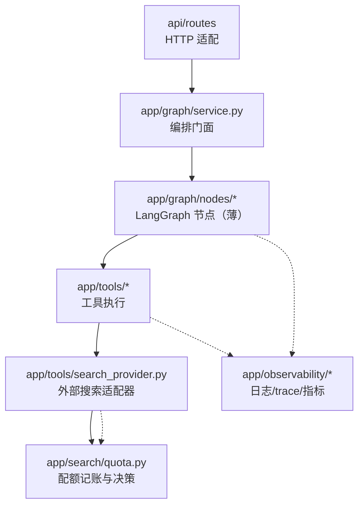

# AI Research Workspace — 后端重构 PRD

| 项 | 值 |
| --- | --- |
| 语言 | 中文 |
| 技术栈（不变） | Python 3.13 / FastAPI / LangGraph / Pydantic v2 / httpx / tenacity |
| 项目名（后端） | `ai_research_workspace_backend` |
| 代码基线 | `D:/UserData/Desktop/项目/backend`，5978 行（app 4216 + tests 774 + 其他） |
| 版本 | v0.2.0（重构版） |
| 作者 | 许清楚（产品经理） |
| 上游约束 | 搜索**不接新供应商**，只做配额治理；不改前端已有页面；不新增重量级依赖 |

---

## 0. 变更历史

### v1.0 — 初稿
基于代码取证产出痛点清单、配额治理方案、架构分层方案、可观测方案、需求池与验收标准。

### v1.1 — 前端依赖澄清（frontend-pm 征询）
- 新增第 10 章：耗时字段 / 步骤计数 / 跨会话 active run 三项后端能力核查。
- P1-7 / P1-8 / P1-9 提为 P0（后续 team-lead 批准）。

### v1.2 — team-lead 第一轮裁决
- P1-7 / P1-8 / P1-9 → **P0-15 / P0-16 / P0-17**，各自限定范围（不许碰 checkpointer / 不许扩展成耗时分析体系 / 不许重排 nodes）。

### v1.3 — team-lead 第二轮裁决（僵尸 run 落点）
- **P0-15 收敛**：不做 `GET /api/runs/active` 专用端点，改为把陈旧过滤**下沉到 `run_store.list_runs()`**。理由：顶栏只是单个消费方，真正的污染面是历史列表，修在 `list_runs()` 才能被所有消费方共享。
- 新增 §10.5 技术债登记 5 条（TD-1 ~ TD-5），每条含缓解措施与残留缺口。
- **重要修正**：原定 180s 陈旧阈值被否决，改为「只对 `status="running"` 生效 + 阈值 900s」（依据见 §10.3 边界④；`awaiting_approval` 的 `updated_at` 是冻结的，用 180s 会把待确认报告从列表抹掉）。

### v1.4 — 用量契约与列表口径
- 用量字段走 **独立端点 `GET /api/settings/usage`**（team-lead 批准），确立降级契约：**配额不可读时返回全 0、HTTP 200，不抛异常**（AC-25）。
- `GET /api/graph/runs` **保持 `list[dict]`，不引入 response model**（team-lead 批准选 (b)）；以 AC-24 契约测试锁住 `created_at` / `updated_at`。
- 新增 §0.1「响应模型追加式」约定；新增 AC-23 / AC-24 / AC-25。

### v1.5 — Q1~Q7 全部裁决（当前）
- §11 由「开放问题」改为「**已裁决事项**」，每条补「裁定值 + 依据行号」，并声明**全部已裁决、不再讨论**。
- **§11.1 新增实施约束**：`app/observability/` 目前**尚不存在**（Q5 属欠账非既成事实）；观测模块必须**复用 `quota.py:181-198` 已有的 `current_run_id()` ContextVar**，不得另建第二套、不得参数透传；迁移只能是「搬函数 + 改 import」，**不许重构 `reserve`/`settle`/`release` 调用语义**。
- 特别记录 Q2 的反向裁定：**不采纳**「DB 层原子累加 + 接受极小超支」——记账正确性是该模块存在的唯一理由，不能拿它换并发度。
- 用量字段走 **独立端点 `GET /api/settings/usage`**（team-lead 批准），确立降级契约：**配额不可读时返回全 0、HTTP 200，不抛异常**（AC-25）。
- `GET /api/graph/runs` **保持 `list[dict]`，不引入 response model**（team-lead 批准选 (b)）；以 AC-24 契约测试锁住 `created_at` / `updated_at`。
- 新增 AC-23 / AC-24 / AC-25。

### v1.10 — smoke 断言规格更正：不做跨命名空间名称比对（当前）

- **更正 v1.9 给 frontend-engineer 的规格**：原写法「提取 `add_node` 阶段名，断言与 `STEPS` 的 `name` 一一对应」**做不成**——后端是 `understand_task` / `retrieve` 这类 snake_case，前端 `STEPS[].name` 是 `理解任务` / `资料获取` 这类中文（`FlowOverview.tsx:13-52`），命名空间对不上。硬造映射表等于又引入一份平行清单，正是本轮在拆的东西。
- **改为两条**：① 「`add_node` 顺序 == 脚本内硬编码的期望序列」；② 「`STEPS.length === ` 后端阶段数」。
- **两条的分工是「归属」不是「覆盖面」**：重排 `add_node` 时 `STEPS` 条数不变，只有第 ② 条会漏报或误指方向；由 AC-20b（后端单测，断言含顺序）把这类失败钉在后端一侧，避免失败信息误导值班的人去改前端文案。
- **核过基线**：`STEPS` 现为 7 条（`no: 1~7`，按 `grep -c "no: "` 会得到 8，含第 4 行的接口声明 `no: number`），与后端 7 阶段数量已一致，第 ② 条断言**今日即为绿**，是防漂移护栏而非现存故障。

### v1.9 — 阶段顺序的前后端同步：不写提示行，改记校验归属

- **背景**：v1.8 落了 `STAGE_ORDER` 推导式后，前端 `FlowOverview.tsx:11` 的 `STEPS`（8 个阶段 + 硬编码说明文案）与后端构成同一份概念的两处登记，命中 §6.1 的失败模式。
- **决定不写提示行**：若把「前端 `STEPS` 需与此一致」写进后端文档，该提示本身就成了后端文档里第二处无机制保证的内容，最易被当历史注释忽略。**不新增待办债**（收益最小、成本最高、最易腐化），改为新增 **§10.6** 记录校验归属：该缺口已由 `smoke-render.mjs` 交叉断言覆盖（frontend-engineer 执行）。
- **区分「已消除」与「残留」**：后端碎片已由 v1.8 推导式 + AC-20b 消除；前端 `STEPS` 的残留是「不受任何测试保护」，只能靠补校验消除，**不能靠去重消除**（它是文案，本就不该由节点名生成）。
- 记入一条判据：发现硬编码时，正确动作不一定是去重，而是先问**它有没有被校验**。

### v1.8 — `STAGE_ORDER` 推导式落地 + 分母 8 的理由

- **更正我 v1.7 的提法**：我当时写「由后端从 `len(STAGE_ORDER)` 推导」，但没意识到 **`STAGE_ORDER` 目前根本不存在**（`grep STAGE_ORDER backend/app/` 零命中），它属于 T10 要新建的东西。若 T10 手写一个阶段名字列表，就出现第二份并列清单，与 §6.1 已登记的失败模式重合。
- team-lead 查证补齐了两个事实：唯一真相源是 `graph.py:80-87` 的 `add_node` 顺序；且 `grep "STAGE_ORDER\|add_node\|graph.nodes\|阶段顺序" backend/tests/` 零命中——该对应关系目前**只有「评审必查」一条人类纪律守着**，无自动化检查。
- **落法**：`STAGE_ORDER` 在 `build_research_graph()` 内从 `graph.nodes` 推导（排除 `__start__`/`__end__`/`fail`），使「与 `add_node` 一致」在结构上不可能不成立；配套 AC-20b 断言推导结果，把「评审必查」变成「CI 必红」。
- **补上分母 8 的理由**：8 是**钳制值**不是笔误，作用是保证阶段阶梯在任何情况下都不先于完成抵达 100%（取 7 会导致 `7/7 = 100%` 假满格，与前端 0.95 钳制自相矛盾）。并注明 `max(8, current)` 的 `max` 是对 `current` 的上界保护，不是给分母加的。

### v1.7 — 撤回 IC-1：13 不进 API 字段

- **我自己 v1.6 的写法有一处错误，此处更正**：我把 `estimated_total_steps` 记成了 `m + 4v + 2 = 13`，又把 §10.2 的 `current_step` 记成了 `len(steps)`。经 team-lead 终裁，两者都错：**`estimated_total_steps` 恒为 8（阶段总数），`current_step` 是阶段序号（上限 8）**；13 是**节点执行次数上界**，只属于进度条，而进度条分母由前端本地建模算出，**不消费后端字段**。§10.2、P0-17 行已按此更正。
- 诊断部分（8/13 ≈ 61% 填不满）成立，但**该进度条不存在**：UI 有两个 widget，分母各归各的——阶段阶梯答「现在第几阶段」、进度条答「活干完了多少」（分子 `len(steps)`）。禁令只有一条：**不许把 `current_step` / `estimated_total_steps` 放进同一个除法**。
- `current_step` 冻在 3 属诚实表述，research 循环期的推进由进度条体现，**「循环期停在 3」那套已批准设计不推翻**，AC-23b 判据仍是「不许倒退」而非「不许递增」。
- 补同源声明：`RECOURSE_BLOCK = 4` 与前端 §12.2 是同一个数，任一侧单独改动都会造成切换时进度跳 2。

### v1.6 — `estimated_total_steps` 分母口径收敛为 13（其时点口径，已被 v1.7 更正）
- **修订 P0-17 与 §10.2 的推算公式**：原稿「固定 6 步 + `max_iterations` + `max_verify_attempts`」= 11 是我未做条件边核对的估数，**作废**。采纳 frontend-architect 用 32 组配置（`maxIterations` 1~8 × `maxVerify` 1~4）逐一模拟验证的口径：

  ```
  estimated_total_steps = max_iterations + 4 × max_verify_attempts + 2
  ```

  推导依据：`route_after_verify` 在 `verify_attempts < max_verify_attempts` 时回到 research，故循环轮次 = v−1；而每一轮循环重跑的是 `research → retrieve → analyze → verify` **4 个节点**，不是只重跑 `research`。默认 `(3, 2)` → **13**（原稿 11，(8,2) 原稿 13 → 实为 18，(8,4) 原稿 14 → 实为 26）。
- **AC-20 收紧**：从「默认配置下 `>= current_step` 恒成立」改为**锁死具体数值** + 断言 32 组配置的单调性，杜绝「9/8」与「进度只走一半」两种崩坏。
- **提醒架构文档同步**：`backend-refactor-architecture.md` §12.2.3 的 `total = max(8, current)` = 8 是第三个口径，且已被写成实现。本轮要求**收敛为 13 一个分母**，8 不得与 13 同时对外。
- **新发现 IC-1（单位错配）**：已由 team-lead 终裁，**见 v1.7**。此处保留原文记录当时的判断。

---

## 0.1 约定：接口响应模型的「追加式」规则（**不可违反**）

> 失效风险：若 `GET /api/graph/runs` 将来补上 `list[SomeModel]` 这类正式 response model，**Pydantic 会静默裁剪掉所有未声明字段**——接口照常返回 200、类型也对得上，只是 `created_at` 悄悄没了，前端 ETA 静默失效，且没有任何报错。

**规则**：

1. 当前该端点**保持 `list[dict]` 裸返回，不引入 response model**。
2. 若将来确需引入，**必须是追加式**：新 schema 必须保留当前全部已有键（`id` / `thread_id` / `question` / `status` / `state` / `created_at` / `updated_at`），**只允许增、不允许减**。
3. 引入时**必须同步更新 AC-24** 的断言，且断言失败信息要写清后果（见 AC-24）。
4. **不得**借助引入 response model 来「顺手」裁剪 `state` 字段——那是性能优化，需单独立项并单独评审，不要搭在这次契约变更的车上。

### 0.2 实现进度标注（防止把「已裁决」读成「已实现」）

本 PRD 的需求条目写于重构前。**其中一部分后端代码已经落地**，实施时按此表区分「要新建」还是「已存在、只需验收」：

| PRD 条目 | 落地状态 | 位置 |
| --- | --- | --- |
| P0-1 配额记账（预扣/结算/自然月窗口） | **已实现** | `app/search/quota.py` |
| P0-7 `StubSearchProvider` 不计费 | 待验收 | `app/search/quota.py` 相关分支 |
| Q7 模块命名 `app/search/` | **已实现** | `app/search/{quota.py,errors.py}` |
| Q5 / P0-12 结构化日志、run 级追踪 | **未实现（`app/observability/` 目录不存在）** | 待建，约束见 §11.1 |
| 其余 P0 / P1 条目 | 未实现 | 见第 7 章需求池 |

> **提醒**：`app/search/quota.py` 是本轮**唯一已落地的模块**，且它自己就约束了下游（单 worker 语义见 `quota.py:22-28`；run_id ContextVar 见 `:181-198`）。后续模块在引用它之前，请先确认这些既有约束是否约束到你自己。

---

## 1. 产品目标

> **一句话**：让每一次研究都「说得清花掉了什么、花在了哪、额度没了会明说，而不是假装成功」。

拆成三个正交目标：

| # | 目标 | 用户视角的说法 |
| --- | --- | --- |
| G1 | **配额可见、可控、可预警** | 「我还剩多少搜索额度？快用完时你得提前告诉我，别等我跑了 20 次研究才发现全是空的。」 |
| G2 | **搜索失败对用户可感知** | 「额度耗尽/搜索挂了时，请明确告诉我这轮研究缺少真实来源，不要给我一份看起来正常的空报告。」 |
| G3 | **系统可诊断、可度量** | 「出问题的时候我能看到 trace_id，能把日志甩给你；你也能看到搜索失败率和平均耗时，而不是让我猜。」 |

**不做什么（明确排除）**：不接新搜索供应商、不做前端页面、不引入 ORM / 可观测性全家桶、不改 LangGraph 的流程语义与人工确认中断点。

---

## 2. 当前痛点清单（逐条带行号取证）

### P-1 【最痛｜P0】额度耗尽 = 静默失败，用户完全无感知

**证据链（4 步，每一步都在丢信息）**

| 步 | 位置 | 代码行为 |
| --- | --- | --- |
| ① | `app/tools/search_provider.py:119-126` | `try/except Exception` 兜住一切，`logger.warning` 后 `return []`。**HTTP 429（额度耗尽）与「网络抖动」「查询真的没结果」在这里被合并成同一个返回值 `[]`**。 |
| ② | `app/tools/search_web.py:36-37` | 拿到空列表后 `return f"没有检索到与「{args.query}」相关的内容。"` —— **以 `ok=True` 返回**，`ToolResult.error` 为 `None`，`error_kind` 为 `None`。从工具层看，这次调用是「成功的，只是没搜到」。 |
| ③ | `app/graph/nodes.py:424-425` / `399-403` | `retrieve_node` 里 `except Exception: web_result = None`，配额耗尽被静默吞掉，**连 `tool_calls` 记录都不会产生**。 |
| ④ | `app/graph/nodes.py:442` | `used_source = "无命中"`，`retrieve` 节点的 step 摘要是「无命中：补充证据」。后续 analyze / verify 拿到 0 条证据，仍照常生成结论，最终 `write` 节点返回 `"status": "completed"`（`nodes.py:551`）。 |

**用户会遇到什么**：

1. 跑到第 N 次研究时，搜索开始静默返回空。用户不会收到任何中断、警告、错误——后端返回 `status="completed"`。
2. 报告照常生成，但里面**没有任何一条 `citations`**，`evidence_count=0`。报告读起来仍然结构完整（有标题、有章节、有结论），用户很难一眼看出它是「零证据凭空写出来的」。
3. 用户会**持续消费后续月份的行为模式**：以为额度还在，继续跑；等到某天手动打开 Tavily 后台才发现额度早就超了。
4. 更糟的是这是**单向消耗**：额度耗尽后每一次 run 仍然会走 complete_structured 调 4~6 次 LLM（`nodes.py:129/166/239/471/502/535` 共 6 个 LLM 调用点），**烧的是用户的 LLM 钱，产出却是零证据的报告**。

**这一条是本 PRD 的第一优先级，其余痛点都排在其后。**

> 补充取证：Tavily 免费额度是 **1000 credits/月**，basic 搜索 1 credit、**advanced 搜索 2 credits**（Tavily 官方 Credits & Pricing）。而当前代码 `app/tools/search_provider.py:115` 硬编码 `"search_depth": "advanced"` —— 也就是说**实际可用搜索次数约 500 次，不是用户以为的 1000 次**。这条认知偏差本身就是「配额不可见」造成的第一重伤害。

### P-2 【P0】额度成本无人记账：不知道一次研究花掉了多少

**证据**：全仓 grep `tavily|quota|credit|usage` 仅命中 token 用量（`app/graph/state.py:37`、`app/graph/service.py:29-30`），**没有任何搜索积分的计数、扣减、上限**。`app/core/config.py:56-68` 只有 `search_provider` 与 `tavily_api_key`，无配额字段。

**用户会遇到什么**：无法回答「我这一个月用了多少」「一次研究平均花几次搜索」，无法做任何预算判断，也无法在额度见底前主动减速。

**量级测算（供阈值设计参考）**：单条 run 中 `research_node` 最多执行 `max_iterations(3) + max_verify_attempts(2) = 5` 次（`app/graph/graph.py:45-51, 72-74`），加 `retrieve_node` 固定 1 次 → **单次 run 最多 6 次搜索**（advanced 下 12 credits / **basic 下 6 credits**）；典型 run 1~2 次（advanced 2~4 credits / **basic 1~2 credits**）。<br/>**1000 credits 的可用量：advanced ≈ 250~500 次典型研究或约 83 次最坏情况；basic ≈ 500~1000 次典型研究或约 166 次最坏情况。**（2026-09-25 默认改 basic 后，取后半段数值）

### P-3 【P0】工具层与图层没有重试，只有 LLM SDK 层有

**证据**：
- LLM 层有 tenacity 重试：`app/llm/client.py:150-156`（`stop_after_attempt(max_attempts=3)` + `wait_exponential` + `retry_if_exception(retryable)`）。
- 工具层只有一次机会：`app/tools/base.py:74-125`，失败即 `return self._failure(...)`，**无重试**。
- 图层的 `plan_node` 自己写了个 for 循环重试（`app/graph/nodes.py:164-179`），这是**散落在节点里的孤立重试逻辑**，与工具层、LLM 层三套机制互不相通。

**用户会遇到什么**：一次偶发的网络抖动导致 `search_web` 失败，整个研究的检索环节就缺一块；而同样的抖动在 LLM 调用上是被自动掩盖的。体验不一致，且失败原因难以定位。

### P-4 【P0】没有 run 级别的追踪 ID，三个 ID 互不相通

**证据**：
- HTTP 层有 `request_id`：`app/core/middleware.py:33-34`，输出为 `request_id=xxx` 的纯文本前缀（`middleware.py:47`）。
- Graph 路径只有 LangGraph 的 `thread_id`，且靠 `_thread_id(config)` 从 `RunnableConfig` 里抠（`app/graph/nodes.py:73-75`，图里还在用 `thread_id` 当 `run_id` 构造 `ToolContext`，见 `nodes.py:278` 与 `nodes.py:387`）。
- Agent 路径是**另一个** run_id：`app/agent/orchestrator.py:65`（`uuid4().hex[:12]`），与 graph 那条线毫无关联。

**用户会遇到什么**：用户报「研究卡住了」，你手上只有一个 thread_id，无法把它和那次 HTTP 请求、那批工具调用日志对上；在几十条工具调用日志里靠肉眼找是哪个环节慢/失败。

### P-5 【P0】日志是非结构化文本，字段靠字符串拼接

**证据**：`app/core/logging.py:13` 的 `_LOG_FORMAT = "%(asctime)s | %(levelname)-8s | %(name)-28s | %(message)s"`。工具/节点的日志是自由文本，例如 `app/tools/base.py:95`（`"tool timeout: %s"`）、`app/graph/nodes.py:179`（`"plan 生成失败（第 %s 次）：%s"`）。唯一的「结构化」是 middleware 手拼的 `request_id=%s ...`。

**用户会遇到什么**：无法按「某个 run 里所有工具调用」聚合统计；查一次失败要翻几百行文本。

### P-6 【P1】缺少任何运行统计

**证据**：`app/api/routes/health.py:28-36` 只返回 app_name / environment / version / timestamp。全仓无失败率、耗时、token 用量、工具成功率的采集点。虽然 token 用量已存进 state（`app/graph/state.py:37`），但只在单次 run 内累加（`app/graph/service.py:29-30`），**跨 run 没有聚合**。

**用户会遇到什么**：只能靠「感觉慢」，无法判断是 LLM 慢还是搜索慢；无法判断最近是不是在间歇性失败。

### P-7 【P1】`nodes.py` 572 行职责过杂，依赖靠 `_deps()` 从 config 里抠

**证据**：`app/graph/nodes.py:78-86` 的 `_deps(config)` 从 `RunnableConfig["configurable"]` 里取 client / registry，取不到就调全局单例。同一份「全局单例」在 `app/tools/registry.py:39-59` 和 `app/graph/service.py` 里各实现一次，三处各调一次 `get_llm_client()`（`nodes.py:84`）/ `build_default_registry()`（`nodes.py:85`）。

**用户会遇到什么（间接）**：无法对单个节点做单元测试——要测 `retrieve_node` 就得伪造一个 `RunnableConfig` 并让 `_deps` 认账，测试的 Setup 成本极高，因此现有 774 行测试里**没有任何单节点测试**，全靠端到端跑（`tests/test_graph.py:71-101`）。改一个节点就得跑整条图。

### P-8 【P1】`service.py` 混了四件事

**证据**：`app/graph/service.py` 207 行里同时有：图编排（`start_research` 121 / `resume_research` 146）、状态映射（`_to_response` 28）、事件广播（`_announce` 66）、落库（112-117）。

---

## 3. 配额治理需求（核心章节）

> 本章是本次重构的重心。目标：把「静默失败」改造成「**可预知的、可记账的、可降级的、明说的**」行为。

### 3.1 需要追踪什么

| 维度 | 字段 | 说明 |
| --- | --- | --- |
| 调用次数 | `calls_total` | 实际发出的搜索请求数（**重试算多次**，重试是真实扣费） |
| 消耗积分 | `credits_used` | 按 `depth` 加权累加：basic=1 / advanced=2 |
| 时间窗口 | `period_key` | `YYYY-MM`，自然月；读取时 lazy rollover |
| 按 run 聚合 | `search_credits_by_run` | 每次 run 的搜索调用数与积分，用于「这次研究花了多少」 |
| 按天聚合 | `daily_calls` / `daily_credits` | 排查「哪天突然烧没了」 |
| 失败分类 | `failed_by_kind` | `quota_exhausted` / `timeout` / `network` / `upstream_error` / `empty` |
| 预警 | `warn_level` | 达到 50% / 75% / 90% 各记一次 |

**Tavily 计费口径（必须写进代码注释）**：basic=1 credit，advanced=2 credit。当前 `search_provider.py:115` 用 advanced，单次要 2 credit。

### 3.2 额度耗尽时该怎么做决策（明确建议）

**建议：`degrade_annotate`（分层降级 + 强制标注）**，同时保留 `hard_stop` 作为可选策略。

| 策略 | 行为 | 评价 |
| --- | --- | --- |
| `degrade_annotate`（**推荐，默认**） | 本次搜索返回 `ok=False, error_kind="quota_exhausted"`；**当前 run 继续跑完**，但：① SSE 立刻发一条 `warning` 事件；② thread 的 `steps` 里写入一条明确记录；③ 最终 `ResearchRunResponse` 在**非失败字段**上带 `degraded_reason`，且 `finished_reason` 置为 `search_quota_degraded`；④ `write` 节点的 prompt 被注入「本次研究未获取到任何联网来源，请在报告中显式声明证据缺失」。 | 既不浪费用户已投入的 LLM 开销，也不再假装成功。**「继续」和「说明继续得有条件」是两件事，当前代码的 bug 在于只做了前者。** |
| `hard_stop` | 达到软上限（90%）时拒绝新建 run（返回 409 + 明确原因）；额度为 0 时连 `start_research` 都进不去。 | 防「白烧 LLM 钱跑零证据研究」，适合付费额度场景。作为配置项提供。 |
| `continue_silent` | 即当前行为 | **明确废弃**，不允许保留。 |

**为什么不是纯 hard stop**：研究任务有独立价值——用户可能只是要一份基于自有知识库的结论。此时 `retrieve_node` 前的知识库检索（`nodes.py:398-417`）仍可能命中。直接 500 / 409 会让用户花 1~2 分钟等来的东西全部作废，体验比「带标注的降级报告」更差。

**为什么不是「继续但只记日志」**：这正是 P-1 的病根。日志只有打开终端的人看得见，而系统有 SSE 和前端。

**额度为 0 时新建 run 的处理**：
- `degrade_annotate` 策略下，**允许**新建，但 SSE 第一帧就带 `warning`，且 `start_research` 立即返回 `warnings=[...]`；
- `hard_stop` 策略下，**拒绝**新建，返回 `AppError(ERROR_CODES.SEARCH_QUOTA_EXHAUSTED, 402/409)`，message 必须是可操作的：「本月搜索额度（1000 credits）已用尽，下次重置为 X 月 1 日。可以先切到离线模式重试，或配置更多额度。」

### 3.3 阈值预警（建议档位）

| 水位 | 级别 | 动作 |
| --- | --- | --- |
| ≥ 50% | `INFO` | 记日志 + `usage` 里出现 warn 记录 |
| ≥ 75% | `WARNING` | 记日志 + SSE 发 `warning` 事件 + 新建 run 的响应带 `warnings` |
| ≥ 90% | `ERROR` | 记日志 + SSE `warning`（高优先级）+ **`degrade_annotate` 模式下建议同步切 `hard_stop` 语义**（配置项 `search_quota_soft_cap_ratio=0.9`） |
| ≥ 100% | `CRITICAL` | 停止扣费，进入降级/拒绝分支 |

**暴露形式（三条都要，缺一不可）**：
1. **日志**：结构化 `event=search_quota_warning level=... credits_used=... / credits_total=...`；
2. **SSE 事件**：新增 `EventType.SEARCH_QUOTA_WARNING`，前端可实时弹提示（前端接入由前端线负责）；
3. **API 字段**：`ResearchRunResponse.warnings: list[str]`、`ResearchRunResponse.degraded: bool`、`ResearchRunResponse.degraded_reason: str | None`，以及设置页要用的 `/api/settings` 用量快照（见 3.4）。

### 3.4 用户能否在设置页看到用量（接口契约）

后端**只定义契约**，前端接入由前端线负责。

**最终决定（team-lead 已批准）：新增独立端点 `GET /api/settings/usage`，不并入 `GET /api/settings`。**

两条理由：

1. **失败隔离（主）**：配额 SQLite 在全新安装/文件损坏时可能读不到，而 `/api/settings` 是设置页的**必读**数据——不能因为用量统计挂掉连设置页都开不了。
2. **变更频率不同（次，team-lead 补充）**：设置页其余项基本静态，而**配额用量每次研究都会变**。合并的话，前端要么每次都等用量、要么得在设置页上自己造一套过期逻辑。独立端点天然允许「设置页秒开、用量按需加载或定时刷新」。

**降级行为契约（必须实现）**：

| 场景 | 端点行为 | 前端行为 |
| --- | --- | --- |
| 配额 SQLite 不可读 / 文件缺失 / 配额模块未启用 | **返回默认值（数值全 `0`、字符串空），HTTP 200，绝不抛异常** | 隐藏整个「用量」分组，设置页其余部分照常渲染 |
| 正常 | 返回真实快照 | 渲染分组 |

> 实现提示：配额访问器命名为 `get_search_quota_or_none()`，返回 `None` 的语义正好对得上——**不要在这个端点里向上抛异常**。
>
> 若团队日后改口径并入 `GET /api/settings`，改动很小，但**必须保留上面这张表的降级行为**。

```jsonc
{
  "success": true,
  "data": {
    "provider": "tavily",

    // ---- 周期 ----
    "period_key":     "2026-09",                         // string
    "period_start":   "2026-09-01T00:00:00+08:00",       // string ISO-8601(+时区)
    "period_end":     "2026-10-01T00:00:00+08:00",       // string ISO-8601(+时区)
    "renews_at":      "2026-10-01T00:00:00+08:00",       // string ISO-8601(+时区)

    // ---- 额度（单位：积分 credits）----
    "credits_limit":   1000,   // number 本周期上限
    "credits_used":     742,   // number 已消耗（含本周期全部累计）
    "credits_remaining":258,   // number 剩余
    "ratio":            0.742, // number 0~1 小数，**不是** 74.2
    "warn_level":           2, // number 0=正常 1=50% 2=75% 3=90%+ 4=已耗尽
    "warn_level_label": "接近上限", // string 档位文案，前端不必自己算

    // ---- 次数（单位：次）----
    "calls_total":            371, // number 本周期搜索调用总数（含失败）
    "calls_failed_total":       3, // number 本周期失败次数
    "calls_quota_exhausted":    0, // number 本周期因额度耗尽被拒次数

    // ---- 成本口径（单位：积分/次）----
    "search_depth_default": "basic",    // string basic | advanced（2026-09-25 起默认 basic）
    "credits_per_call":       1,        // number 单次搜索耗费，basic=1 / advanced=2

    // ---- 预测 ----
    "avg_credits_per_run":   1.5, // number | null 近 7 日均
    "estimated_runs_remaining": 64, // number | null 为 null = 数据不足，前端不要渲染"预计"

    // ---- 每日聚合（用于迷你图）----
    "daily": [ // array<object>，固定最近 7 天，缺失天数以 0 补位
      {"date": "2026-09-25", "calls": 12, "credits": 24}
    ]
  }
}
```

**为满足前端「设置页用量分组」而衍生出的展示契约**（下表即 frontend-pm 在 `Settings.tsx` 里要写进 `buildGroups()` 的那批 key）：

| 展示项 | key | 类型 | 量纲 / 备注 |
| --- | --- | --- | --- |
| 已用 / 上限 | `credits_used` / `credits_limit` | `number` | 积分 |
| 剩余 | `credits_remaining` | `number` | 积分 |
| 使用比例 | `ratio` | `number` | **0~1 小数**，前端自行 ×100 得百分比 |
| 状态文案 | `warn_level_label` | `string` | 后端出文案，前端不做档位判断 |
| 档位（可选，用于配色） | `warn_level` | `number` | 0~4 |
| 本月搜索次数 | `calls_total` | `number` | 次 |
| 单次耗费 | `credits_per_call` | `number` | 积分/次；配 `search_depth_default` 一起展示可解释「为什么 1000 积分只约等于 500 次」 |
| 预计还可研究 | `estimated_runs_remaining` | `number \| null` | 次；**null 时前端不渲染这一行**，不要显示 `0` 或 `NaN` |
| 下次重置 | `renews_at` | `string`(ISO) | 前端自行格式化 |

**硬性约束**：`estimated_runs_remaining` 与 `avg_credits_per_run` **允许为 `null`**（样本不足时），其余数值字段在配额模块未启用时一律返回 `0`，不得返回 `null` 或不出现——保证前端无需写两套分支。

**同时扩展 `ResearchRunResponse`**（`app/schemas/graph.py:29-47` 追加，均为**向后兼容的可选字段**）：

| 字段 | 类型 | 含义 |
| --- | --- | --- |
| `credits_used` | `int` | 本次 run 消耗的搜索积分 |
| `search_calls` | `int` | 本次 run 的搜索次数 |
| `degraded` | `bool` | 本次 run 是否处于降级状态（零/少证据） |
| `degraded_reason` | `str \| None` | 如 `search_quota_exhausted` |
| `warnings` | `list[str]` | 面向用户的人类可读提示 |

**前端接入点**：设置页新增「搜索用量」卡片；研究卡片在 `degraded=true` 时显示醒目提示。**后端必须保证：这些字段在额度充足时是 `0 / 0 / false / None / []`，而不是缺失或 null**——否则前端要写两套分支。

### 3.5 数据存哪里（推荐：SQLite，附理由与风险）

**推荐 `storage/search_quota.db`（复用已有 SQLite 范式）**，而不是进程内存。

| 方案 | 优点 | 问题 |
| --- | --- | --- |
| 进程内存 dict | 零成本 | ❌ **重启即归零** → 用户重启服务就能「刷新」免费额度。对按 credit 计费的外部服务来说，这个记账不成立，等于漏洞。 |
| SQLite（**推荐**） | Python 内置 `sqlite3`，**零新依赖**；沿用 `app/rag/store.py` 已有的连接/WAL/close 范式与 `main.py:36-56` 的 `_close_sqlite_handles`；单机部署零运维；写入量极低（每次搜索 1 行 upsert） | 需处理多 worker 场景 |
| 新依赖（Redis/SQLAlchemy） | — | ❌ 违反「不新增重量级依赖」约束 |

**必须处理的三个细节**：

1. **单调不减 + 跨进程**：写入用 `INSERT ... ON CONFLICT DO UPDATE SET credits_used = credits_used + ?`，用 SQL 原子累加而不是「读出来 +1 再写回」，避免竞态超支。
2. **多 worker 风险**：`uvicorn --workers > 1` 下各 worker 独立记账会低估用量。缓解：README 明确标注「当前配额记账为单 worker（uvicorn 单进程）设计」，并在 `/api/health` 暴露 `workers=1` 约定；接受极小超支风险（WAL + `synchronous=NORMAL`），因为 Tavily 侧自身也会限流兜底。**这一条要写进 Open Questions 与 README。**
3. **时间窗口**：存 `period_key='YYYY-MM'`，**读取时 lazy rollover**（比对当前 `YYYY-MM`，不同则清零并写回），**不使用定时任务**——避免进程长期不重启时 Cron 不执行，也避免引入调度依赖。

**启用条件**：`search_quota_enabled=True` 时计费；使用 `StubSearchProvider`（离线语料，`search_provider.py:84-98`）时**必须不计费**——见 6.2 的测试兼容性坑。

---

## 4. 架构分层需求

### 4.1 目标分层



### 4.2 `nodes.py` 怎么拆（572 行 → 6 个文件）

采用**包 + 命名空间重导出**的方式，`app/graph/graph.py:18-27` 的现有 import 语句**一行都不用改**，因此 `tests/test_graph.py` 完全不受影响。

| 文件 | 职责（一句话） | 预估行数 |
| --- | --- | --- |
| `app/graph/nodes/__init__.py` | 重导出 8 个节点函数，保持 `from app.graph.nodes import understand_task, ...` 向后兼容 | ~20 |
| `app/graph/nodes/common.py` | 节点公共件：`_ask` / `_step` / `_failed` / `_safe_args` / `_make_tool_context` / `resolve_deps` / `NodeDeps` | ~120 |
| `app/graph/nodes/understanding.py` | `understand_task` + `_fallback_plan`（计划兜底） | ~90 |
| `app/graph/nodes/research.py` | `research_node`（工具决策循环，最大一块） | ~150 |
| `app/graph/nodes/retrieval.py` | `retrieve_node`（知识库优先 + 联网回退的编排） | ~90 |
| `app/graph/nodes/analysis.py` | `analyze_node` + `verify_node` | ~110 |
| `app/graph/nodes/writing.py` | `write_node` + `fail_node` | ~80 |

**拆分原则**：每个文件≤150 行；**跨文件共享的私有函数上提到 `common.py`**；`_TRUSTED_TOOLS`（`nodes.py:49`）、`_EVIDENCE_PREVIEW`（`nodes.py:43`）、`_ARGS_SNAPSHOT_CHARS`（`nodes.py:44`）三个常量统一迁到 `common.py`。

### 4.3 `_deps()` 改成依赖注入

**当前问题**：`nodes.py:78-86` 从 `RunnableConfig["configurable"]` 里抠依赖，测试要伪造 config。

**目标形态**：

```python
# app/graph/nodes/common.py
@dataclass(frozen=True)
class NodeDeps:
    llm: LLMClient
    registry: ToolRegistry
    quota: SearchQuota | None = None     # None = 不计费（stub provider）
    tracer: Tracer | None = None

def default_deps() -> NodeDeps: ...     # lru_cache，替换 get_llm_client / build_default_registry

def resolve_deps(config: RunnableConfig | None) -> NodeDeps:
    """兼容垫片：优先读 configurable，读不到回落 default_deps()。
       保留这个函数是为了(1) 现有 test_graph 端到端不受影响；(2) 后续可换 DI 容器。"""

# 每个节点拆成「纯逻辑」+「LangGraph 适配器」两层
async def _research_logic(state: ResearchState, deps: NodeDeps) -> dict: ...
async def research_node(state, config) -> dict:
    return await _research_logic(state, resolve_deps(config))
```

**收益**：单节点单测直接 `await _research_logic(state, deps_with_fake_llm)`，**完全不需要构造 `RunnableConfig`**。

**同时回收三处重复的单例工厂**：`app/tools/registry.py:39-59`（`build_default_registry`）、`nodes.py:84-85`、以及 service 里的调用，统一由 `default_deps()` 提供。

### 4.4 service 层如何回收

`app/graph/service.py` 207 行拆成三块，**对外门面不变，路由与测试零改动**：

| 新文件 | 从 service.py 移出 | 说明 |
| --- | --- | --- |
| `app/graph/run_mapper.py` | `_to_response`（28-63） | 纯函数，方便单测「状态映射」这一最容易出回归的部分 |
| `app/graph/notifier.py` | `_announce`（66-83）+ SSE 生命周期事件 | 事件语义集中，便于扩展 `SEARCH_QUOTA_WARNING` |
| `app/graph/service.py` | 保留 `start_research` / `resume_research` / `list_runs` 编排 + `_snapshot` | 目标 ≤ 120 行 |

**`TERMINAL_STATUSES`（`service.py:87`）是跨模块共识，下沉到 `run_mapper.py` 或 `state.py`，避免以后被别处重新实现一遍。**

### 4.5 可测试性：新增哪些测试

| 新增测试文件 | 覆盖 | 关键断言示例 |
| --- | --- | --- |
| `tests/test_search_quota.py` | 配额记账与决策 | 预扣/结算/429 分类/跨月 rollover/阈值触发/warn_level |
| `tests/test_nodes_unit.py` | **单节点测试**（当前空白） | 注：`_research_logic(state, fake_deps)`，不构造 RunnableConfig |
| `tests/test_tool_retry.py` | 工具层重试策略 | 可重试错误重试 2 次后成功 / 不可重试错误只调 1 次 |
| `tests/test_metrics.py` | 指标采集 | 搜索失败率、平均耗时的聚合正确性 |
| `tests/test_tracing.py` | run_id 贯穿 | 从 API 请求到工具日志，同一 run 的日志共享 `run_id` |

**fixture 组织方式（加在 `tests/conftest.py`，不删任何现有内容）**：

```python
@pytest.fixture  def fake_deps(...) -> NodeDeps      # 注入 FakeLLM + FakeRegistry
@pytest.fixture  def recording_llm(...)              # 记录每次 LLMRequest(purpose/metadata)
@pytest.fixture  def exploding_provider(...)         # 恒定抛指定异常的 provider
@pytest.fixture  def flaky_provider(...)             # 第 N 次抛异常、之后成功
@pytest.fixture  def tmp_quota_db(tmp_path)          # 指向临时 SQLite，绝不污染 storage/
@pytest.fixture(autouse=True) def no_network(monkeypatch)  # 禁止真实外网
```

`no_network` 这个 autouse fixture 很重要：**防止以后有人写了一个真的联网的测试，让 CI「时绿时红」**。

### 4.6 与现有 774 行测试的兼容（不要让它失效）

| 现有测试 | 处理 | 说明 |
| --- | --- | --- |
| `tests/conftest.py`（24 行，全离线语义：清空 `TAVILY_API_KEY`） | **保留并追加**，不改原行为 | 清除 `TAVILY_API_KEY` 这一行必须保留，否则 `test_tools.py:131` 会真联网 |
| `tests/test_tools.py`（134 行） | 保留 + 新增用例 | ⚠️ **已知兼容坑**：`test_search_web_returns_results`（131-135）依赖 stub provider 返回 5 条离线语料。如果配额模块对 stub 也计费，这份测试会因「额度为 0」而失败。**结论：`StubSearchProvider` 必须走 `quota=None`、不计费路径。** |
| `tests/test_graph.py`（175 行） | 保留 + 新增用例 | `start_research(...)` 走默认 `NodeDeps`，必须继续全绿；新增用例不得改动原断言 |
| `tests/test_agent_loop.py`（86 行）、`test_agent_api.py`（33）、`test_structured.py`（48） | 保留 | 依赖 `MockLLMClient` 的 `_MOCK_PURPOSES`（`app/llm/client.py:259-270`）；重构**不得**删减其中的 purpose，否则这些测试直接红 |
| `tests/test_rag.py`（180）、`test_research_plan_api.py`（52）、`test_health.py`（42） | 保留 | `test_health` 若断言方式是「字段存在性」，新增 metrics 字段不影响 |
| `tests/test_tools.py:10-15` 的 security 断言 | 保留 | 安全边界测试是红线，一行不改 |

**硬性要求**：重构前后 `uv run pytest` 全绿，且**现有 8 个测试文件的断言语义不变**（可以加断言，不可以改语义）。

---

## 5. 健壮性与可观测需求

### 5.1 工具层重试

**重试判定表（写进 `app/tools/retry.py`，工具与 provider 共用）**：

| `error_kind` | 是否重试 | 理由 |
| --- | --- | --- |
| `timeout` | ✅ 重试 | 幂等读操作，很可能只是慢 |
| `network` / `connection` | ✅ 重试 | 瞬时故障 |
| `upstream_5xx` | ✅ 重试 | 上游抖动 |
| `rate_limit`（429） | ✅ **重试，但要退避更久** | 重试有意义；注意搜索的 429 也可能是**额度耗尽**，见下 |
| `invalid_args` | ❌ 不重试 | 模型参数错了，重试 100 次还是错（`base.py:86-90`） |
| `blocked` | ❌ 不重试 | SSRF 拒绝 / 未知工具，重试是安全漏洞的放大器 |
| `execution_error` | ❌ 不重试 | 本地异常，重试无意义 |
| **`quota_exhausted`** | ❌ **不重试，且立即熔断** | **重试就是继续烧积分。这是与「限流」的关键区别，必须在代码里显式区分** |

> **关键区分**：Tavily 额度耗尽返回的 429 与「请求太频繁」返回的 429 是**同一状态码**。配额模块必须在**发起请求前**就预扣并拦截（否则等拿到 429 再熔断，积分数已经超支了），同时把**运行时**捕获到的 429 也归类为 `quota_exhausted` 而不是 `rate_limit`。

**参数建议**（`app/core/config.py` 新增）：

| 配置 | 默认值 | 说明 |
| --- | --- | --- |
| `tool_max_attempts` | `2` | 总计 2 次（1 次原始 + 1 次重试） |
| `tool_retry_backoff` | `wait_exponential(multiplier=0.5, min=0.5, max=4.0)` | **比 LLM 层（`client.py:152` 的 min=1,max=8）更短**，工具在 run 关键路径上，用户等不起 |
| `retryable_kinds` | `timeout,network,upstream_5xx,rate_limit` | 可配置项 |

**最终失败的降级**：
- `ToolResult` 增加 `attempts: int` 字段（否则统计会漏掉重试次数）；
- `search_web` 失败时 `to_observation()` 给模型的文本必须是「搜索服务本次不可用（原因），请基于已有证据作答或说明无法验证」，**不能是当前的「没有检索到与「X」相关的内容」**（`search_web.py:37`）——后者会让模型误以为「真的没有相关内容」，从而编造。这是 P-1 在提示词侧的修复；
- `error_kind` 区分 `quota_exhausted` / `search_failed` / `empty_result` 三类，`empty_result` 才是当前语义。

### 5.2 run 级追踪

**问题回顾**（见 P-4）：`request_id`（HTTP）、`thread_id`（Graph）、`run_id`（Agent）三个 ID 互不相通。

**方案**：

> ⚠️ **前置事实（v1.5 修订，与 §11.1 一致，不可违反）**：**不要新建第二个 ContextVar。** `run_id` 的 ContextVar（`_run_id_var` / `current_run_id()` / `run_context()`）**已经存在于 `app/search/quota.py:181-198`**，本方案是**复用并整体迁入**，不是新建。

1. `app/observability/tracing.py` **整体迁入** `quota.py:176-198` 的 `_run_id_var` / `current_run_id()` / `run_context()`（这是迁移不是重构，见 §11.1 约束二）；
   - run_id 取值规则：优先用 LangGraph 的 `thread_id`，Agent 路径用 `orchestrator.py:65` 的同款生成逻辑；二者在同一进程内统一为**同一个 run_id 命名规则** `run_<12 位 hex>`，Graph 路径的 `thread_` 前缀保留以兼容现有 API 契约；
2. **节点与工具一律通过 `current_run_id()` 取 run_id**，不再 `_thread_id(config)`（`nodes.py:73-75`/`278`/`387`）也不要在节点里手搓 `ToolContext(run_id=...)`；
3. middleware（`middleware.py:33`）优先沿用请求头 `X-Request-ID`，并把 `request_id` 一并写入同一个 ContextVar（与 run_id 并列，不是第二个 run_id），实现 HTTP → run 的串联；
4. 新增 `app/observability/logging.py` 或一个 `logging.Filter`，**不用 structlog**，把 run_id / request_id / node / tool 等字段注入每条日志记录（JSON 序列化用 `json.dumps(default=str)`）。

**为什么 run_id 不许有第二份**：`reserve(run_key=...)` 靠这个 ContextVar 把搜索归属到某次 run，run 级账本 `search_quota_run` 就是靠它落库的。如果 tracing 另建一份，日志里打印的和配额里记账的会是**两个不同的 run_id**，「这次研究花了多少」就算错了——而这正是我们要交付给用户的可信数字。

**日志字段字典**：

| 字段 | 类型 | 示例 | 来源 |
| --- | --- | --- | --- |
| `ts` | ISO8601 | `2026-09-25T14:03:11.221+08:00` | logging 自动 |
| `level` | str | `WARNING` | logging 自动 |
| `logger` | str | `app.tools.search_provider` | logging 自动 |
| `msg` | str | `搜索额度耗尽，本次返回降级结果` | 业务 |
| `run_id` | str \| null | `run_a1b2c3d4e5f6` | ContextVar |
| `request_id` | str \| null | `9f8e7d6c5b4a` | middleware / ContextVar |
| `node` | str \| null | `research` | 节点 |
| `tool` | str \| null | `search_web` | 工具 |
| `attempt` | int \| null | `2` | 重试循环 |
| `attempts` | int \| null | `2` | `ToolResult.attempts` |
| `ok` | bool \| null | `false` | `ToolResult.ok` |
| `duration_ms` | int \| null | `1842` | `ToolResult.duration_ms` |
| `error_kind` | str \| null | `quota_exhausted` | `ToolResult.error_kind` |
| `purpose` | str \| null | `research_decision` | `LLMRequest.purpose` |
| `search_depth` | str \| null | `basic`（2026-09-25 起；原 `advanced`） | 搜索请求 |
| `credits_delta` | int \| null | `2` | 配额结算 |
| `trace_event` | str \| null | `search_quota_warning` | 结构化事件名 |

**开发环境降级**：`log_format=plain` 时退回到 `core/logging.py:13` 的可读格式，但**保留字段拼接**（至少带 `run_id`），不要完全丢掉可追溯性。

### 5.3 统计指标

**采集清单**（`app/observability/metrics.py`，纯 dict + `threading.Lock`，零新依赖）：

| 指标 | 类型 | 标签 | 用途 |
| --- | --- | --- | --- |
| `search_calls_total` | counter | `depth`, `result=ok/failed/quota_exhausted/empty` | 搜索失败率 |
| `search_credits_used_total` | counter | `depth` | 额度消耗 |
| `quota_warning_total` | counter | `level` | 预警触发次数 |
| `tool_calls_total` | counter | `tool`, `ok` | **工具成功率** |
| `tool_duration_ms` | histogram | `tool` | 平均 / P95 耗时 |
| `llm_calls_total` | counter | `purpose`, `kind` | LLM 失败率 |
| `llm_tokens_total` | counter | `purpose`, `token_type` | token 用量与成本 |
| `graph_run_total` | counter | `status`, `finished_reason` | 整体成功率 |
| `graph_run_duration_ms` | histogram | — | 端到端耗时 |

**以什么形式可查（建议：两处，不新增路由）**：

1. **`GET /api/health` 扩展 `metrics` 字段**（`app/schemas/health.py` + `routes/health.py:28-36`）：返回近 24h 或进程启动以来的聚合快照。理由：存活探针顺带看到「服务是不是在降级运行」，无需额外端点；`tests/test_health.py` 目前只校验字段存在性，加字段不影响。
2. **`GET /api/settings` 扩展 `usage` 字段**：给设置页的完整用量（见 3.4）。

不引入 `/metrics/Prometheus` 端点——那是新依赖与运维成本，超出本次范围。

---

## 6. 用户故事

| # | 用户故事 |
| --- | --- |
| US-1 | 作为**重度使用者**（一个月跑 50+ 次研究），我希望在设置页看到本月已用搜索额度与剩余估算次数，以便我能安排研究节奏、不会在某天突然发现搜索全空了。 |
| US-2 | 作为**正在跑研究的用户**，我希望当搜索额度耗尽时，前端立刻弹出明确提示、最终报告里也写明「本轮未获取到联网来源」，以便我一眼知道这份报告不可作为可靠引用，而不是被一份结构完整的空报告误导。 |
| US-3 | 作为**反馈问题的用户**，我希望出错时能在界面上拿到一个 run_id，并把它与后端日志、SSE 事件对上，以便我能告诉你「哪一次研究、哪一步失败」，而不是只能描述「它好像卡住了」。 |
| US-4 | 作为**维护者**，我希望我能给工具配置重试与退避，让偶发的网络抖动不至于让整轮研究缺一块证据，以便系统表现稳定、不需要我盯着日志查 intermittent failure。 |
| US-5 | 作为**维护者**，我希望每个节点的单元测试可以注入假的 LLM 和假的工具，以便我改一个节点就能立刻知道有没有破坏它，而不必端到端跑完整条图。 |

---

## 7. 需求池

### P0 — 必须做（本次交付的核心）

| ID | 需求 | 对应原始诉求 |
| --- | --- | --- |
| P0-1 | 新增配额记账模块 `app/search/quota.py`：预扣 + 结算、按 `period_key` 自然月 lazy rollover 重置、跨重启持久化到 SQLite（`storage/search_quota.db`） | 搜索配额 ③ |
| P0-2 | 额度耗尽/失败时**分类识别**：把 Tavily 的 429/额度相关错误与「真实查询无结果」严格区分，错误码 `quota_exhausted` | 搜索配额 ② |
| P0-3 | 额度耗尽时**不再静默**：`ToolResult.ok=False` + `error_kind=quota_exhausted`；SSE 发 `SEARCH_QUOTA_WARNING`；`steps` 写入可见记录；`ResearchRunResponse` 带 `degraded`/`degraded_reason`/`warnings` | 搜索配额 ② |
| P0-4 | 默认策略定为 `degrade_annotate`，并提供 `hard_stop` 配置开关 | 搜索配额 ②（决策建议） |
| P0-5 | 阈值预警 50/75/90/100% 四档，日志 + SSE + API 三处暴露 | 搜索配额 ③ |
| P0-6 | 新增 `GET /api/settings/usage` 用量快照接口（契约见 3.4） | 搜索配额 ④ |
| P0-7 | `StubSearchProvider` 走不计费路径（**测试兼容红线**） | 架构兼容 |
| P0-8 | `nodes.py` 拆分为 `app/graph/nodes/` 包，单文件 ≤150 行 | 架构分层 ① |
| P0-9 | `_deps()` 改为 `NodeDeps` 依赖注入 + `resolve_deps()` 兼容垫片；节点拆出「纯逻辑 + LangGraph 适配器」两层 | 架构分层 ② |
| P0-10 | 工具层重试：可重试/不可重试分类表 + `tool_max_attempts=2` + 短退避；`ToolResult.attempts` 字段 | 健壮性 ① |
| P0-11 | run_id 贯穿：ContextVar + tracing 模块，节点/工具不再从 config 抠 thread_id | 健壮性 ② |
| P0-12 | 结构化日志字段（字段字典见 5.2），`log_format=json` | 健壮性 ② |
| P0-13 | 新增单节点测试 / 工具重试测试 / 配额单元测试 | 架构分层 ② |
| P0-14 | 现有 774 行测试**全部保留、断言语义不变**，`uv run pytest` 全绿 | 架构分层 ③ |
| P0-15 | 把陈旧过滤下沉到 `run_store.list_runs()`：`status="running"` 且 `updated_at` 早于 `now - agent_run_stale_seconds` 的记录**从列表查询结果中剔除**。**本轮不做 `GET /api/runs/active` 专用端点**（team-lead 裁决：顶栏只是单个消费方，修在 `list_runs()` 才能被所有消费方共享）。不动 `get_research(thread_id)`；不动 checkpointer | 僵尸 run 污染运行历史列表 |
| P0-18 | 用一条测试锁住 P0-15 的过滤行为（现有 774 行测试无 `list_runs` / `/graph/runs` 覆盖，见 10.3 边界③） | 僵尸 run |
| P0-16 | `ResearchRunResponse` 追加 `duration_ms`：`nodes.py:109` 的 `_ask` 把已算出的 `latency_ms` 接回去，`_to_response` 累加。**约 5 行，不顺手扩展成耗时分析体系**。仅供可观测指标使用，**不供前端 ETA** | 可观测 G3 前置项 |
| P0-17 | `ResearchRunResponse` 追加 `current_step`（阶段序号，上限 8）与 `estimated_total_steps`（阶段总数，= `len(STAGE_ORDER)`）。**`STAGE_ORDER` 必须从 `graph.nodes` 推导，不得写第二份字面量清单**（§10.2）；**不重排 nodes**；**两个字段都不得进入前端进度条**（进度条走 `len(steps)` + 前端本地上界，见 §10.2 IC-1 守卫） | 前端状态胶囊「第 3/8 步」 |

### P1 — 应该做

| ID | 需求 |
| --- | --- |
| P1-1 | `service.py` 拆出 `run_mapper.py` / `notifier.py`，service 降到 ≤120 行 |
| P1-2 | 指标采集模块（9 个指标，见 5.3），注入进现有调用点 |
| P1-3 | `GET /api/health` 扩展 `metrics` 聚合快照 |
| P1-4 | 搜索失败时给模型的观察文本改为「服务不可用」语义，而非「没有检索到」（修复提示词侧误导） |
| P1-5 | 单次 run 的搜索次数上限（per-run cap），防止某条 run 疯狂烧积分 |
| P1-6 | 配额预警的 SSE 事件接入文档（`docs/` 下补 SSE 事件类型表） |

> **已提 P0**：P1-7（`GET /api/runs/active` 僵尸过滤）→ P0-15；P1-8（`current_step` / `estimated_total_steps`）→ P0-17；P1-9（`duration_ms`）→ P0-16。详见第 7 章 P0 表。

### P2 — 可以不做（留作后续）

| ID | 需求 |
| --- | --- |
| P2-1 | 自动把 `advanced` 降级为 `basic` 以拉长额度（会牺牲检索质量，默认关） |
| P2-2 | `/metrics/Prometheus` 端点 |
| P2-3 | 按用户维度隔离配额（当前无鉴权，先做全局） |
| P2-4 | 配额历史曲线的时序表 |
| P2-5 | `search_depth` 从配置读取，替代 `search_provider.py:115` 的硬编码 |

---

## 8. 新增配置项（供架构师参考）

全部加在 `app/core/config.py` 的 `Settings` 类内，均有默认值、均可通过 `.env` 覆盖：

```python
# ----- Search quota -----
search_quota_enabled: bool = True
search_quota_db_path: str = "storage/search_quota.db"
search_quota_monthly_credits: int = 1000        # Tavily Researcher 免费额度
search_quota_warn_ratios: str = "0.5,0.75,0.9"  # 逗号分隔
search_quota_policy: str = "degrade_annotate"   # degrade_annotate | hard_stop
search_quota_soft_cap_ratio: float = 0.9

# ----- Tool retry -----
tool_max_attempts: int = 2
tool_retry_backoff_min: float = 0.5
tool_retry_backoff_max: float = 4.0

# ----- Observability -----
log_format: str = "json"                        # json | plain

# ----- Run liveness（僵尸过滤，P0-15）-----
# 仅用于过滤 status="running" 的记录：updated_at 早于 now - agent_run_stale_seconds
# 即视为僵尸，从 list_runs() 结果中剔除。awaiting_approval 与所有终态不受影响。
# 默认值 900 的依据见 10.3 边界④：图路径无墙钟上限，最坏情况约 935s。
agent_run_stale_seconds: float = 900.0
```

---

## 9. 验收标准（可量化）

| ID | 验收点 | 判定方式 |
| --- | --- | --- |
| AC-1 | 构造 `credits_used=0` 的配额库调用 `TavilySearchProvider.search()`，必须触发额度拦截/计费判定，**不得**返回空列表后继续 | 单元测试（用假 provider，不发真实请求） |
| AC-2 | 用 `httpx.MockTransport` 返回 429，断言错误被归类为 `quota_exhausted` 而非 `rate_limit` / `search_failed` | 单元测试 |
| AC-3 | 额度耗尽跑完一条完整 run：断言 `citations == []`、`evidence_count == 0`、`degraded == True`、`finished_reason == "search_quota_degraded"`，且 SSE 流中出现 `search_quota_warning` | 端到端测试 |
| AC-4 | 额度耗尽时用户可见的文案包含「额度」字样；额度充足时 `degraded == False` 且 `warnings == []` | 断言响应体 |
| AC-5 | `nodes.py` 拆包后每个文件 ≤150 行；`app/graph/service.py` ≤120 行 | 静态检查 |
| AC-6 | 单节点测试不构造 `RunnableConfig`，直接 `await _research_logic(state, deps)` | 代码审查 + 单元测试 |
| AC-7 | 注入「第一次超时、第二次成功」的 provider，断言 `ToolResult.ok is True` 且 `attempts == 2` | 单元测试 |
| AC-8 | 注入「恒定 429」的 provider，断言 `attempts == tool_max_attempts`、`error_kind == "quota_exhausted"`、**请求次数不超过 2** | 单元测试 |
| AC-9 | 注入「参数不合法」的 provider，断言只调用 1 次（不重试） | 单元测试 |
| AC-10 | 进程重启后 `credits_used` 不归零 | 集成测试 |
| AC-11 | 跨月 rollover：把 `period_key` 设为上个月，读取时自动清零并写回 | 单元测试 |
| AC-12 | 每条工具/节点日志 JSON 含 `run_id`、`level`、`msg` 字段；同一 run 的所有日志 `run_id` 一致 | 日志采样校验 |
| AC-13 | `GET /api/health` 返回 `data.metrics`，含 `search_calls_total`、`credits_used`、`tool_success_rate` | 接口测试 |
| AC-14 | 现有 8 个测试文件全部保留，`uv run pytest` 全绿；测试总行数从 774 增长到 ≥1200 | CI |
| AC-15 | 测试期无任何真实外网请求（autouse `no_network` fixture 生效） | CI + fixture |
| AC-23 | `GET /api/settings/usage` 的 9 个数值/字符串字段全部存在；仅 `estimated_runs_remaining` 与 `avg_credits_per_run` 允许为 `null`，其余在配额未启用时返回 `0` | 接口契约测试 |
| AC-24 | `GET /api/graph/runs` 的响应中**必须同时含 `created_at` 与 `updated_at`**，用测试锁住（防止将来补 response_model 时被静默裁剪，见 10.1）。**断言的失败信息必须自带解释**，不得只报 `assert 'created_at' in resp`——否则将来接手的人看到 `KeyError: 'created_at'` 会误判为自己改坏了，白白花时间排查。建议失败文案：`"GET /api/graph/runs 缺少 created_at，前端 ETA 将静默失效（若为此新增了 response_model，请确认是追加式、未裁剪字段）"` | 接口契约测试 |
| AC-25 | 配额 SQLite 不可读时，`GET /api/settings/usage` **返回 HTTP 200 + 默认值（全 0），不抛异常**；前端据此隐藏「用量」分组且设置页其余部分正常渲染 | 集成测试（模拟 DB 缺失/损坏） |
| AC-16 | 制造一条「`status=running` 且 `updated_at` 早于阈值」的记录，`list_runs()` / `GET /api/graph/runs` **不得**返回它（僵尸过滤生效） | 集成测试 |
| AC-17 | `awaiting_approval` 记录即使 `updated_at` 极旧，`list_runs()` **必须原样返回**（不得被陈旧过滤误杀） | 集成测试 |
| AC-17b | 同一条陈旧记录经 `get_research(thread_id)` **必须仍能取到**（单条查询不受 list 层过滤影响） | 集成测试 |
| AC-18 | 一次完整 run 结束后，`ResearchRunResponse.duration_ms > 0` 且近似等于真实墙钟耗时（±20%） | 集成测试 |
| AC-19 | `current_step` 与 `estimated_total_steps` **要么同时存在、要么同时缺失**，前端据此在「用后端值 / 退回本地 8 阶段」之间二选一，**不允许只拿到一个** | 接口契约检查 |
| AC-20 | ① 默认 `max_iterations=3, max_verify_attempts=2` 时**节点执行次数上界**必须精确等于 13（该值只作进度条分母/内部校验，**不进 `ResearchRunResponse`**）；② 对 `max_iterations` ∈ 1~8 × `max_verify_attempts` ∈ 1~4 的 32 组配置，该上界恒 ≥ `len(steps)`（无「9/8」崩坏显示，也无分母虚高导致进度只走一半） | 单元/集成测试 |
| AC-20b | `STAGE_ORDER` 由 `graph.nodes` 推导，结果必须恰好等于 7 个正常阶段（`understand_task / plan / research / retrieve / analyze / verify / write`，不含 `fail` 与 `__start__` / `__end__`）；`estimated_total_steps == len(STAGE_ORDER)`。失败信息直写「`graph.py` 的 `add_node` 顺序变了，`STAGE_ORDER` 跟着变了——请同步检查 `compute_step_progress` 与前端 `.progress-node`」 | 单元测试 |
| AC-21 | 启动期校验：过滤仅作用于 `running`，且 `agent_run_stale_seconds` ≥ 图路径最坏情况估算值（当前默认 900s，依据见 10.3 边界④）。**若有人把该值降到 180s，启动即报错**——否则会同时误杀长跑任务与待确认报告 | 配置校验（启动期断言） |
| AC-22 | 新增至少 1 条 `list_runs` 陈旧过滤用例，锁住本行为（对应 P0-18） | 单元测试 |

---

## 10. 前端依赖澄清：耗时字段与跨会话查询

> 起因：frontend-pm 就「ETA 估算依据 / 步骤计数 / 跨会话 active run」三个问题征询后端。以下结论均基于代码取证。
>
> **裁决已下（team-lead）**：三项中的 P1-7/8/9 **已全部提到 P0**，见第 7 章 P0 表的 P0-15 / P0-16 / P0-17 及各自的范围约束。**前端 ETA 维持 localStorage 方案，不改用后端 `created_at/updated_at`**；`duration_ms`（P0-16）只服务可观测指标，不供前端 ETA。以下章节保留完整论证与契约，供架构师实施时参考。

### 10.1 耗时字段：Graph 路径**完全缺失**，但部分素材已存在

**结论：`ResearchRunResponse`（`app/schemas/graph.py:29-47`）既没有 `duration_ms` 也没有任何分阶段耗时。** 全链路无一处记录 run 的墙钟耗时。

| 位置 | 现状 |
| --- | --- |
| `app/graph/service.py:28-63` | `_to_response` 只累加 token（`sum(item.get("total_tokens"))`），无时间维度 |
| `app/graph/nodes.py:109` | `_ask()` 只回传 `result.response.usage.model_dump()`——**`LLMResponse.latency_ms`（`app/llm/client.py:215`）在节点层被算出来后直接丢掉了** |
| `app/tools/base.py:51,101,124` | `ToolResult.duration_ms` 有记录，且已落进 `tool_calls`（`nodes.py:358`）——**这是唯一真实存在的耗时数据** |
| `app/agent/schemas.py` | `AgentRunResult.latency_ms` 有，但**只覆盖 Agent 手写循环路径**，Graph 路径拿不到 |
| `app/graph/run_store.py:113-115` | 落库记录有 `created_at` / `updated_at`，但 `_snapshot` 每次都 upsert（`service.py:110-117`），**只能反映「最后一次落库时间」，不是运行耗时** |

**对前端的结论（team-lead 已裁决）**：
- **ETA 维持纯前端方案**：「已完阶段耗时 + localStorage 最近 3 次中位数」的设计已批准，**不改用后端 `created_at/updated_at`**——此刻改要重做一轮前端设计，收益不抵成本；
- 后端 `GET /api/graph/runs` 返回的 `created_at` / `updated_at`（`run_store.py:114-115`）**仍可作为「已完成 run」耗时的数据源备选**，但本轮不切换；

> **补充核查（frontend-pm 追问）**：`created_at` **前端其实已经拿得到了，不需要后端改动。** `GET /api/graph/runs`（`routes/graph.py:87-97`）直接返回 `list_runs(...)` 的 `list[dict]`，而 `run_store._row_to_dict`（`run_store.py:105-116`）已包含 `"created_at"`，`updated_at` 也在同一份字典里。前端只需把这个字段补进自己的 TS 类型（`ResearchRunSummary`）。**本轮无需为此新增任何后端变更。**
>
> **⚠️ 由此引出的隐患与对策（frontend-pm 提醒，`backend-pm` 采纳）**：`created_at` 之所以能到前端，**纯粹因为这个端点没有正式 response model**。将来若给它补一个 `list[RunSummary]` 之类的 schema，Pydantic 会**静默裁剪掉未声明字段**——接口 200、类型也对得上，只是 ETA 算不出来。
>
> **对策（我选 (b)）**：**保持 `list[dict]` 不变**，不引入 schema；同时在验收标准 **AC-24** 加一条契约测试，断言响应体必须同时含 `created_at` 与 `updated_at`。把"静默消失"转成"CI 变红"。若将来确实要引入 schema，**必须是追加式**（加即保留全部现有键），不得裁剪。
>
> 不采用方案 (a) 的理由：给列表接口引入响应模型会连带决定「哪些字段允许存在」，一旦漏声明就触发上面这个静默裁剪，风险反而比收益大；而 `list[dict]` 配合契约测试，成本更低且可验证。（team-lead 已批准 (b)；配套的「响应模型追加式」约定见 **§0.1**。）
- **P0-16 的 `duration_ms` 不给前端 ETA 用**，它只服务于 `graph_run_duration_ms` 等可观测指标；
- PRD 需注明：**「ETA 当前为前端本地估算，未来可切换为 API 真实耗时」**。

### 10.2 步骤计数：分子可取，分母不可写死

**结论**：`steps` 是累计型字段（`app/graph/state.py:33` 的 `Annotated[list[dict], add]`），所以 **`len(steps)` 就是「已完成的步骤数」，是有后端依据的**；但**分母不是固定的 8**。

- 图里确实注册了 8 个节点（`app/graph/graph.py:80-87`：`understand_task / plan / research / retrieve / analyze / verify / write / fail`），前端写死 8 不算离谱；
- 但 `research` 会循环（`graph.py:95-99`，上限 `max_iterations=3`）、`verify` 失败会回炉（`graph.py:107-111`，上限 `max_verify_attempts=2`），**每次循环都会新增一条 step**。实际步骤数区间约为 **6（无循环）~ 11（默认值跑满）**；
- 因此「第 3/8 步」在默认配置下，多数时候分母偏小、进度条容易提前跳到 100%。

**结论**：这是前端状态胶囊「第 3/8 步」显示崩坏的根源——后端实际步骤数区间 6~11，而分母写死为 8，**会出现「9/8」这种违反直觉的显示**（若前端将来直接用 `iteration` 之类未经封面的字段尤其容易触发）。

**已提 P0 → P0-17**：`ResearchRunResponse` 追加两个字段：
- `current_step: int` —— **阶段序号**（`STAGE_ORDER` 下标 +1，上限 8）。research 循环期**不递增**（这是诚实的：阶段确实没变，见下方 IC-1 守卫 3）；
- `estimated_total_steps: int` —— **恒为 8**，由后端从节点清单 `len(STAGE_ORDER)` 推导得出。

> **这不是「把 8 写回去」。** 原本写死 8 之所以是缺陷，在于它被当成「步骤数上界」拿去和 `len(steps)`（6~11）相除，才炸出「9/8」。现在 8 是**阶段总数**，与 `current_step` 同单位（阶段），与 `len(steps)` 无关。

**`STAGE_ORDER` 必须从事实上推导，不得声明第二份字面量清单**（team-lead 查证后给的法，替换我原提的「从 `len(STAGE_ORDER)` 推导」）。原因很具体：`STAGE_ORDER` **目前根本不存在**（`grep STAGE_ORDER backend/app/` 零命中），T10 要新建它——一旦手写一个阶段名字列表，就出现**第二份并列的阶段清单**，与 PRD §6.1 已登记的失败模式完全重合：一处改了另一处不改，到第 N 次评审才发现。现状唯一真相源是 `graph.py:80-87` 的 `add_node` 顺序，而 `grep "STAGE_ORDER\|add_node\|graph.nodes\|阶段顺序" backend/tests/` **零命中**——这个对应关系目前只有「评审必查」一条人类纪律守着，没有任何自动化检查。

因此在 `build_research_graph()` 内构建完图后直接取：

```python
# 阶段顺序从图上推导，不是第二份字面量 —— 加节点不会漏，重排会红
STAGE_ORDER = tuple(
    name for name in graph.nodes
    if name not in START_END_FAKE_NODES and name != "fail"
)
```

这样「`STAGE_ORDER` 与 `add_node` 顺序一致」**在结构上不可能不成立**，不再依赖纪律。**过滤规则**：必须排除 `__start__` / `__end__`（LangGraph 自动注入）与 `fail`（行为矩阵里它「沿用上一条已知阶段」，本就不在阶梯上）——否则 `fail` 混进 `STAGE_ORDER` 会让分母变成 8 而 `fail` 的 `current_step` 仍沿用上一条，又是一次不对齐。

**配套测试断言**（把「红线 C 评审必查」变成「CI 必红」）：断言推导结果等于期望的 7 个阶段，失败信息直写人话——「`graph.py` 的 `add_node` 顺序变了，`STAGE_ORDER` 跟着变了——请同步检查 `compute_step_progress` 与前端 `.progress-node`」。

**分母为 8 而非 7（重要，勿「修正」为 7）**：`current_step = STAGE_ORDER.index(node) + 1`，最后阶段 `write` 得到 7。若分母取真实阶段数 7，最坏显示 `7/7 = 100%`——**假满格**，违反前端「运行期不得提前到 100%」那条硬约束：`fill` 虽被钳在 0.95，但分子分母已自相矛盾（100% 的分子配 0.95 的钳制）。取 8 则最坏 `7/8 = 87.5% < 0.95`，**天然留白**。所以 8 不是 7 的四舍五入余数，而是一个**钳制值**，作用与 0.95 同源：保证阶段阶梯在任何情况下都不先于完成抵达 100%。

> ⚠️ **别混了两个 `max`**：`max(8, current)` 里那个 `max` 是**对 `current` 的上界保护**，不是给分母加的。混了就会有人以为分母该跟着 `current` 涨。

**13 出场的地方不在这个字段上。** `m + 4v + 2` 是**节点执行次数上界**，服务于**进度条**（分子 `len(steps)`），而进度条的分母由前端本地建模算出（`computeRunUpperBound`，`frontend-ux-architecture.md` §12.1），**不消费后端字段**。推导链（`v1.6` 建立，v1.0~v1.5 的「11」作废）：

```
上界 = max_iterations + 4 × max_verify_attempts + 2      默认 (3,2) = 13，(8,2) = 18
等价写法 = BASE_NODES(7) + (max_iterations − 1) + (max_verify_attempts − 1) × RECOURSE_BLOCK(4)
```

`4` 来自「每轮 verify 不通过会重跑 `research → retrieve → analyze → verify` 共 4 个节点」（`graph.py` 的 `route_after_verify:72-74`）。

**推导链我逐条复核过**（与 frontend-architect 的 32 组配置模拟、frontend-pm 的独立复核三方一致）：`route_after_research` 在 `iteration < max_iterations` 且 `research_done=False` 且 `failure_streak < MAX_FAILURE_STREAK` 时自环（`graph.py:45-51`），故 research 恰好执行 `max_iterations` 次；`route_after_verify` 在 `verify_attempts < max_verify_attempts` 时回 `research`，再追加 `max_verify_attempts − 1` 次。展开后节点序列为 `understand_task` + `plan` + `research×m` + `[retrieve + analyze + verify]×v`（轮间各夹一个 research）+ `write`。

> 🔗 **同源声明（team-lead D5，`frontend-ux-architecture.md` §12.7 已记）**：本节的 `RECOURSE_BLOCK = 4` 与前端 §12.2 的 `RECOURSE_BLOCK = 4` **是同一个数**，两处同式同源。**任一侧单独改动都会造成「切到后端权威值时进度跳 2」**，必须同步改并触发一次口径核对（`frontend-ux-architecture.md` §13 的 reconciliation debt，触发条件为「`BASE_NODES` / `MAX_VERIFY_ATTEMPTS` / `RECOURSE_BLOCK` 任一被改动」）。*（本节前端文档不覆盖的后端内容：`app/observability/` 落地顺序、`shouldListRun` / `isStaleRun` 谓词拆分等，无需同步。）*

  > ✅ **IC-1 已终裁（team-lead 2026-09-25）：两个字段不同单位是对的，不许同除。** 诊断成立（两者直接相除得 8/13 ≈ 61%，填不满），但处方不成立——**该进度条不存在**。UI 有两个 widget，分母各归各的：阶段阶梯（`current_step` / `estimated_total_steps`=8，答「现在第几阶段」）与进度条（`len(steps)` / 上界 13，答「活干完了多少」）。进度条分子是 `len(steps)` 不是 `current_step`。**唯一的禁令是：不许把这两个字段放进同一个除法。** `current_step` 冻在 3 是阶段确实没变，冻结是诚实的；research 循环期间的推进由进度条体现，无需推翻「循环期停在 3」。
>
> **由此产生的三条守卫（PRD 当前按 13 记）**：
> 1. **命名即禁令**：`estimated_total_steps` 字段注释写死「**阶段数**，不是步骤数上界，与前端进度条分母不同源、不可互换」。防混用的手段是命名，不是注释里的解释。
> 2. **单位混用守卫（新增烟雾断言）**：扫描 `frontend/src/`，断言进度条接缝 `resolveProgress(run)` **完全没有消费 `estimated_total_steps` / `current_step`**。将来谁手滑把后端字段接上进度条，这条会红且失败信息直说人话。
> 3. **AC-23b 判据补充**：它的判据是「**不许出现进度倒退**」，不是「research 期间不许递增」。`3 + iteration` 会因进入 `retrieve` 时 5→4 而倒退，故被禁；`len(steps)` 单调递增天然不倒退。将来有人援引「AC-23b 说 research 停在 3」去改进度条，是对 AC-23b 的误用。

**范围约束（team-lead）**：只加这两个字段；**不重排 nodes 让 step 数固定**——那会牵动整个图，超出本轮范围。

**前端契约（team-lead 2026-09-25 更正，替代旧版）**：状态胶囊的**阶段阶梯**默认用后端值（`current_step` / `estimated_total_steps`），拿不到就退回本地 8 阶段估算。后端两个字段缺一即视为「拿不到」，前端不能只拿到 `current_step` 就用本地分母。

> ⚠️ **这条旧契约会把进度条带错**：旧版笼统说「默认用后端值」，容易被读成「进度条也用 `estimated_total_steps` 当分母」，从而拼出 `current_step / 13 = 8/13 ≈ 61%` 这个错配。**进度条分母只能用 `len(steps)` 的上界（13/18），与 `estimated_total_steps` 无关。** 守卫见上文 IC-1 第 2 条。

### 10.3 僵尸 run：从「专用端点」改为「下沉到 `list_runs()`」（team-lead 裁决：方案 A 变体）

**`GET /api/graph/runs?status=running`（`app/api/routes/graph.py:87-97`）确实存在**，但直接拿它做「启动时轮询一次」会踩三个坑：

| 坑 | 证据 | 后果 |
| --- | --- | --- |
| ① 漏掉 `awaiting_approval` | `TERMINAL_STATUSES = {completed, cancelled, failed}`（`service.py:87`），`awaiting_approval` 不在其中，且会作为 `status` 落库（`service.py:110-116`） | 用 `status=running` 过滤查不到「报告待人工确认」的运行——而这类恰恰是用户最需要看到提示的 |
| ② 返回整个 state 快照 | `run_store.py:113` 的 `state` 字段把全量 state（含 evidence / steps / tool_calls）塞进去了 | 顶栏只要「有没有在跑」，拉一份全量快照既慢又浪费 |
| ③ **僵尸 run** | checkpointer 是 `InMemorySaver`（`graph.py:116`），进程重启即空（注释见 `run_store.py:8-9`）。而 `status` 一旦写进 SQLite 就没人再改，**进程中途崩掉的运行会永远显示为 `running`** | 前端轮询会「锁死」在一个早已不存在的运行上，顶栏永久显示「研究中」 |

**裁决（team-lead）：方案 A 变体 —— 下沉到 `list_runs()`，本轮不做 `GET /api/runs/active` 端点。**
理由：顶栏只是**一个**消费方，真正的污染面是 `GET /api/graph/runs` 会永久返回 `status=running` 的僵尸记录，而这前端修不了。修复必须落在能被所有消费方共享的位置，`run_store.list_runs()` 就是那个位置。

**范围约束**：**不动 checkpointer**。`InMemorySaver` 换持久化实现（如 `langgraph-checkpoint-sqlite`，`run_store.py:9` 注释亦提过）不在本轮范围——读取层过滤是「不动 checkpointer」前提下的最小方案。

**前端侧已独立规避（本轮不再依赖后端）**：frontend-pm 不用 `?status=running` 参数（改为取全量后前端筛 `status ∈ {running, awaiting_approval}`），并用现成的 `updated_at` 做客户端陈旧过滤，采用「永不轮询」。该方案语义等价，且「不轮询」比轮询更合理（轮询会让僵尸「消失→出现」抖动）。

#### 10.3.1 实施边界（team-lead 指定三条 + 本轮新识别的必要条件④）

**边界①：只过滤 `list_runs()`，不要动 `get_research(thread_id)`。**
用户按 thread_id 显式取某次 run 时必须能拿到，**不管它陈旧多久**——若在单条查询上也做过滤，「从历史打开某次研究」会直接 404 / 返回 None。已写进 P0-15 范围约束。

**边界②：过滤语义是「超时即视为非运行中」，不是「标记它为已中断」。**
本轮**不写回 status**（不引入写路径），只是让它从列表里消失。
> **残留缺口（须登记技术债）**：将来若要给僵尸打「已中断」标签，需要**新增一条写入路径**（如启动时的僵尸扫描 + `status='interrupted'`），不能靠这套只读过滤实现。

**边界③：必须补用例。**
现有 774 行测试无 `list_runs` / `/graph/runs` 覆盖（已 grep 确认），但仍须新增至少一条锁住该行为，否则将来有人改 `list_runs` 会**静默回退**。

**边界④【本轮新识别，实现时最容易踩空，必须遵守】：过滤只能作用于 `status == "running"`，且阈值不能取 180s。**

1. **`awaiting_approval` 绝不能被过滤。** 图在 `interrupt_before=["write"]` 处暂停（`graph.py:117`），此后 `_snapshot` 不再被调用，`updated_at` 就此冻结；而人工确认可以等几小时甚至几天。**用 180s 过滤会把「等待人工确认的报告」在 3 分钟后从列表里抹掉**——这比僵尸问题严重得多。
2. **`running` 的阈值必须大于最长预期耗时，否则会误杀真正在跑的任务。** 关键事实：**图路径根本没有墙钟上限**（`agent_total_timeout_seconds` 只作用于 Agent 手写循环，`orchestrator.py:88-92`；`start_research` 与图节点均无超时）。按现有配置估算最坏情况：单个 LLM 调用最多 `llm_max_attempts=3 × llm_timeout_seconds=30` ≈ 90s；`research` 节点最多执行 `max_iterations(3) + max_verify_attempts(2) = 5` 次，每次含 1 次 LLM + 1 个工具（timeout 25s）≈ 575s；再加固定 4 个节点 × 90s ≈ 360s → **合计约 935s ≈ 15.6 分钟**。取 180s 会把「正常跑着的长任务」判成僵尸。

**修正后的判定条件**：

```python
# app/graph/run_store.py :: list_runs()
STALE_FILTER_STATUSES = frozenset({"running"})    # 不含 awaiting_approval，不含任何终态
# updated_at 早于 now - agent_run_stale_seconds 的 running 记录，从结果中剔除
```

配置项修正：`agent_run_stale_seconds` 默认值由 180 改为 **900**（15 分钟，覆盖上述最坏情况）。
**前后端分工**：前端顶栏仍用其 180s 客户端过滤做快速响应（**同样需排除 `awaiting_approval`**）；后端列表取 900s 保守值——宁可僵尸多留一会儿，也绝不误杀真跑着的任务。

> **根因提示（P1 候选）**：图路径缺墙钟上限，正是「阈值只能取很大」这件事的根因。若将来给图补上 `graph_total_timeout_seconds`（对齐 Agent 路径的做法），阈值即可收敛到该值的 2 倍并保持低误杀。建议作为 P1 单独立项，不在本轮混做。

> **附带影响（需架构师知悉）**：本轮不做持久化 checkpointer，因此**跨重启恢复仍不完整**。`resume_research` 已有明确前置校验（`service.py:159-165`：内存中断点丢失时返回 409「请重新发起一次研究」），**这条行为保持不变即可**，不要因为加陈旧过滤而放宽它。

### 10.4 SSE 事件时间戳语义（前端 ETA 计算的前置事实）

frontend-pm 问「SSE 事件的 `ts` 是服务端时间还是浏览器时间」，以免算阶段耗时时出现负数。核实结论：

| 项 | 事实 | 位置 |
| --- | --- | --- |
| 语义 | **服务端时间**，且是 **UTC** | `events/store.py:52`：`now = datetime.now(UTC)` |
| 格式 | **ISO-8601 带时区偏移**，形如 `2026-09-25T06:03:11.221000+00:00` | `events/store.py:69`：`"ts": now.isoformat()`；字段定义见 `events/schemas.py:52` |
| 一致性 | 同一 `now` 同时写入 DB 的 `created_at` 列与返回的 `ts`，两者严格同源 | `events/store.py:52-70` |

**对前端的结论**：
- 用 `new Date(ts).getTime()`（取 epoch 毫秒）做差是**时区无关的，不会出负数**；JS 的 `Date.parse` 能正确解析带 `+00:00` 偏移的字符串；
- **负数只会出现在一种写法**：把 `ts` 与「本地朴素时间」混比，或对两个 `toLocaleTimeString()` 的字符串做比较。frontend-pm 现在从 `ts` 取原始值、不碰 `toLocaleTimeString()`，方向正确；
- 唯一残留风险是**宿主时钟本身不准**（事件时间戳跟随服务器时钟，与浏览器无关）。若将来发现阶段耗时离谱，先对一下服务器时间。

此结论已同步 frontend-pm，无需后端改动。

---

## 10.5 技术债登记：僵尸 run 的残留缺口

> 本轮**缓解 ≠ 修复**。以下缺口客观存在，须在下个迭代跟进，**不得因本轮的读取层过滤而视为已解决**。

| 条目 | 内容 |
| --- | --- |
| **TD-1 僵尸仍污染单条查询** | `get_research(thread_id)` **不做陈旧过滤**（这是边界①，刻意如此），因此按 thread_id 显式取出僵尸时，接口**仍返回 `status="running"`**。前端若据此展示，用户仍会看到假状态。缓解仅限列表视角。 |
| **TD-2 僵尸仍污染跨重启恢复** | checkpointer 为 `InMemorySaver`，进程重启即空。重启后 `get_research` 从 SQLite 回落，取到的正是那条永远 `running` 的僵尸 → 后续 `resume_research` 会走到 `service.py:170-176` 的状态检查。缓解：本轮**不修改**该路径（改它会动摇「人工拒绝必须是终态」的 [B4] 不变量）。缺口：跨重启恢复仍不完整。 |
| **TD-3 无法给僵尸打「已中断」标签** | 本轮过滤是**只读**的（边界②），不写回 status。将来若产品要求「显示已中断」或「中断的 run 不计入成功数」，需要新增**写入路径**（启动扫描或惰性判定 + `status='interrupted'`），不能靠当前只读过滤实现。 |
| **TD-4 陈旧阈值被迫取大值** | 因图路径无墙钟上限（见边界④），阈值只能取 900s。后果：僵尸最多会在列表里滞留约 15 分钟。根因是**图路径缺 `graph_total_timeout_seconds`**（Agent 路径有，`orchestrator.py:88-92`，图路径没有）。修复根因后阈值可收敛到该值的 2 倍并保持低误杀。 |
| **TD-5 前端顶栏的 180s 过滤有同类误杀风险** | frontend-pm 的客户端过滤若同样作用于 `awaiting_approval`，会导致「等待人工确认超过 180s 的报告」从顶栏消失。已提示其排除该状态；若未改，属前端侧残留缺口。 |

**本轮的缓解措施（已落地）**：`run_store.list_runs()` 读取层对 `status="running"` 的陈旧记录做剔除，一次性覆盖历史列表与所有未来消费方；配合启动期断言防止阈值被误调小。

### 10.6 阶段顺序的前后端同步（P0-17 遗留，非僵尸 run 议题）

**重叠的失败模式**：后端 `STAGE_ORDER` 与前端说明卡用的阶段清单，是同一份概念的两处登记。这正是 **§6.1 已登记的失败模式**——「两处登记，一处改了另一处不改，第 N 次评审才发现」。

**但两边不是同一类东西，处理也不同**：

| | 后端 `STAGE_ORDER` | 前端 `FlowOverview.tsx:11` 的 `STEPS` |
| --- | --- | --- |
| 性质 | **计算输入**：决定 `current_step` / `estimated_total_steps` | **文案**：模块说明卡的科普内容（每项带 `name` / `desc` / `detail` 硬编码文案） |
| 错了会怎样 | 进度数字算错 | 说明文字过时 |
| 处理方式 | 已消除碎片：v1.8 起从 `graph.nodes` 推导，**结构上不可能与 `add_node` 不一致** | **不该共享**：不会想让「解析你提出的问题…」这类说明文案由节点名生成。并行维护说明 ≠ 第二份真相 |

**因此它不进后端文档作为提示行。** 若在此处写「注：`STAGE_ORDER` 依赖 `FlowOverview.tsx` 的 `STEPS`，前端需与此一致」，这条提示本身就成为**后端文档里第二处需要维护、却没有任何机制保证其内容**的东西——前端那份 `STEPS` 改了，它不会跟着改，而它恰恰最容易被当成历史注释忽略。**收益最小、成本最高、最易腐化的写法，排除。**

**已消除的缺口 / 残留的缺口**（这两句要分开，它决定了下次遇到同类情况该做什么）：

- **已消除**：后端不存第二份真相（v1.8 推导式 + AC-20b）。「靠人 review」→「CI 必红」。
- **残留**：前端 `STEPS` 此前**既不从后端阶段列表生成、也不受任何测试保护**——前者是事实（可经重构消除），后者是**缺口**（只能靠补校验消除）。**本条不登记为待办债，§10.5 的 TD 系列不含此项。**

**该缺口由 `smoke-render.mjs` 的两条断言承担**（frontend-engineer 执行，最终规格以 team-lead 更正后的为准）：

| # | 断言 | 抓什么失效 | 落地位置 |
| --- | --- | --- | --- |
| 1 | `graph.py` 的 `add_node` 顺序 == 断言脚本内**硬编码的期望序列** | 后端阶段被**重排/增删** | 前端脚本 |
| 2 | `STEPS.length === ` 后端阶段数 | 后端加了节点而前端文案没跟上 | 前端脚本 |

**两条的分工不是「覆盖面大小」，而是「归属」**：设想有人把 `add_node("plan", …)` 挪到 `analyze` 之后——**只有第 2 条时，`STEPS` 条数没变，断言会通过（漏报）**；若改成报「前端文案没跟上」，**失败信息就指向了错误方向**。PRD §6 与 frontend-architect 的 R17 都警告过这类失败信息比没有测试更糟，因为值班的人会真去改 `STEPS` 文案。第 1 条 + **AC-20b**（后端单测断言推导结果恰好是那 7 个阶段、顺序含在内）则把这类失败**钉在后端那一侧**：失败时红在「推导结果 ≠ 期望顺序」，断言名与失败信息都直指 `graph.py`。**发现靠覆盖面大的那条，看对地方靠覆盖面小的那条。**

> ⚠️ **一开始给 frontend-engineer 的规格是错的，已更正**：原写法是「提取 `add_node` 阶段名，断言与 `STEPS` 的 `name` 一一对应」。**做不成**——后端节点名是 `understand_task` / `retrieve` 这类 snake_case，前端 `STEPS[].name` 是 `理解任务` / `资料获取` 这类中文（`FlowOverview.tsx:13-52`），两个命名空间对不上；硬造一张映射表又等于引入一份需要维护的平行清单，正是本轮在拆的东西。

> ✅ **当前基线（已核）**：`STEPS` 共 **7 条**（`no: 1~7`；注意第 4 行 `no: number` 是接口声明，按 `grep -c "no: "` 计数会得到 8，别被带偏），与后端推导出的 7 个阶段**数量已一致**。所以第 2 条断言**今日即为绿**，它是一条防止未来漂移的护栏，不是在修现存故障——别当红灯去"修前端"。

> **一条判据，供后续判「某处有硬编码」时套用**：正确的动作**不一定是去重**，而是先问——**它有没有被校验？** 字面量本身不是问题，**没人校验的字面量**才是。Funding 这一条时我发现「不受任何测试保护」这半句比「前端有硬编码」重要得多：前者说明可以靠重构解决，后者说明只能靠补断言解决。

## 11. 已裁决事项（Q1 ~ Q7，无需再讨论）

> **状态：全部已裁决（team-lead，v1.5）。** 本节不再有未决项。保留表格是为了让后来者看到「已确定 + 为什么」，而不是重新算一遍。
>
> ⚠️ **注意「已裁决」≠「已实现」。** Q1/Q2/Q3/Q7 的部分内容已在 `app/search/quota.py` 中落地（行号见下表「依据」列）；**Q5 涉及的可观测性模块 `app/observability/` 目前尚不存在**，属欠账，实施约束见 §11.1。

| # | 问题 | **裁定值** | 依据 |
| --- | --- | --- | --- |
| Q1 | 配额窗口：自然月 vs 30 天滚动 | **自然月**，`period_key` 用 `YYYY-MM`，时区固定 `+08:00` | `quota.py:121` `_period_key` / `:125` `_period_bounds` / `:57` `_TZ`；不改 |
| Q2 | 多 worker（`--workers > 1`）下记账低估 | **只支持单 worker**；「DB 层原子累加 + 接受极小超支」这条备选**明确不采纳** | `quota.py:22-28` 文件头已写明进程内锁与「勿用 `--workers>1`」；`:691` 再次强调。**理由：记账正确性是该模块存在的唯一理由，不能拿它换并发度——把正确性从「可靠」降到「尽力」不可接受** |
| Q3 | `search_depth` 是否改 `basic` | ~~**保留 `advanced`，但可配置**；「设置页明示 = 2 credits」由 `credits_per_call` + `search_depth_default` 两个字段承载，**不加额外文案分支**~~ <br/><br/>⚠️ **2026-09-25 主理人决议推翻：默认改为 `basic`**。推翻理由是额度现实——`advanced` 每次 2 credits，1000 credits/月实际只够约 500 次；用户为免费额度用户，额度耗尽的代价（研究中途降级）高于 basic 档的质量损失。改后约 1000 次。「设置页明示单价」的承载方式**不变**（仍由 `credits_per_call` + `search_depth_default` 两字段），但**其值现在应为 `1` / `"basic"`**（见 `:302-303` 的示例需按此理解）。`CREDITS_BY_DEPTH` 单价表两档保留，用户可 `.env` 显式设 `SEARCH_DEPTH=advanced` 切回质量优先 | `quota.py:51` `CREDITS_BY_DEPTH` / `:53` `DEFAULT_DEPTH` 已是配置入口；与 §3.4 展示契约一致 |
| Q4 | `degraded` 报告是否新增交互 | **不加额外确认环节**，复用现有 `interrupt_before=["write"]`；`degraded` 在确认页以提示形式呈现 | 用户本来就要点一次，新增独立确认链会让「要不要确认」变成两次判断 |
| Q5 | 开发环境日志形态 | `plain` 模式下**仍拼接 `run_id` / `tool` 等关键字**，不做完全降级 | 实施约束见 **§11.1** |
| Q6 | `write` 节点是否注入「证据缺失」声明 | **做**，保持 P1-4 | 这是让降级在报告正文里可感知的最后一块拼图；不做的话，用户会在正文里读到一段没有来源的结论却意识不到是降级所致 |
| Q7 | 配额模块命名 | **`app/search/`** | 配额是搜索域的领域概念，而非工具的通用设施；已落地 |

### 11.1 实施约束：observability 必须复用既有的 run_id ContextVar（Q5 落地硬约束）

> **事实前提（请勿写反）**：`app/observability/` **目录目前不存在**（已核实）。Q5 是一条**待建的欠账**，不是已定稿的实现。

**背景**：`current_run_id()` 这个 ContextVar **已经建好了**，就在 `app/search/quota.py:181-198`，且注释里明确写了「后续 observability 的 tracing 模块（架构文档 §6.1）会把这几个函数整体迁过去」。

**约束一：只许复用，不许另起炉灶。**

- tracing / logging 模块**直接复用 `current_run_id()`（`quota.py:186`）**，并沿用配套的 `run_context()`（`quota.py:191-198`）；
- **不许再建第二个 ContextVar**，**不许把 `run_id` 当参数在各层透传**。

> **为什么这是硬约束**：`reserve(run_key=...)` 正是靠这个 ContextVar 记录「这次搜索属于哪一次运行」，而 run 级配额账本 `search_quota_run` 是靠它落库的。若 tracing 另建一份，会出现「`reserve()` 里记录的 run_id」与「日志里打印的 run_id」**两个值不一致**——的结果是 run 级用量算错。**这不是显示问题，是我们承诺给用户的「这次研究花了多少」这个数字不可信。**

**约束二：迁移只能「搬函数 + 改 import」。**

- 把 `current_run_id` / `run_context` / `_run_id_var` 整体搬到 `app/observability/tracing.py`，**不得顺手重构 `reserve` / `settle` / `release` 的调用语义**；
- 这是**迁移，不是重构**。

> **验收**：迁移后 `app/search/quota.py` 改为 import 复用；`reserve/settle/release` 的签名与调用点**逐字不变**；run 级用量（`/api/settings/usage` 的 `estimated_runs_remaining` 计算输入）结果前后一致。
