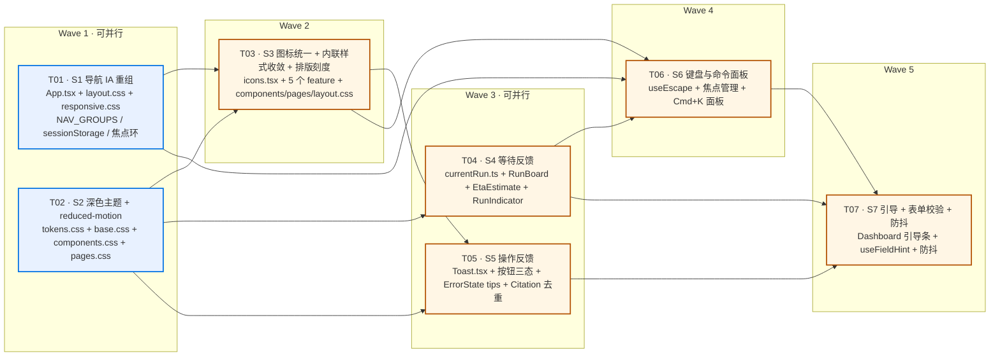
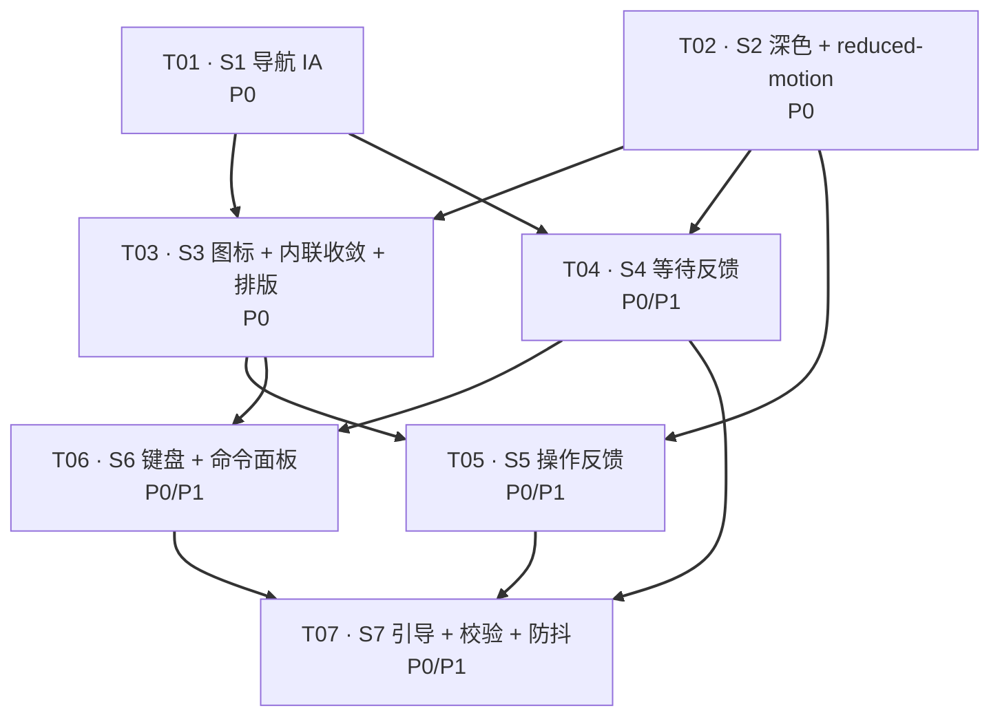

# AI Research Workspace · 前端 UX 改造架构设计（第二轮）

> 文档版本：**v1.7**（+ §12.2b 致因归正：模式漏字面量，非自指；滑杆定稿已由 team-lead 落地验证）｜
> 负责人：高见远（架构）｜ 输入：许清楚《前端 UX 与信息架构 PRD v1.2》
> 范围：**仅前端**（`D:/UserData/Desktop/项目/frontend`）
> 红线：不加 react-router / 不加组件库 / 不加 CSS 框架 / 不加图标库 / 不改 API 与业务逻辑
> 本文与 PRD 冲突处，**一律以代码实测为准**，差异已在 §0 列明。
> **推断数字一律视作待核项**（与 PRD v1.6 方法论栏同一条口径）：步数上界、配额默认值、后端参数这类
> 「看起来有依据的推断值」，未经代码逐条核对不得进文档——本轮上界 11 → 13 就是这条规则拦下来的。
>
> **v1.1 变更**：PRD 升至 v1.2，主理人下达「进度条永不为假满格」硬约束。本文新增 **§12 进度条诚实性约束**，
> 并同步修正 §3.2 / §3.3 / §3.4 / §3.5 中与之冲突的行。**凡涉及步数与进度展示，§12 为覆盖性章节。**
>
> **v1.2 变更**：team-lead 裁决 D1（封闭名单 + 出处要求）/ D2（后端给 `created_at`）/ D3（搜索用量字段名已给出）
> 全部落地。同时**更正了上界公式**——按 `app/graph/graph.py` 的条件边逐条核对，PM v1.2 的
> `7 + (m−1) + v = 11` 偏小 2（更新为 **13**），会让进度条在后 2 步完全不动。推导见 **§12.1b**；
> 配套的两个待批项 D4 / D5 均已在 **§13** 裁决完毕，无遗留。
>
> **v1.3 变更**：frontend-pm 独立复核确认 13 并已同步改 PRD。据此更正我先前的一处下错定论——
> 旧式**不是**「宁大勿小」，而是随 `maxVerify` 系统性偏小（`旧 − 新 = 4 − 3v`，32 组中偏大仅 8 组、偏小 24 组），
> 偏差表已补进 §12.1b。同时把「条必须始终在动」明确为**独立于 AC2b 的 AC2c**（各管一头，不是互补），
> 并采用录屏逐帧的验证方式。`RECOURSE_BLOCK` 已按镜像常量的三段式标注。
>
> **v1.4 变更**：team-lead 的 D4 / D5 裁决落地，**§13 已无挂起项**。
> ① `RECOURSE_BLOCK = 4` 批准入封闭名单（§12.2，注释旁注已摘除），并追加一条硬规则——
> **该常量不得带任何默认值回落**，扫描红着就是设计意图，给它兜底值等于把「必须显式决策」悄悄降级；
> ② 前后端同源写成硬条款（§12.7）：backend PRD 的 P0-17 与本文 §12.1 **共用同一个 `RECOURSE_BLOCK = 4`**，
> 同式 `maxIterations + 4 × MAX_VERIFY_ATTEMPTS + 2`，默认 (3,2) = **13**、(8,2) = **18**；
> reconciliation debt 项保留，触发条件为「**任一处常量被改动**」；
> ③ §13 登记一条留给 backend-pm 的待同步项：`backend-refactor-prd.md:708` 的推算口径仍是 11，需同步为 13 的口径。
>
> **v1.7 变更**：① **§12.2b 的致因归正**——门闸漏检的**唯一**致因是「模式 `7|8|11|13|16|26` 漏了 `2` 和 `4`」
> （扫描目标与要守的集合不匹配），**不是**「grep 命中了自己那行声明所以自指、所以没用」。
> 这两条会导向**相反的修复动作**（补模式 vs 改排除规则），必须分开写；team-lead 逐条核过，
> 他原话：「命中自己那句注释恰恰说明这个门闸设计得对」。已按此重写 §12.2b ②。
> ② **§12.5 定稿已落地并由 team-lead 验证**：`TERMINAL_STATUSES` + `isRunActive`，
> `tsc --noEmit` exit 0、smoke **210/210 通过**；`TERMINAL_STATUSES` 复用 `import type { RunStatus }`（`types/graph.ts:5` 同源），未重复声明。
> ③ team-lead 接受行号 citation 规则：**双方一律引符号名 / 文件+行号，不引裸节号**，`§12.2.7` 系其记岔，统一改引 `frontend-ux-architecture.md:1834`。
>
> **v1.6 变更**：§12.5 的修复**换了一个信号**，理由是两种候选都被实测否掉了（判据与取证都写在 §12.5）：
> ① 我 v1.5 给的 `disabled={running}` —— **只覆盖启动请求那几百毫秒**（`running` 在 `finally` 里就置回 `false`），
> 剩下 1~2 分钟的研究过程照样能拖，**等于没修**（team-lead 指出，已核，他对）；
> ② team-lead 给的 `disabled={hasStream}` —— `hasStream = streamStatus !== 'idle' || events.length > 0`，
> **终态事件把 status 置成 `'closed'`，`'closed' !== 'idle'`，而 `events` 只在下次 `subscribe()` 才清空 → 粘性永久为真**，
> 后果是**跑完第一次研究后滑杆再也不能拖**，比正在修的缺陷更严重（我核出，已回改）；
> ③ 定稿用 **`run.status` 判据**：`disabled={running || (run !== null && !TERMINAL_STATUSES.has(run.status))}`，
> 终态集合与 §12.3 同一套（`types/graph.ts:5`）。六格时刻表已逐格验过，含我原先误判为「边缘情形」的降级态。
>
> 另新增风险 **R18 / R19**，并给 §12.2 加了 `§12.2.7` 的锚点别名（那个节号从未存在过，QA 引它引不到）。
> 同时把 §12.5 里失效的 `ResearchWorkflow.tsx` 行号改为**以符号名引用**，并注明该文件已被改动过、行号会漂。
>
> **v1.5 变更**：team-lead 用「兜底分支会不会因此永不执行」这条长效判据复审本轮约束，引出三处修正：
> ① **`§12.2b` 新增（门闸盲区）**——原第 3 条把「扫描失败 / 常量缺失 / 常量被改坏」混为一件事，
> 实测 grep 模式 `7\|8\|11\|13\|16\|26` **不含 `2` 和 `4`**，所以三个常量里只有 `BASE_NODES = 7` 被验过，
> 另外两个从一开始就没在门闸视野内；「常量缺失」这一支 grep 根本拦不住，应由 `tsc --noEmit`（编译期）管。
> ② **`§12.5` 标题与结论自我更正**——「上界随滑块变化是特性」只对一半：`bound = m + 10` 与滑块成**反比**，
> 所以**任何一次拖动都会让 `fill` 跳变**（向上拖 = 进度倒退，违反 AC-23b 新判据；向下拖 = 虚假跃进到 95%）。
> 取证：`ResearchWorkflow.tsx:462-469` 的滑块**没有 `disabled`**，`:341` 已把 `maxIterations` 快照进本次 run
> → 运行期间调它对图毫无影响、只会污染进度分母，故修复为一行 `disabled={running}`。
> ③ **`§11 Q8` 三态表新增**——`estimated_runs_remaining` 是三态不是两态，`0`（配额关闭）这一态的理由
> （`credits_limit` 不可当除数）已写进文档，防止 Q8 复开时被当边界情况删掉。

---

## 0. 复核结论（PRD 与代码的实测差异 —— 施工前必读）

本轮对 PRD §3 全部诊断与 §6.2 全部对比度结论做了代码级复核：**14 条确认属实（C1–C14），10 处需要修正（M1–M10）**，其中 5 处（M1/M3/M4/M6/M7）会直接影响施工写法，务必先读 §0.2。

> **PRD v1.2 增量复核（本版新增）**：前端 PM updated PRD 至 v1.2，追加 A5「推导式分母」与 AC2b「三验证」。
> 我已逐条回代码复核，结论：**三条**——
> ① `ResearchRun.steps`（`types/graph.ts:50`）确为后端累加字段，`len()` 即已完成步数 ✅；
> ② `api/graph.ts:14` 的 `max_verify_attempts: input.maxVerifyAttempts ?? 2` 与 `max_iterations ?? 3` 均存在，`MAX_VERIFY_ATTEMPTS = 2` 有先例而非臆造 ✅；
> ③ `ResearchRunSummary`（`types/graph.ts:69-75`）**确实既无 `created_at` 也无 `steps`**，我的 §3.5 状态条「第 3/8 步」在降级态下是**死路** ❌ → 已按 §12.3 降级口径重写。
> 详见 **§12**（覆盖性章节）与 §13 待确认项。

### 0.1 确认属实（可直接施工）

| # | PRD 结论 | 复核证据 |
|---|---|---|
| C1 | `:focus-visible` 全站 0 次 | `grep ":focus-visible" src/styles/*.css` = 0 |
| C2 | 内联 `style={{` 共 37 处 | 分文件计数：ResearchWorkflow 15 / ResearchPlanner 6 / AgentRunner 4 / KnowledgeBase 3 / Settings 3 / Evaluation 2 / App 1 / Reports 1 / RunHistory 1 / Reveal 1 = **37** |
| C3 | `ProgressTrack` 依赖 `run !== null` | `ResearchWorkflow.tsx:604` 位于 `RunView` 内，而 `RunView` 仅在 `:504` `{run && <RunView/>}` 时挂载 |
| C4 | `EVENT_ICON` 16 个 emoji | `ResearchWorkflow.tsx:85-102`，确为 16 键 emoji 映射 |
| C5 | `ErrorState` 的 `tips` 无调用点传参 | `ErrorState.tsx:13` 有 `tips?: ReactNode`；6 个调用点均未传 |
| C6 | Tutorial 教「五个模块」 | `Tutorial.tsx:114` 文案：「平台由「概览 / 研究规划 / 智能体 / 知识库 / 研究工作流」五个模块组成」 |
| C7 | 两份重复 citation 渲染 | `ResearchWorkflow.tsx:751-768` ↔ `AgentRunner.tsx:238-255`，结构逐字相同 |
| C8 | 图标混用四套 | 内联 SVG（`App.tsx:40-71`）+ 汉字（`Dashboard.tsx:17-22`/`Tutorial.tsx:13-57`）+ emoji（`:85-102`）+ 字符（`layout.css:486` `content:"▸"`、`layout.css:170` `▾`、`Reports.tsx:132` `✕`） |
| C9 | `data-nav-core` 仅平板档消费 | `responsive.css:14-16`；`layout.css` 无对应规则 |
| C10 | `Reports.tsx:132` 用字符 `✕` | 确认，且同时挂 `.nav-icon` |
| C11 | 骨架屏深色对比 ≈1.2:1 | `.skeleton` 背景 `--surface-alt:#161617`，父级 `--surface:#1d1d1f` → 实测 **1.07:1** |
| C12 | `--faint` 深色偏弱 | `#86868b` on `#161617` → 实测 4.99:1（达 AA，PRD 的 4.3 偏低） |
| C13 | `.progress-track` 深色下容器边界消失 | 背景 `--surface-alt:#161617` + `border:1px solid var(--line)`（暗色 `rgba(255,255,255,.11)`）叠在 `--page:#000` 上 → 边框实际渲染 `#1c1c1c`，与底 **1.09:1** |
| C14 | 浮动层未纳入 reduced-motion | `responsive.css:111-128` 仅覆盖 `[data-reveal]`、`main`、`.skeleton` |

### 0.2 需要修正（**施工按本节执行**）

| # | PRD 说法 | 实测 | 处理 |
|---|---|---|---|
| **M1** | 主按钮白字 ≈**2.4:1** | `--accent` 深色 `#2997ff` 上白字 = **3.01:1**；浅色 `#0071e3` 上白字 = **4.69:1（已达标）** | 问题**只存在于深色**。新增 `--accent-strong` 仍是正解，但浅色值必须 = 原 `--accent`（不能改动浅色观感） |
| **M2** | `--faint` 深色 4.3:1 不足 → 只提深色 | 深色 **4.99:1（已达标）**；真正不足在**浅色**：`#86868b` on `--surface-alt#f5f5f7` = **3.33:1**、on `--surface#fff` = **3.62:1** | **浅深都要改**：浅 `--faint` → `#6b6b70`（on `#f5f5f7` = 4.87:1）；深 `--faint` → `#98989d`（on `#161617` = 6.30:1） |
| **M3** | （PRD 未发现）`--accent` 当**文字色**放在 `--accent-tint` 底上不达标 | `.timeline__icon`/`.badge--running`/`.step__index`/`.step-card__no`/`.module__icon`：浅色 **4.19:1**、深色 **4.46:1** | 新增 `--accent-ink`（浅 `#0062c4` / 深 `#6ab7ff`），专用于「tinted 底上的 accent 文字」 |
| **M4** | （PRD 未发现）白字压在 `--ok` 上不达标 | `.progress-node--done .progress-node__no`：浅色 `#008a34` 上白字 **4.48:1**、深色 `#4cd07d` 上白字 **1.98:1** | 全局规则：**除 `--accent-strong` 家族外，禁止在彩色底上写 `#fff`**；状态一律改用 tinted（底色 + 同色文字）方案 |
| **M5** | `.modal-backdrop` 复用 `--z-modal` | `pages.css:534` 硬编码 `z-index: 200`（= 旧 `--z-dropdown` 值），`--z-modal:400` **从未被使用** | 改为 `var(--z-modal)`，并新增 `--z-toast: 500` |
| **M6** | `.progress-track` 在 375px 下「需横滚 3 屏」 | `.progress-track`（`components.css:799-810`）**已声明 `flex-wrap: wrap`** → 不会横滚，而是折成 3~4 行；`overflow-x:auto` 是**无效声明** | V9 的实现机制改写：不能靠「关掉 wrap 让它滚」，改为**分组 + 只展开当前组**（见 §4.4） |
| **M7** | `NAV_CORE_KEYS` 保留 4 项 | `App.tsx:38` = `['dashboard','workflow','knowledge','reports']`，与 PRD §4.3「768–1023 顶栏 = 概览 · 深度研究★ · 研究报告」**不一致** | 改为 `['dashboard','workflow','reports']`，`knowledge` 下沉到「更多」下拉 |
| **M8** | 第 37 处内联样式为「硬编码」 | `Reveal.tsx:38` 的 `style={{ ...transitionDelay, ...style }}` 是**动态值**（`transitionDelay`），不是硬编码 | 计为**豁免内联**，不入「需清理」清单（这是它该留在内联的原因） |
| **M9** | B2 的 toast 接入点给 `KnowledgeBase.tsx:48/52` | 实测上传成功在 `:50`、失败在 `:55`；检索失败在 `:191` 附近 | 施工以「函数内部」为锚点而非行号（`handleFile` 两处 + `handleSearch` 一处） |
| **M10** | `.flow__step:hover` 的 `scale(1.05)` 与相邻卡重叠 | `pages.css:150-155` 确实 `transform:scale(1.05)` + `z-index:10`；但 `.flow__step` 基类已有 `z-index:1`，**相邻卡不在同一堆叠上下文时未必真的重叠** | W3 的修法仍然正确（改 `border-color` + `translateY(-2px)` + `--shadow-md`），但**不要**再依赖 `z-index:10` |

> **一句话**：M1/M2/M3/M4 说明「深色主题的对比度缺口」比 PRD 描述的**更多**但**位置不同**（浅色也有洞）；M5/M6/M7 是三处会直接写错代码的坑。

---

## 1. 总体改造路线图

### 1.1 七阶段依赖关系



### 1.2 哪些必须串行、哪些可并行

| 阶段 | 依赖 | 能否并行 | 说明 |
|---|---|---|---|
| **S1**（T01） | 无 | ✅ 与 S2 并行 | 两者都要改 `base.css`（T01 加全局 `:focus-visible`，T02 改 `body::before`）。**并行可行**，但 T01 必须把焦点环写成一条独立规则块，T02 的 `body::before` 改动放在文件末，合并时零冲突 |
| **S2**（T02） | 无 | ✅ 与 S1 并行 | 见上 |
| **S3**（T03） | S1、S2 | ❌ 串行 | 与 S2 同改 `components.css`/`pages.css`；且图标要引用 S2 新增的 `--accent-ink`/`--accent-strong` |
| **S4**（T04） | S2 | ⚠️ 与 S5 并行 | 两者同改 `components.css`（T04 加 `.run-board`，T05 改 `.button`）。**建议串行执行**（先 T04 后 T05）以避免同一区块反复改；若人力充足可分文件并行 |
| **S5**（T05） | S2、S3 | ❌ 串行 | 与 T03 同改 5 个 feature 文件与 `ErrorState.tsx` |
| **S6**（T06） | S1、S3、S4 | ❌ 串行 | 重度依赖 S1 的导航 DOM 与 S3 的 `icons.tsx` |
| **S7**（T07） | S4、S5、S6 | ❌ 串行 | 依赖前述全部新增组件 |

**关键路径**：`T02 → T03 → T05 → T07`（约 5 个任务量）。若需压缩周期，可砍掉 T05 中的 Citation 去重（P1-13）插到 S3 内并行。

### 1.3 各阶段可独立验收的边界

| 阶段 | 验收标准（对应 PRD §10） | 独立可测性 |
|---|---|---|
| S1 | AC1（≤3 步到达）、AC3（375/768/1024/1440 × 9 页无横向溢出） | ✅ 只动导航 DOM + 焦点环，可单独点检 |
| S2 | AC4（对比度扫描）、AC12（reduced-motion） | ✅ 纯 CSS，可用 DevTools 切主题扫描 |
| S3 | AC9（同一页 ≤2 套图标语言）、AC10（内联 ≤5）、AC13（零新增硬编码） | ✅ `grep` 可机器验证 |
| S4 | AC2（启动 ≤1s 出看板、任意 3s 有变化）、AC8（顶栏始终可见） | ⚠️ 需真跑一次研究（约 2~4 分钟） |
| S5 | AC6（三态可辨）、AC7（失败必带下一步） | ✅ mock 断网即可 |
| S6 | AC5（纯键盘走查）、AC5b（Esc + 焦点回填） | ✅ 纯键盘即可 |
| S7 | AC11（新用户 ≤4 次点击 / ≤30s） | ⚠️ 需真人模拟走查 |

---

## 2. S1 · 导航信息架构实现设计（核心）

### 2.1 NAV 数据结构改造

**位置**：`src/App.tsx`（替换现有 `App.tsx:21-38`）

```ts
// ---------- 类型 ----------
export type PageKey =
  | 'dashboard' | 'workflow' | 'research' | 'agent' | 'knowledge'
  | 'reports' | 'evaluation' | 'settings' | 'tutorial'

/** 视觉层级：家 / 主推 / 次（开发者向也用次） */
export type NavTier = 'home' | 'primary' | 'secondary'

export interface NavItem {
  key: PageKey
  /** 导航显示文案（唯一可改名的地方） */
  label: string
  /** 视觉层级 */
  tier: NavTier
  /** 推荐角标（只有 workflow 为 true） */
  recommend?: boolean
  /** 命令面板 / 抽屉的补充说明（可选） */
  hint?: string
}

export interface NavGroup {
  id: 'home' | 'research' | 'results' | 'system'
  /** 组标签文案；'home' 为空字符串（不渲染标签） */
  label: string
  items: NavItem[]
}

// ---------- 数据 ----------
export const NAV_GROUPS: NavGroup[] = [
  { id: 'home', label: '', items: [
      { key: 'dashboard', label: '概览', tier: 'home' },
  ]},
  { id: 'research', label: '研究', items: [
      { key: 'workflow', label: '深度研究', tier: 'primary', recommend: true, hint: '推荐入口' },
      { key: 'research', label: '研究规划', tier: 'secondary' },
      { key: 'agent', label: '智能体', tier: 'secondary' },
      { key: 'knowledge', label: '知识库', tier: 'secondary' },
  ]},
  { id: 'results', label: '结果', items: [
      { key: 'reports', label: '研究报告', tier: 'secondary' },
      { key: 'evaluation', label: '效果评估', tier: 'secondary', hint: '开发者向' },
  ]},
  { id: 'system', label: '系统', items: [
      { key: 'settings', label: '系统设置', tier: 'secondary', hint: '开发者向' },
      { key: 'tutorial', label: '使用教程', tier: 'secondary' },
  ]},
]

/** 扁平索引：保持 NAV_ITEMS 的既有用法（navigate() 查找等）不变 */
export const NAV_ITEMS: NavItem[] = NAV_GROUPS.flatMap((g) => g.items)

/**
 * 768–1023px 顶栏保留项（改：原含 knowledge，按 PRD §4.3 去掉）。
 * 不在本列表中的组，在该档位整组不渲染（下面 §2.5 说明为什么不需要 :has()）。
 */
const NAV_CORE_KEYS: PageKey[] = ['dashboard', 'workflow', 'reports']
```

**Q1 改名的落地范围**（只动文本，不动路由）：

| 位置 | 现值 | 改后 |
|---|---|---|
| `App.tsx:27` NAV label | `研究工作流` | `深度研究` |
| `ResearchWorkflow.tsx:401` eyebrow | `研究工作流` | `深度研究` |
| `ResearchWorkflow.tsx:402` h2 | `跑一次完整的研究` | **不动** |
| `ResearchWorkflow.tsx:545` 折叠说明正文 | `「研究工作流」是…` | `「深度研究」是…` |
| `Dashboard.tsx:17` 入口卡标题 | `研究工作流` | `深度研究` |

> ⚠️ `.page__primary` 主按钮文案「启动研究工作流」（`:452`）**不改**——它是动作而非入口名。

### 2.2 ≥1200px（组标签可见）

```html
<header class="global-nav" data-scrolled="true">
  <div class="nav-inner">
    <a class="nav-brand" href="#" …>
      <span class="nav-logo">ARW</span>AI 研究工作台<small>研究智能体</small>
    </a>

    <nav class="nav-menu" aria-label="主导航">
      <!-- 组① 家 -->
      <div class="nav-group" data-group="home">
        <span class="nav-group__label" aria-hidden="true">概览</span>
        <button class="nav-link nav-link--home"
                data-core="true" aria-current="page">概览</button>
      </div>

      <!-- 组② 研究（主推） -->
      <div class="nav-group" data-group="research">
        <span class="nav-group__label" aria-hidden="true">研究</span>
        <button class="nav-link nav-link--primary"
                data-core="true" aria-recommend="true" aria-current="false">
          深度研究
          <span class="nav-link__badge">推荐</span>
        </button>
        <button class="nav-link" data-core="false" aria-current="false">研究规划</button>
        <button class="nav-link" data-core="false" aria-current="false">智能体</button>
        <button class="nav-link" data-core="false" aria-current="false">知识库</button>
      </div>

      <!-- 组③ 结果 -->
      <div class="nav-group" data-group="results">
        <span class="nav-group__label" aria-hidden="true">结果</span>
        <button class="nav-link" data-core="true" aria-current="false">研究报告</button>
        <button class="nav-link" data-core="false" aria-current="false">效果评估</button>
      </div>

      <!-- 组④ 系统 -->
      <div class="nav-group" data-group="system">
        <span class="nav-group__label" aria-hidden="true">系统</span>
        <button class="nav-link" data-core="false" aria-current="false">系统设置</button>
        <button class="nav-link" data-core="false" aria-current="false">使用教程</button>
      </div>
    </nav>

    <div class="nav-more">…</div>   <!-- ≥1024 由 responsive.css 隐藏 -->
    <div class="nav-actions">
      <button class="nav-icon" data-action="search" …>⌕</button>
      <button class="nav-icon" data-action="theme" …>☾/☀</button>
      <button class="nav-toggle" …>☰</button>
    </div>
  </div>
</header>
```

对应 CSS（`layout.css` 追加，`responsive.css` 加断点）：

```css
.nav-menu { display:flex; align-items:center; gap:var(--space-1); margin-left:auto; }

.nav-group { display:flex; align-items:center; gap:var(--space-1); position:relative; }

/* 组间 1px 竖线分隔（1024~1199 与 ≥1200 都显示；只隐藏文字） */
.nav-group + .nav-group::before {
  content: ""; position:absolute; left:calc(var(--space-1) * -1 - 3px);
  top:50%; transform:translateY(-50%);
  width:1px; height:18px; background:var(--nav-group-line);
}

.nav-group__label {
  display:none;                       /* ≥1200 才显示，见 responsive.css */
  margin-right:var(--space-2);
  color:var(--faint);
  font-size:var(--text-xs);
  font-weight:500;
  letter-spacing:.06em;
  white-space:nowrap;
}

/* 主推项 */
.nav-link--primary { color:var(--accent-ink); font-weight:600; }
.nav-link--primary.nav-link--active { color:var(--accent-ink); }
.nav-link__badge {
  margin-left:var(--space-1);
  padding:1px var(--space-2);
  border-radius:var(--radius-pill);
  background:var(--accent-tint);
  border:1px solid var(--accent-border);
  color:var(--accent-ink);
  font-size:var(--text-xs);
  font-weight:600;
}
/* 开发者向（次要样式弱化） */
.nav-link--dev,
.nav-link--dev.nav-link--active { color:var(--faint); font-weight:400; }
```

### 2.3 1024–1199px（隐藏组标签，只留竖线）

`responsive.css` 追加：

```css
@media (min-width: 1024px) and (max-width: 1199px) {
  .nav-group__label { display: none; }
}
/* 组标签在 <1024 与 ≥1200 之间不做其它处理；1023 以下整块隐藏（见 §2.4） */
```

### 2.4 768–1023px（顶栏 3 项 +「更多」下拉显示 3 组标题 + 全部 9 项）

**关键问题：升级为「3 组标题 + 9 项」会不会破坏纯 CSS 降级？**

**答：不会。** 因为升级只是**往 `.nav-more__menu` 内部加了更多兄弟节点**，展开机制（`.nav-more:hover .nav-more__menu` / `.nav-more:focus-within .nav-more__menu`）作用在**父级容器**的伪类上，与子节点数量无关。纯 CSS 降级（无 JS、无 state、`:hover`/`:focus-within`）完整保留。

三个必须注意的兼容点：

1. **不能**把展开机制从父级改到子级（例如用 `> .nav-more__group:hover`），否则一改就退化成「鼠标必须精确悬停在某一组标题上」。
2. **必须**保证 `.nav-more__menu` 的 `min-width` 能容纳最长的项（`研究报告` + `推荐` 角标 + 组标签）。当前值 `176px`（`layout.css:146`）不够 → 改为 `min-width: 208px` 并 `max-width: calc(100vw - var(--space-8))`。
3. **必须**处理「键盘可达性」。现有 `role="menu"` + `role="menuitem"`（`App.tsx:173-184`）在无方向键实现的前提下是 a11y 反模式（ARIA 要求 `role=menu` 的子项必须可聚焦/可漫游）。**本轮直接降级为普通导航列表**：去掉 `role`，放进一个 `<nav aria-label="更多导航">`，这样 Tab 天然可达，同时保留纯 CSS 展开。

```html
<div class="nav-more">
  <button class="nav-link nav-more__btn" type="button" aria-haspopup="true">
    更多<span class="nav-more__caret" aria-hidden="true">▾</span>
  </button>

  <div class="nav-more__menu">
    <nav class="nav-more__group" aria-label="研究">
      <div class="nav-more__label" aria-hidden="true">研究</div>
      <button class="nav-link" aria-current="false">深度研究<…推荐…></button>
      <button class="nav-link" aria-current="false">研究规划</button>
      <button class="nav-link" aria-current="false">智能体</button>
      <button class="nav-link" aria-current="false">知识库</button>
    </nav>
    <nav class="nav-more__group" aria-label="结果">
      <div class="nav-more__label" aria-hidden="true">结果</div>
      <button class="nav-link" aria-current="false">研究报告</button>
      <button class="nav-link" aria-current="false">效果评估</button>
    </nav>
    <nav class="nav-more__group" aria-label="系统">
      <div class="nav-more__label" aria-hidden="true">系统</div>
      <button class="nav-link" aria-current="false">系统设置</button>
      <button class="nav-link" aria-current="false">使用教程</button>
    </nav>
  </div>
</div>
```

```css
.nav-more__menu {
  position:absolute; top:calc(100% + var(--space-2)); right:0;
  min-width:208px; max-width:calc(100vw - var(--space-8));
  display:none; flex-direction:column; gap:var(--space-2);
  padding:var(--space-2);
  background:var(--surface);
  border:1px solid var(--line);
  border-radius:var(--radius-md);
  box-shadow:var(--shadow-md);
  z-index:var(--z-dropdown);
}
/* 纯 CSS 展开机制 —— 保持不变，只是选择器从 .nav-link 变成 .nav-more 自身 */
.nav-more:hover .nav-more__menu,
.nav-more:focus-within .nav-more__menu { display:flex; }

.nav-more__group { display:flex; flex-direction:column; gap:2px; }
.nav-more__label {
  padding:var(--space-1) var(--space-3);
  color:var(--faint); font-size:var(--text-xs);
  letter-spacing:.06em; font-weight:600;
}
.nav-more__menu .nav-link { width:100%; justify-content:flex-start; border-radius:var(--radius-sm); }
```

```css
/* responsive.css：顶栏只留 core 项 */
@media (max-width: 1023px) {
  .nav-menu .nav-link:not([data-core='true']) { display: none; }
  .nav-more { display: block; }
  .nav-more__label { display: block; }   /* 明确语义，防止被上面规则误伤 */
}
```

> **为什么「系统」组在顶栏整组消失、而「更多」下拉里仍有？**
> 顶栏的渲染源是 `NAV_GROUPS`，但只对 `NAV_CORE_KEYS` 内的项输出 `data-core="true"`。
> 「系统」组没有任何 core 项 → 在顶栏渲染为 0 个可见按钮。为避免留下一个「空组 + 空竖线」，
> 用**模块级常量**在渲染阶段整组跳过（`NAV_CORE_KEYS` 是常量，跳过是编译期可判定的，不需要 `:has()`）。
> 同一份 `NAV_GROUPS` 原样传给 `.nav-more__menu` 和抽屉，所以下拉与抽屉里 9 项齐全。

### 2.5 `<768px` 抽屉（9 项全进 + 3 组标题 + 主项置顶）

```html
<div class="nav-drawer-layer">
  <button class="nav-scrim" type="button" aria-label="关闭导航菜单" …></button>
  <aside id="nav-drawer" class="nav-drawer" role="dialog" aria-modal="true" aria-label="主导航">
    <div class="nav-drawer__head">
      <span class="nav-drawer__title">导航</span>
      <button class="nav-icon" type="button" aria-label="关闭" data-drawer-close>…</button>
    </div>

    <div class="nav-drawer__group" data-group="home">
      <div class="nav-drawer__label">概览</div>          <!-- 家也出标签，抽屉是「全量说明」场景 -->
      <button class="nav-link" aria-current="page">概览</button>
    </div>

    <div class="nav-drawer__group" data-group="research">   <!-- 深度研究置顶并带推荐角标 -->
      <div class="nav-drawer__label">研究</div>
      <button class="nav-link nav-link--primary" aria-current="false">
        深度研究<span class="nav-link__badge">推荐</span>
      </button>
      <button class="nav-link" aria-current="false">研究规划</button>
      <button class="nav-link" aria-current="false">智能体</button>
      <button class="nav-link" aria-current="false">知识库</button>
    </div>

    <div class="nav-drawer__group" data-group="results">
      <div class="nav-drawer__label">结果</div>
      <button class="nav-link" aria-current="false">研究报告</button>
      <button class="nav-link" aria-current="false">效果评估</button>
    </div>

    <div class="nav-drawer__group" data-group="system">
      <div class="nav-drawer__label">系统</div>
      <button class="nav-link" aria-current="false">系统设置</button>
      <button class="nav-link" aria-current="false">使用教程</button>
    </div>
  </aside>
</div>
```

```css
.nav-drawer__group { display:flex; flex-direction:column; gap:var(--space-1); }
.nav-drawer__group + .nav-drawer__group {
  margin-top:var(--space-4);
  padding-top:var(--space-3);
  border-top:1px solid var(--line);
}
.nav-drawer__label {
  padding:0 var(--space-3);
  color:var(--faint);
  font-size:var(--text-xs);
  letter-spacing:.06em;
  font-weight:600;
}
/* 抽屉内深度研究置顶后，视觉权重靠 .nav-link--primary 承担 */
.nav-drawer .nav-link { width:100%; justify-content:flex-start; min-height:44px;
                        border-radius:var(--radius-sm); font-size:var(--text-base); }
```

**共用的渲染函数**（`App.tsx` 内，三处复用、避免三份 JSX）：

```tsx
function NavLinkButton({ item, page, core }: { item: NavItem; page: PageKey; core: boolean }) {
  const active = item.key === page
  const cls = [
    'nav-link',
    item.tier === 'primary' ? 'nav-link--primary' : '',
    item.key === 'evaluation' || item.key === 'settings' ? 'nav-link--dev' : '',
    active ? 'nav-link--active' : '',
  ].filter(Boolean).join(' ')
  return (
    <button
      type="button"
      className={cls}
      data-core={core ? 'true' : 'false'}
      aria-current={active ? 'page' : undefined}
      onClick={() => navigate(item.key)}
    >
      {item.label}
      {item.recommend && <span className="nav-link__badge">推荐</span>}
      {item.hint && <span className="nav-link__hint">{item.hint}</span>}
    </button>
  )
}
```

> 三个容器（顶栏 / 更多下拉 / 抽屉）各自决定「传不传 `core`」，因此共用函数零分支。

### 2.6 `sessionStorage['arw-page']` 会话内页面记忆

**位置**：`src/App.tsx`，与 `[OBS-1]` 的 `arw-last-thread`（`ResearchWorkflow.tsx:25`）**完全独立**，两者互不覆盖。

```ts
const PAGE_KEY = 'arw-page'
const PAGE_KEYS: PageKey[] = NAV_ITEMS.map((i) => i.key)   // 白名单

/** 读取：非法值一律回落 'dashboard'，绝不信任存储内容 */
function readStoredPage(): PageKey {
  try {
    const v = sessionStorage.getItem(PAGE_KEY)
    return v && (PAGE_KEYS as string[]).includes(v) ? (v as PageKey) : 'dashboard'
  } catch {
    return 'dashboard'          // 隐私模式 / 禁用存储
  }
}

export default function App() {
  // ⚠️ 关键：初始值必须是「读存储」，且写入必须放在 effect 里，
  //    不能放在 useState 的 setter 处，否则首帧会把 'dashboard' 写回去。
  const [page, setPage] = useState<PageKey>(() => readStoredPage())
  useEffect(() => {
    try { sessionStorage.setItem(PAGE_KEY, page) } catch { /* 忽略 */ }
  }, [page])
  …
}
```

**边界与语义（重点，防误解）**：

| 场景 | 表现 | 是否符合预期 |
|---|---|---|
| 首次打开（新标签页，无 `arw-page`） | 落到 **概览** | ✅ PRD 要求「首次访问必须落到概览」 |
| 同标签内切页 → 刷新 → 重进 | 回到上次页面 | ✅ 会话内记忆 |
| 切页 → 新开标签页 | 新标签**落到概览** | ✅ 正确：sessionStorage **按标签页隔离**，不会把陌生页塞给新用户 |
| 存储被篡改成非法值（如 `''` / `'foo'`） | 回落概览 | ✅ 有白名单兜底 |
| 存储被禁用（隐私模式） | 恒为概览 + 每次点击写失败被吞 | ✅ 静默降级 |

**不做的事**：不用 `localStorage`（会跨标签污染新会话）；不在 `navigate()` 里同步写（避免与 effect 双写）。

---

## 3. 新组件 / hook / 单例设计（props 接口与文件路径）

> 全部新增文件均在 `src/` 下，**零新增 npm 依赖**。模块级单例一律照抄 `features/workflow/useRunEvents.ts:26-28` 的 `listeners = new Map/Set` 模式。

### 3.1 `src/components/Toast.tsx` —— 模块级单例 Toast

```ts
export type ToastKind = 'success' | 'error' | 'info'

export interface ToastAction { label: string; onClick: () => void }
export interface ToastOptions { duration?: number; action?: ToastAction }

interface ToastItem {
  id: number
  kind: ToastKind
  message: string
  action?: ToastAction
  duration: number   // ms；为 0 表示不自动消失
}

/* ---- 模块级状态（零 prop drilling，可在任何非 JSX 上下文调用）---- */
const listeners = new Set<(items: ToastItem[]) => void>()
let items: ToastItem[] = []
let seq = 0
const timers = new Map<number, ReturnType<typeof setTimeout>>()

function emit() { for (const l of [...listeners]) l(items) }

export const toast = {
  success(message: string, options?: ToastOptions): number { return push('success', message, options) },
  error(message: string, options?: ToastOptions): number { return push('error', message, options) },
  info(message: string, options?: ToastOptions): number { return push('info', message, options) },
  /** 关闭单条；id 由上面三个返回值获得 */
  dismiss(id: number): void,
  /** 关闭全部（切页/卸载时使用，避免残留） */
  clear(): void,
}

export function ToastHost(): JSX.Element | null
```

默认时长：`success 3000 / error 6000 / info 4000`；最多堆叠 **3** 条（`push` 时若超 3 条，先 `dismiss` 最旧一条）；`error` 与带 `action` 的 toast **必须**带关闭按钮。

```tsx
export function ToastHost() {
  const [list, setList] = useState<ToastItem[]>(items)
  useEffect(() => {
    listeners.add(setList)
    setList(items)                       // 补发挂载前已产生的 toast
    return () => { listeners.delete(setList) }
  }, [])
  if (list.length === 0) return null
  return createPortal(
    <div className="toast-host" role="region" aria-label="通知">
      {list.map((t) => (
        <div key={t.id} className={`toast toast--${t.kind}`}
             role={t.kind === 'error' ? 'alert' : 'status'} aria-live={t.kind === 'error' ? 'assertive' : 'polite'}>
          <span className="toast__icon" aria-hidden="true">{/* 见 icons.tsx */}</span>
          <p className="toast__msg">{t.message}</p>
          {t.action && (
            <button type="button" className="toast__action"
                    onClick={() => { t.action!.onClick(); toast.dismiss(t.id) }}>
              {t.action!.label}
            </button>
          )}
          <button type="button" className="toast__close nav-icon" aria-label="关闭通知"
                  onClick={() => toast.dismiss(t.id)}>{/* XIcon */}</button>
        </div>
      ))}
    </div>,
    document.body,
  )
}
```

**接入点（B2，6 处）**：

| # | 位置 | 行为 |
|---|---|---|
| 1 | `KnowledgeBase.tsx` `handleFile` 成功（`:50`） | **toast + 就地 `.alert` 双轨**：文件名需要被看见，就地保留 |
| 2 | `KnowledgeBase.tsx` `handleFile` 失败（`:55`） | `toast.error` + 就地 `.alert` |
| 3 | `KnowledgeBase.tsx` `handleSearch` 失败 | `toast.error`（就地不保留，因为输入框旁已有反馈位） |
| 4 | `ResearchWorkflow.tsx:316` `startResearch` 成功 | `toast.success('研究已启动，可在任意页面继续查看')` |
| 5 | `ResearchWorkflow.tsx:331` `resumeResearch` 成功 | 批准 → `toast.success('已生成报告，可在「研究报告」查看')`；终止 → `toast.info('已终止研究', { action: { label:'撤销', onClick: resume(true) } })`（Q13） |
| 6 | `ResearchWorkflow.tsx:347` `getResearch` 失败 | `toast.error('刷新状态失败：' + message)` |
| 7 | 复制引用（B9） | `toast.success('已复制引用')` |

`<ToastHost />` 在 `App.tsx` 的 `.site-shell` 内、`<main>` 之后挂载一次（新增节点，不改动既有元素结构）。

### 3.2 `src/features/workflow/currentRun.ts` —— 当前运行单例

```ts
export interface CurrentRunState {
  runKey: 'workflow' | 'agent'      // 预留 agent
  threadId: string
  question: string
  startedAt: number                 // epoch ms，点「启动」那一刻就写
  phaseLabel: string                // '正在检索资料…'
  /** 已完成步数 = len(run.steps)；run 未就绪 / 降级态下为 null */
  doneSteps: number | null          // 原 `stepIndex`；null 的语义见 §12.3
  /** 本次运行的 maxIterations（取自 UI 滑块），**推导分母用，不缓存成常量** */
  maxIterations: number
}

const listeners = new Set<(s: CurrentRunState | null) => void>()
let state: CurrentRunState | null = null

/** 首次登记（含 runKey/threadId/startedAt/doneSteps=null） */
export function setCurrentRun(next: CurrentRunState): void
/** 增量更新 phaseLabel / doneSteps（最常用） */
export function updateCurrentRun(patch: Partial<CurrentRunState>): void
export function clearCurrentRun(): void
export function useCurrentRun(): CurrentRunState | null

/* ---- 计时 / ETA 的纯函数，便于单测 ---- */
export function formatClock(ms: number): string          // '1:12' | '12:03'
export function readDurations(): number[]                // localStorage['arw-run-durations']，最多 3，try/catch
export function pushDuration(ms: number): void           // 追加并裁剪到最近 3 条（JSON 数组）
export function medianDuration(): number | null          // null = 无历史
```

> **`doneSteps` 与分母都不能从本文件推导**。`currentRun.ts` 只负责如实记录「本次的 `maxIterations`」与「此刻能拿到的步数（可能为 `null`）」；
> 全部换算集中到 `runProgress.ts`（§12.1），两个模块**不互相 import 计算逻辑**，避免把步数常量扩散到单例里。

存储：

```ts
const DUR_KEY = 'arw-run-durations'   // JSON number[]，长度 ≤ 3，单位 ms
```

`setCurrentRun` 在 `handleStart()` 里 **await 之前**调用（乐观），`startResearch` 抛错时 `clearCurrentRun()` + `toast.error`。终态事件到达时 `clearCurrentRun()`。这样「启动即渲染研究看板」在**切页卸载后依然成立**：重新挂载时 `useCurrentRun()` 立刻返回一个非 null 值 → `runPhase` 回到 `'starting'` → 看板马上出现。

### 3.3 `src/features/workflow/RunBoard.tsx` —— 研究看板（解决「等待反馈」缺口）

> ⚠️ **编号撞车预警**：这里沿用了旧编号的「D5」指的是 PRD 的等待反馈缺口；**§13 里的 D4 / D5 是 team-lead 的裁决编号**，
> 两者**毫无关系**。QA 看验收清单时别把「T04 解决 D5」当成「后端 P0-17 口径已对齐」——
> 那是 §13 D5 在管，动作落在 `docs/backend-refactor-prd.md:708`。

**这是本轮最重要的一块**：让 `run === null` 的启动期也有完整界面。

```ts
export interface RunBoardProps {
  /** 'starting' = 已点启动但 run 还没回来；'active' = run 已就绪 */
  phase: 'starting' | 'active'
  startedAt: number
  question: string
  events: RunEvent[]          // 来自 useRunEvents()
  streamStatus: StreamStatus
  /** 失败态显示「用同样的设置再跑一次」 */
  onRetry?: () => void
  /** 中断点显示「继续等待」 */
  retryLabel?: string
}
export function RunBoard(props: RunBoardProps): JSX.Element
```

结构（class 名即施工用的类名）：

```html
<section class="run-board" data-phase="starting|active">
  <div class="run-board__head">
    <h3 class="run-board__title">研究进行中</h3>
    <StatusBadge variant="running">研究中</StatusBadge>
    <span class="run-board__clock">已用时 0:12</span>
    <!-- 只给分子，不给分母；无步数时整段不渲染（§12.3） -->
    <span class="run-board__step">已完成 3 个步骤</span>
  </div>

  <!-- ProgressTrack 从「依赖 run」改为「依赖 events + currentRun」，见 §4.4 -->
  <ProgressTrack … />

  <p class="run-board__phase"><!-- 当前阶段一句话 --></p>

  <!-- ETA：upperBound 由 live maxIterations 推导（§12.1），非字面量 8 -->
  <EtaEstimate startedAt={startedAt} doneSteps={n} upperBound={computeRunUpperBound(m)} active={…} />

  <p class="run-board__latest">
    <!-- 最近 1 条事件；无事件时「正在连接研究流…」 -->
  </p>

  <div class="run-board__aside">   <!-- A7：把无聊等待变成有产出等待 -->
    <p>① 上传资料，让这次研究引用内部文档</p>
    <p>② 看看上次的研究报告</p>
  </div>

  <div class="run-board__actions">
    <button class="button button--primary">用同样的设置再跑一次</button>  <!-- 仅 failed -->
  </div>
</section>
```

**触发条件（关键改法）**：

```tsx
// ResearchWorkflow.tsx —— 替换现有 `:504 {run && <RunView/>}` 的单点判断
const showBoard =
  runPhase === 'starting' ||        // 点过启动，run 还没回来
  runPhase === 'active' ||
  hasStream                          // 已有事件（含切页回来补发）

{showBoard && <RunBoard … />}
{run && <RunView run={run} … />}   // 两者可共存：看板在上、结果在下
```

> `phaseItems`（`:395` 已有 `buildPhaseTimeline`）在 `events.length > 0` 时就可用，因此「分阶段提示」(A2) 不再等 `run`。

**当前阶段文案表**（纯展示映射，零新增后端字段）：

```ts
const EVENT_PHASE_HINT: Record<string, string> = {
  task_started: '正在连接研究流…',
  planning: '正在理解你的问题…',
  plan_created: '正在制定研究计划…',
  retrieval_started: '正在检索资料…',
  retrieval_completed: '正在整理命中的证据…',
  analysis_started: '正在分析证据…',
  analysis_completed: '正在归纳结论…',
  verification_started: '正在验证结论…',
  verification_completed: '正在准备报告…',
  report_started: '正在撰写报告…',
  approval_required: '等待你确认…',
  tool_started: '工具调用中…',
  tool_completed: '工具调用完成',
}
const FALLBACK_HINT = '正在执行…'
```

### 3.4 `src/components/EtaEstimate.tsx` —— 计时器与 ETA

```ts
export interface EtaEstimateProps {
  startedAt: number
  doneSteps: number | null   // null = 当前拿不到步数（降级态），ETA 退化为纯计时
  /** 上界 = computeRunUpperBound(liveMaxIterations)，**不是**字面量 */
  upperBound: number
  active: boolean            // false 时隐藏倒计时
  /** 覆盖「参考最近 N 次研究」的措辞 */
  sourceLabel?: string
}
```

> 这里的 `upperBound` **只用于算「已完成的比例」来调节进度文案的语气**（例如 >70% 时把「预计还需」换成「快好了」），
> 它**不参与** `fill` 的展示 —— 进度条 `fill` 一律走 `runProgress.computeRunFill()`（§12.1），保持唯一实现。

**单调不回落算法**（Q7 拍板）：

```
tick(每秒):
  elapsed = now - startedAt
  if (elapsed >= median) → 显示「比上次慢一些」/「即将完成」，不再显示倒计时
  rawRemaining  = max(0, median - elapsed)
  // 单调保证：允许值 = 上一帧的值 - 1 个 tick；新值只有更小才能通过
  floorRef.current = Math.min(floorRef.current - 1000, Number.MAX_SAFE_INTEGER)  // 每帧松开 1s
  eta = clamp(rawRemaining, 0, floorRef.current)
```

**首次运行（无历史）**：不显示倒计时，显示「首次运行，一般 2–4 分钟」。

**写入历史**：`pushDuration(now - startedAt)` 在**终态事件**到达时调用一次（不要在每个 tick 写，避免 localStorage 抖动）。

### 3.5 `src/components/RunIndicator.tsx` —— 运行状态胶囊 + 页面状态条（B3）

```ts
/** 顶栏胶囊：<768 只显示脉冲点；≥768 显示完整信息 */
export function TopRunPill({ onOpen }: { onOpen: () => void }): JSX.Element | null

/** 页面状态条：渲染在 <main> 内、.shell 上方 */
export function PageRunBar({ onOpen }: { onOpen: () => void }): JSX.Element | null
```

```html
<!-- 顶栏胶囊 -->
<button class="run-pill" data-compact="false" onClick={onOpen}>
  <span class="run-pill__dot" aria-hidden="true"></span>
  <!-- 只显分子；无步数时只留「研究中 · 标题 · 时间」三段（§12.3 降级口径） -->
  <span class="run-pill__text">研究中 ·「研究 2026 年 AI Agent…」· 已完成 3 个步骤 · 1:12</span>
  <span class="run-pill__cta">查看</span>
</button>

<!-- 页面状态条（位于 .page__head 上方） -->
<div class="run-bar" role="status">
  <span class="run-bar__dot"></span>
  <span class="run-bar__text">研究中 ·「问题摘要（前 24 字）」· 已完成 3 个步骤 · 1:12</span>
  <button class="link-button run-bar__cta">查看进度</button>
</div>
```

```ts
/** 状态条文案拼接；steps 为 null 时自动省掉「已完成 N 个步骤」整段 */
export function buildRunStatusParts(
  phase: string, question: string, steps: number | null, elapsed: string
): string
```

```css
.run-pill { display:inline-flex; align-items:center; gap:var(--space-2);
  min-height:34px; padding:0 var(--space-3); border:1px solid var(--accent-border);
  border-radius:var(--radius-pill); background:var(--accent-tint);
  color:var(--accent-ink); font-size:var(--text-xs); cursor:pointer; }
.run-pill__dot { width:7px; height:7px; border-radius:var(--radius-circle);
  background:var(--accent); animation:pulse 1.4s ease-in-out infinite; }
@media (max-width: 767px) {
  .run-pill__text, .run-pill__cta { display:none; }   /* <768 缩为纯脉冲点 */
}
.run-bar { display:flex; align-items:center; gap:var(--space-2); flex-wrap:wrap;
  margin-bottom:var(--space-4); padding:var(--space-2) var(--space-3);
  border:1px solid var(--accent-border); border-left:3px solid var(--accent);
  border-radius:var(--radius-md); background:var(--accent-tint);
  color:var(--accent-ink); font-size:var(--text-sm); }
```

### 3.6 `src/components/useEscape.ts` —— 统一 Esc + 焦点陷阱（C3/C4）

```ts
/** 内层优先关闭：内部维护一个 LIFO 栈，嵌套浮层（抽屉 > 命令面板 > 弹窗）天然正确 */
export function useEscape(active: boolean, onClose: () => void): void

/** 焦点管理：打开时移入首个可聚焦元素，关闭后把焦点还给触发者 */
export function useFocusTrap(
  containerRef: React.RefObject<HTMLElement>,
  active: boolean,
  opts?: { initialFocus?: React.RefObject<HTMLElement>; returnFocusTo?: HTMLElement | null },
): void
```

- 抽屉：`useFocusTrap(drawerRef, navOpen, { initialFocus: closeBtnRef, returnFocusTo: hamburgerEl })`
- 报告弹窗：`useFocusTrap(modalRef, !!selected, { initialFocus: closeBtnRef })`
- 命令面板：`useFocusTrap(panelRef, cmdOpen, { initialFocus: inputRef })`
- 更多下拉：保留纯 CSS `:focus-within`，S6 追加 `useEscape(moreOpen, …)`（点击外部时失焦即收起）

### 3.7 `src/components/icons.tsx` —— 手写 line SVG 图标集

```tsx
export interface IconProps { size?: number; className?: string; strokeWidth?: number }

function Icon({ size = 18, className, strokeWidth = 1.75, children }: IconProps & { children: ReactNode }) {
  return (
    <svg width={size} height={size} viewBox="0 0 24 24" fill="none" stroke="currentColor"
         strokeWidth={strokeWidth} strokeLinecap="round" strokeLinejoin="round"
         className={className} aria-hidden="true" focusable="false">
      {children}
    </svg>
  )
}

/* ---- 导航 9 项（S1 阶段先不用，S3 接入；保留清单供施工排序）---- */
export const HomeIcon, TelescopeIcon, MapIcon, BotIcon, BookIcon,
             DocIcon, ChartIcon, GearIcon, GuideIcon

/* ---- 组标签 3 个 ---- */
export const LayersIcon, InboxIcon, SlidersIcon

/* ---- 事件 / 语义 8+ 类 ---- */
export const PlayIcon, BulbIcon, ListIcon, SearchIcon, FileIcon,
             PuzzleIcon, CheckIcon, WrenchIcon, PencilIcon, PauseIcon,
             AlertIcon, CopyIcon, XIcon, ChevronDownIcon, ClockIcon, BoltIcon

/* ---- 主题 / 搜索 / 撤销 ---- */
export const SunIcon, MoonIcon, MenuIcon, SearchIcon, UndoIcon
```

统一规格：**24×24 viewBox / `stroke="currentColor"` / `strokeWidth: 1.75` / `fill="none"` / round linecap+linejoin / `size` 默认 18**。
迁移方式：把 `App.tsx:40-71` 的 4 个图标函数**原样搬过去**再扩展，避免重写已验证可用的路径。

### 3.8 `src/components/useFieldHint.ts` —— touched 感知的表单提示（C7）

```ts
export interface FieldHint {
  /** 是否显示错误（首次点主操作之前不报） */
  showError: boolean
  /** 正向字数提示文案：「还需 3 个字」/「12 字」 */
  hint: string
  /** 传给 textarea/input 的 aria-invalid */
  invalid: boolean
  /** 绑在主操作 onClick 上：通过返回 true 才继续执行，false 则中止并 markTouched */
  validate: () => boolean
  /** 供 aria-describedby 的 id */
  describedBy: string
}

export function useFieldHint(opts: {
  min: number
  value: string
  /** 唯一 id 片段，用于生成 describedBy，如 'wf-question' */
  id: string
}): FieldHint
```

4 处复用：`ResearchWorkflow.tsx:429`、`ResearchPlanner.tsx:77`、`AgentRunner.tsx:91-93`、`KnowledgeBase.tsx:183`。

**关键改动**：**按钮不再 `disabled`**（`:449` / `AgentRunner.tsx:111` / `KnowledgeBase` 检索按钮）。改为 `onClick={() => { if (!hint.validate()) return }}` —— 用户点了就看到红边 + 原因，而不是「按钮点不动」。

---

## 4. S2 · 深色主题修复清单与完整令牌新增表

### 4.1 新增 / 修订令牌总表（`tokens.css`）

| 令牌 | 浅色值 | 深色值 | 用途 | 影响的 CSS 选择器（必须一并改） |
|---|---|---|---|---|
| `--accent-strong` **(新)** | `#0071e3` | `#0f6fd6` | **承载白字的强调底** | `.button--primary`(bg/border/hover/disabled)、`.nav-logo`、`.flow__no`、`.guide__no`、`.tip__label`、`.progress-node--active .progress-node__no` |
| `--on-accent` **(新)** | `#ffffff` | `#ffffff` | 上述底色上的文字（显式化，禁止再写 `#fff`） | 同上 7 处 |
| `--accent-ink` **(新)** | `#0062c4` | `#6ab7ff` | **tinted 底 / 中性底上的 accent 文字** | `.timeline__icon`、`.badge--info`、`.badge--running`、`.step__index`、`.step-card__no`、`.module__icon`、`.card__icon`、`.flow__tag`、`.nav-link--primary`、`.nav-link__badge`、`.run-pill`、`.run-bar` |
| `--faint` **(修订)** | `#6b6b70` (原 `#86868b`) | `#98989d` (原 `#86868b`) | 三级灰阶文字（原深色已达标，浅色 3.33:1 不足） | 全局，无需逐个改（换值即全局生效）；建议同步检查 `.hero-facts span` / `.eyebrow` / `.nav-brand small` |
| `--skeleton-bg` **(新)** | `var(--surface-alt)` | `rgba(255,255,255,.07)` | 骨架块底色（深色下从 1.07:1 → 有实体） | `.skeleton` |
| `--skeleton-sheen` **(新)** | `rgba(255,255,255,.55)` | `rgba(255,255,255,.10)` | shimmer 扫光 | `.skeleton::after` 的 `background` |
| `--surface-sunken` **(新)** | `var(--surface-alt)` | `#0b0b0d` | 下沉容器底色 | `.progress-track`、`.run-metric`、`.process-timeline__detail`、`.citation__quote`、`.answer-card` |
| `--line-sunken` **(新)** | `var(--line)` | `var(--line-strong)` | 下沉容器**边框**（深色下 `--line` 在纯黑上不可见） | 同上 5 处 |
| `--ambient-glow` **(新)** | `var(--accent-tint)` | `rgba(41,151,255,.08)` | `body::before` 环境光 | `base.css:66-77` 的 `background` |
| `--focus-outline` **(新)** | `var(--ink)` | `var(--ink)` | 焦点环颜色（在 `--accent-strong` 底上也可见） | `:focus-visible` 全局 |
| `--focus-halo` **(新)** | `0 0 0 4px var(--accent-tint)` | `0 0 0 4px var(--accent-tint-strong)` | 焦点柔光（配合 outline） | 各可点组件的 `:focus-visible` |
| `--toast-bg` **(新)** | `var(--surface)` | `#262629` | toast 底 | `.toast` |
| `--toast-border` **(新)** | `var(--line-strong)` | `var(--line-strong)` | toast 边 | `.toast` |
| `--toast-shadow` **(新)** | `var(--shadow-lg)` | `var(--shadow-xl)` | toast 阴影 | `.toast` |
| `--nav-group-line` **(新)** | `var(--line-strong)` | `var(--line-strong)` | 导航组分隔竖线 | `.nav-group + .nav-group::before` |
| `--kbd-bg` **(新)** | `var(--surface-alt)` | `var(--surface-alt)` | `<kbd>` 底 | `.nav-kbd` |
| `--measure-lede` **(新)** | `62ch` | `62ch` | lede 行长 | `.hero-lede`、`.section-lede` |
| `--dur-short` **(新)** | `120ms` | `120ms` | 按钮按下 | `.button:active` |
| `--z-toast` **(新)** | `500` | `500` | toast 层级 | `.toast-host` |
| `--z-modal` **(修订)** | 已存在 `400`，但 `.modal-backdrop` 未使用 | — | 修 M5 | `pages.css:534` 由硬编码 `200` → `var(--z-modal)` |

### 4.2 完整深色修复清单（含 PRD 点名 6 项 + 复核追加 4 项）

| # | 问题 | 位置 | 修法 |
|---|---|---|---|
| **F1**（PRD ①） | 白字在 `--accent` 上仅 3.01:1（深色） | `components.css:167-184`、`.nav-logo`(`layout.css:51-52`)、`.flow__no`(`pages.css:170-171`)、`.guide__no`、`.tip__label`(`components.css:491-493`) | 底色与文字全部改 `--accent-strong` / `--on-accent` |
| **F2**（PRD ②） | 骨架屏 1.07:1 | `components.css:1540-1555` | 用 `--skeleton-bg` + `--skeleton-sheen` |
| **F3**（PRD ③） | 下沉容器边界消失 | `components.css:799-810`、`:776-781`、`:972-979` | 背景改 `--surface-sunken`，**边框改 `--line-sunken`**（关键：光换背景仍是 1.07:1，必须同时换边框） |
| **F4**（PRD ④） | `body::before` 环境光出现色块边界 | `base.css:66-77` | 深色改用 `--ambient-glow` + 收窄扩散（`transparent 78%`） |
| **F5**（PRD ⑤） | `--faint` 不足 | `tokens.css:19` / `:135` | 见 §4.1 修订行（**浅色也要改**，见 M2） |
| **F6**（PRD ⑥） | emoji 图标与中性色系冲突 | `ResearchWorkflow.tsx:85-102`、`.tool-call-card__tool::before`(`components.css:1075-1079` 的 `⚡`) | S3 统一替换为 line SVG |
| **F7**（复核追加，M4） | 白字压在 `--ok` 上：浅 4.48:1 / 深 **1.98:1** | `components.css:846-849` `.progress-node--done .progress-node__no` | **改为 tinted 方案**：`background: var(--ok-bg); color: var(--ok); border: 1px solid var(--ok-border)`（与 `.badge--ok` 同构，实测 8.91:1） |
| **F8**（复核追加，M3） | accent 文字压在 tint 底上：浅 4.19:1 / 深 4.46:1 | 见 §4.1 `--accent-ink` 影响列 | 全部改 `--accent-ink` |
| **F9**（复核追加，M5） | `.modal-backdrop` z-index 硬编码 200 | `pages.css:534` | → `var(--z-modal)` |
| **F10**（复核追加，M1） | `.progress-node--active .progress-node__no` 白字 3.01:1 | `components.css:858-861` | 底色改 `--accent-strong`，文字 `--on-accent` → 4.92:1 |

**全局规则（写进 `components.css` 顶部注释，施工员必读）**：

> **禁止在彩色底上写 `#fff`**，唯一例外是 `--accent-strong`（实测 ≥4.69:1）。
> 所有状态表达一律用 **tinted 方案**（`--{sem}-bg` 底 + `--{sem}` 字 + `--{sem}-border` 边），
> 参考既有且已达标的 `.badge--ok / --info / --warn / --error`。

### 4.3 reduced-motion 完整清单（S2 交付）

```css
/* responsive.css —— 用统一「全覆盖」写法，避免逐个补漏 */
@media (prefers-reduced-motion: reduce) {
  html { scroll-behavior: auto; }

  /* ① 兜底：任何未来新增的 animation / transition 自动失效 */
  *, *::before, *::after {
    animation-duration: 0.01ms !important;
    animation-iteration-count: 1 !important;
    transition-duration: 0.01ms !important;
    scroll-behavior: auto !important;
  }

  /* ② 揭示 / 转场：直接置终态，避免「闪一下」 */
  [data-reveal],
  main {
    animation: none !important;
    opacity: 1 !important;
    transform: none !important;
    transition: none !important;
  }

  /* ③ 骨架屏保持静态（既有实现，回归确认） */
  .skeleton::after { animation: none; }
  .skeleton { opacity: .7; }

  /* ④ PRD 点名遗漏的 5 处 */
  .badge--running::before,          /* components.css:726  pulse            */
  .collapsible-card__body,          /* components.css:1033 slide-down      */
  .modal,                           /* pages.css:548     slide-up           */
  .modal-backdrop,                  /* pages.css:538     fade-in            */
  .nav-scrim,                       /* layout.css:202    fade-in            */
  .nav-drawer                       /* layout.css:219    drawer-in          */
  { animation: none !important; }

  /* ⑤ 复核追加：本轮新增的持续动画 */
  .run-pill__dot,                   /* §3.5 顶栏脉冲点           */
  .progress-node--active,           /* W2 呼吸                   */
  .progress-node--active .progress-node__no,
  .toast,                           /* §3.1 toast 入场           */
  .toast__icon
  { animation: none !important; }

  /* ⑥ hover / active 位移类：改为纯颜色反馈 */
  .flow__step:hover,
  .module:hover,
  .step-card:hover,
  .card--interactive:hover,
  .button:active
  { transform: none !important; }
}
```

**逐项对照（说明为什么是这些，不是 PRD 列的那些）**：

| 动画 | 位置 | 原 PRD 是否列出 | 本设计是否覆盖 |
|---|---|---|---|
| `page-in` (`main`) | `base.css:54` | 列出但未覆盖 | ✅ ② 已覆盖（实际原本就覆盖，此处仅回归确认） |
| `[data-reveal]` 位移 22px | `base.css:40-49` | 已覆盖 | ✅ ② |
| `skeleton-shimmer` | `components.css:1554` | 已覆盖 | ✅ ③ |
| `pulse` (`.badge--running::before`) | `components.css:727` | ❌ 遗漏 | ✅ ④ |
| `slide-down` (`.collapsible-card__body`) | `components.css:1033` | ❌ 遗漏 | ✅ ④ |
| `slide-up` (`.modal`) | `pages.css:548` | ❌ 遗漏 | ✅ ④ |
| `fade-in` (`.modal-backdrop`) | `pages.css:538` | ❌ 遗漏 | ✅ ④ |
| `fade-in` (`.nav-scrim`) | `layout.css:202` | ❌ 遗漏 | ✅ ④ |
| `drawer-in` (`.nav-drawer`) | `layout.css:219` + `keyframes :242` | ❌ 遗漏 | ✅ ④ |
| `.progress-node--active` 呼吸（W2 新增） | 本轮新增 | ❌ 遗漏 | ✅ ⑤ |
| `.run-pill__dot` 脉冲（B3 新增） | 本轮新增 | ❌ 遗漏 | ✅ ⑤ |
| toast 入场（B2 新增） | 本轮新增 | ❌ 遗漏 | ✅ ⑤ |
| `html{scroll-behavior:smooth}` | `base.css:9` | 已覆盖 | ✅ ① |
| hover/active `transform` 位移 | `pages.css:151/236`、`components.css:1164/158` | ❌ 未提及 | ✅ ⑥（PRD 的 W3 会改 `.flow__step:hover`，改后仍需 ⑥ 兜底其它三处） |

### 4.4 V9 · 进度轨移动端分组（`components.css`）

> **修 M6**：`.progress-track`（`components.css:799-810`）**已声明 `flex-wrap: wrap`**，所以 375px 下**不会**横向滚动，而是把 7 个 pill 折成 3~4 行；`overflow-x: auto` 是一行**永不生效**的声明（因为 wrap 优先）。因此 V9 不能「关掉 wrap 让它滚」，必须改成**分组 + 只展开当前组**。

**节点 → 分组映射**（7 节点分 3 组）：

| 组 | 序号 | 节点 |
|---|---|---|
| ① 准备 | 1~3 | `understand_task` 理解 / `plan` 计划 / `research` 研究 |
| ② 取证 | 4~5 | `retrieve` 检索 / `analyze` 分析 |
| ③ 收尾 | 6~7 | `verify` 验证 / `write` 报告 |

**DOM**（`RunBoard` 与 `RunView` 共用同一个 `ProgressTrack`）：

```html
<div class="progress-track" data-active-g="2">
  <div class="progress-group" data-g="1">
    <span class="progress-group__label" aria-hidden="true">准备</span>
    <span class="progress-node progress-node--done"><span class="progress-node__no">1</span>理解</span>
    <span class="progress-node"><span class="progress-node__no">2</span>计划</span>
    <span class="progress-node"><span class="progress-node__no">3</span>研究</span>
  </div>
  <div class="progress-group" data-g="2">
    <span class="progress-group__label" aria-hidden="true">取证</span>
    <span class="progress-node progress-node--active">…</span>
    <span class="progress-node">…</span>
  </div>
  <div class="progress-group" data-g="3">
    <span class="progress-group__label" aria-hidden="true">收尾</span>
    <span class="progress-node">…</span>
    <span class="progress-node">…</span>
  </div>
</div>
```

```css
.progress-track {
  display: flex; align-items: center; gap: var(--space-2);
  flex-wrap: wrap;                 /* 保留：≥768 仍可折行 */
  padding: var(--space-4);
  border-radius: var(--radius-md);
  background: var(--surface-sunken);
  border: 1px solid var(--line-sunken);   /* F3：深色下边框可见的关键 */
  /* overflow-x: auto 删除 —— 它是永不生效的声明 */
}
/* ≥768：组外壳「消失」，节点视觉上仍是平铺的一行/多行 */
@media (min-width: 768px) {
  .progress-group { display: contents; }
}
@media (max-width: 767px) {
  .progress-track { display: block; gap: 0; padding: var(--space-3); }
  .progress-group { display: block; }
  .progress-group__label {
    display: block; margin-bottom: var(--space-2);
    color: var(--faint); font-size: var(--text-xs); letter-spacing: .06em; font-weight: 600;
  }
  /* 只展开当前组，其它组收成一行小标签 —— 375px 下由 3~4 行压到 1+2 行 */
  .progress-track[data-active-g='1'] .progress-group:not([data-g='1']) .progress-node,
  .progress-track[data-active-g='2'] .progress-group:not([data-g='2']) .progress-node,
  .progress-track[data-active-g='3'] .progress-group:not([data-g='3']) .progress-node
  { display: none; }
  /* 未展开的组只留一个组名；若要做「点标签切换组」，把 label 换成 <button class="progress-group__label"> */
}
```

**JSX 侧只多一个属性**：`data-active-g` 取自当前活跃节点所属组号（`activeNode` 已有，见 `ResearchWorkflow.tsx:590`）。

```ts
const ACTIVE_GROUP: Record<string, '1' | '2' | '3'> = {
  understand_task: '1', plan: '1', research: '1',
  retrieve: '2', analyze: '2',
  verify: '3', write: '3',
}
```

> **验收**：AC3（375px 下零横向溢出，且 `.progress-track` 高度 ≤ 3 个 pill 行）。

---

## 5. 图标统一方案（渐进迁移，不一次性大改）

### 5.1 迁移顺序与理由

| 批次 | 内容与范围 | 阶段 | 风险 | 理由 |
|---|---|---|---|---|
| **B1** | 先把 `App.tsx:40-71` 的 4 个图标函数原样搬进 `icons.tsx`，导出**全部**图标（导航 9 + 组 3 + 语义 16 + 主题/搜索/撤销） | T01（S1） | 无 | 只是文件搬家，不引入新语言 |
| **B2** | `.tool-call-card__tool::before` 的 `⚡` → `BoltIcon`；`Reports.tsx:132` 的 `✕` → `XIcon`；`layout.css:486` 的 `▸` / `:170` 的 `▾` → `ChevronDownIcon` | T03（S3） | 极低 | 字符箭头/emoji 最容易与 line SVG 混排，优先级最高 |
| **B3** | `EVENT_ICON`（`ResearchWorkflow.tsx:85-102`）16 emoji → 11 个 line 图标 | T03（S3） | 低 | 集中在时间线内，改动局部 |
| **B4** | `.card__icon` 的汉字「程智库报」→ `TelescopeIcon/BotIcon/BookIcon/DocIcon`；`.module__icon` 的「览规体库程教」→ 对应图标 | T03（S3） | 中 | 涉及 Dashboard 与 Tutorial 两张卡片的视觉重心，需与 T02 的 `--accent-ink` 一起调 |

**事件 → 图标映射（B3）**：

| 事件 | emoji | → 图标 | 事件 | emoji | → 图标 |
|---|---|---|---|---|---|
| `task_started` | ▶ | `PlayIcon` | `analysis_started` | 🔬 | `PuzzleIcon` |
| `planning` | 💡 | `BulbIcon` | `analysis_completed` | 🧩 | `CheckIcon` |
| `plan_created` | 📋 | `ListIcon` | `verification_started` | ✓ | `SearchIcon` |
| `retrieval_started` | 🔎 | `SearchIcon` | `verification_completed` | ✓ | `CheckIcon` |
| `retrieval_completed` | 📄 | `FileIcon` | `report_started` | ✍ | `PencilIcon` |
| `tool_started` | 🔧 | `WrenchIcon` | `approval_required` | ⏸ | `PauseIcon` |
| `tool_completed` | 🔧 | `WrenchIcon` | `task_completed` | ✅ | `CheckIcon` |
| | | | `task_failed` | ❌ | `AlertIcon` |
| | | | `task_cancelled` | 🛑 | `XIcon` |

### 5.2 混用期的过渡控制

- T01（S1）**不引入任何导航图标**（导航项仍是纯文字 + 推荐角标），因此 S1 上线后**图标语言种类不增加**。
- T03（S3）一次性清掉全部非 SVG 语言（B2/B3/B4），**同批次内完成**，不跨阶段留尾巴。
- AC9（「同一页面 ≤2 套图标语言」）只在 **T03 完成后**测量；T01/T02 阶段的混合是**计划内**的。
- 每个图标必须 `aria-hidden="true"` + `focusable="false"`；**承载语义**的图标所在容器要补 `aria-label`（例：关闭按钮已有 `aria-label`，无需图标语义）。

---

## 6. 内联样式收敛方案：37 处 → ≤5 处（逐处映射表）

> **豁免 1 处**：`Reveal.tsx:38` 的 `style={{ ...(delay ? {transitionDelay} : {}), ...style }}` 是**动态值**，保留。
> **豁免 2 组**：`Settings.tsx:176/205` 的 `marginLeft:'auto'` ×2——它们用同一个工具类 `.push-right`，`grep` 上算 2 处但只新增 1 个 class。
> 收敛后 `grep -c 'style={{' src -r` 预期 = **3**（Reveal / App / Settings）。

### 6.1 工具类清单（新增到 `components.css`）

```css
/* ===== 间距工具类（替代散落的内联 margin/gap，全部引用令牌）===== */
.stack-gap-xs { margin-top: var(--space-2); }   /* 原 8px  */
.stack-gap-sm { margin-top: var(--space-3); }   /* 原 12px */
.stack-gap    { margin-top: var(--space-4); }   /* 原 16px */
.stack-gap-lg { margin-top: var(--space-7); }   /* 原 28px */
.push-right   { margin-left: auto; }
.text-flush   { margin: 0; }

/* ===== 组合工具类 ===== */
.badge-row       { display:flex; align-items:center; gap:var(--space-2); }
.data-list--gap  { gap: var(--space-3); }
.shell--tight    { padding-top: var(--space-2); }
.run-card__meta--end { justify-content: flex-end; }

/* ===== 既有非刻度值一并刻度化（AC13 / V3 / V7）===== */
.activity      { margin-top: var(--space-6); }        /* 原 22px */
.field         { margin-bottom: var(--space-5); }    /* 原 18px */
.tip           { margin-top: var(--space-5); }       /* 原 18px */
.metrics       { margin: var(--space-5) 0 0; }       /* 原 18px */
.input-card    { margin-top: var(--space-5); }       /* 原 18px */
.steps         { gap: var(--space-3); }              /* 原 10px */
.steps--compact{ gap: var(--space-2); }              /* 保持 8px */
.data-list     { gap: var(--space-3); }              /* 原 10px */
.module-section__grid { gap: var(--space-3); }       /* 原 14px */
.panel__notes  { gap: var(--space-3); }              /* 原 14px */
.hero-lede     { max-width: var(--measure-lede); }   /* 原 640px */
.section-lede  { max-width: var(--measure-lede); }   /* 原 660px */
.panel__subtitle { max-width: var(--content-measure); }  /* 原 760px */
.nav-inner, .shell { width: min(var(--max-width), calc(100% - var(--gutter) * 2)); }  /* 原硬写 44px */
.page + .page, .panel + .panel { margin-top: var(--space-6); }   /* 原 22px */
.module-section { margin-top: var(--space-7); }      /* 原 26px */
```

### 6.2 逐处映射表（施工员照此改）

| # | 文件:行 | 现值 | 改为 |
|---|---|---|---|
| 1 | `App.tsx:238` | `style={{ paddingTop: 8 }}` | `className="shell shell--tight"` |
| 2 | `AgentRunner.tsx:122` | `<div style={{marginTop:16}}>` | `<div className="stack-gap">` |
| 3 | `AgentRunner.tsx:204` | `style={{display:flex,alignItems:center,gap:8}}` | `<div className="badge-row">` |
| 4 | `AgentRunner.tsx:240` | `<div className="data-list" style={{gap:12}}>` | `<div className="data-list data-list--gap">` |
| 5 | `AgentRunner.tsx:294` | `<div style={{marginTop:8}}>` | `<div className="stack-gap-xs">` |
| 6 | `Reports.tsx:131` | `style={{margin:0}}` | `className="panel__title text-flush"` |
| 7 | `KnowledgeBase.tsx:190` | `<div style={{marginTop:12}}>` | `<div className="stack-gap-sm">` |
| 8 | `KnowledgeBase.tsx:196` | `<div style={{marginTop:12}}>` | `<div className="stack-gap-sm">` |
| 9 | `KnowledgeBase.tsx:205` | `style={{gap:12,marginTop:12}}` | `className="data-list data-list--gap stack-gap-sm"` |
| 10 | `Settings.tsx:160` | `<div style={{marginBottom:18}}>` | **删除包裹 div**，ErrorState 直接放 `</header>` 后；并给 `.state-error` 补 `margin-bottom: var(--space-5)` |
| 11 | `Settings.tsx:176` | `style={{marginLeft:'auto'}}` | `className="button push-right"` |
| 12 | `Settings.tsx:205` | `style={{marginLeft:'auto'}}` | `className="button push-right"` |
| 13 | `Evaluation.tsx:98` | `<section className="activity" style={{marginTop:28}}>` | 删除 `style`（`.activity` 已刻度化为 `--space-6`） |
| 14 | `Evaluation.tsx:100` | `style={{margin:0}}` | `className="plan__heading text-flush"` |
| 15 | `ResearchPlanner.tsx:107` | `<div style={{marginTop:16}}>` | `<div className="stack-gap">` |
| 16 | `ResearchPlanner.tsx:188` | `style={{display:flex,alignItems:center,gap:8}}` | `<div className="badge-row">` |
| 17 | `ResearchPlanner.tsx:203` | `style={{marginTop:0}}` | `className="plan__goal text-flush"` |
| 18 | `ResearchPlanner.tsx:208` | `style={{marginTop:0}}` | `className="data-list text-flush"` |
| 19 | `ResearchPlanner.tsx:220` | `style={{gap:10,marginTop:0}}` | `className="data-list data-list--gap text-flush"` |
| 20 | `ResearchPlanner.tsx:235` | `style={{marginTop:0}}` | `className="data-list text-flush"` |
| 21 | `ResearchWorkflow.tsx:462` | `<div style={{marginTop:16}}>` | `<div className="stack-gap">` |
| 22 | `ResearchWorkflow.tsx:481` | `<div style={{marginBottom:16}}>` | `<div className="stack-gap">`（用 `margin-top` 语义更准，保留容器但换类） |
| 23 | `ResearchWorkflow.tsx:623` | `style={{marginTop:16,justifyContent:'flex-end'}}` | `className="run-card__meta run-card__meta--end"` |
| 24 | `ResearchWorkflow.tsx:632` | `style={{marginTop:0}}` | `className="plan__goal text-flush"` |
| 25 | `ResearchWorkflow.tsx:634` | `style={{marginTop:8}}` | `className="hint stack-gap-xs"` |
| 26 | `ResearchWorkflow.tsx:637` | `style={{marginTop:12}}` | `className="data-list stack-gap-sm"` |
| 27 | `ResearchWorkflow.tsx:651` | `style={{marginTop:0}}` | `className="plan__goal text-flush"` |
| 28 | `ResearchWorkflow.tsx:652` | `style={{marginTop:14}}` | `<ol className="steps steps--compact stack-gap-sm">` |
| 29 | `ResearchWorkflow.tsx:665` | `style={{marginTop:18}}` | `className="plan__heading stack-gap"` |
| 30 | `ResearchWorkflow.tsx:682` | `<div style={{marginBottom:16}}>` | `<div className="stack-gap">` |
| 31 | `ResearchWorkflow.tsx:683` | `style={{marginTop:0}}` | `className="plan__heading text-flush"` |
| 32 | `ResearchWorkflow.tsx:694` | `style={{marginTop:14}}` | `className="plan__heading stack-gap-sm"` |
| 33 | `ResearchWorkflow.tsx:708` | `style={{marginTop: run.analysis ? 0 : undefined}}` | 条件恒真：验证行总是要显示 → 直接 `className="alert__row"`（调 CSS 统一 `margin-top`） |
| 34 | `ResearchWorkflow.tsx:720` | `<div className="data-list" style={{gap:12}}>` | `<div className="data-list data-list--gap">` |
| 35 | `ResearchWorkflow.tsx:753` | `<div className="data-list" style={{gap:12}}>` | `<div className="data-list data-list--gap">` |
| 36 | `RunHistory.tsx:74` | `style={{margin:0}}` | `className="plan__heading text-flush"` |
| 37 | `Reveal.tsx:38` | `style={{...transitionDelay,...style}}` | **豁免保留**（动态值） |
| — | `runProgress` 驱动的进度条宽度（§12.1） | `style={{ width: ... }}` | **豁免保留**（派生动态值，与 `Reveal` 同类）。预算里「≤5」已含此 1 处 |

> **第 38 处的定性**（与 M8 同规则）：进度条宽度是 `computeRunFill()` 的**实时派生值**，既无静态设计常量、
> 也无设计意图可固化成 class —— 它随 `run.steps` 每步变化。这与 `Reveal` 的 `transitionDelay` 属于同一类「该留在内联」。
> 但要守住两条：**① 值只能来自 `computeRunFill()`，不得就地算；② 不得出现 `width:100%` 裸写**（终态走 `computeRunFillForTerminal()`）。

**验收**：`grep -rn "style={{'" src | grep -vE 'Reveal\.tsx|computeRunFill' | wc -l` ≤ 3。

---

## 7. 去重方案：`Citation` 共享组件

**现状**：`ResearchWorkflow.tsx:751-768` 与 `AgentRunner.tsx:238-255` 的 citation 渲染**逐字相同**（4 个字段：`chunk_id/filename/page?/quote`，5 个 class：`citation/citation__head/citation__file/citation__meta/citation__quote`）。

**新增** `src/components/Citation.tsx`：

```ts
/** 结构最小化类型：graph.Citation 与 agent.Citation 都天然兼容，无需类型断言 */
export interface CitationLike {
  chunk_id: string
  filename: string
  page?: number | null
  quote: string
}

export interface CitationProps {
  citation: CitationLike
  /** 是否显示「复制」按钮；默认 true */
  copyable?: boolean
  /** 覆盖复制成功/失败时的 toast；不传则用默认 '已复制引用' */
  onCopied?: (ok: boolean) => void
}

export function Citation({ citation, copyable = true, onCopied }: CitationProps): JSX.Element
```

```tsx
export function Citation({ citation, copyable = true, onCopied }: CitationProps) {
  async function handleCopy() {
    const text = `${citation.filename}${citation.page ? ` · 第 ${citation.page} 页` : ''}\n${citation.quote}`
    try {
      await navigator.clipboard.writeText(text)
      onCopied?.(true) ?? toast.success('已复制引用')
    } catch {
      /* 非安全上下文 / 权限被拒：给出可操作的下一步 */
      toast.error('浏览器拒绝了复制请求，请手动选择文本复制')
    }
  }

  return (
    <div className="citation">
      <div className="citation__head">
        <span className="citation__file">
          {citation.filename}
          {citation.page ? ` · 第 ${citation.page} 页` : ''}
        </span>
        <span className="citation__meta">片段 {citation.chunk_id}</span>
      </div>
      <p className="citation__quote">{citation.quote}</p>
      {copyable && (
        <button type="button" className="link-button citation__copy" onClick={() => void handleCopy()}>
          复制
        </button>
      )}
    </div>
  )
}
```

**需要补的 CSS**（`components.css`，`.citation__copy`）：

```css
.citation__copy {
  /* .link-button 已有 13px accent 字；tint 底上要换成 --accent-ink */
  color: var(--accent-ink);
  min-height: 32px;   /* <768 由 responsive.css 的 44px 规则兜住 */
  display: inline-flex; align-items: center;
}
```

**调用点改写**：

```tsx
// ResearchWorkflow.tsx（RunView 内）
<div className="data-list data-list--gap">
  {run.citations.map((c) => <Citation key={c.chunk_id} citation={c} />)}
</div>

// AgentRunner.tsx（RunView 内）
<div className="data-list data-list--gap">
  {data.citations.map((c) => <Citation key={c.chunk_id} citation={c} />)}
</div>
```

**同时消掉的第三处**：`KnowledgeBase.tsx:205+` 的检索结果也用同一份 `.citation` 结构（`hit.chunk_id/filename/quote`）→ 一并改用 `<Citation>`（只读、`copyable` 保持默认）。这也是 PRD 未统计到的第三处重复。

---

## 8. 任务列表（S1~S7，有序、含依赖、可施工）

> 每条任务 = 「改哪个文件 / 做什么 / 验收点」。P0 为必须，P1/P2 可裁剪。

### T01 · S1 导航信息架构重组 + 会话记忆 + 全局焦点环

- **依赖**：无
- **优先级**：P0
- **涉及文件**：
  - 改：`src/App.tsx`（NAV_GROUPS/NAV_ITEMS/NAV_CORE_KEYS、三处渲染改组、sessionStorage、`aria-current`、`nav-more` 去 `role=menu`、`<ToastHost/>` 挂载点预留）、`src/styles/layout.css`（`.nav-group`/`.nav-group__label`/`.nav-link--primary`/`.nav-link--dev`/`.nav-link__badge`/`.nav-more__*`）、`src/styles/base.css`（`:focus-visible` 全局规则块，放在文件靠前位置）
  - 改：`src/styles/responsive.css`（`@media (min-width:1024px) and (max-width:1199px)`、`.nav-menu .nav-link:not([data-core='true']){display:none}`、`.nav-more{display:block}`、`<768` 的 `.run-pill` 压缩规则）
  - 改：`src/features/dashboard/Dashboard.tsx:17`（入口卡标题「研究工作流」→「深度研究」）
  - 改：`src/features/workflow/ResearchWorkflow.tsx:401`（eyebrow）、`:545`（折叠说明正文）
- **做什么**：
  1. §2.1 数据结构替换
  2. §2.2~2.5 三档 DOM + 抽屉
  3. §2.6 sessionStorage（白名单 + try/catch + 初始值读存储）
  4. C1 全局焦点环（§9 的 CSS），`.collapsible-card__header` 与 `.modal__head` 用 `outline-offset:-3px` 防裁切
- **验收点**：AC1（9 页 × 3 档桌面视口 ≤3 步到达）、AC3（375/768/1024/1440 × 9 页 × 明暗零横向溢出）、Tab 走查 ≥10 个可交互元素有可见焦点环
- **可并行**：✅ 与 T02 并行（注意 `base.css` 的合并顺序）

### T02 · S2 深色主题修复 + reduced-motion 全覆盖

- **依赖**：无
- **优先级**：P0
- **涉及文件**：`src/styles/tokens.css`（§4.1 全部令牌）、`base.css:66-77`、`components.css`（F1/F2/F3/F7/F8/F10 的选择器）、`pages.css:170-171/534`、`responsive.css:111-128`
- **做什么**：按 §4.1 令牌表加令牌 → 按 §4.2 F1~F10 逐项改选择器 → 按 §4.3 写入 reduced-motion 全量规则
- **验收点**：AC4（明暗双主题对比度扫描可疑项 = 0，采样点含 `.progress-node--done .progress-node__no`、`.timeline__icon`、`.eyebrow`）、AC12（DevTools emulation 走查无任何持续动画）
- **可并行**：✅ 与 T01 并行

### T03 · S3 图标统一 + 内联样式收敛 + 排版/间距刻度化

- **依赖**：T01、T02
- **优先级**：P0（V4 内联收敛为 P0；图标为 P0-13）
- **涉及文件**：
  - 新增：`src/components/icons.tsx`
  - 改：`App.tsx:40-71`（图标函数搬走）、`components.css`（§6.1 工具类 + §6.2 中的组件类）、`layout.css:25/258/383/409/435/486/170`、`pages.css:151/236/538/548/559-565`、`layout.css:383/409`
  - 改 feature：`ResearchWorkflow.tsx`、`ResearchPlanner.tsx`、`AgentRunner.tsx`、`KnowledgeBase.tsx`、`Settings.tsx`、`Evaluation.tsx`、`Reports.tsx`、`RunHistory.tsx`（§6.2 全表）
  - 改：`ResearchWorkflow.tsx:85-102`（EVENT_ICON → 图标组件）、`Dashboard.tsx:17-22`、`.module__icon`(`Tutorial.tsx:13-57`)、`Reports.tsx:132`(`✕`→`XIcon`)、`layout.css:486`(`▸`)、`layout.css:170`(`▾`)
  - 改 W3：`pages.css:151` `.flow__step:hover` → `border-color:var(--accent); translateY(-2px); box-shadow:var(--shadow-md)`（移除 `scale(1.05)` 与 `z-index:10`）
- **做什么**：§5 迁移顺序 B2→B3→B4；§6.2 全 36 处替换；§6.1 工具类落地
- **验收点**：AC9（逐页截图评审，同页 ≤2 套图标语言）、AC10（`grep -c` ≤ 3 且 ≤5）、AC13（零新增硬编码颜色/间距）
- **可并行**：❌ 串行（与 T02 同文件）

### T04 · S4 等待反馈：研究看板 + 分阶段 + 全局运行状态 + ETA

- **依赖**：T02（引用新令牌）、T01（顶栏 `nav-actions` 位置）
- **优先级**：P0（A1/A2/B3）+ P1（A3/A4/A7）
- **涉及文件**：
  - 新增：`src/features/workflow/currentRun.ts`、`src/features/workflow/runProgress.ts`、`src/features/workflow/RunBoard.tsx`、`src/components/EtaEstimate.tsx`、`src/components/RunIndicator.tsx`
  - 改：`src/features/workflow/ResearchWorkflow.tsx`（`runPhase` state、`handleStart` 乐观登记、`showBoard` 条件、`phaseItems` 前置、`pushDuration` 终态写入、`onRetry`、`maxIterations` 透传）、`src/App.tsx`（`<PageRunBar/>` + `<TopRunPill/>`）、`components.css`（`.run-board*/`.run-pill*/`.run-bar*`）
  - 改 `responsive.css`（`.run-pill__text` 在 <768 隐藏）
- **做什么**：
  1. `currentRun` 单例（§3.2），`handleStart` 在 `await` 前 `setCurrentRun`（`doneSteps: null`、`maxIterations` 取滑块值）
  2. `showBoard` 条件替换 `:504` 的单点判断（§3.3）
  3. `RunBoard` + `ProgressTrack` 分组改造（§4.4）
  4. `EtaEstimate` 单调不回落（§3.4）—— 入参 `upperBound` 走 `computeRunUpperBound`，不写字面量
  5. `RunIndicator` 顶栏胶囊 + 页面状态条（文案走 `buildRunStatusParts`；`doneSteps === null` 时省掉整段；
     降级态的计时起点用 `run.created_at`，见 §12.3）
  6. **新增 `runProgress.ts`，`ProgressTrack` 宽度改为 `computeRunFill(doneSteps, maxIterations)`**（§12.1）——
     这是 T04 内**独立可回滚的第 6 步**，与 1–5 解耦，建议单独一个 commit
  7. **`ResearchRunSummary` 加必填 `created_at: string`**（§12.3，D2 裁决），AC-24 契约测试负责锁住后端
- **验收点**：
  - AC2（点「启动」≤1s 出现 7 节点进度轨 + 阶段 + 计时器；此后任意 3s 内界面有可见变化）
  - **AC2b（§12.6 四件套，任一不过则 T04 不可提交）**：
    ① 滑块拉 8 → 上界 **26** 且不放顶；② mock `len(steps)=40` → 停 **95%** 不溢出；
    ③ 代码扫描无裸写步数字面量（封闭名单外）；④ 默认配置跑满一次**条始终在动**（= AC2c，最容易漏）
  - AC8（切页 ×3 次，顶栏始终可见运行状态且返回自动恢复）
- **可并行**：⚠️ 与 T05 同改 `components.css`，建议串行
- **⚠️ 优先级提示**：第 6 步（进度条诚实性）是**主理人硬约束**，即使 AC2 视觉验收通过、第 1–5 步全部完成也不算 T04 完成。建议把第 6 步排在 T04 的最后半小时，单独一个 commit。

### T05 · S5 操作反馈：Toast + 按钮三态 + 错误「下一步」+ 引用去重

- **依赖**：T02、T03
- **优先级**：P0（B1/B2/B4）+ P1（B5/B6/B7/B9/Q13）
- **涉及文件**：
  - 新增：`src/components/Toast.tsx`、`src/components/Citation.tsx`
  - 改：`components.css`（`.button:disabled` 改为 `--surface-alt` 底/`--line` 边/`--faint` 字；新增 `.button--loading` + `aria-busy`；`.toast*`；`.citation__copy`）
  - 改 `ErrorState.tsx`（必带 tips + 「复制错误详情」按钮）
  - 改调用点：`ResearchWorkflow.tsx:463`、`KnowledgeBase.tsx:117/191`、`RunHistory.tsx:82`、`Reports.tsx:98`、`Settings.tsx:161`、`AgentRunner.tsx:123`
  - 改 toast 接入点 6 处（§3.1 表）
  - 改 `ResearchWorkflow.tsx:518/521`（乐观更新）+ `:751-768`、`AgentRunner.tsx:238-255`（→ `<Citation>`）
  - 改 `Settings.tsx:181-193` 的 tips 与 `ErrorState` 共用（当前 tips 已写好，只需在错误块里复用）
- **做什么**：B1 三态、B2 toast、B4 tips、B5 同参数重试、B6 恢复提示、B7 乐观更新、B9 去重
- **验收点**：AC6（主操作按钮禁用态与可点态有量级差异，截图比对）、AC7（逐个异步操作走查 + 断网 mock，失败必带错误码 + 一句「下一步」+ 重试入口）
- **可并行**：❌ 串行

### T06 · S6 键盘与命令面板

- **依赖**：T01、T03、T04
- **优先级**：P0（C3/C4）+ P1（C2/C5/C6）
- **涉及文件**：新增 `src/components/useEscape.ts`；改 `App.tsx`（⌘K state、Esc 栈、焦点管理、顶栏「搜索 ⌘K」按钮）、`Reports.tsx:127-137`（Esc + 焦点陷阱 + `XIcon`）、`components.css`/`pages.css`（`.modal-backdrop` → `var(--z-modal)`、`.cmd-*`、`kbd`）、`responsive.css`（<1024 显示放大镜图标）
- **做什么**：`useEscape` LIFO 栈 + `useFocusTrap`；命令面板复用 `.modal-backdrop/.modal`，数据源 = `NAV_GROUPS`（9 页） + 5 条高频命令，无结果列 3 组全量
- **验收点**：AC5（纯键盘 Tab 走完 9 页，可交互元素 100% 有可见焦点环；每个浮层 100% 可 Esc 关闭且焦点回到触发元素）
- **可并行**：❌ 串行

### T07 · S7 首屏引导 + 表单校验时机 + 防抖

- **依赖**：T04、T05、T06
- **优先级**：P0（§7 引导轻量版）+ P1（C7/C8）
- **涉及文件**：新增 `src/components/useFieldHint.ts`；改 `Dashboard.tsx:74-88`（上手进度一行）、`ResearchWorkflow.tsx:528-535`（首次空态文案 +「填入示例」）、`:506-526`（中断点首次解释）、`ResearchPlanner.tsx:77`、`AgentRunner.tsx:92`、`KnowledgeBase.tsx:183/156`、`Settings.tsx:101`
- **做什么**：H3 上手进度（`localStorage['arw-onboarded']`，跑成功一次后自动打标）；C7 touched 校验（**按钮不再 disabled**）；C8 检索 300ms 防抖 +「检索中」态、`重新检测` 500ms 节流 + loading
- **验收点**：AC11（新用户从打开到「看到已填好示例问题的研究界面」≤4 次点击、≤30 秒）
- **可并行**：❌ 串行

### 8.1 任务依赖图（施工排期）



**可并行组合**：`(T01 ∥ T02) → T03 → T04 → T05 → T06 → T07` 为 safest 主线；
若人力 ≥2 人，`T04` 与 `T05` 可**同一人先后**做（不建议分人，会同时写 `components.css` 同一区块）。

---

## 9. 键盘焦点样式：`:focus-visible` 全局方案

**问题**：现有 `--focus-ring` = `0 0 0 3px rgba(0,113,227,.15)`（浅）/ `.24`（深）——**太弱**，单独用它当焦点指示不满足 WCAG 2.2 SC 2.4.11/2.4.13，且在全站 0 处使用。

**方案**（`base.css`，放在 reset 之后、组件规则之前）：

```css
/* ===== 全局可见焦点环 =====
   说明：outline 用 --ink 而非 --accent —— accent 在 --accent-strong 底上会「消失」。
   双层：2px 实线描边（对比度保证）+ 4px 柔光晕（观感）。 */
:focus-visible {
  outline: 2px solid var(--focus-outline);
  outline-offset: 2px;
  box-shadow: var(--focus-halo);
}

/* 被 overflow 裁切的容器内的元素：改为内嵌描边，永不丢失 */
.collapsible-card__header:focus-visible,
.modal__head :focus-visible,
.nav-drawer__head :focus-visible {
  outline-offset: -3px;
}
```

**需要覆盖的选择器清单**（这些在 focus-visible 下会拿到全局规则；若有更精致的组件级焦点态，在这里覆盖）：

| 选择器 | 位置 | 处理方式 |
|---|---|---|
| `.nav-link` | `layout.css:71-84` | 直接用全局（建议额外 `border-radius` 已存在） |
| `.nav-icon` / `.nav-toggle` | `layout.css:109-125` / `:170-185` | 直接用全局 |
| `.nav-more__btn` | `layout.css:133` | 直接用全局 |
| `.button` | `components.css:137-159` | 直接用全局 |
| `.link-button` | `components.css:301-313` | 直接用全局；注意它是 `padding:0` 的行内按钮，2px 描边会紧贴字，加 `padding: 2px 0` 更舒适 |
| `.run-list__btn` | `components.css:451` | 直接用全局 |
| `.collapsible-card__header` | `components.css:998-1014` | 用 `outline-offset:-3px` 变体 |
| `.textarea` / `.input` | `components.css:287-292` | 已有 `:focus` 的 `border-color + --focus-ring`；补 `&:focus-visible{outline:none}` 避免**双重环** |
| `.file-field` | `pages.css:92-97` | `:focus-within` 保持；内部若含按钮将被全局覆盖，确认无冲突 |
| `.toast__action` / `.toast__close` | `components.css`（新增） | 用 `outline-offset:-2px` |
| `.cmd__input` / `.cmd__item` | `pages.css`（新增） | 命令面板项用 `background: var(--accent-tint)` + 全局焦点环 |
| `.nav-link__badge` 内若可点 | — | 不可点，无需 |

**补充**：`.link-button` 加 `padding: 2px 0` 会让它的 `min-height:44px`（`responsive.css:86-89`）计算保持；给定 `line-height` 而非固定高更安全。

---

## 10. 风险与回滚

| # | 风险 | 触发条件 | 影响 | 缓解 | 回滚方式 |
|---|---|---|---|---|---|
| R1 | 导航分组后顶栏在 1024–1199 溢出 | 「深度研究」+「推荐」角标 + 组标签在窄屏挤爆 | 中 | 1024–1199 隐藏组标签（§2.3）；`.nav-more__menu` 加 `max-width: calc(100vw - var(--space-8))` | 回滚 `layout.css` 的 `.nav-group` 块即可恢复平铺 |
| R2 | `.nav-more` 去 `role="menu"` 被误认为 a11y 回退 | 评审只看 diff | 低 | 已在上文说明：`role=menu` 无方向键支持是反模式；改为 `<nav>` + 原生 Tab | 一行改回 |
| R3 | `sessionStorage` 恢复页面后用户看到一个「陌生页」且不知道怎么回来 | 用户在研究页停留后误开新标签 | 中 | 新标签会话隔离 → 落到概览；且 `PageRunBar`（B3）会解释「研究中」 | 删除 `arw-page` 键即恢复 |
| R4 | `--faint` 修订（`#86868b`→`#6b6b70`）使浅色灰阶层次变弱 | 视觉评审 | 低 | `#6b6b70` 与 `--muted #6e6e73` 仅差 3，视觉上几乎同级 → 若评审不接受，可退为 `#7a7a7f`（3.87:1，**不达标**，不推荐） | 换回单个令牌值 |
| R5 | `--surface-sunken` 在深色下仍不够明显（1.07:1） | 只看背景不看边框 | 中 | **必须同时把边框换成 `--line-sunken`**（§4.2 F3），双管才 1.55:1 | 换回 `--line` |
| R6 | F7（白字压 `--ok`）改动影响「已完成节点」的辨识度 | 视觉评审 | 低 | tinted 方案与 `.badge--ok` 同构，用户已熟悉该语言 | 换回 `background:var(--ok);color:#fff` |
| R7 | 研究看板在切页卸载后无法重建 | `currentRun` 未正确清空/重建 | **高**（AC2 失败） | `useCurrentRun()` 读单例 → 挂载即渲染；终态事件必 `clearCurrentRun()`；`startResearch` 失败必 `clearCurrentRun()` | 回退 `showBoard` 为 `{run && …}` 原逻辑 |
| R8 | ETA 数值跳动引焦虑 | 算法写错 | 中 | 单调递增 `floorRef` 必须每 tick 松开 1s；且无历史时不显示倒计时 | 直接不渲染 `<EtaEstimate>` |
| R9 | 按钮不再 `disabled`（C7）导致用户连点 | 校验只在 click 时触发 | 中 | `hint.validate()` 返回 false 时 `markTouched()`，红边立刻出现，反馈明确；同时 `handleStart` 入口再防重入一次 | 改回 `disabled` |
| R10 | Toast 在 `<ToastHost/>` 未挂载时调用被吞 | 挂载顺序错 | 中 | `ToastHost` 挂载时 `setList(items)` 补发；且 `App.tsx` 内 `.site-shell` 顶层挂载 | 检查一处挂载 |
| R11 | 图标统一后某页短暂混用 2 套语言 | 跨阶段留尾巴 | 低 | T03 内一次性清完（B2/B3/B4 同批） | 回退该页 emoji |
| R12 | reduced-motion 兜底 `!important` 影响调试 | 开发期 | 低 | 只在 `@media (prefers-reduced-motion: reduce)` 内；DevTools emulation 关闭即恢复 | — |
| **R13** | **进度条假满格**（主理人硬约束） | 上界算错 / `Math.min(...,0.95)` 被当保险丝删掉 | **高**（AC2b 失败） | `min(...)` 是**要求项不是保险项**：后端默认值漂移时唯一吸收层就是它。全站 fill 只走 `runProgress.computeRunFill`（§12.1），禁止别处重算 | 回退 `width:100%` 到终态分支 |
| **R14** | 分母随 `maxIterations` 变化，视觉上「进度变慢」被误判为 bug | 滑块拉到 8 后进度条更慢 | 低（**符合预期**） | 已明确写为设计意图（§12.5）；且文案只给分子不给分母，无「应到未到」的负反馈 | 无需回滚 |
| **R15** | 上界估偏（偏小）导致进度条后段不动 | 图结构变更 / 后端默认值调整 / 沿用旧的 11 | 中 | ① 已按图拓扑更正为 13（§12.1b）；② **0.95 硬顶只防「假满格」，防不住「不动」**——所以 AC2c 必须独立设项、一票否决；③ 验证走录屏逐帧，不靠肉眼 | 无需回滚（不动比假满格伤害小） |
| **R17** | 有人把建模上界写成断言（如 `expect(actual).toBe(bound)`） | 想"顺便"加个测试锁住进度 | 低但极具误导性 | 代码注释里已写明「上界是建模值，不要拿它跟后端日志里的实际步数做断言」（§12.1b）。图结构一变它会假失败，且失败信息会把人引向错误方向 | 删断言 |
| **R16** | 后端 `estimated_total_steps` 上线时与前端估计不一致 | backend P0-17 落地 | 低 | §12.7 的替换契约：只换取值来源，钳制逻辑不动；AC-19 保证两字段同在 | 不用回滚 |
| **R18** | **规格写对了，但没人检查过实现里谁在什么时候能改这个规格的输入**（v1.6 新增，由 §12.5 那处缺陷提炼） | 上界公式进了规格，却没人问「谁能改 `maxIterations`、什么时候能改」——结果滑块在整个 SSE 生命周期里都能拖，规格被实现直接绕过 | **中**（不体现在单测里，只体现在用户眼前的一条会跳的进度条上） | 每写一条**派生量**的规格，强制补一个问题：**「谁读它、谁能写它、写它的窗口什么时候打开」**。§12.5 已补上门控规格并逐格验过 6 个时刻；`runProgress.ts` 是纯函数、无外部可写入口，所以这类风险目前只存在于**调用点** | 补 `disabled` |
| **R19** | **门控信号选窄了或选粘了**（R18 的同族，方向相反） | 选 `running` → 只挡住启动那几百毫秒；选 `hasStream` → 终态后永久锁死滑杆 | 中 | 两条都要问：① 这个信号覆盖的**时间段**是不是我想要的？② 它会不会把**另一条本该存在的路径**也一起删掉？§12.5 两张反例表已把这两个方向都列全 | 换成 `run.status` 判据 |

**统一回滚策略**：本轮全部改动集中在 `src/App.tsx`、`src/styles/*.css`、`src/components/*.tsx`（新增 6 个）与 `src/features/**/*.tsx`。
建议**按 T01→T07 顺序逐任务提交**，每个任务一个 commit；任一任务出问题用 `git revert <commit>` 单点回滚，不影响其它阶段。
**禁止**把 T02 与 T03 合并成一个 commit（两者同改 `components.css`，合并后无法区分回滚面）。

---

## 11. 对 PRD 开放问题（Q2~Q14）的结论

> Q1 / Q5 / Q7 已由主理人拍板，此处记录落地方式；Q2~Q4、Q6、Q8~Q14 为本节结论。

| # | 问题 | **结论** | 落地位置 |
|---|---|---|---|
| **Q1** | 「研究工作流」是否改名「深度研究」？ | **已批准**：只改 label 与 3 处 eyebrow/文案，不改路由 key、不改功能。落地见 §2.1 改名表 | `App.tsx:27`、`ResearchWorkflow.tsx:401/545`、`Dashboard.tsx:17` |
| **Q2** | 「概览」是否留在导航里？ | **留**。它是「后端是否连接 + 研究是否在跑」的仪表盘。实现：`tier:'home'`，DOM 里是第一个 `.nav-group[data-group="home"]`，不渲染组标签（避免「家」变成一个需要解释的分类），但**抽屉里要出标签**以便 9 项完整 | §2.2 / §2.5 |
| **Q3** | 「效果评估 / 系统设置」是否隐藏？ | **不隐藏，降级**。次级样式 = `.nav-link--dev`（`--faint` 字 + 400 字重）；**不进入**概览入口卡；命令面板与抽屉仍可达。**前置条件**：`--faint` 必须先修订（否则 `--faint` 字在浅色 3.33:1 不达标） | §4.1 `--faint` 行 + `NavLinkButton` |
| **Q4** | 是否做「上手进度」三步引导？ | **做轻量版**：`localStorage['arw-onboarded']` 标记 + 概览 hero 下方一行进度 + 首次空态文案增强 + 中断点首次解释。**不做全屏向导** | T07（`Dashboard.tsx:74-88`） |
| **Q5** | 是否引入 toast？ | **已批准**：模块级单例，`toast.success/error/info`，零 prop drilling、不新增依赖、不改 App 元素结构 | §3.1 |
| **Q6** | ⌘K 是「搜索」还是「命令」？ | **混合**。输入时同时匹配 9 个页面（按 `NAV_GROUPS` 分组显示）与 5 条命令（`开始研究 / 上传资料 / 切换主题 / 系统设置 / 帮助`）；无结果时列出 3 组全部条目（等价于全功能菜单）。实现：`cmdOpen` state + 复用 `.modal-backdrop/.modal` | T06 |
| **Q7** | ETA 数据来源？ | **已批准**：`localStorage['arw-run-durations']` 最近 3 次总耗时中位数 + 本次已完成阶段耗时；**单调不回落**；首次运行不显示倒计时，显示「首次运行，一般 2–4 分钟」 | §3.4 |
| **Q8** | 后端本轮的「搜索用量」配额字段？ | **明确不依赖**，本轮不预留占位 UI。字段名已由 team-lead 给出（后端 `SearchQuotaSnapshot`，`GET /api/settings/usage`），**照抄不自行命名**。`buildGroups()`（`Settings.tsx:31-89`）只新增一个 item | T05/T07 |
| | 可用字段（**全部照抄，不得改名**） | `provider` / `period_key` / `period_start` / `period_end` / `renews_at` / `credits_limit` / `credits_used` / `credits_remaining` / `ratio` / `warn_level` / `calls_total` / `search_depth_default` / `estimated_runs_remaining: number \| null` / `daily: {date, calls, credits}[]` | `api/settings.ts` + `Settings.tsx` |
| | **三个类型地雷**（写进代码注释） | ① `estimated_runs_remaining` 可为 `null`，**样本不足时不渲染该行**（不是显示 0）；② `ratio` 是 **0~1 小数**，不是 `74.2` 这种百分数；③ `daily` 后端**已补零并合并区段**，不要假设每天都有一条 | `Settings.tsx` |
| | **`estimated_runs_remaining` 的三态渲染**（team-lead 补，v1.5）——`number \| null` 之外还有**脏值第三态**，见下表 | `Settings.tsx` |

**§11 Q8 三态表 —— `estimated_runs_remaining` 的三种取值对应三种渲染，不要合并成两种**

| 情形 | 取值 | 应当渲染 |
|---|---|---|
| 配额**开启**、`credits_limit` 未知（样本不足） | `null` | 只显「本月用量 x / —」，**绝不显「约 x 次」** |
| 配额**关闭**（`search_quota_enabled=false`） | `0` | 同上；且**配额行整块隐藏** |
| **回调把 `credits_limit` 改成脏数** | `NaN` / `Infinity` | `Number.isFinite` 拦下后**按第一态处理**（显示 `—`，不显示 `NaN 次`） |

> ⚠️ **第二态的理由必须写进代码注释，不许只写结论**（team-lead 指定）：
> 配额是**可关闭的**，关掉时 `credits_limit` **无意义，不能拿它当除数**。
> 所以「`credits_limit` 缺失 → 隐藏该行」不是边界情况的兜底，而是**这条字段的语义定义**。
> 不写这句理由，Q8 复开时有人会把它当成「样本不足的另一种写法」删掉——
> 而删掉的直接后果是配额关闭时前端去除了 `credits_limit`，得到 `NaN 次`，
> 一个 `NaN` 不会被 `null` 检查拦住（`NaN != null` 为 true），会一路渲染到页面上。
>
> 第三态的判断标准沿用 §12.2b 那条长效判据：`missing`（上游不存在，含配额关闭）→ 显式走隐藏分支；
> `dirty`（上游存在但脏，`NaN`/`Infinity`）→ 显式钳制，**两条都不许静默放行**。
> 这里最容易写错的是把 `!= null` 当成「值合法」——`NaN != null` 是 `true`，它过不了 null 检查。

| **Q9** | 顶栏是否显示运行状态胶囊？ | **显示**。新增 `features/workflow/currentRun.ts` 模块级单例，顶栏胶囊 + 页面状态条双投。<768 缩为纯脉冲点 | §3.2 / §3.5 |
| **Q10** | 深色主按钮：调暗 `--accent` 还是反色按钮？ | **调暗**，新增 `--accent-strong`（专用于承载白字的强调底），`--accent` 保持活力。**修正**：PRD 的 2.4:1 实测为 dark **3.01:1**、light **4.69:1（已达标）**，所以浅色 `--accent-strong` 必须取原 `--accent` 值，不能改动浅色观感 | §4.1 |
| **Q11** | 组标签文案？ | **「研究 / 结果 / 系统」** | §2.1 `NAV_GROUPS` |
| **Q12** | Toast 位置与时长？ | **右下角**，`--space-5` 边距，宽 `min(380px, calc(100vw - var(--space-8)))`；success **3s** / info **4s** / error **6s**（必带关闭按钮）；最多堆叠 3 条；带 `action` 的 toast 与 error 同规格（6s） | §3.1 |
| **Q13** | 「暂停/终止」是否加撤销？ | **加**。终止成功后 `toast.info('已终止研究', { action: { label:'撤销', onClick: () => resumeResearch(threadId, true) } })`；乐观更新 + 失败回滚 + `toast.error`。**注意**：终止 = `resumeResearch(id, false)`，撤销 = `resumeResearch(id, true)`，需后端 `cancelled` 态可被再次 resume —— 若后端拒绝，前端 `catch` 后回滚即可，不改后端 | T05 |
| **Q14** | 移动端抽屉是否折叠部分项？ | **不折叠**。9 项全进抽屉 + 3 组标题 + 深度研究置顶带「推荐」角标。理由是抽屉垂直空间充裕（375×667 下 9×44 = 396px ≈ 59% 视口仍可滚），「全量 + 分组」优于「折叠一半」 | §2.5 |

---

## 12. 进度条诚实性约束（PRD v1.2 · A5 / AC2b / AC2c —— **本轮最高优先级**）

> **来源**：主理人硬约束 + 前端 PM 许清楚 v1.2 更新（`docs/frontend-ux-prd.md:243` A5、`:432` AC2b）。
> 一句话：**进度条在任何非终态下都不得显示 100%**。宁可让用户觉得「条走得慢」，也不能让人判断成「卡住了」——
> 后者的伤害大于没有进度条。
> **本节对上述所有涉及步数的设计是覆盖性的**：§3.2 / §3.3 / §3.4 / §3.5 中任何与之冲突的行，一律以本节为准。

### 12.1 派生分母：`src/features/workflow/runProgress.ts`（新增，纯函数模块）

```ts
/**
 * 唯一权威：进度百分比的计算。
 * 设计原则 —— 分母是「推导」出来的，不是写死的；100% 这一格 reserve 给终态。
 * ⚠️ 本文件的常数**全部是建模估计，不是后端权威值**。真正的保证是 0.95 钳制，不是这里的算术。
 */

/** 出处：`app/graph/graph.py:80-86` 注册的 7 个具名节点
 * （understand_task / plan / research / retrieve / analyze / verify / write）。
 * **不含 `fail`**（`graph.py:87` 是显式失败终态，短路路径，不计入正常上界）。
 * 这是公式的组成部分，不是「写死的步数」。 */
export const BASE_NODES = 7

/** 出处：`app/schemas/graph.py:11` 的 `max_verify_attempts: Field(default=2, ge=1, le=4)`，
 * 实际生效值来自 `app/core/config.py:112` 的 `graph_max_verify_attempts: int = 2`。
 * ⚠️ **镜像值**：跟随后端默认值漂移，前端不拥有真相。吸收漂移的是 0.95 钳制，**不是这个常量**。 */
export const MAX_VERIFY_ATTEMPTS = 2

/** 每次「验证回炉」重跑的节点数：research → retrieve → analyze → verify
 * （`graph.py:95-112` 的条件边 + `retrieve→analyze→verify` 的固定链）。
 * ① 这是**回炉块的节点数**，不是业务常量；② **图结构一变就失准**——
 *    将来在回炉块里插入一个节点（比如加个 dedupe），4 会静默变成错的，无任何报错；
 * ③ 真正的保险是 0.95 钳制 + AC2c，不是这个数。
 * 与 `MAX_VERIFY_ATTEMPTS` 同类：都是**描述后端结构的建模常量**，会随后端漂移。 */
export const RECOURSE_BLOCK = 4           /* ✅ 已在 §12.2 封闭名单内（team-lead D4 批准） */

/** 运行中进度条的硬顶。终态才允许到 1。 */
export const RUN_FILL_CEILING = 0.95

/**
 * 上界 = 7 固定节点 + (maxIterations − 1) 次 research 自环 + (MAX_VERIFY_ATTEMPTS − 1) 次回炉重跑块
 * 等价写法：maxIterations + 4 × MAX_VERIFY_ATTEMPTS + 2
 * 默认配置 (3, 2) → 7 + 2 + 4 = **13**
 * 推导见 §12.1b。⚠️ PM v1.2 的「7 + (3−1) + 2 = 11」偏小 2，会让进度条在后 2 步完全不动。
 */
export function computeRunUpperBound(maxIterations: number): number {
  const m = Number.isFinite(maxIterations) ? Math.max(0, Math.trunc(maxIterations)) : 0
  const recourses = Math.max(0, MAX_VERIFY_ATTEMPTS - 1)
  return BASE_NODES + Math.max(0, m - 1) + recourses * RECOURSE_BLOCK
}

/**
 * fill = min( len(run.steps) / 上界, 0.95 )
 * 第二个参数 **不是** 保险丝，是要求项：后端默认值漂移时由它吸收，
 * 删掉它进度条就会在异常长跑到的时候假满格。重构时禁止优化掉。
 */
export function computeRunFill(doneSteps: number, maxIterations: number): number {
  const bound = computeRunUpperBound(maxIterations)
  if (bound <= 0) return RUN_FILL_CEILING
  // 下界也钳到 0：负宽度在 CSS 里是非法值会被忽略，条会「停在上一帧」看起来像卡死
  return Math.min(Math.max(0, doneSteps) / bound, RUN_FILL_CEILING)
}

/** 终态才解锁的 100%——只在 run.status ∈ {completed, failed, cancelled} 时调用 */
export function computeRunFillForTerminal(): number {
  return 1
}
```

**调用点（全站仅此一处负责 fill 数值）**：

| 位置 | 用法 |
|---|---|
| `ProgressTrack` 节点轨道 | `style={{ width: `${computeRunFill(doneSteps, maxIterations) * 100}%` }}`（原 `width: 100%`） |
| `.run-board` 的进度条 / `.run-pill` 的迷你条 | 同上，共用 |
| 终态收尾 | `run.status` 变为终态时改用 `computeRunFillForTerminal()`，一次性补满 |

### 12.1b 上界是怎么推出来的（图拓扑核对 —— 本版修正）

PM v1.2 给的公式是 `7 + (maxIterations − 1) + MAX_VERIFY_ATTEMPTS`，默认配置得 **11**。
我按 `app/graph/graph.py` 的条件边逐条走了一遍，**这个上界偏小 2**。核对依据：

**边的实际形状**（`graph.py:80-113`）：

```
START → understand_task → plan → research ⇄{research 自环 | retrieve}
        retrieve → analyze → {verify | fail}
        verify   → {research 回炉 | write | fail}
        write / fail → END
```

**两个循环的上限**（这决定了重复执行次数）：

| 循环 | 边界条件 | 位置 | 结论 |
|---|---|---|---|
| `research` 自环 | `iteration >= max_iterations` 才退出 | `graph.py:45-51` | research 执行 **maxIterations** 次 |
| `verify` 回炉 | `verify_attempts >= max_verify_attempts` 才写报告 | `graph.py:72-74` | 回炉 **maxVerifyAttempts − 1** 次 |

**默认配置 (3, 2) 的最坏路径**（每个节点执行即追加 1 条 `steps`，`nodes.py` 每个节点只有一个 `_step`）：

```
 1 understand_task    4 research(自环2)    7 analyze       10 retrieve(回炉)
 2 plan               5 research(自环3)    8 verify#1      11 analyze(回炉)   12 verify#2 → write
 3 research(自环1)    6 retrieve           9 research(回炉)
                                                                        → 共 13 步
```

**通用式**：`understand + plan + write`(3) + `research maxIterations + (v−1)` + `retrieve v` + `analyze v` + `verify v`
→ **上界 = maxIterations + 4 × maxVerifyAttempts + 2**

| 配置 | 本式 | PM v1.2 原式 | 差 |
|---|---|---|---|
| (3, 2) **默认** | **13** | 11 | +2 |
| (1, 1) | **7** | 8 | −1（原式反而偏大） |
| (8, 2) **滑块拉满**（v 不可调，仍是 2） | **18** | 16 | +2 |
| (8, 4) 两个旋钮都拉满（后端 `le=4`，前端不暴露） | **26** | 18 | +8 |

**已做交叉验证**：按上述规则模拟最坏路径，`m ∈ [1,8] × v ∈ [1,4]` **32 组全部吻合**
（`computeRunUpperBound(m, v) === len(steps) === m + 4v + 2`）。默认 (3, 2) 的实际路径：

```
understand_task → plan → research ×3 → retrieve → analyze → verify
                → research(回炉) → retrieve → analyze → verify → write      （13 步）
```

**旧式偏差不是单向的 —— 更正一个容易下错定论的地方**（frontend-pm 复核时指出，采纳）：

两式相减（与 `maxIterations` 无关）：

```
旧式 − 新式 = 4 − 3 × maxVerifyAttempts
  maxVerify = 1 → +1   偏大
  maxVerify = 2 → −2   偏小
  maxVerify = 3 → −5   偏小
  maxVerify = 4 → −8   偏小
```

**32 组配置里偏大只有 8 组（且集中在 `maxVerify = 1`），偏小有 24 组。**
所以「宁大勿小」这个说法是错的——旧式在绝大多数可用配置下是**系统性偏小**的。
我先前只举 (1, 1) 这一组偏大，很容易误判成有安全方向，特此更正。

**这反而把旧式的危害抬得更高**：旧式在 (3, 3) 偏小 5、(8, 4) 偏小 8，
那几组下进度条会**明显地提前钉死**，比默认配置「最后 2 步不动」严重得多。

| 配置 | 本式 | PM v1.2 原式 | 偏差 |
|---|---|---|---|
| (3, 2) **默认** | **13** | 11 | −2 |
| (1, 1) | 7 | 8 | **+1**（唯一的方向安全区） |
| (3, 3) | 17 | 12 | −5 |
| (8, 2) 滑块拉满（v 仍为 2） | **18** | 16 | −2 |
| (8, 4) 两旋钮都拉满 | **26** | 18 | −8 |

**必须同时理解的一点**：`13` 是**建模估计，不是权威总数**，也不是「上界保证」。
`computeRunUpperBound` 这个名字容易让人以为它保证不小于实际步数——但 `steps` 的实际 append 量是由各节点自行决定的
（`nodes.py` 每个节点只有一个 `_step`，但那只是「当前实现」的事实，不是契约），`estimated_total_steps` 后端这轮也不给。
所以按 frontend-pm 的定性：**本节的全部价值在于「估计再不准也绝不假满格」，不在于这个数字精确。**
将来后端给了权威值（backend PRD 的 P0-17 计划加 `current_step` / `estimated_total_steps`），
**只需把调用 `computeRunUpperBound()` 的地方换成后端字段，钳制逻辑一行不用动**。替换契约已写在 §12.7。

> ⚠️ 代码注释里请留一句：**上界是建模值，不要拿它跟后端日志里的实际步数做断言**——
> 一旦有人写了 `expect(actualSteps).toBe(bound)` 这类断言，图结构一变就会假失败，而且失败信息会把人引向错误的方向。

**三条不可协商（施工员逐条对照）**：

1. `100%` 这一格 reserve 给终态；运行中**最高只到 `RUN_FILL_CEILING = 0.95`**。
2. `len(run.steps)` **超过上界时钳到 0.95** —— 不追平、不溢出。绝不允许出现 `> 95%` 的宽度。
3. **代码中不得出现任何硬编码步数常量**。AC2b 会扫 `=== 11` / `/ 11` / `/ 13` 这类字面量；
   允许的只有 §12.2 封闭名单里的 `BASE_NODES` / `MAX_VERIFY_ATTEMPTS` / `RECOURSE_BLOCK` 三个具名常量。

### 12.2 常量的出处与「封闭名单」（team-lead D1 裁决）

> **锚点别名（给 QA / 施工员）**：本节的常量门闸三支在 **§12.2b**。
> 外部文档里出现过的「§12.2.7」是**误引，本文档从未有过这个节号**——
> 请以 `§12.2b` 为准，或直接给行号：`frontend-ux-architecture.md:1834`（§12.2b 开头）。


**扫描的目标不是「数字 11 出现在任何位置」，而是「公式里新出现的裸字面量」。**
批准白名单，但必须是**封闭名单（closed list）**——只列下面这几个标识符，将来加第三个常量必须让扫描**失败**，
那是一次强制的显式决策，比事后 code review 可靠。名单可以加，但**不默认通过**。

**封闭名单（唯一允许出现在进度公式里的标识符）**：

| 标识符 | 值 | 出处（**必须写在声明处的注释里**） |
|---|---|---|
| `BASE_NODES` | `7` | `app/graph/graph.py:80-86` 的 7 个具名节点（`understand_task/plan/research/retrieve/analyze/verify/write`），**不含 `fail`**（`graph.py:87` 是显式失败终态，短路路径，不计入正常上界） |
| `MAX_VERIFY_ATTEMPTS` | `2` | `app/schemas/graph.py:11` 的 `max_verify_attempts: Field(default=2, ge=1, le=4)`；实际生效值来自 `app/core/config.py:112` 的 `graph_max_verify_attempts: int = 2` |
| `RECOURSE_BLOCK` | `4` | **✅ 已批准（team-lead D4）**。`graph.py:95-112`：一次验证回炉会重跑 research + retrieve + analyze + verify 四个节点 |

> 出处注释不是可选项。白名单没有出处就成了不可证伪的 exemption——后人无法判断这个常量还成不成立。

> **D4 已批准（team-lead）**：`RECOURSE_BLOCK = 4` 进封闭名单，§13 的 D4 行同步结清。
>
> **配套的一条硬规则（D4 裁决里附带，请施工员一起遵守）**：team-lead 原话——
> 「我之前要求的『扫描失败时不给默认值』你用 `_FALLBACK` 那行实现了，**删掉是对的**——
> 常量进白名单本身就是约束，宁可让人重命名后重跑，也不要悄悄回落到 4。」
> 落在本文档的含义是：`RECOURSE_BLOCK` **不得带任何形式的默认值回落**（不写 `?? 4`、不写 `_FALLBACK`、
> 不写 `Number.isFinite(x) ? x : 4`）。扫描失败时**让扫描红着**，就是这道闸门的设计意图；
> 给它一个兜底值等于把「必须显式决策」悄悄降级成「随便给个数」。
>
> ⚠️ **这条规则只管常量，不要外扩到入参**（容易被过度执行，然后制造一个新 bug）：
> `computeRunUpperBound` 里的 `Number.isFinite(m) ? Math.max(0, Math.trunc(m)) : 0` 是**入参归一化**，
> 不是常量回落——它处理的是「滑块值可能不是有限数」这个输入合法性，落点仍是 0（条不出），不会把
> `RECOURSE_BLOCK` 悄悄变成别的数。**同理 `computeRunFill` 里的 `Math.max(0, doneSteps)` 也是入参钳制。**
> 判断标准只有一条：**有没有把某个建模常量悄悄换成另一个值**。入参归一化不违反，常量回落违反。

> **「裸数字」的失败模式已被钳制兜住**（team-lead 意见，已采纳）：即使施工员把上界写死成一个偏小的数，
> 进度条也只会**更早停住**，永远不可能假满格。代价是条偏低，那是「诚实的保守」，不是「欺骗」。
> 所以**不要**为了怕写错算式去加严规则。

### 12.2b 门闸的三支：扫描失败 / 常量缺失 / 常量被改坏（**v1.5 新增，原第 3 条有盲区**）

team-lead 用「兜底分支会不会因此永不执行」这条判据复查本轮约束时指出一句我不能凭记忆答的问题：
**「扫描失败」和「常量还没定义」在你的文档里是两个分支吗？** 我查了，结论是——

**原来不是。原来的扫描把这三件事混成了一件事，而且只挡住了其中一件。**

| 失败模式 | 原来谁管 | 实测 | 现在谁管 |
|---|---|---|---|
| **① 常量不存在**（施工员先写扫描、后填常量，`RECOURSE_BLOCK` 还没定义） | 以为 grep 管，**grep 管不了** | grep 只扫数字字面量，常量整个不存在时它什么都不报 → **假通过** | **`tsc --noEmit`（编译期）** |
| **② 常量值被改坏**（比如有人把 `RECOURSE_BLOCK` 改成 3） | grep 漏了（`4` 不在模式里） | 模式是 `7\|8\|11\|13\|16\|26`，**`2` 和 `4` 都不在里面** → 模式与要守的集合不匹配 | 声明处扫描（值恰好 `7/2/4`） |
| **③ 施工员魔数化**（为了躲扫描把公式写成 `+ 4`） | grep 本意是管这个 | 这个是 grep 唯一真正在管的 | 公式区裸字面量扫描 |

**① 为什么必须交给编译器，不能交给 grep（取证）**：

```
frontend/package.json:6     "build": "tsc --noEmit && vite build"
frontend/package.json:8     "typecheck": "tsc --noEmit"
frontend/tsconfig.json      "strict": true, "include": ["src", "vite.config.ts"]
```

`RECOURSE_BLOCK` 是 `export const`，删掉它 → `computeRunUpperBound` 里的引用直接
`TS2304: Cannot find name 'RECOURSE_BLOCK'` → **构建失败，跑不起来**。
这是编译期拦截，比「扫描红着」硬得多：扫描可以被人用 `|| true` 绕过，`tsc` 不能。
**所以「常量缺失」这一支已经由工具链自动兜住了，不需要额外写任何代码。**
但前提是——**本模块必须是 TS 且必须被 `include: ["src"]` 覆盖**（已确认）。
如果哪天有人把它改写成 `.jsx` 或挪出 `include`，这一层保护会静默消失。

**② 为什么原来的注释是错的 —— 致因是「模式漏了两个值」，不是「自指」**

附录 B 里写的是「`grep -rnE ... 期望：仅命中 §12.2 封闭名单那三行`」。**这个期望永远达不到**，
但**致因只有一个**，且这一条我 v1.5 时也差点写反、由 team-lead 逐条核过（他的原话是
「命中自己那句注释恰恰说明这个门闸设计得对」「我上一轮的结论对，致因说反了」）：

✅ **正确致因：模式 `7|8|11|13|16|26` 漏了 `2` 和 `4`。** 三个常量值是 `7`/`2`/`4`，
模式里有 `7` 没 `2` 没 `4` → `MAX_VERIFY_ATTEMPTS = 2` 和 `RECOURSE_BLOCK = 4`
**从第一天起就不在这个扫描的视野内**。这不是「扫描不严」，是**扫描的目标和它要守的集合不匹配**。

❌ **错误致因（不要采用）：「因为 grep 命中了自己那行声明/注释，所以它自指、所以它没用」。**
这条是站不住的——**`BASE_NODES = 7` 的声明行本来就该被它自己扫到**。
它守的是「这个值不许被改成别的数」，扫到自己这行是**预期内**的正确行为，不是缺陷。
（实测确实自指：`runProgress.ts:12` 注释、`:25` 声明、`:43` 公式注释都被扫进来了——
但那只是噪声，不是错。真正的错在模式漏字面量。）

> ⚠️ **这两条致因会导向相反的修复动作**，所以必须写准：
> 按 ✅（模式漏值）修 → **补 `2` 和 `4` 进模式**；
> 按 ❌（自指没用）修 → **去改 grep 的排除规则**，而模式漏字面量的问题**一个都没解决**。
>
> **实测记录（team-lead 与我都跑过，`frontend/src/` 下 6 条命中）**：
>
> ```
> AgentRunner.tsx:59        question.trim().length >= 8 && ...
> ResearchPlanner.tsx:44    question.trim().length >= 8 && ...
> runProgress.ts:12         *  BASE_NODES = 7   出处 app/graph/graph.py:80-86
> runProgress.ts:25         export const BASE_NODES = 7        ← 被守的声明本身，命中属预期
> runProgress.ts:43         *  上界 = 7 固定节点 + ...
> components.css:1707       /* 对应原先散落的 8 / 12 / 16 / 28px */
> ```
>
> 结论一句话：**`7` 被验了（含它自己的声明行，这是对的）；`2` 和 `4` 一次都没被验过。**

**施工员照抄这三支（顺序不可换）**：

```bash
# ① 常量存在性 —— 编译期，必须零错
npx tsc --noEmit

# ② 值锁定 —— 声明处恰好 3 行，值分别为 7 / 2 / 4
grep -nE 'export const (BASE_NODES|MAX_VERIFY_ATTEMPTS|RECOURSE_BLOCK) = [0-9]+' \
  src/features/workflow/runProgress.ts
# 期望：恰好 3 行；若少于 3 行 → 常量缺失（回到 ①）；若值不对 → 改回去

# ③ 公式区裸字面量 —— 只扫公式所在的目录，不扫全 src（扫全量噪声太大，会逼人加 || true）
grep -rnE '(=|/|\*)\s*(7|8|2|4|11|13|16|26)([^0-9]|$)' src/features/workflow/
# 期望：仅命中 §12.2 封闭名单那 3 行声明；其他命中即魔数化，改回具名常量
```

> ⚠️ 第 ③ 条**故意不扫全 `src/`**。全量扫会把 `'2px'`、`max={8}`、`width: 100%` 这类无关命中全放进来，
> 结果是噪声淹没信号，然后有人给它加 `|| true` —— **那等于把门闸整个拆了，比漏检更糟**。
> 范围收窄到公式所在目录，才是「扫得动的门闸」。

> **判据回扣**：第 ① 支没有给 `RECOURSE_BLOCK` 写任何 fallback，但**它不是「兜底分支永不执行」**——
> 常量缺失时 `tsc` 直接让构建失败，这是一个**显式失败分支**，不是被静默删除的兜底。
> 这正是 team-lead 那条判据要区分的：`missing`（上游不存在）→ 显式报错；
> `dirty`（上游存在但脏）→ 显式钳制。两者都不许「静默放行」。

### 12.3 降级态契约：**状态条对步数失明，但对时间不再失明**

实测依据 —— `ResearchRunSummary`（`src/types/graph.ts:69-75`）原本字段仅 `id / thread_id / question / status / updated_at`：
**既没有 `created_at`，也没有 `steps`**。team-lead D2 裁决：后端**给出 `created_at`**，靠 AC-24 契约测试锁住字段存在性。

**这是两件独立的事，别混为一谈**：

- `created_at` 解决的是**时间起点**——降级态下 `currentRun` 单例已随刷新消失，`startedAt` 无从得知；
  有了 `created_at`，状态条/ETA 能算出**准确的已用时**（而不是从 0:00 重新开始爬）。
- `doneSteps` 解决的是**步数**——`created_at` **帮不上忙**，`steps` 在摘要里仍然不存在。
  所以 `doneSteps: number | null` 与 `null` 时不渲染整段的契约**继续有效**。

契约表（已并入 `created_at`）：

| 状态 | `doneSteps` | `startedAt` 取谁 | 状态条文案 |
|---|---|---|---|
| 启动中（`run === null`） | `null` | `currentRun.startedAt` | `研究中 ·「摘要」· 0:12` |
| 运行中（完整 `ResearchRun` 在手） | `len(run.steps)` | `currentRun.startedAt` | `研究中 ·「摘要」· 已完成 N 个步骤 · 1:12` |
| **降级态**（只有 `ResearchRunSummary`） | `null` | **`run.created_at`** | `研究中 ·「摘要」· 1:12`（**无步数段**） |
| 终态 | `null` | — | `研究已完成 · 3:20`，进度条 100% |

**实现要求**：

- TS 声明：`ResearchRunSummary.created_at` 写**必填**（`created_at: string`），**不写 fallback**——
  AC-24 契约测试会在后端缺字段时直接失败，失败信息里已写明「`GET /api/graph/runs` 缺少 created_at，前端 ETA 将静默失效」。
- **运行时兜底仍然保留**：读不到就不渲染 ETA。`created_at` 的必填性由契约测试保证，
  但前端不该出现「`undefined` 参与 `now - createdAt` 得 `NaN`」这种把时钟显示成 `NaN:NaN` 的路径。
- `doneSteps: number | null`，`null` 时 **整段不渲染**（不是渲染 `已完成 0 个步骤`，也不是渲染 `已完成 ? 个步骤`）。
- 进度条在降级态下：宽度取 `RUN_FILL_CEILING`（「条已接近满」传达推进感），**但文案不写数字分母**。

### 12.4 语序：只给分子，不给分母

用户可见文案**一律只出现分子**：

```
✅ 已完成 3 个步骤                    ❌ 第 3/8 步       ❌ 进度 3/11
✅ 已完成 3 个步骤（共约 13 步）       ❌ 3 / 13（23%）
```

理由：分母一旦暴露就会变成用户心里的「承诺」，而这个分母是**推导值**，后端多跑一轮就会打脸。
只给分子时，步数增加是正反馈；给了分母时，步数不增加就是负反馈。

### 12.5 上界随 UI 实时值变化 —— **只在「运行前」是特性，运行中会变成倒退**

> **v1.5 自我更正**：本节旧标题写的是「这是特性，不是 bug」。**只对了一半**——
> 向上拖（3→8）确实是「走得更慢」，但**向下拖（8→3）会让进度条虚假跃进**，而运行期间
> **两个方向都会造成数值跳变**。既然 `fill` 对 `maxIterations` 是**反比**（`bound = m + 10`），
> 那么**任何一次拖动都会让 fill 跳**，只是方向不同。旧标题因此是错的，标题已改。

> **⚠️ 行号已失效，先读这一段**：本节引用的 `ResearchWorkflow.tsx` 行号是**我取证时**的快照
> （`running` 在 `:326`、`maxIterations` state 在 `:324`、`startResearch` 调用在 `:347`、滑块在 `:469-475`、
> 提交按钮在 `:480`）。我写 v1.5 时这些行号还在 `:318/:341/:465-470/:474`，**半年内已被改动过一次**
> （中间平移了 +6 行）。**施工前请重新核对行号，以符号名为准**：
> `ResearchWorkflow` 组件内的 `maxIterations` state / `handleStart` / `subscribe(` / `type="range"` /
> `disabled={` —— 这些符号不会因增删行而失效，行号会。**凡是指向行号的引用，都应以符号名复核过一遍为准。**

`maxIterations` 取自 `ResearchWorkflow.tsx` 的滑块（`type="range"` `min={1} max={8}`，state 在
「`const [maxIterations, setMaxIterations]`」那一行），**不缓存为常量**，由 `computeRunFill` 每帧现算。

- **向上拖（3 → 8）**：`bound` 13 → 18，`fill = done/18 < done/13` → **进度条往回跳**。
  例：`doneSteps = 5` 时 fill 从 `38.5%` 掉到 `27.8%`。这就是 team-lead 新给的 AC-23b 判据
  **「不许出现进度倒退」**的直接违反点。
- **向下拖（8 → 3）**：`bound` 18 → 13，`fill` **往上跳**，且会被 `0.95` 钳住 →
  例：`doneSteps = 14` 时 fill 从 `77.8%` 直接跳到 **95%**。这一格「接近满」时实际还差 4 步——
  **它和假满格是同一类危害，只是路径不同**（AC2b 只锁「不满 100%」，锁不住这种「从 78% 跳到 95%」）。

**为什么这两个方向都必须堵死（代码实测）**：

`maxIterations` 在「`setRun(await startResearch({ question, maxIterations, threadId }))`」那一行
（`handleStart` 内）就已经被**快照进本次运行**——运行期间改它，**对图毫无影响**。
所以运行期间的滑块拖动是 **`0` 效果 + `1` 处损害**：它只会去改那个本不该再变的进度分母。
**没有任何正当理由让它可动。**

而它现在**确实可动**：`<input type="range">` **没有 `disabled`**；
「`{!run && !hasStream && !running && (...)}`」那行挡的是 EmptyState，**不在滑块的外层**；
加了 `running` 的只有提交按钮与 resume/terminate 两个按钮。
即 **`type="range"` 的 `onChange` 在研究运行中是活的。**

**修复（v1.6 定稿 —— 不要用 `disabled={running}`，也不要用 `disabled={hasStream}`，见下）**：

```tsx
/** 与 §12.3 的「终态」同一集合：`types/graph.ts:5`
 *  RunStatus = 'running' | 'awaiting_approval' | 'completed' | 'cancelled' | 'failed'
 * 终态 = completed / cancelled / failed（awaiting_approval 不是终态：等人批，跑还在继续） */
const TERMINAL_STATUSES = new Set<RunStatus>(['completed', 'cancelled', 'failed'])

// 一次运行「还在有效改动范围内」= 有 run 在手、且它还没到终态。
// 注意判据是 run.status，不是 running / hasStream —— 见下面两张反例表。
const isRunActive = run !== null && !TERMINAL_STATUSES.has(run.status)

<input
  id="wf-iter"
  type="range"
  min={1}
  max={8}
  /* ⚠️ 运行中必须锁死：maxIterations 在 :347 已被快照进本次 run，
     运行期间改它对图毫无影响，只会让进度分母在条上来回跳（进度倒退 / 虚假跃进）。 */
  disabled={running || isRunActive}
  value={maxIterations}
  onChange={(event) => setMaxIterations(Number(event.target.value))}
/>
```

**为什么不能只写 `disabled={running}`（我 v1.5 给的修法，已废）**——team-lead 指出，我核了，**他是对的**：

```
ResearchWorkflow.tsx:326   const [running, setRunning] = useState(false)
ResearchWorkflow.tsx:341   setRunning(true)          ← handleStart 开头
ResearchWorkflow.tsx:353   setRunning(false)         ← finally，即 startResearch await 一结束
```

`running` 只覆盖**点击到响应那几百毫秒**（`handleStart` 的 `await` 窗口）。真正的运行是之后靠 SSE 持续 1~2 分钟，
那段时间 `running` 早已是 `false`。**所以我 v1.5 那句「`disabled={running}` 就够了」等于没修**，已废。

**为什么也不能改用 `disabled={hasStream}`（team-lead v1.6 给的修法，我核出它过覆盖）**：

```ts
ResearchWorkflow.tsx:425   const hasStream = streamStatus !== 'idle' || events.length > 0
useRunEvents.ts            type StreamStatus = 'idle'|'connecting'|'open'|'error'|'closed'
useRunEvents.ts            if (isTerminalEvent(event.type)) setStatus('closed')
useRunEvents.ts            onEvent: setEvents(prev => [...prev, event])
```

`hasStream` 有两条**粘性**：① 终态事件把 status 置成 `'closed'`，而 `'closed' !== 'idle'` → 永久为真；
② `events.length > 0` 只在下次 `subscribe()` 时才 `setEvents([])`。所以：

| 时刻 | `hasStream` | Slider | 应当 |
|---|---|---|---|
| 首次运行**结束后**，`run` 仍载着 | `'closed'` + events 非空 → **true** | 永久锁死 | **解锁**（用户要能改轮数跑下一次） |
| 流 `error`（`onError` → `'error'`，`!== 'idle'`） | **true** | 永久锁死 | 解锁（流已断，再拖没意义） |

后果是**跑完第一次研究后，滑杆再也不能拖动**，下一次研究的「最大循环轮数」只能沿用旧值 ——
比正在修的这个缺陷更严重。另外 team-lead 说 `hasStream`「顺带覆盖降级态」，这条**成立但目的不同**：
刷新后 `:395-397` 的 `setRun(loaded)` + `subscribe(threadId)` 确实会让 `events` 涨起来，
但那是**碰巧**被覆盖的，把它写进规格是为了一个不相关的信号去买单一个不相关的约束。**两个门控就该长在两个信号上。**

**用 `run.status` 判据逐格验过**（上表覆盖不到的补在下面）：

| 时刻 | `run` | `running` | `isRunActive` | 应当 |
|---|---|---|---|---|
| 全新页面，未跑过 | `null` | `false` | `false` | **可拖** ✅ |
| 点下「启动」的几百毫秒（`:343` 已 `setRun(null)`，`:345` 已 `subscribe` 置 `'connecting'`） | `null` | `true` | `false` | 锁 —— 由 `running` 兜住 ✅ |
| 运行中（SSE 1~2 分钟） | 非 `null`，`'running'` | `false` | `true` | **锁** ✅ |
| `awaiting_approval`（等人批，`:554/557` 有 resume 按钮） | 非 `null` | `false` | `true` | **锁** ✅ |
| 刷新后的降级态（`run` 载着 `'running'`） | 非 `null` | `false`（刷新复位） | `true` | **锁** ✅（team-lead 担心的那条，由 `run.status` 直接命中，不靠 `hasStream`） |
| 已终态、`run` 仍载着 | 非 `null`，`'completed'` | `false` | `false` | **解锁** ✅ |

> **这一格里没有「边缘情形」，只有「主情形」。** 我 v1.5 把「刷新后的降级态」当成边缘情形写进文档，
> 是我们对 `running` 生命周期判断错了（`running` 只覆盖启动窗口）——信号选窄了，剩下的就都像边缘。
> team-lead 的原话是「这是主情形」。**选对信号以后，边缘情形自己会消失，不需要专为它写代码。**

> **长效判据（team-lead，v1.4 提出，本节两次实际用上）**：约束 A 禁止的是「兜底取值」，
> 不禁止「让取值本身**不可能**走兜底分支」。判断方法是问「**兜底分支会不会因此永不执行**」——
> 永不执行 = 把约束实现过头了，等于静默删除该分支。
> ⚠️ **这条判据反过来也成立**：加一个门控时同样要问「**它会不会把本该能做的事也一并锁死**」。
> `hasStream` 就是反面——它把「跑完后改轮数」这条**本该存在的路径**给删了。`disabled` 不是免费的。
> 判据的完整形式是：**先确认要锁哪一条路径，再确认没有第二条路径被顺手锁死。**

- ⚠️ 滑块只调 `maxIterations`（上限 **8**，`app/schemas/graph.py:10` 的 `le=8`）；
  `MAX_VERIFY_ATTEMPTS` 是**前端镜像常量、UI 上不可调**，默认 2（后端 `le=4` 但前端不暴露这个旋钮）。
  别把两者当成同一个量纲：**只有滑块那一维会变**，所以上界随滑块增长是 `+1/档`，不是 `+4/档`。
- `computeRunFill` 每帧用当前的 `maxIterations` 重新算一次，**不做 memo 缓存**；只在 `run.steps` 变化时才写 DOM。
  （锁定滑块后，运行中 `maxIterations` 恒为启动时的值，这一行的开销不再产生可见跳变。）

### 12.6 验收：AC2b 与 AC2c（**两条独立，不是互补关系**）

> ⚠️ 最容易读错的一点：**AC2b 和 AC2c 不是「一条管这块、一条管那块」的互补关系，是各管一头**。
> 只守 AC2b 会**完整放行**「钉死在 95% 走完全程」这种实现——它没透支、没满格，看上去完全符合 AC2b。

| 验收项 | 管什么 | 反例（都会通过另一条） |
|---|---|---|
| **AC2b** | **不许透支** —— run 结束前不得显示 100% | 跑满全程停在 95% 不动（不透支，但装死） |
| **AC2c** | **不许装死** —— 进度条必须始终在动 | 提前 20% 就满格（不装死，但透支） |

**AC2c 的验证方式必须是录屏逐帧比对**，不能靠肉眼：统计两次**可见变化**之间的最长间隔。
默认配置 (3, 2) 跑满一次即可。人眼对「3 秒没动」和「5 秒没动」没有分辨力，而后者可能就是临界值。

**施工员自测四项**：

| # | 方法 | 期望 |
|---|---|---|
| 1 | 把滑块拉到 **8** 启动一次 | 进度条最宽不超过 95%，且随步数增长而非瞬间到顶；上界为 **18**（原式给 16） |
| 2 | **构造**一个 `len(steps) > 上界` 的响应（mock 拦截 `GET /api/graph/runs` 返回 40 个 step） | 进度条停在 **95%**，不追平、不溢出（不接受 `100%`，也不接受 `> 95%`） |
| 3 | **门闸三件套**（原第 3 条只有扫描，有盲区，已拆开见 §12.2b；这里只记结论） | ① `npx tsc --noEmit` **必须零错**（管「常量缺失」）；② 声明处扫描**恰好 3 行**、值 `7/2/4`（管「常量被改坏」）；③ 公式区裸字面量**零命中**（管「施工员魔数化」）。三者独立，缺一等于门闸开着 |
| 4 | **AC2c**：默认配置 (3, 2) 跑满一次，**录屏逐帧统计两次可见变化之间的最长间隔** | 间隔始终低于肉眼可辨阈值；不在 95% 处停滞（用 11 当上界会在这条上挂掉） |

**要锁分母，只锁与数值无关的性质**（frontend-pm 提的替代做法，比「别去断言」有用——光说不能做，下次还会写）：

```ts
// ✅ 可测：与具体步数值无关的性质
expect(computeRunFill(0, 3)).toBeGreaterThanOrEqual(0)
expect(computeRunFill(9999, 3)).toBeLessThanOrEqual(0.95)     // 超限钳位
expect(computeRunFill(5, 3)).toBeGreaterThan(computeRunFill(4, 3))  // 对 steps 单调不减
expect(computeRunFillForTerminal()).toBe(1)                    // 终态才满格

// ❌ 禁止：把建模值当断言基准
expect(actualSteps).toBe(computeRunUpperBound(3))              // 图一变就假失败
expect(actualSteps).toEqual(13)                                 // 同上，且把估计写进了测试
```

> 理由（风险 R17）：这类断言在图结构变更时会**假失败**，而且失败信息会把人引向「分母算错了」的错误方向，
> 实际是图变了。一个会骗人的测试比没有测试更糟。

> 第 4 条是**独立于 AC2b 的一票否决项**（AC2c），不是 AC2b 的补充条款。前三条验的是「不撒谎」，第 4 条验的是「不装死」——上界算小的后果不是假满格（会被 0.95 钳住），而是**最后一段不动**，同样会被判定成卡住。

### 12.7 后端权威值到达后的替换契约

后端这轮**不加** `estimated_total_steps`（backend PRD 的 P0-17 虽已列入，但本轮不落地）。届时替换方式：

```ts
// 现在：上界来自前端建模
const bound = computeRunUpperBound(liveMaxIterations)

// 后端给了权威值之后（ResearchRun.estimated_total_steps / current_step）：
const bound = run.estimated_total_steps ?? computeRunUpperBound(liveMaxIterations)
const done = run.current_step ?? run.steps.length
```

**替换要点**：

- 只替换 `bound` / `done` 的取值来源；`computeRunFill` 的钳制逻辑**一行都不用动**。
- **命名对齐**（与 PRD v1.6 双向补齐）：PRD 把同一个接缝管叫 **`resolveProgress(run)`**，上面这两行就是它的内部实现。
  **是同一个缝，不是两套**；且**本轮不得另起第二个函数去管进度取值**——
  两个函数管同一件事，是「换数据源只改一处」这条契约被破坏的第一个入口。
- ⚠️ 口径会作废：backend PRD 的 P0-17 `estimated_total_steps` 一旦落地，A5 标注里的
  「非后端权威总数」随之失效，分母改吃后端值。这正是这个缝存在的意义。
- `current_step` 与 `estimated_total_steps` 由后端 AC-19 保证「要么同在、要么同缺」，前端**不要**只消费其中一个。
- 前端的 `?? 回退` 是**运行时兜底**，不是「后端可以慢一拍再给」的承诺。
- ⚠️ 注意 backend PRD `:708` 给 P0-17 写的推算口径是「固定 6 步 + max_iterations + max_verify_attempts」= 默认 11，
  与本节更正后的 13 不一致（§13 D5）。这个字段上线前口径必须先对齐，否则前端切到后端值反而会更早停住。

**D5 已裁定，两点必须写死（team-lead）：**

1. **前后端同源**：backend PRD 的 P0-17 与本文档 §12.1 **用同一个 `RECOURSE_BLOCK = 4`**。
   上界两边同式：`maxIterations + 4 × MAX_VERIFY_ATTEMPTS + 2` → 默认 `(3,2)` = **13**，滑块拉满 `(8,2)` = **18**。
   两处口径必须同源；任一侧单独改成别的数，都会让「切换到后端权威值」这一步出现 2 的跳变。
2. **reconciliation debt 项保留**，触发条件写为「**任一处常量被改动**」——即 `BASE_NODES` / `MAX_VERIFY_ATTEMPTS` /
   `RECOURSE_BLOCK` 三个里**任何一个**在前后端两侧被改过，就要重跑一次口径核对。
   这不是「等后端上线时再对齐」，是「只要有人动了常量就立刻核对」。

---

## 13. 判定项（D1–D5 已全部裁决并落地）

> **已裁决（team-lead）**：D1 批准为**封闭名单**并附出处要求（§12.2）；D2 后端**给出 `created_at`**，
> TS 必填 + 不写 fallback + 保留运行时兜底（§12.3）；D3 字段名已给出，见 §11 Q8 行；
> D4 `RECOURSE_BLOCK = 4` **已批准入名单**（§12.2，附「不得带默认值回落」的硬规则）；
> D5 **已裁定**前后端同源（§12.7）。本节**无挂起项**。

| # | 事项 | 我的建议 | 不确认的后果 |
|---|---|---|---|
| **D4** | §12.1b 的上界从 `7 + (m−1) + v = 11` 更正为 `7 + (m−1) + (v−1)×4 = 13`。**这引入了第三个具名常量 `RECOURSE_BLOCK = 4`**，按 D1 的封闭名单规则，它必须**显式加入名单否则扫描失败** | **✅ 已裁定：批准成立并加入封闭名单。** 理由已附推导：11 会让进度条在后 2 步完全不动。frontend-pm 已独立复核并确认 13，同时建议 `RECOURSE_BLOCK` 按镜像常量标准标注（已采纳，§12.1）。附带一条硬规则：**该常量不得带任何默认值回落**（§12.2） | ~~若沿用 11，AC2c「条始终在动」必然失败——验收形同虚设~~（已消除） |
| **D5** | 后端 P0-17 的 `estimated_total_steps` 推算口径（`docs/backend-refactor-prd.md:708` 写的是「固定 6 步 + max_iterations + max_verify_attempts」，默认 =(3,2) 得 11）与本节的 13 不一致 | **✅ 已裁定：前后端同源。** 后端 P0-17 与本文档 §12.1 **共用同一个 `RECOURSE_BLOCK = 4`**，同式 `maxIterations + 4 × MAX_VERIFY_ATTEMPTS + 2` → 默认 (3,2) = **13**、(8,2) = **18**。reconciliation debt 项保留，触发条件为「**任一处常量被改动**」 | 已消除；残留的只是「切换口径时可能跳变 2」这一项，已登记为 reconciliation debt |

> **📌 留给 backend-pm 的一条**（本节已闭环，但动作在对方文档）：
> `docs/backend-refactor-prd.md:708` 的 P0-17 推算口径仍是「固定 6 步 + max_iterations + max_verify_attempts」= 11。
> team-lead 已裁定口径同源，所以**该行的推算式需要同步改成 13 的口径**（`m + 4v + 2`），
> 并注明 `RECOURSE_BLOCK = 4` 与前端 §12.1 是同一个数。前端文档不改 backend PRD，故在此登记为待同步项。

---

## 附录 A：本轮新增文件清单（修正 PRD 附录 B）

| 类型 | 路径 | 说明 |
|---|---|---|
| 新增 | `src/components/Toast.tsx` | 模块级单例 toast + `<ToastHost/>`（§3.1） |
| 新增 | `src/components/Citation.tsx` | 引用来源（含复制 + toast），消掉 3 处重复（§7） |
| 新增 | `src/components/EtaEstimate.tsx` | 预计剩余时间（单调不回落）（§3.4） |
| 新增 | `src/components/RunIndicator.tsx` | 顶栏胶囊 + 页面状态条（§3.5） |
| 新增 | `src/components/icons.tsx` | 手写 line SVG 图标集（§3.7） |
| 新增 | `src/components/useEscape.ts` | Esc LIFO 栈 + `useFocusTrap` |
| 新增 | `src/components/useFieldHint.ts` | touched 感知的表单提示（§3.8） |
| 新增 | `src/features/workflow/currentRun.ts` | 当前运行单例 + 计时/历史工具（§3.2） |
| 新增 | `src/features/workflow/runProgress.ts` | **进度分母的唯一权威**：`computeRunUpperBound` / `computeRunFill`（§12.1 + §12.1b 图拓扑推导） |
| 新增 | `src/api/settings.ts` | `SearchQuotaSnapshot` 类型 + `getUsage()`（字段名照抄 §11 Q8，含三个类型地雷） |
| 新增 | `src/features/workflow/RunBoard.tsx` | 研究看板（D5 的正解）（§3.3） |
| 修改 | `src/App.tsx` | NAV_GROUPS、sessionStorage、⌘K、状态条、焦点管理、ToastHost |
| 修改 | `src/styles/{tokens,base,layout,components,pages,responsive}.css` | 令牌、焦点环、动效、深色、间距、分组导航 |
| 修改 | `src/features/**/*.tsx` | 内联样式清理、表单校验、引导、状态条、toast 接入、图标替换 |

## 附录 B：施工自检清单（每任务收尾跑一遍）

```bash
# AC2b · 进度条硬约束（§12）—— 四件套，缺一不可
# 1) 门闸三件套（§12.2b；原第 1 条只有扫描，有盲区，已拆开）
npx tsc --noEmit                                              # ① 常量存在性（编译期，必须零错）
grep -nE 'export const (BASE_NODES|MAX_VERIFY_ATTEMPTS|RECOURSE_BLOCK) = [0-9]+' \
      src/features/workflow/runProgress.ts                    # ② 恰好 3 行，值 7/2/4
#  1-1) 无裸写步数字面量（封闭名单：BASE_NODES=7 / MAX_VERIFY_ATTEMPTS=2 / RECOURSE_BLOCK=4）
grep -rnE "(=|/|\*)\s*(7|8|2|4|11|13|16|26)([^0-9]|$)" src/features/workflow/  # ③ 公式区仅命中那 3 行
# 2) 钳位存在且未被优化掉
grep -rn "RUN_FILL_CEILING\|computeRunFill" src/            # 期望：runProgress.ts 定义 + ≥2 处调用
grep -rn "0\.95\|Math.min" src/features/workflow/runProgress.ts   # 期望：均在
# 3) 终态之外无 "width:100%" 硬写
grep -rnE "width:\s*['\"]?100%" src/                        # 期望：仅终态分支
# 4) AC2c 条始终在动（人工）—— 默认 (3,2) 跑满一次，**录屏逐帧**，不要肉眼判断

# 5) 要锁分母，只锁与数值无关的性质（§12.6）—— 禁止拿建模值当断言基准
#    可测：fill ∈ [0, 0.95] 且对 steps 单调不减、终态才为 1
#    禁止：expect(actualSteps).toBe(computeRunUpperBound(3)) 之类

# AC10 · 内联样式（豁免：Reveal 的动态 delay + 进度条宽度的派生值）
grep -rn "style={{'" src | grep -vE 'Reveal\.tsx|computeRunFill' | wc -l   # 期望 ≤ 3

# AC12/§4.3 · reduced-motion 覆盖（DevTools emulation 人工）
# AC13 · 新硬编码
grep -rnE "#[0-9a-fA-F]{3,8}\b" src/styles/*.css | grep -v "tokens.css"   # 期望空

# AC5 · 焦点
grep -rn "focus-visible" src/styles/*.css | wc -l        # 期望 ≥ 1（全局）+ 变体

# 冒烟
npm run build          # tsc --noEmit && vite build 必须零错误
npm run dev            # 375 / 768 / 1024 / 1440 × 明暗 × 9 页 遍历无横向溢出
```
