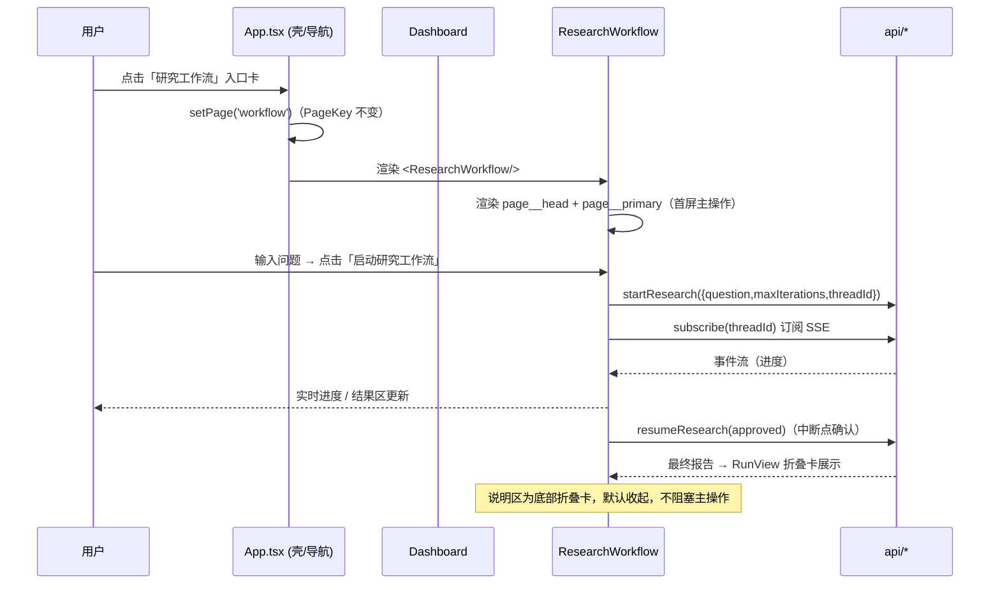
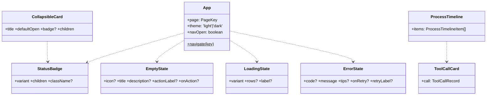
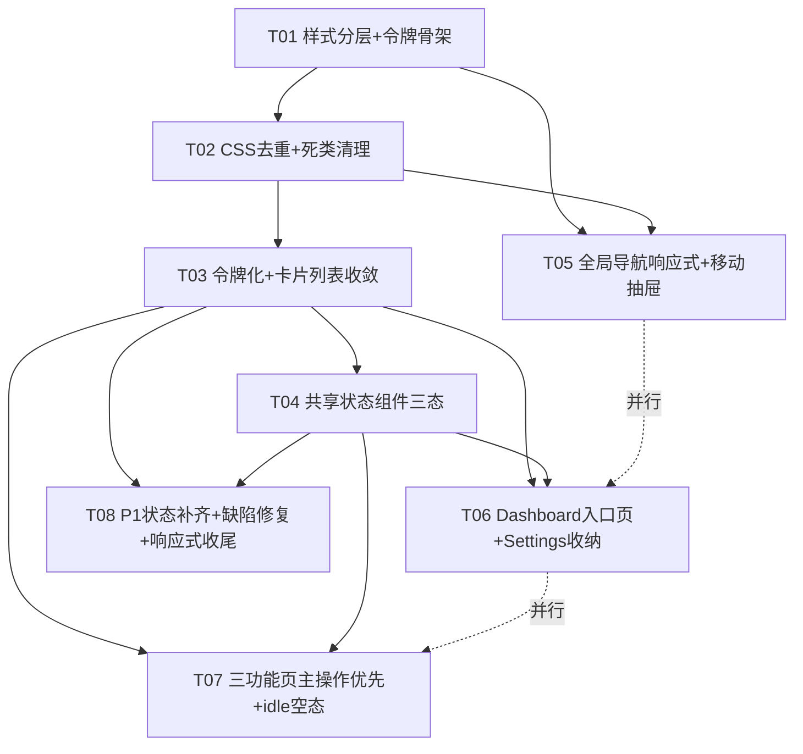

# AI Research Workspace · UI 优化架构设计与任务分解

| 项目信息 | 内容 |
| --- | --- |
| Language | 中文 |
| 输入 | `docs/ui-redesign-prd.md`（PRD v1.0） |
| 代码库 | `frontend/`（React 18 + Vite 5 + TypeScript，纯手写 CSS） |
| 交付物 | 设计系统规范 + CSS 结构方案 + 组件收敛 + 页面分区规范 + 响应式规范 + 任务分解。**不含业务代码。** |
| 硬约束 | 功能/路由/业务逻辑/API/state 完全不变；**零新增 npm 依赖**；不改 `backend/` |
| 版本 | v1.0 |

## 0. 现状复核（对 PRD 取证的关键项逐条验证）

| PRD 结论 | 复核结果 | 证据 |
| --- | --- | --- |
| `index.css` 2951 行 | ✅ 确认 | `wc -l` = 2951 |
| 1–2047 主设计系统 / 2099–2951 追加层 | ✅ 确认 | 2050–2060 为原 2 个媒体查询；**2099 起**为「运行状态与过程可视化组件」第二层，2104 `.badge` 起 |
| 重复定义 12 个类 | ✅ 确认并精确定位（见 §2.3） | `.badge`(505/2104)、`.panel__title`(375/2910)、`.panel__subtitle`(382/2917)、`.activity`(964/2738)、`.timeline`(986/2767)、`.timeline__item`(996/2787)、`.timeline__icon`(1628/2803)、`.timeline__text`(1021/2814)、`.approval`(777/2822)、`.approval__title`(1652/2842)、`.approval__actions`(785/2854)、`.input-card`(1590/2862)、`.report`(794/2889)、`.report__title`(801/2896)、`.report__summary`(807/2902)、`.result-stack`(1639/2882) |
| 死 CSS ~120 行 | ✅ 确认 0 引用 | `trace* / pipeline* / flow-card* / flow-grid / flow-overview / feature-index / progress-arrow / .list / .plan / .plan__meta / doc--column / timeline__type / timeline__id / fold__body / result-stack__head / tool-call-card__reason` 全部 0 引用 |
| 阴影 3 档全硬编码 | ✅ 确认 | `0 1px 3px rgba(0,0,0,.04)`(2171)、`0 8px 24px rgba(0,0,0,.08)`(2176)、`0 18px 40px rgba(0,0,0,.10)`(1147)、`0 24px 80px rgba(0,0,0,.28)`(modal) |
| 字号 10+ 种 | ✅ 确认 | 实测 **20 种** font-size 取值（含 2 个 clamp、10px~32px） |
| 圆角 8 种硬编码 | ✅ 确认 | 实测硬编码 `1/3/4/5/6/8/10/11/980/999/50%` + 令牌 `sm/md/lg` |
| padding 13 种 | ✅ 确认 | 实测 20+ 种 padding 组合，PRD 点名的 13 种全部命中 |
| `Evaluation.tsx:108` 缺陷 | ✅ 确认 | `<li className="run-list__item">` 直接渲染徽章/问题/时间，**未包** `.run-list__btn`（对比 `RunHistory.tsx:85-96` 正确写法） |
| `RunHistory.tsx:80` 错误用 `.hint` | ✅ 确认 | `{error && <p className="hint">{error}</p>}` |
| `ResearchPlanner.tsx:140` 硬编码 badge | ✅ 确认 | `<span className="badge badge--error">失败</span>` |
| 移动端 `.nav-menu` 未处理 | ✅ 确认 | 640px 断点（2064）仅隐藏 `.nav-brand small`，`.nav-menu` 9 项横向 flex 无处理 |
| 硬编码强调色 `rgba(0,113,227,*)` | ✅ 确认 | 17 处（.08/.1/.12/.15/.18/.25/.4），深色下对比度不足 → 需令牌化 |
| `.textarea` 有定义 | ✅ 确认 | 621/635 行与 `.input` 合并定义（无需新增） |

> **结论**：PRD 取证准确，架构设计直接采纳，无推翻项。

---

## Part A：系统设计

## 1. 实现路径

### 1.1 核心难点

| 难点 | 说明 | 应对策略 |
| --- | --- | --- |
| **D1 双层 CSS 静默覆盖** | 追加层（2099+）晚于主层，**当前生效值 = 较晚定义**。直接删任一层都可能引发视觉回归 | 去重时**保留"当前生效（较晚）"定义、删除被覆盖（较早）定义**，保证像素级零变化；令牌化时统一到唯一来源 |
| **D2 无级数的散值** | 字号 20 种、圆角 11 种、padding 20+ 种、阴影 4 种全硬编码 | 建立 8 级间距 / 9 级字号 / 4 档圆角 / 4 档阴影令牌；给「硬编码→令牌」全量映射表（§1.4） |
| **D3 同类语义多套实现** | 卡片 14 种、列表行 8 种、页面容器 3 种 | 收敛为**基础卡/交互卡/折叠卡**三类 + 语义变体；旧类名通过「等价分组」CSS 归并（§3），**不强推重命名**（遵 PRD Q8 降低改动面） |
| **D4 主操作被说明淹没** | workflow/research/agent 均为「说明→说明→表单」，主按钮在 2.5–3 屏下 | 采用「**主操作区前置 + 折叠说明沉底**」的页面骨架（§4），JSX 分区重排（不动 state/API） |
| **D5 移动端导航溢出** | 9 项横向 flex 无响应式处理 | 纯 CSS + **1 个 UI 开合 `useState`** 实现汉堡抽屉；不改 `PageKey`/导航数据结构/不引 react-router（团队已拍板） |
| **D6 状态三态缺失** | 加载仅文字、空态两套、错误无重试 | 抽 **3 个纯展示组件** `EmptyState / LoadingState / ErrorState` + `.state-*` 类，全站复用（无新依赖） |

### 1.2 框架与库选型

**不引入任何新依赖**（团队硬约束）。本方案完全基于既有栈：
- React 18 + TypeScript（既有）
- 纯手写 CSS + CSS 自定义属性（既有）
- Vite 5 内置 CSS 打包（既有，支持多文件 `import` 保序）

**不选**：MUI / Tailwind / antd / CSS-in-JS / classnames / react-router —— 违反「零新依赖」红线。

### 1.3 架构模式

- **CSS 分层架构**：`tokens → base → layout → components → pages → responsive`（单向依赖，下层不反向引用上层）。
- **组件分层**：`components/`（无业务纯展示）← `features/`（页面容器，持有 state）← `App.tsx`（壳层 + 路由）。
- **设计令牌驱动**：所有颜色/字号/间距/圆角/阴影一律引用令牌，禁止散值（护栏见 §7）。

### 1.4 「硬编码 → 令牌」全量映射表（核心）

#### 1.4.1 间距（padding 13 种 → 3 档卡片 + 通用刻度）

| 现状硬编码 | 主要出现位置 | 收敛令牌 | 目标值 |
| --- | --- | --- | --- |
| `padding: 24px 26px 28px` | `.panel`(360) | `var(--space-6)` | 24px |
| `padding: 22px 24px 28px` | 追加层卡片 | `var(--space-6)` | 24px |
| `padding: 26px 24px 28px` | `.feature`(1082) | `var(--space-6)` | 24px |
| `padding: 22px 24px` | 若干 | `var(--space-5) var(--space-6)` | 20/24 |
| `padding: 20px 22px` | `.run-card`(2169) | `var(--space-5)` | 20px |
| `padding: 30px 28px` | 头部 | `var(--space-7) var(--space-6)` | 32/24 |
| `padding: 18px 20px` | `.activity`(2742) | `var(--space-4) var(--space-5)` | 16/20 |
| `padding: 18px 18px 22px` | 卡片 | `var(--space-4) var(--space-5)` | 16/20 |
| `padding: 16px 18px` | `.step`/`.alert`/`.module-card` | `var(--space-4) var(--space-5)` | 16/20 |
| `padding: 14px 16px` | `.metric`/`.tool-call-card`/`.citation` | `var(--space-4)` | 16px |
| `padding: 18px 16px` | `.approval`(2827) | `var(--space-4) var(--space-5)` | 16/20 |
| `padding: 12px 14px` | `.step`/`.data-list__item` | `var(--space-3) var(--space-4)` | 12/16 |
| `padding: 14px` | 零散 | `var(--space-4)` | 16px |
| `padding: 84px 0 24px` / `64px 0` | `.hero`/`.section` | `var(--space-10) 0 var(--space-4)` / `var(--space-10) 0` | 收敛见 §1.4.5 |

**卡片 padding 最终收敛为 3 档**：`--space-6`(页面面板) / `--space-5`(交互卡) / `--space-4`(内嵌子卡)。

#### 1.4.2 字号（20 种 → 9 级）

| 现状硬编码 | 收敛令牌 | 目标值 | 语义层级 |
| --- | --- | --- | --- |
| `clamp(2.1rem,5vw,3.6rem)` | `var(--text-hero)` | `clamp(2rem,4.5vw,3rem)` | L1 Hero H1 |
| `clamp(1.8rem,3.6vw,2.6rem)` | `var(--text-h2)` | `clamp(1.6rem,3vw,2.25rem)` | L2 Section H2 |
| `32px` | `var(--text-h2)` | 同上 | H2 备用 |
| `26px` | `var(--text-2xl)` | 24px | — |
| `24px` / `22px`（`.panel__title`） | `var(--text-2xl)` | **22px**（两级合一） | L2 面板标题 |
| `20px`（cta h3） | `var(--text-xl)` | 18px | L3 卡片标题 |
| `18px`（feature h3） | `var(--text-xl)` | 18px | L3 卡片标题 |
| `17px`（report title） | `var(--text-lg)` | 16px | L3 子标题 |
| `16px`（module/scenario h3） | `var(--text-lg)` | 16px | L3 子标题 |
| `15px`（flow__name/activity__title） | `var(--text-md)` | 15px | 强调正文 |
| `14.5px` / `14px` | `var(--text-base)` | 14px | L4 正文 |
| `13.5px` / `13px` | `var(--text-sm)` | 13px | 辅助正文 |
| `12.5px` / `12px` / `11.5px` / `11px` / `10px` | `var(--text-xs)` | 12px | 标签/元信息 |

> 容忍 ±1px 微调（H1/H2 因 clamp 会随视口变化，属预期）。

#### 1.4.3 圆角（11 种 → 4 档 + pill + circle）

| 现状硬编码 | 收敛令牌 |
| --- | --- |
| `1px`/`3px`/`4px`/`5px`（code、scroll-thumb、装饰） | `var(--radius-xs)` = 6px |
| `6px`/`8px`/`10px`（nav-logo、step__index、timeline__icon） | `var(--radius-sm)` = 8px |
| `11px` | `var(--radius-md)` = 12px |
| `var(--radius-sm/md/lg)` 既有 | 保留 sm=8 / md=12 / lg=18 |
| `940px`/`980px`/`999px`（button、badge、nav-link、progress-node） | `var(--radius-pill)` = 999px |
| `50%`（circle 类） | `var(--radius-circle)` = 50% |

#### 1.4.4 阴影（4 处硬编码 → 4 档 × 明暗两套）

| 现状硬编码 | 收敛令牌 |
| --- | --- |
| `0 1px 3px rgba(0,0,0,.04)`（`.run-card`） | `var(--shadow-sm)` |
| `0 8px 24px rgba(0,0,0,.08)`（`.run-card:hover`） | `var(--shadow-md)` |
| `0 18px 40px rgba(0,0,0,.10)`（`.flow__step:hover`） | `var(--shadow-lg)` |
| `0 24px 80px rgba(0,0,0,.28)`（`.modal`） | `var(--shadow-xl)` |

#### 1.4.5 垂直节奏收敛（P2-1）

| 现状 | 收敛令牌 |
| --- | --- |
| `.hero` `padding: 84px 0 24px` | `padding: var(--space-10) 0 var(--space-4)`（64/16） |
| `.section` `padding: 64px 0` | `padding: var(--space-9) 0`（48，section 间 96px→收敛） |
| `.hero-facts` `margin-top: 56px` | `margin-top: var(--space-7)`（32） |
| `.result-stack` `gap: 12px` | `gap: var(--space-4)`（16） |

---

## 2. 设计令牌规范（可直接抄进 CSS）

### 2.1 `src/styles/tokens.css`（new，节选为完整定义）

```css
:root {
  color-scheme: light;

  /* ---- 颜色语义（沿用现有命名） ---- */
  --page: #ffffff;
  --surface: #ffffff;
  --surface-alt: #f5f5f7;
  --ink: #1d1d1f;
  --ink-soft: #424245;
  --muted: #6e6e73;
  --faint: #86868b;
  --line: rgba(0, 0, 0, 0.09);
  --line-strong: rgba(0, 0, 0, 0.16);
  --accent: #0071e3;
  --accent-hover: #0077ed;
  --danger: #d70015;
  --danger-bg: #fff5f5;
  --ok: #008a34;
  --ok-bg: #f0fbf3;
  --warn: #b25000;
  --warn-bg: #fff8ef;
  --nav-bg: rgba(255, 255, 255, 0.72);
  --overlay: rgba(0, 0, 0, 0.42);

  /* ---- 新增：消除硬编码 rgba(0,113,227,*) 与状态边框 ---- */
  --accent-tint: rgba(0, 113, 227, 0.10);
  --accent-tint-strong: rgba(0, 113, 227, 0.18);
  --accent-border: rgba(0, 113, 227, 0.25);
  --ok-border: rgba(0, 138, 52, 0.25);
  --danger-border: rgba(215, 0, 21, 0.25);
  --warn-border: rgba(178, 80, 0, 0.30);
  --focus-ring: 0 0 0 3px rgba(0, 113, 227, 0.15);
  --hover-bg: rgba(0, 0, 0, 0.02);
  --scroll-thumb: rgba(0, 0, 0, 0.16);

  /* ---- 间距刻度（4px 基准，--space-1..8 核心 + 9/10 扩展） ---- */
  --space-1: 4px;
  --space-2: 8px;
  --space-3: 12px;
  --space-4: 16px;
  --space-5: 20px;
  --space-6: 24px;
  --space-7: 32px;
  --space-8: 40px;
  --space-9: 48px;   /* section 节奏 */
  --space-10: 64px;  /* hero 上留白 */

  /* ---- 字号层级（9 级） ---- */
  --text-hero: clamp(2rem, 4.5vw, 3rem);
  --text-h2: clamp(1.6rem, 3vw, 2.25rem);
  --text-3xl: 28px;
  --text-2xl: 22px;
  --text-xl: 18px;
  --text-lg: 16px;
  --text-md: 15px;
  --text-base: 14px;
  --text-sm: 13px;
  --text-xs: 12px;

  /* ---- 行高 / 字重 ---- */
  --leading-tight: 1.25;
  --leading-snug: 1.4;
  --leading-normal: 1.6;
  --leading-relaxed: 1.7;
  --weight-normal: 400;
  --weight-medium: 500;
  --weight-semibold: 600;
  --weight-bold: 700;

  /* ---- 圆角 ---- */
  --radius-xs: 6px;
  --radius-sm: 8px;
  --radius-md: 12px;
  --radius-lg: 18px;
  --radius-pill: 999px;
  --radius-circle: 50%;

  /* ---- 阴影（浅色） ---- */
  --shadow-xs: 0 1px 2px rgba(0, 0, 0, 0.04);
  --shadow-sm: 0 1px 3px rgba(0, 0, 0, 0.06);
  --shadow-md: 0 8px 24px rgba(0, 0, 0, 0.08);
  --shadow-lg: 0 18px 40px rgba(0, 0, 0, 0.10);
  --shadow-xl: 0 24px 80px rgba(0, 0, 0, 0.28);

  /* ---- 排版 / 栅格 / 层级 / 动效 ---- */
  --font: -apple-system, BlinkMacSystemFont, "SF Pro Display", "SF Pro Text",
    "Helvetica Neue", "PingFang SC", "Hiragino Sans GB", "Microsoft YaHei", Inter, sans-serif;
  --mono: ui-monospace, SFMono-Regular, "SF Mono", Menlo, Consolas, monospace;
  --max-width: 1080px;        /* PRD Q4：保持 1080，仅统一内边距与 gap */
  --content-measure: 68ch;    /* 正文行长上限（P1-6） */
  --nav-height: 52px;
  --gutter: 44px;             /* 桌面容器左右内边距 */
  --grid-gap: var(--space-4);

  --z-base: 0;
  --z-track: 1;
  --z-nav: 100;
  --z-dropdown: 200;
  --z-scrim: 290;
  --z-drawer: 300;
  --z-modal: 400;

  --dur-fast: 160ms;
  --dur-base: 220ms;
  --dur-slow: 320ms;
  --ease: cubic-bezier(0.25, 0.1, 0.25, 1);
  --ease-out-expo: cubic-bezier(0.19, 1, 0.22, 1);
  --ease-spring: cubic-bezier(0.16, 1, 0.3, 1);
}

:root[data-theme="dark"] {
  color-scheme: dark;
  --page: #000000;
  --surface: #1d1d1f;
  --surface-alt: #161617;
  --ink: #f5f5f7;
  --ink-soft: #d2d2d7;
  --muted: #a1a1a6;
  --faint: #86868b;
  --line: rgba(255, 255, 255, 0.11);
  --line-strong: rgba(255, 255, 255, 0.20);
  --accent: #2997ff;
  --accent-hover: #4aa8ff;
  --danger: #ff6b6b;
  --danger-bg: rgba(255, 59, 48, 0.14);
  --ok: #4cd07d;
  --ok-bg: rgba(48, 209, 88, 0.14);
  --warn: #ff9f3c;
  --warn-bg: rgba(255, 159, 10, 0.14);
  --nav-bg: rgba(22, 22, 23, 0.72);
  --overlay: rgba(0, 0, 0, 0.68);

  --accent-tint: rgba(41, 151, 255, 0.16);
  --accent-tint-strong: rgba(41, 151, 255, 0.24);
  --accent-border: rgba(41, 151, 255, 0.30);
  --ok-border: rgba(76, 208, 125, 0.30);
  --danger-border: rgba(255, 107, 107, 0.30);
  --warn-border: rgba(255, 159, 60, 0.32);
  --focus-ring: 0 0 0 3px rgba(41, 151, 255, 0.24);
  --hover-bg: rgba(255, 255, 255, 0.03);
  --scroll-thumb: rgba(255, 255, 255, 0.20);

  /* 深色阴影：显著提高不透明度补偿黑底不可见 */
  --shadow-xs: 0 1px 2px rgba(0, 0, 0, 0.55);
  --shadow-sm: 0 1px 3px rgba(0, 0, 0, 0.60);
  --shadow-md: 0 8px 24px rgba(0, 0, 0, 0.60);
  --shadow-lg: 0 18px 40px rgba(0, 0, 0, 0.65);
  --shadow-xl: 0 24px 80px rgba(0, 0, 0, 0.80);
}
```

### 2.2 令牌总览表

| 分类 | 令牌 | light | dark | 用途 |
| --- | --- | --- | --- | --- |
| 表面 | `--page` | `#ffffff` | `#000000` | 页面底色 |
| | `--surface` | `#ffffff` | `#1d1d1f` | 卡片/面板底 |
| | `--surface-alt` | `#f5f5f7` | `#161617` | 次级底/内嵌块 |
| 文字 | `--ink` | `#1d1d1f` | `#f5f5f7` | 主文字 |
| | `--ink-soft` | `#424245` | `#d2d2d7` | 次主文字 |
| | `--muted` | `#6e6e73` | `#a1a1a6` | 辅助文字 |
| | `--faint` | `#86868b` | `#86868b` | 最弱文字 |
| 分隔 | `--line` | `rgba(0,0,0,.09)` | `rgba(255,255,255,.11)` | 细边框 |
| | `--line-strong` | `rgba(0,0,0,.16)` | `rgba(255,255,255,.20)` | 强边框/输入框 |
| 强调 | `--accent` | `#0071e3` | `#2997ff` | 主色/链接 |
| | `--accent-hover` | `#0077ed` | `#4aa8ff` | 主色悬停 |
| | `--accent-tint` | `rgba(0,113,227,.10)` | `rgba(41,151,255,.16)` | 主色浅底 |
| | `--accent-tint-strong` | `rgba(0,113,227,.18)` | `rgba(41,151,255,.24)` | 主色浅底(强) |
| | `--accent-border` | `rgba(0,113,227,.25)` | `rgba(41,151,255,.30)` | 主色边框 |
| 状态 | `--danger`/`--danger-bg`/`--danger-border` | `#d70015`/`#fff5f5`/`rgba(215,0,21,.25)` | `#ff6b6b`/`rgba(255,59,48,.14)`/`rgba(255,107,107,.30)` | 错误 |
| | `--ok`/`--ok-bg`/`--ok-border` | `#008a34`/`#f0fbf3`/`rgba(0,138,52,.25)` | `#4cd07d`/`rgba(48,209,88,.14)`/`rgba(76,208,125,.30)` | 成功 |
| | `--warn`/`--warn-bg`/`--warn-border` | `#b25000`/`#fff8ef`/`rgba(178,80,0,.30)` | `#ff9f3c`/`rgba(255,159,10,.14)`/`rgba(255,159,60,.32)` | 警告 |
| 壳层 | `--nav-bg` | `rgba(255,255,255,.72)` | `rgba(22,22,23,.72)` | 毛玻璃顶栏 |
| | `--overlay` | `rgba(0,0,0,.42)` | `rgba(0,0,0,.68)` | 遮罩/背板 |
| | `--hover-bg` | `rgba(0,0,0,.02)` | `rgba(255,255,255,.03)` | 悬停底 |
| | `--focus-ring` | `0 0 0 3px rgba(0,113,227,.15)` | `0 0 0 3px rgba(41,151,255,.24)` | 聚焦环 |
| 间距 | `--space-1..10` | 4/8/12/16/20/24/32/40/48/64 | 同 | 全站间距 |
| 字号 | `--text-hero/h2/3xl/2xl/xl/lg/md/base/sm/xs` | 见 §2.1 | 同 | 全站字号 |
| 行高/字重 | `--leading-*` `--weight-*` | 见 §2.1 | 同 | 排版 |
| 圆角 | `--radius-xs/sm/md/lg/pill/circle` | 6/8/12/18/999px/50% | 同 | 全站圆角 |
| 阴影 | `--shadow-xs/sm/md/lg/xl` | 弱 | 强（不透明度补偿） | 层次 |
| 栅格 | `--max-width` `--content-measure` `--gutter` `--grid-gap` `--nav-height` | 1080px/68ch/44px/16px/52px | 同 | 布局 |
| 层级 | `--z-base/track/nav/dropdown/scrim/drawer/modal` | 0/1/100/200/290/300/400 | 同 | 层叠 |

> **新增令牌理由**：`accent-tint*`/`accent-border`/`*_border`/`focus-ring`/`hover-bg`/`scroll-thumb` 用于消除 17 处硬编码 `rgba(0,113,227,*)` 及状态边框硬编码（PRD P2-5 要求深色下对比度可辨）；`--content-measure` 落实 P1-6 行长受控；z-index 令牌消除 `.modal`(400?)、`.global-nav`(100) 等魔法数字。

---

## 3. CSS 文件结构方案

### 3.1 决策：**拆分为 6 个分层文件 + main.tsx 顺序引入**

**理由**：2951 行单文件使「同名类只定义 1 次」难以自证；分层后职责边界清晰、去重可验证、代码评审友好。Vite 打包 `import` 顺序即最终 `@import` 顺序（`main.tsx` 中的相对顺序被保留），比 CSS 内 `@import` 更可控。

**引入顺序（改 `src/main.tsx`）**：

```ts
import { StrictMode } from 'react'
import { createRoot } from 'react-dom/client'
import App from './App'
import './styles/tokens.css'
import './styles/base.css'
import './styles/layout.css'
import './styles/components.css'
import './styles/pages.css'
import './styles/responsive.css'
```

> `src/styles/index.css` **保留为空聚合占位或删除**；若保留，用 6 行 `@import`（必须置于文件首部）作为兼容层。推荐直接删除 `index.css` 并更新 `main.tsx`（仅 1 处引用，改动可控）。

### 3.2 文件职责边界

| 文件 | 职责 | 现有行号归集 |
| --- | --- | --- |
| `tokens.css` | 仅 CSS 变量（`:root` + dark），无选择器样式 | 原 7–69 |
| `base.css` | reset、`html/body`、`code/a/::selection`、全局滚动条、`@keyframes` | 原 71–104、2926–2940 |
| `layout.css` | 顶栏导航、`.shell`、`.main`、`.hero`、`.section`、`.panel`、`.module-section`、栅格容器 | 原 105–430、1227–1260、1534–1570 |
| `components.css` | button/badge/alert/hint/field/input/card 系列/list-row 系列/state-*/timeline/tool-call/process-timeline/citation/data-list/markdown/modal/approval | 原 452–1120、1260–2050、2099–2951（去重后） |
| `pages.css` | 页面级专属：dashboard 入口网格、workflow 结果栈、knowledge upload、reports modal、settings table、tutorial | 原 `.feature*`/`.module-grid`/`.module`/`.scenario*`/`.guide*`/`.cta-banner`/`.settings-*`/`.report-list`/`.report-card`/`.stat-*`/`.upload`/`.doc*` |
| `responsive.css` | 全部 `@media`（3 档断点 + hover 能力 + reduced-motion） | 原 2050–2097、2940 |

### 3.3 去重与删除清单

**去重原则**：同名选择器在「主层（较早）」与「追加层（较晚）」各定义一次时，**CSS 级联当前生效的是较晚定义** → **保留较晚定义、删除较早定义**，做到**零视觉变化**。唯一例外是需收敛统一值的标题类（改用令牌单一定义）。

**重复类删除清单（删较早定义，保留较晚）**：

| 类名 | 删除（被覆盖，较早） | 保留（当前生效，较晚） |
| --- | --- | --- |
| `.badge` + `::before` | 505–528（旧无圆点版） | 2104–2124（带圆点版） |
| `.panel__title` | 375–380 | 2910–2916 → **改令牌 `--text-2xl` 单一定义** |
| `.panel__subtitle` | 382–387 | 2917–2925 → **改令牌单一定义** |
| `.activity` | 964–971 | 2738–2744 |
| `.activity__head` | 972–985 | 2746–2752 |
| `.timeline` | 986–995 | 2767–2785 |
| `.timeline__item` | 996–1005 | 2787–2801 |
| `.timeline__icon` | 1628–1634 | 2803–2812 |
| `.timeline__text` | 1021–1030 | 2814–2819 |
| `.approval` | 777–784 | 2822–2840 |
| `.approval__title` | 1652–1657 | 2842–2846 |
| `.approval__actions` | 785–793 | 2854–2860 |
| `.input-card` | 1590–1597 | 2862–2870 |
| `.result-stack` | 1639–1644 | 2882–2888 |
| `.report` | 794–800 | 2889–2895 |
| `.report__title` | 801–806 | 2896–2901 |
| `.report__summary` | 807–812 | 2902–2909 |

> 保留的较晚定义中若含硬编码值（如 `.run-card` 阴影），在 T03 统一替换为令牌。

**死类删除清单（0 引用，直接删）**：

```
.trace / .trace__item / .trace__head / .trace__tool / .trace__tool--final /
.trace__reason / .trace__args code / .trace__preview / .trace__error / .trace--compact
.pipeline / .pipeline__node / .pipeline__node--done / .pipeline__node--next
.flow-card / .flow-card__no / .flow-card__title / .flow-card__desc
.flow-grid / .flow-overview / .feature-index / .progress-arrow
.list / .plan / .plan__meta / .doc--column
.timeline__type / .timeline__id / .fold__body / .result-stack__head / .tool-call-card__reason
```

**CSS 组织顺序（文件内通用）**：`tokens → reset/base → layout → components → pages → utilities → responsive`。

**预期收益**：删除重复 + 死类约 350–450 行，令牌化后再压缩散值 → 全量 CSS 行数下降 **≥15%**（满足 P0-2 验收）。

---

## 4. 组件收敛方案

### 4.1 卡片：14 种 → 3 类 + 语义变体

**基线类（新增，供新样式与改造页使用）**：

| 类名 | 职责 | 何时用 |
| --- | --- | --- |
| `.card` | 基础容器：`surface` 底 + `1px var(--line)` + `--radius-lg` + `--space-5` padding + `--shadow-sm` | 所有静态卡片 |
| `.card--interactive` | 可点击/悬停抬升：`+ hover border-color:var(--line-strong)` + `--shadow-md` | 入口卡、报告卡、可点列表项 |
| `.card--fold` | 折叠卡（= 现有 `.collapsible-card` 语义） | 说明区、结果折叠块 |
| `.card--stat` | 统计数字卡（大数字 + 标签） | evaluation `stat-card` |
| `.card--metric` | 键值 metric | dashboard `metric` |
| `.card--entry` | 首页入口卡（图标 + 标题 + 一句话 + 推荐角标） | dashboard 入口区 |

**旧类名 → 新类名映射表（工程师按需批量替换；同时提供 CSS 等价分组作为零 JSX 改动兜底）**：

| 旧类名 | 目标基线类 | 说明 |
| --- | --- | --- |
| `.feature` | `.card .card--interactive` | dashboard 能力卡 |
| `.module-card` | `.card` | 说明子卡 |
| `.module` | `.card .card--interactive` | tutorial 模块卡 |
| `.scenario` | `.card .card--interactive` | tutorial 场景卡 |
| `.flow__step` | `.card .card--interactive` | 流程步骤卡 |
| `.step-card` | `.card` | research 步骤卡 |
| `.report-card` | `.card .card--interactive` | 报告列表卡 |
| `.input-card` | `.card` | 输入区容器 |
| `.run-card` | `.card` | 运行状态卡 |
| `.tool-call-card` | `.card` | 工具调用卡 |
| `.collapsible-card` | `.card--fold` | 折叠卡（保留类名亦可，见下） |
| `.metric` | `.card .card--metric` | 键值项 |
| `.stat-card` | `.card .card--stat` | 统计卡 |
| `.citation` | `.card` | 引用卡 |

> **重要**：PRD Q8 明确「本次不强制重构类名」。因此**推荐做法是"CSS 等价分组"**——在 `components.css` 中把上述旧类名与基线类**并列写在同一条规则**里（`.card, .feature, .module, .scenario, …{…}`），实现视觉统一而**零 JSX 改动**。映射表用于**已被改造的页面**（dashboard/workflow/research）顺带迁移到基线类，其余页面保持类名不变。两种方式并存，风险最低。

### 4.2 列表行：8 种 → 1 基线 + 变体

| 类名 | 职责 |
| --- | --- |
| `.list-row`（新增基线） | `display:flex; align-items:center; gap:var(--space-3); padding:var(--space-3) var(--space-4); border-bottom:1px solid var(--line)` |
| `.list-row--btn` | 可点行（hover 底 + 触摸高度 ≥44px） |

**旧类名 → 新类名映射表**：

| 旧类名 | 目标 | 说明 |
| --- | --- | --- |
| `.metric` | `.list-row`（metric 变体） | dashboard 指标行 |
| `.settings-row` | `.list-row`（label/value 两列变体） | 设置行 |
| `.param-row` | `.list-row`（key/value 两列变体） | 工具参数行 |
| `.doc` | `.list-row` | 知识库文档行 |
| `.run-list__btn` | `.list-row .list-row--btn` | **历史运行 / 最近运行统一到此类**（修 P0-6） |
| `.report-card` | `.card .card--interactive`（列表卡） | 报告列表（卡片式，不并入行） |
| `.timeline__item` | `.list-row`（时间线变体） | 事件流行 |
| `.process-timeline__item` | `.list-row`（轨道变体） | 阶段时间线行 |

> **P0-6 修复点**：`Evaluation.tsx:108` 的 `<li className="run-list__item">` 补 `<button className="list-row list-row--btn">`（或沿用 `.run-list__btn`）包裹徽章/问题/时间三列，与 `RunHistory.tsx` 完全一致。

### 4.3 页面容器：3 种 → 1 骨架类

| 现状 | 收敛 |
| --- | --- |
| `.panel` / `.panel--clean`（workflow）/ `.hero+.section`（dashboard/tutorial） | 统一 `.page`（= 现 `.panel` 语义）用于工具页；营销/入口页（dashboard/tutorial）沿用 `.hero + .section`。`.panel--clean` 合并为 `.page` 的修饰符 `.page--flush`（去掉首块顶部分隔线）。**JSX 层面 `.panel` 类名可保持不动**，仅通过分组统一样式。 |

### 4.4 新增可复用组件（纯展示，零依赖）

新增 3 个组件，统一全站三态（§PRD 8）：

| 文件 | 组件 | Props 接口 |
| --- | --- | --- |
| `src/components/EmptyState.tsx` | `EmptyState` | `{ icon?: string; title: string; description?: string; actionLabel?: string; onAction?: () => void }` |
| `src/components/LoadingState.tsx` | `LoadingState` | `{ variant?: 'card' | 'list' | 'table' | 'inline'; rows?: number; label?: string }`（渲染固定高度骨架块，消除 CLS） |
| `src/components/ErrorState.tsx` | `ErrorState` | `{ code?: string; message: string; tips?: ReactNode; onRetry?: () => void; retryLabel?: string }`（默认重试文案「重试」；以 Dashboard 错误态为模板） |

> 三组件仅输出 `.state-*` 结构 + 现有 `.badge/.button` 类，**不新增 npm 依赖、不含业务逻辑**。

---

## 5. 页面结构与分区规范

### 5.1 统一页面骨架（间距节奏）

```
.page                                     // 容器（= 现 .panel）
├─ .page__head                           // 标题区：eyebrow + h2 + subtitle，下间距 --space-5
├─ .page__primary                        // 主操作区【首屏必达】：输入 + 主按钮 + tip
├─ .page__content                        // 内容/结果区：run-card / 结果栈
├─ .page__aside                          // 折叠说明区（底部，默认收起）
└─ .page__status                         // 状态区：EmptyState / LoadingState / ErrorState / 历史
```

**节奏**：区与区之间 `--space-6`(24px)；区内元素 `--space-3`(12px)；标题→副标题 `--space-1`。

### 5.2 Dashboard 改造后 DOM 分区（≤3 区块）

```
<>
  <section className="hero hero--compact">              // ① 首屏：一句话 + 主按钮 + 轻量状态点
    <p className="hero-welcome">AI 研究工作台</p>
    <h1>提一个问题，拿到一份有出处的研究报告。</h1>
    <p className="hero-lede">{一句话说明}</p>
    <div className="hero-actions">
      <button className="button button--primary">开始研究</button>   // → workflow
      <button className="button">3 分钟上手教程</button>            // → tutorial
    </div>
    <div className="hero-facts">7 步 · 实时进度 · 写报告前可确认 · 结论可溯源</div>
    <button className="status-line" onClick={()=>onNavigate('settings')}>   // 轻量状态点
      <StatusBadge variant="ok|error">后端已连接 / 未连接，点此排查</StatusBadge>
    </button>
  </section>

  <section className="section section--entry">          // ② 4 张核心入口卡
    <div className="entry-grid">
      <button className="card card--interactive card--entry card--primary">  // 主入口
        <span className="card__icon">程</span>
        <h3 className="card__title">研究工作流</h3>
        <p className="card__desc">跑一遍完整研究，写报告前可先确认方向。</p>
        <span className="badge badge--info">推荐</span>
      </button>
      <button className="card card--interactive card--entry">智能体</button>
      <button className="card card--interactive card--entry">知识库</button>
      <button className="card card--interactive card--entry">研究报告</button>
    </div>
    <div className="entry-links">研究规划 · 效果评估 · 系统设置 · 教程</div>
  </section>

  <section className="section">                          // ③ 研究流程（保留，紧凑）
    <section-head/> <FlowOverview/>
  </section>
</>
```
- 移除：原「它能做什么」feature 区块（能力描述并入 4 张入口卡一句话）；原「连接状态」技术明细（环境/版本/延迟/UTC）→ **移入 Settings**（见 §5.4）。
- 入口卡网格：桌面 4 列 / 平板 2 列 / 移动 1 列。

### 5.3 workflow 改造后 DOM 分区（主操作优先）

```
<section className="page page--flush">
  <header className="page__head panel__header--compact">    // 标题区
    eyebrow + h2.panel__title + p.panel__subtitle
  </header>

  <section className="page__primary">                        // ★ 主操作区（首屏）
    <div className="input-card card">
      field(研究任务 textarea + placeholder/hint)
      field--inline(range 最大轮数)
      <button className="button button--primary">启动研究工作流</button>
      <p className="tip">点「启动研究工作流」后进度实时刷新；写报告前会停下等你确认。</p>
    </div>
    {error && <ErrorState onRetry={...} />}
  </section>

  {run?.status !== 'awaiting_approval' && !hasStream && (
    <EmptyState title="还没开始研究" description="输入研究问题并点「启动研究工作流」，这里会显示实时进度与结果。" />
  )}

  {hasStream && <section className="activity card">实时进度 …</section>}   // 内容区
  {run && <RunView run={run} />}                                          // 结果区
  {run?.status === 'awaiting_approval' && <div className="approval">人工确认 …</div>}

  <section className="page__aside">                          // ★ 折叠说明区（底部默认收起）
    <CollapsibleCard title="这个模块能做什么？">… + <FlowOverview/></CollapsibleCard>
    <CollapsibleCard title="使用方式">…</CollapsibleCard>
  </section>

  <RunHistory onSelect={...} />                              // 状态区（历史运行）
</section>
```
> 关键：`.page__primary` 紧随标题区，主按钮首屏可见（1440×900）；说明区 2 张折叠卡默认 `defaultOpen=false` 沉底。

### 5.4 research / agent 改造后分区

同 workflow：`page__head → page__primary（field + 主按钮「生成研究计划」/「运行 Agent」）→ EmptyState(idle) → 结果区 → page__aside（「这个模块能做什么？」+「使用方式」折叠，含原 4 张 `.module-card`）→ 状态区`。

### 5.5 Settings 收纳（承接 Dashboard 技术明细）

在现有「运行配置」之上插入「连接状态」分组，承接原 Dashboard 的 `metrics`（环境/版本/API 地址/延迟/UTC/最近检测）+ 重新检测按钮；并将 20 行配置按 **应用 / LLM / 搜索 / Agent / 研究工作流 / Embedding / 安全(CORS)** 分 7 组（P1-5）。

### 5.6 程序调用流程（主操作：首页 → 研究工作流）



### 5.7 组件类图（展示层）



---

## 6. 响应式规范

### 6.1 三档断点

| 档位 | 宽度 | 容器 | 卡片网格 | 表单 | 表格(设置) | 数据列表 | 弹窗 |
| --- | --- | --- | --- | --- | --- | --- | --- |
| Desktop | ≥1024px | `min(1080px,100% - 44px)` | 入口卡 4 列 / 能力卡 3 列 / 统计卡 4 列 | `.field` 上下；`.field--inline` label 左 + 控件右(range ≤220px) | `200px 1fr`，分组头吸顶 | 徽章/问题(弹性省略)/时间 三列 | `760px`，`max-height:88vh` |
| Tablet | 768–1023px | `100% - 40px` | 2 列（统计卡 2×2） | 同桌面 | `160px 1fr` | 问题占满 | `100% - 40px` |
| Mobile | <768px | `100% - 32px` | 1 列（统计卡 2×2） | 一律上下；label 在上、控件满宽；按钮全宽 | **单列**：label 上(小号弱色)/值下，行 padding 14px | 时间换行至第二行 | **全屏**：`inset:0`，`max-height:100vh`，头部固定，关闭键 ≥44px |

**兜底**：`pre` / `.tool-call-card__output` / `.markdown-body table` 统一 `overflow-x:auto`；`body` 禁止横向滚动。`.progress-track` 移动端保留 `overflow-x:auto` 边缘渐隐。hover 效果一律包 `@media (hover:hover)`，禁用 `scale` 类动效。

**断点实现**：替换现有 2050(≤860)/2060(≤640) 为：

```css
@media (max-width: 1023px) { /* Tablet 及以下 */ }
@media (max-width: 767px)  { /* Mobile */ }
@media (hover: hover) and (pointer: fine) { /* 悬停动效 */ }
@media (prefers-reduced-motion: reduce) { /* 已存在，保留 */ }
```

### 6.2 移动端导航抽屉

| 档位 | 导航形态 |
| --- | --- |
| ≥1024 | `.nav-menu` 9 项平铺，`.nav-link--active` 加下指示条/胶囊底 |
| 768–1023 | 显示核心 4 项（概览/研究工作流/知识库/研究报告）+「更多」下拉（含其余 5 项） |
| <768 | 隐藏 `.nav-menu`，显示汉堡按钮 → 打开抽屉 |

**DOM 结构（`App.tsx` 新增，`PageKey` 与 `NAV_ITEMS` 不变）**：

```tsx
// 仅新增 1 个 UI state（团队拍板）
const [navOpen, setNavOpen] = useState(false)

<button className="nav-toggle" aria-label="打开导航" aria-expanded={navOpen}
        aria-controls="mobile-nav" onClick={() => setNavOpen(v => !v)}>☰</button>

{/* 遮罩 + 抽屉：仅在移动端由 CSS 显示 */}
<div className="nav-scrim" data-open={navOpen} onClick={() => setNavOpen(false)} />
<nav id="mobile-nav" className="nav-drawer" data-open={navOpen} aria-label="主导航">
  {NAV_ITEMS.map(item => (
    <button key={item.key}
            className={`nav-drawer__link ${item.key===page?'is-active':''}`}
            onClick={() => { navigate(item.key); setNavOpen(false) }}>   // 选中后自动收起
      {item.label}
    </button>
  ))}
</nav>
```

**交互约定**：遮罩点击关闭；`Escape` 可关（可选，`useEffect` 监听）；**body 滚动锁定**——`useEffect(() => { document.body.style.overflow = navOpen ? 'hidden' : '' }, [navOpen])`（仅在移动端生效，桌面 `navOpen` 恒 false）。抽屉单列、行高 ≥44px、当前页高亮。

---

## 7. 共享知识（跨文件约定）

| 项 | 约定 |
| --- | --- |
| **类名规范** | 沿用既有 BEM 风格（`block__element--modifier`）；**新增**只用基线类 `.card / .list-row / .state-* / .page__*` 及其修饰符；不引入新命名体系（遵 Q8） |
| **令牌使用** | 禁止硬编码颜色/字号/间距/圆角/阴影；一律 `var(--*)`。允许例外：`50%`（用 `--radius-circle`）、`#fff`（用既有语义或保留极小范围） |
| **间距取值** | 只能用 `--space-1..10`；不得出现魔法数字 |
| **圆角取值** | 只能用 `--radius-xs/sm/md/lg/pill/circle` |
| **阴影** | 只能用 `--shadow-xs/sm/md/lg/xl`；深色自动切换 |
| **状态三态统一写法** | 空 → `<EmptyState/>`(`.state-empty`)；加载 → `<LoadingState/>`(`.state-loading`，固定高度骨架)；错误 → `<ErrorState/>`(`.state-error`，含 `code`+`retry`+`tips`)；**禁止**用 `.hint` 渲染空/错误 |
| **错误模板** | 以 Dashboard 错误态为全站模板：`StatusBadge(error)` + `code` + 下一步建议 + 「重试」 |
| **交互反馈** | 所有 `:hover`/动效包在 `@media (hover:hover)`；可点元素 ≥44×44px |
| **容器宽度** | 统一 `min(var(--max-width), 100% - gutter)`；正文容器加 `max-width: var(--content-measure)` |
| **不动的红线** | 不改 API 签名/调用、不改 `useState/useEffect` 业务逻辑、不改 `PageKey`/`NAV_ITEMS`、不引 react-router、不动 `backend/` |

---

## 8. 风险与回滚

| 风险 | 影响 | 规避 |
| --- | --- | --- |
| **删重复 CSS 后样式错乱** | 误判「哪份生效」导致视觉回归 | 严格遵循「保留较晚（当前生效）定义」；**每删一批跑 `npm run build` + 三档截图对比**；用 `git diff` 逐段核对 |
| **拆分文件后层叠顺序变化** | 样式覆盖关系改变 | `main.tsx` import 顺序固定为 tokens→base→layout→components→pages→responsive；拆分**只移动不修改**（T01），值变更留到 T03 |
| **改 JSX 结构后 className 失效/新类无样式** | 元素裸奔 | 分区重排时**只做包裹与位移，不删类名**；新增结构类（`.page__primary` 等）先在 CSS 落地再改 JSX；改造后逐页目视核对 |
| **主操作首屏可见性不达标** | 违反 G2 | 桌面 1440×900 与移动 390×844 双尺寸实测主按钮位置；折叠说明默认收起 |
| **移动抽屉 body 锁定泄漏** | 桌面滚动被锁 | `navOpen` 仅移动端可为 true；卸载时复位 `overflow` |
| **令牌替换遗漏硬编码** | 视觉不一致 | T03 后 grep 校验：`font-size:/padding:/border-radius:/box-shadow:` 后不应再出现纯数字（除令牌定义与合法 `0`） |
| **深色主题阴影仍不可见** | 层次丢失 | 深色 `--shadow-*` 用高不透明度；明暗切换逐页验收 |

**回滚策略**：每个任务独立提交（atomic commit）；T01/T02 为纯 CSS 结构改动，回滚零风险；T05/T06/T07 涉及 JSX，若回归可单文件 `git checkout` 回退，不影响其他任务。

---

## 9. 待明确事项

| # | 事项 | 默认决策（建议） |
| --- | --- | --- |
| A1 | 是否保留 `index.css` 作为聚合层？ | **删除**，改 `main.tsx` 直接按序 import 6 个文件（仅 1 处引用改动） |
| A2 | 旧类名是否全量重命名为 `.card/.list-row`？ | **不全量**（遵 Q8）。用 CSS 等价分组统一视觉；仅在已改造页（dashboard/workflow/research）顺带迁移 |
| A3 | 「更多」下拉（768–1023）是否需要 JS state？ | **不需要**。用 CSS `:hover/:focus-within` 纯 CSS 下拉，避免新增 state（团队仅批准 1 个 state 用于抽屉） |
| A4 | 骨架屏是否需要 shimmer 动画？ | **需要**，纯 CSS `@keyframes` 实现（无依赖），并受 `prefers-reduced-motion` 约束 |
| A5 | `.hero` 是否两套（营销版 vs 紧凑版）？ | 用 `.hero--compact` 修饰符（dashboard 用紧凑版，tutorial 保留原版） |

---

## Part B：任务分解

### 6. 所需第三方包

**无新增依赖**。沿用现有：`react@^18.3.1`、`react-dom@^18.3.1`、`react-markdown@^10.1.0`、`remark-gfm@^4.0.1`；dev：`typescript@^5.6.3`、`vite@^5.4.11`、`@vitejs/plugin-react@^4.3.4`。

### 7. 任务列表（按依赖顺序，8 个任务）

| ID | 任务名 | 源文件 | 依赖 | 优先级 | 验收点 |
| --- | --- | --- | --- | --- | --- |
| **T01** | **样式分层 + 设计令牌骨架** | `src/styles/tokens.css`(新)、`base.css`、`layout.css`、`components.css`、`pages.css`、`responsive.css`(均新)、删除 `index.css`、`src/main.tsx` | — | P0 | ① 6 文件按序引入；② `npm run typecheck` 与 `npm run build` 通过；③ **视觉零变化**（拆分只搬不改值）；④ `tokens.css` 含全部 §2.1 令牌 |
| **T02** | **CSS 去重 + 死类清理** | `components.css`、`pages.css`、`responsive.css` | T01 | P0 | ① §3.3 重复类删较早定义、死类全删；② 同名类全文件仅 1 处；③ build 通过 + 逐页无视觉回归；④ CSS 行数下降 ≥15% |
| **T03** | **硬编码全量令牌化 + 卡片/列表收敛** | `components.css`、`pages.css`、`layout.css` | T01,T02 | P0 | ① §1.4 映射表全部落地；② grep 校验无残留硬编码字号/间距/圆角/阴影；③ 卡片 padding ≤3 档、圆角 ≤4 档、阴影 ≤4 档；④ 明暗两主题层次可辨 |
| **T04** | **共享状态组件（三态）** | `src/components/EmptyState.tsx`、`LoadingState.tsx`、`ErrorState.tsx`(新)、`components.css` | T03 | P0 | ① 三组件纯展示、可独立渲染；② `.state-empty/loading/error` 类生效；③ 骨架固定高度无 CLS；④ typecheck 通过 |
| **T05** | **全局导航响应式 + 移动抽屉** | `src/App.tsx`、`layout.css`、`responsive.css` | T01,T02 | P0 | ① ≥1024 平铺 9 项；② 768–1023 核心 4 项 + 纯 CSS 更多；③ <768 汉堡抽屉、遮罩、选中收起、body 锁滚动；④ **375px 无横向溢出**；⑤ `PageKey`/`NAV_ITEMS` 不变、仅 +1 UI state |
| **T06** | **Dashboard 入口页重构 + Settings 收纳** | `Dashboard.tsx`、`Settings.tsx`、`pages.css` | T01,T03,T04 | P0 | ① 首屏见一句话 + 4 入口卡（主入口视觉最强）；② 首页区块数 ≤3；③ 技术明细迁入 Settings「连接状态」分组且可分 7 组；④ 404/断网错误态为全站模板 |
| **T07** | **workflow/research/agent「主操作优先」+ idle 空态** | `ResearchWorkflow.tsx`、`ResearchPlanner.tsx`、`AgentRunner.tsx`、`pages.css` | T01,T03,T04 | P0 | ① 三页主按钮 1440×900 首屏内可见、移动端 ≤1 屏；② 说明区沉底为默认收起折叠卡（不删除，遵 Q7）；③ idle 补 `EmptyState`；④ `ResearchPlanner` 硬编码 `.badge--error` → `StatusBadge` |
| **T08** | **P1 状态补齐 + 缺陷修复 + 响应式收尾** | `Evaluation.tsx`、`RunHistory.tsx`、`Reports.tsx`、`KnowledgeBase.tsx`、`Settings.tsx`、`responsive.css`、`pages.css` | T03,T04 | P0/P1 | ① `Evaluation.tsx:108` 列表行与「历史运行」像素级一致（P0-6）；② `RunHistory.tsx:80` `.hint`→`ErrorState`+重试（P0-7）；③ Reports/Evaluation/Settings 错误块加「重试」；④ 知识库首屏区分加载/空/失败；⑤ 加载态改骨架；⑥ 设置表移动端单列；⑦ 报告 modal 移动端全屏；⑧ 正文 `max-width: var(--content-measure)` |

**并行/串行说明**：
- **串行链**：`T01 → T02 → T03 → T04`（样式底座，必须顺序）。
- **可并行**：T04 完成后，**T05 / T06 / T07 三者可并行**（分属不同文件：导航 / dashboard+settings / 三功能页），互不冲突。
- **收尾**：T08 依赖 T03+T04（复用三态组件与令牌），建议在 T05/T06/T07 之后统一做回归。

### 8. 任务依赖图



---

## 附：设计系统范围边界

- ✅ 本设计覆盖：CSS 令牌、文件分层、去重、组件收敛、页面分区、响应式、三态组件。
- ✅ 不改：API 调用、`useState/useEffect` 业务逻辑、`PageKey`/`NAV_ITEMS`、`backend/`。
- ⚠️ 类名重命名为**渐进式、可选**（遵 PRD Q8），以 CSS 等价分组为主，零 JSX 改动兜底。
